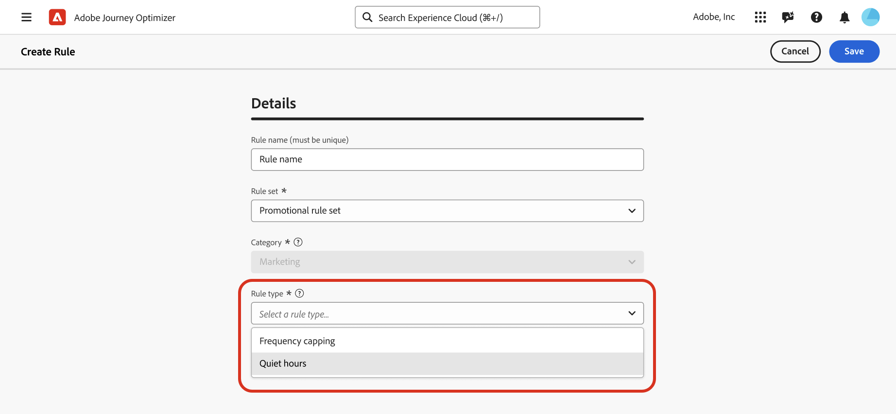
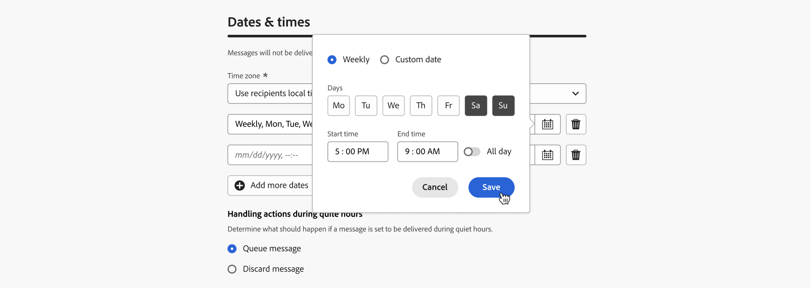
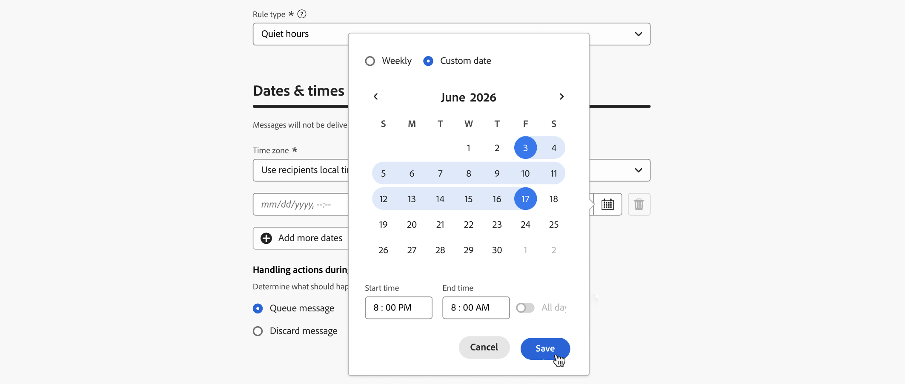
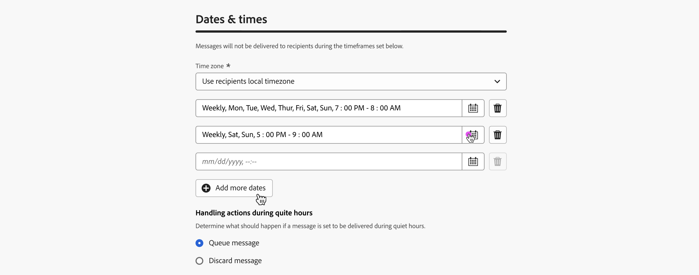
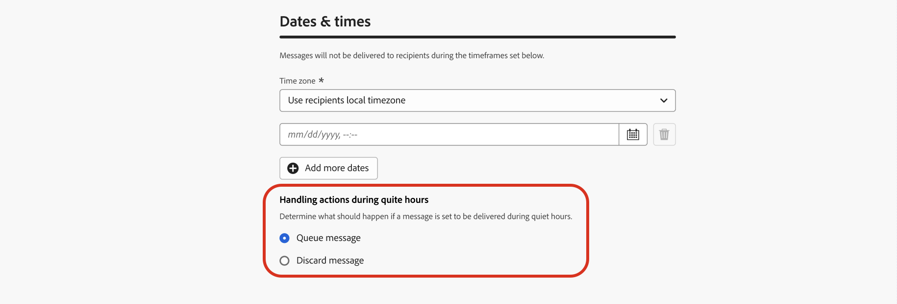
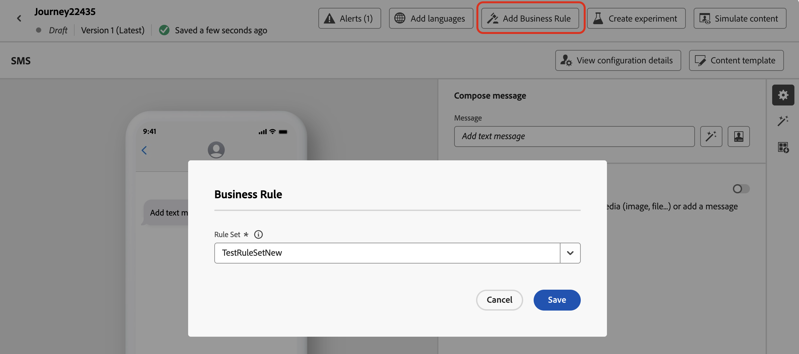
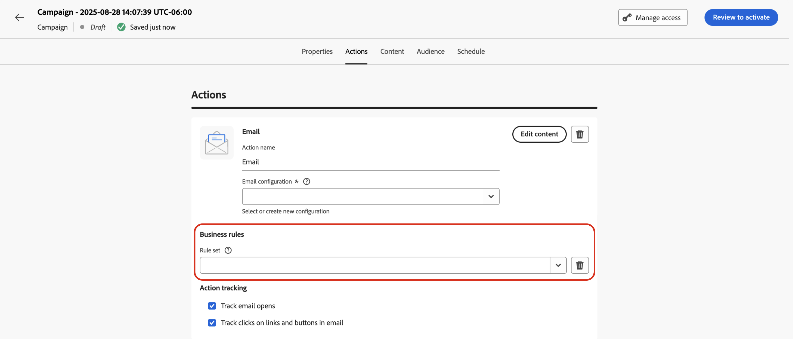
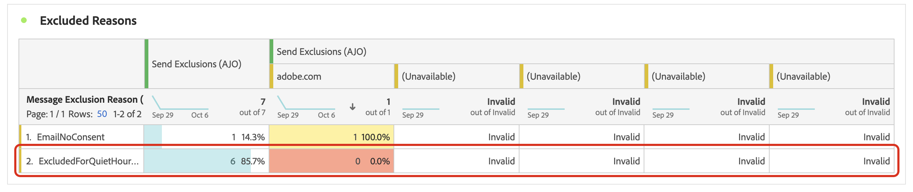
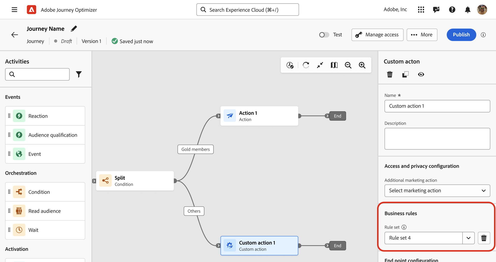

# Set quiet hours {#quiet-hours}

## What are quiet hours 

**Quiet hours** let you define time-based exclusions for **Email**, **SMS**, **Push**, and **WhatsApp** channels. They ensure that no messages are sent during specific periods of time, helping you respect customer preferences and compliance requirements.

You can apply quiet hours through **rule sets**, which can be assigned to individual actions in campaigns or journeys for precise control.

By streamlining these processes, you can enhance customer experience, save time, and ensure compliance with communication rules:

* **Don’t wake up your customer** - *The right customer, right channel, right time* is the mantra of many marketers, so it makes sense that timing is a critical part of the customer journey. By setting a Quiet hours rule, brands have better control over when contacts are receiving messages, ensuring they are getting them when they’re more likely to take action on your message.
* **Convenience** - Easily intercept communications across campaigns & journeys when you need to prevent an audience from receiving a message without needing to stop the entire journey or campaign. 
* **Time Saving** - Manage exclusions in one place by creating a **time-based rule**, instead of adding multiple condition nodes with custom expressions.  
<!--* **Extra Safeguard** - Benefit from an extra safeguard in case audience criteria or time-window configurations were incorrectly set, ensuring individuals are still excluded when they should be.--> 

>[!AVAILABILITY]
>
>Quiet hours rules are currently only available for a set of organizations (Limited Availability).  They will be progressively available to all customers in future releases.

➡️ [Discover this feature in video](#video)

## Guardrails & limitations

* **Supported channels** - Email, SMS, Push, and WhatsApp.
<!--* **Custom actions** – For custom actions, only quiet hours rules are enforced. If a rule set also includes other rules (e.g., frequency capping), those rules are ignored.-->
* **Propagation delay** – Updates to a quiet hours rule may take up to 12 hours to be applied to channel actions that already use that rule.
<!--* **Pre-suppression window** – The system begins suppressing communications 30 minutes before quiet hours start, ensuring that no messages are delivered once the quiet period begins.-->
* **High-volume latency** – In cases of high-volume communications, the system may take additional time to begin successfully enforcing quiet hour suppressions.

## Create Quiet hours rules

To set quiet hours, create a rule inside a custom rule set. Follow these steps:

1. Navigate to **[!UICONTROL Business rules]** to access the rule sets inventory.

1. Choose an existing custom rule set or create a new one:

   +++Create a Quiet hours rule in an existing rule set

   Select the rule set from the inventory. Quiet hours rules can only be added to rule sets with the "channel" domain. You can check this information in the **[!UICONTROL Domain]** column.

      

   +++

   +++Create a Quiet hours rule in a new rule set

   Click **[!UICONTROL Create rule set]**, enter a unique name, and select "Channel" from the **[!UICONTROL Rule Set Domain]** drop-down.

      

   +++

   >[!NOTE]
   >
   >Quiet hours can only be defined in **custom rule sets**. The global rule set does not support quiet hours configuration.

1. In the rule set screen, click **[!UICONTROL Add Rule]** and provide a unique name for the rule.

1. The **Category** field specifies the category of message the rule applies to. For now, this field is read-only and defaults to **[!UICONTROL Marketing]**.

1. In the **[!UICONTROL Rule type]** drop-down, select **[!UICONTROL Quiet hours]**.

   

1. In the **[!UICONTROL Dates & times]** section, define when to apply quiet hours:

   1. Choose the **[!UICONTROL Time zone]** to use:

      * **[!UICONTROL UTC/GMT]** - Apply a standard GMT time window to all recipients in the audience, regardless of their individual time zones.
      * **[!UICONTROL Use recipients local time zone]** - Use the time zone field from each profile. [Learn more on time zone management in journeys](../building-journeys/timezone-management.md#timezone-from-profiles)

         >[!IMPORTANT]
         >
         >If a profile has no time zone value, quiet hours are not enforced for that profile.

   1. Specify the time period at which quiet hours should apply.

      * **[!UICONTROL Weekly]** - Choose specific days of the week and a timeslot. You can also enforce the rule **[!UICONTROL All day]** (this option is only available for up to 3 consecutive days).

         

      * **[!UICONTROL Custom date]** - Choose specific dates in the calendar and a timeslot. You can also enforce the rule **[!UICONTROL All day]** (this option is only available for up to 3 consecutive days).

         

   1. Click the **[!UICONTROL Add more dates]** button to add up to 5 separate periods.

      
   
1. In the **[!UICONTROL Handling actions during quiet hours]** section, choose how messages are treated during the selected period of time:

   

   * **[!UICONTROL Queue message]** - Messages are sent at the completion of the quiet hours period unless in Paused state.

      >[!NOTE]
      >
      >This option is available only for journey actions. If applied to a campaign action, it will behave the same as selecting the **[!UICONTROL Discard message]** option.

   * **[!UICONTROL Discard message]** - Messages are never sent. If you want the journey or campaign containing the message to end with the cancelation of the send, select **[!UICONTROL Discard and exit journey or campaign]**.

## Apply Quiet hours to journeys and campaigns {#apply}

Once your rule is saved and the rule set is activated, you can apply it to actions in journeys and campaigns. Supported channels: **Email, SMS, Push, WhatsApp**. Browse the tabs below for more details.

>[!BEGINTABS]

>[!TAB Apply Quiet hours channel actions in journeys]

1. Open your journey, select a [channel action](../building-journeys/journeys-message.md) and edit the content of your message.
1. Click the **[!UICONTROL Add Business Rule]** button and select the rule set containing the Quiet hours rule.

   

   >[!NOTE]
   >
   >Only [activated](#activate-rule) rule sets display in the list.

1. Activate your journey.

>[!TAB Apply Quiet hours to campaign actions]

1. Edit your campaign and access the **[!UICONTROL Actions]** tab.
1. In the **[!UICONTROL Business rules]** section, select the rule set containing the Quiet hours rule.

   

   >[!NOTE]
   >
   >Only [activated](#activate-rule) rule sets display in the list.

1. Activate your campaign.

>[!ENDTABS]

## Next steps

Once your journey or campaigns has been activated and executed, you can view the number of profiles excluded from the communication in the [Customer Journey Analytics report](../reports/report-gs-cja.md), and in the [Live report](../reports/live-report.md), where Quiet hours rules will be listed as a possible reason for users excluded from delivery.

   

<!--

>[!TAB Apply Quiet hours to custom actions]

1. Open your journey and add or select a custom action in the canvas.

1. In the **[!UICONTROL Business rules]** section, select the rule set containing the Quiet hours rule.

   

   >[!NOTE]
   >
   >Only [activated](#activate-rule) rule sets display in the list.

1. Activate your journey.

-->

## How-to video {#video}

Learn how to use the quiet hours feature in Adobe Journey Optimizer.

>[!VIDEO](https://video.tv.adobe.com/v/3475851?quality=12)
