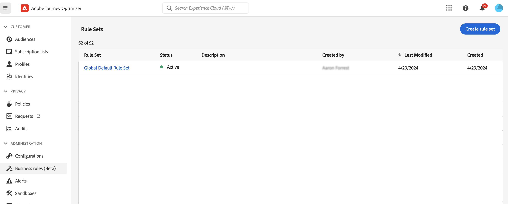
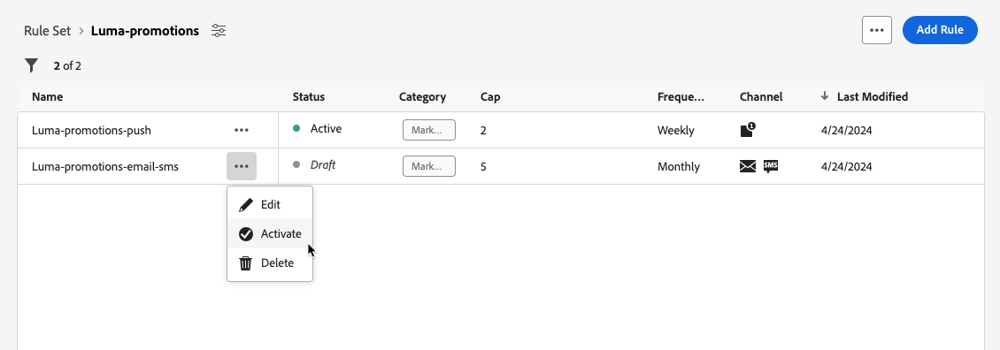
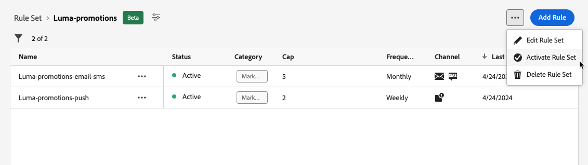
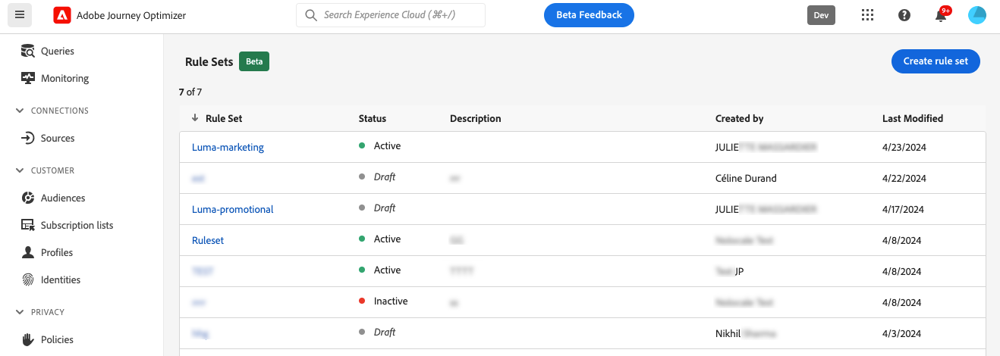
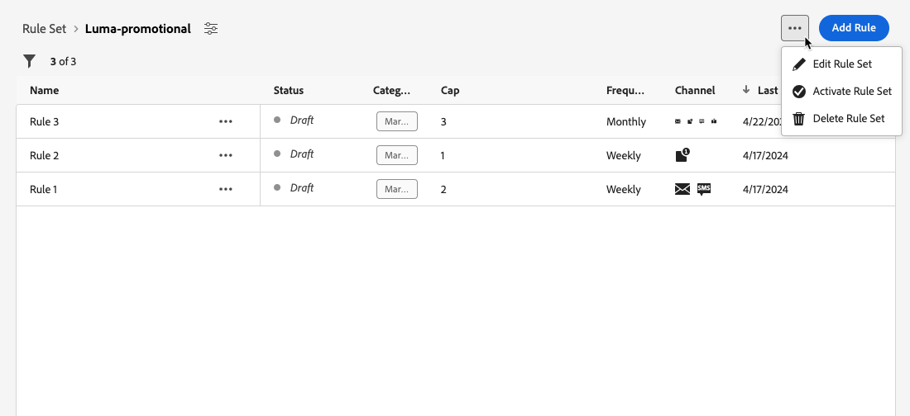
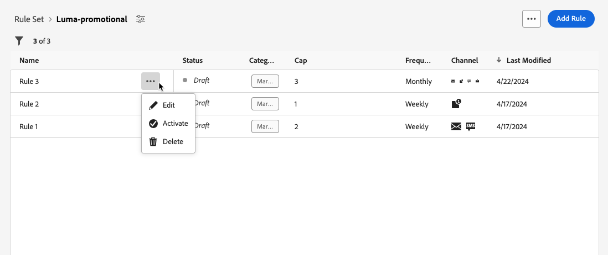
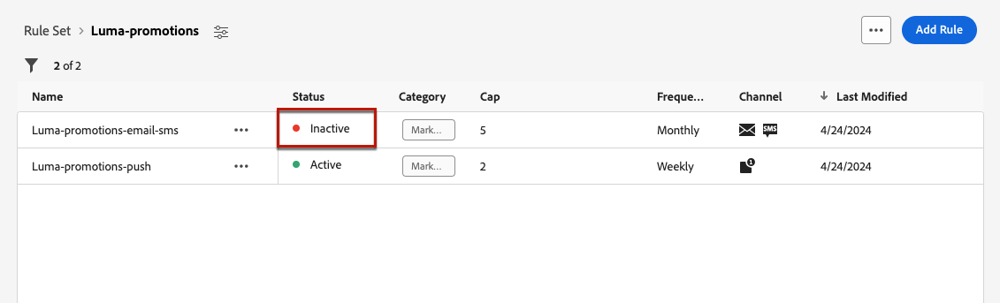

# Work with rule sets {#rule-sets}

>[!CONTEXTUALHELP]
>id="ajo_business_rules_rule_sets"
>title="Rule Sets"
>abstract="Use rule sets to apply frequency capping or quiet hours rules to different types of marketing communications. You can also create rule sets to exclude journeys to part of your audience based on frequency capping rules."

## Get started with rule sets {#gs}

### What are rule sets? {#what}

Rule sets allow you to **group together multiple rules into rule sets** and apply them to the journeys and campaigns of your choice. This provides improved granularity to limit how often and how many journeys a customer can enter within a certain time frame or control how often users will receive a message depending on the type of communication. 

You can create two types of rule sets:

* **Channel** rule sets apply rules to communication channels. They allow you to set:

   * **Frequency capping rules** - *Do not send more than 1 email or SMS communication per day.*
   * **Quiet hours rules** - *Do not send email messages ouside of the 8AM - 9PM timeslot.*

* **Journey** rule sets apply entry and concurrency capping rules to a journey. For example, do not enter profiles into more than one journey simultaneously.

➡️ [Discover this feature in video](#video)

### Permissions {#permissions-frequency-rules}

To work with business rules, you need the following permissions:

* **[!UICONTROL View Frequency Rules]**: Access and view business rules.
* **[!UICONTROL Manage Frequency Rules]**: Create, edit or delete business rules.

Learn more about permissions in [this section](../administration/high-low-permissions.md).

### Global & custom rule sets {#global-custom}

When accessing rule sets for the first time from the **[!UICONTROL Administration]** > **[!UICONTROL Business rules]** menu, a default rule set is pre-created and active: **Global Default Rule Set**.

This rule set contains global rules that you can apply to control how often users receive messages across one or multiple channels. All the rules defined in this rule set apply to all selected channels, whether communications are sent from a journey or a campaign.

In addition to this "Global Default Rule Set" rule set, you can create **rule sets** that you can apply to any journey or campaign to apply specific capping rules. [Learn how to create custom rule sets](#create)

## Create and activate rule sets {#Create}

>[!CONTEXTUALHELP]
>id="ajo_rule_set_domain"
>title="Rule Set Domain"
>abstract="When creating a rule set, you need to specify if the rules within the rule set will enforce capping rules that are specific to communication channels, or to journeys."

>[!CONTEXTUALHELP]
>id="ajo_rule_sets_category"
>title="Select the message rule category"
>abstract="When activated and applied to a message, all the frequency rules matching the selected category will be automatically applied to this message. Currently only the Marketing category is available."

<!--NOT USED?
[!CONTEXTUALHELP]
>id="ajo_rule_sets_capping"
>title="Set the capping for your rule"
>abstract="Specify the maximum number of messages sent to a customer profile within the chosen time frame. The frequency cap will be based on the selected calendar period and will be reset at the beginning of the corresponding time frame."-->

>[!CONTEXTUALHELP]
>id="ajo_rule_type"
>title="Rule type"
>abstract="Select the desired rule type for your channel rule set: Use the **Frequency capping** type to apply capping rules to communication channels. For example, do not send more than 1 email or SMS communication per day. Select **Quiet hours** to define time-based exclusions to ensure that no messages are sent during specific periods of time."

>[!CONTEXTUALHELP]
>id="ajo_rule_sets_duration"
>title="Select the message rule category"
>abstract="When activated and applied to a message, all the frequency rules matching the selected category will be automatically applied to this message. Currently only the Marketing category is available."

>[!CONTEXTUALHELP]
>id="ajo_rule_set_rule_capping"
>title="Rule capping"
>abstract="Set the capping for your rule. Depending on the rule set domain and the selection in the Rule Type field, this field can define the maximum number of messages that can be sent to a profile, or the maximum number of journeys the profile can enter or be enrolled in simultaneously."

>[!CONTEXTUALHELP]
>id="ajo_journey_business_rules"
>title="Rule set"
>abstract="Select the rule set to apply to your custom action."

To create a rule set, follow the steps below.

>[!NOTE]
>
>You can create up to 10 rule sets for the channel domain and 10 rule sets for the journey domain, for a total of 20 rule sets.

1. Access the **[!UICONTROL Rules sets]** list, then click **[!UICONTROL Create rule set]**.

    

1. Define a unique name for the rule set and add a description.

1. Select the rule set's domain and click **[!UICONTROL Save]**.

   * **Channel** domain: apply capping rules or quiet hours rules  to communication channels.
   * **Journey** domain: apply entry and concurrency capping rules to a journey.

   

1. Define the rules you want to add to this rule set. To do so, access the rule set and click **[!UICONTROL Add rule]**.

1. Configure the rule parameters to suit your needs. The parameters available for the rule depend on the rule set domain selected at its creation.

   Detailed information on how to configure journey and channel rules is available in these sections:
   
   * [Journey capping](../conflict-prioritization/journey-capping.md) 
   * [Frequency capping by channel and communication type](../conflict-prioritization/channel-capping.md)
   * [Quiet hours](../conflict-prioritization/quiet-hours.md)

1. Click **[!UICONTROL Save]** to confirm the rule creation. Your message is added to the rule set, with the **[!UICONTROL Draft]** status.

   

1. Repeat the steps above to add as many rules as needed to the rule set.

1. When created, a rule has the **[!UICONTROL Draft]** status and is not yet impacting any message. To enable it, click the **[!UICONTROL More actions]** button next to the rule and select **[!UICONTROL Activate]**.

   

1. Activate the rule set to be able to apply it to your journeys and messages.

   

   >[!NOTE]
   >
   >It can take up to 10 minutes for a rule or rule set to be fully activated. You do not need to modify messages or republish journeys for a rule to take effect.

<!--Currently, once a rule set is activated, no more rules can be added to that rule set.-->

1. You can apply a rule set to a message or a journey, depending on the domain selected when creating the rule set.

   Detailed information on how to apply rule set is available in these sections:

   * [Apply a rule set to a journey](../conflict-prioritization/journey-capping.md#apply-capping)
   * [Apply capping rules to journey and campaign actions](../conflict-prioritization/channel-capping.md#apply-frequency-rule)
   * [Apply quiet hours rules to journey and campaign](../conflict-prioritization/quiet-hours.md#apply)

## Access & manage rule sets {#access-rule-sets}

All created rule sets display in the **[!UICONTROL Administration]** > **[!UICONTROL Business rules]** menu. They are sorted by last modification date.

Click a rule set name to view and edit its content. All rules included in that rule set are listed. The contextual menu on top right enables you to edit the name and description of the rule set, activate it, and delete it.

For each rule in the rule set, the **[!UICONTROL More actions]** button enables you to edit the rule, activate it and delete it.

To deactivate a rule or a rule set, click the **[!UICONTROL More actions]** button next to the desired item and select **[!UICONTROL Deactivate]**.

   
Its status will change to **[!UICONTROL Inactive]** and the rule will not apply to future message executions. Any messages currently in execution will not be affected.

>[!NOTE]
>
>Deactivating a rule or rule set does not affect or reset any counts on individual profiles.

## How-to video {#video}

>[!VIDEO](https://video.tv.adobe.com/v/3435531?quality=12)
