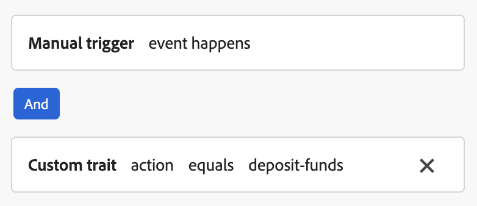

# Configure content cards support in Web SDK {#content-card-configuration-sdk}

This sample showcases how to retrieve Content Cards from Adobe Journey Optimizer (AJO) using Adobe Experience Platform. By leveraging the [Adobe Experience Platform Web SDK](https://experienceleague.adobe.com/en/docs/experience-platform/web-sdk/home), the personalization content is fetched and rendered entirely on the client side.

Upon the initial page load, the page displays its default state. However, if you interact with the **Deposit Funds** or **Share on social media** buttons, additional content cards will appear. These cards are triggered by client-side conditions, ensuring they are displayed only when specific actions are taken.


## Running the sample {#run-sample}

>[!PREREQUISITES]
>
>You need to install node and npm. [Refer to this documentation](https://docs.npmjs.com/downloading-and-installing-node-js-and-npm)


1. Set up local SSL certificates for HTTPS. These samples require locally signed SSL certificates to serve content over HTTPS: 

    1. Install `mkcert` on your computer.

    1. After installation, run `mkcert -install` to install the `mkcert root` certificate.

1. Clone the repository to your local machine.

1. Open a terminal and navigate to the sample's folder.

1. Install the required dependencies by running `npm install`.

1. Start the application by running `npm start`.

1. Open your web browser and go to `https://localhost`.

## How it works {#setup}

1. Include and configure the [Web SDK](https://experienceleague.adobe.com/en/docs/experience-platform/web-sdk/home) on the page using settings from the `.env` file in the sample folder.

    ```
    <script src="https://cdn1.adoberesources.net/alloy/2.18.0/alloy.min.js" async></script>
    alloy("configure", {
        defaultConsent: "in",
        edgeDomain: "{{edgeDomain}}",
        edgeConfigId: "{{edgeConfigId}}",
        orgId:"{{orgId}}",
        debugEnabled: false,
        personalizationStorageEnabled: true,
        thirdPartyCookiesEnabled: false
    });
    ```

1. Use the `sendEvent` command to fetch personalized content.

    ```
    alloy("sendEvent", {
        renderDecisions: true,
        personalization: {
            surfaces: ["web://alloy-samples.adobe.com/#content-cards-sample"],
        },
    });
    ```

1. Subscribe to content cards for a specific surface using the `subscribeRulesetItems` command. Each time rulesets are evaluated, handle the result object in the callback, which will contain `propositions` with content card data.

    ```
    const contentCardManager = createContentCardManager("content-cards");

    alloy("subscribeRulesetItems", {
        surfaces: ["web://alloy-samples.adobe.com/#content-cards-sample"],
        schemas: ["https://ns.adobe.com/personalization/message/content-card"],
        callback: (result, collectEvent) => {
            const { propositions = [] } = result;
            contentCardManager.refresh(propositions, collectEvent);
        },
    });
    ```

1. Manage rendering of content cards and send `interact` and `display` events using the `contentCardsManager` object found in `script.js`. Extract, sort, and process content cards from the received propositions.

    ```
    const createContentCard = (proposition, item) => {
        const { data = {}, id } = item;
        const {
            content = {},
            meta = {},
            publishedDate,
            qualifiedDate,
            displayedDate,
        } = data;

        return {
            id,
            ...content,
            meta,
            qualifiedDate,
            displayedDate,
            publishedDate,
            getProposition: () => proposition,
        };
    };

    const extractContentCards = (propositions) =>
        propositions
            .reduce((allItems, proposition) => {
            const { items = [] } = proposition;

            return [
                ...allItems,
                ...items.map((item) => createContentCard(proposition, item)),
            ];
        }, [])
        .sort(
            (a, b) =>
                b.qualifiedDate - a.qualifiedDate || b.publishedDate - a.publishedDate
        );

    const contentCards = extractContentCards(propositions);
    ```

1. Render the content cards based on the details defined for each campaign. Each card includes a `title`, `body`, `imageUrl`, and other custom data values.

    ```
    const renderContentCards = () => {
        const contentCardsContainer = document.getElementById(containerElementId);
        contentCardsContainer.addEventListener("click", handleContentCardClick);

        let contents = "";

        contentCards.forEach((card) => {
            const { id, title, body, imageUrl, meta = {} } = card;
            const { buttonLabel = "" } = meta;

            contents += `
                <div class="col">
                    <div data-id="${id}" class="card h-100">
                        
                        <div class="card-body d-flex flex-column">
                            <h5 class="card-title">${title}</h5>
                            <p class="card-text">${body}</p>
                            <a href="#" class="mt-auto btn btn-primary">${buttonLabel}</a>
                        </div>
                    </div>
                 </div>
             `;
        });

        contentCardsContainer.innerHTML = contents;
        collectEvent(
            "display",
            contentCards.map((card) => card.getProposition())
         );
    };
    ```

1. When the `subscribeRulesetItems` callback is invoked, a convenience function called `collectEvent` is also provided. This function is used to send Experience Edge events to track interactions, displays, and other user actions. In this sample, collectEvent tracks when a content card is clicked. Additionally, if the button on the content card is clicked, the browser is directed to the `actionUrl` specified by the campaign.

    ```
    const handleContentCardClick = (evt) => {
        const cardEl = evt.target.closest(".card");

        if (!cardEl) {
            return;
        }

        const isAnchor = evt.target.nodeName === "A";
        const card = contentCards.find((card) => card.id === cardEl.dataset.id);

        if (!card) {
            return;
        }

        collectEvent("interact", [card.getProposition()]);

        if (isAnchor) {
            evt.preventDefault();
            evt.stopImmediatePropagation();
            const { actionUrl } = card;
            if (actionUrl && actionUrl.length > 0) {
                window.location.href = actionUrl;
            }
        }
    };
    ```

## Key Observations {#key-observations}

### personalizationStorageEnabled 

The `personalizationStorageEnabled` option is set to `true` in the `configure` command. This ensures that previously qualified content cards are stored and continue to be displayed across user sessions.

### Triggers

Content cards support custom triggers evaluated on the client side. When a trigger rule is met, additional content cards are displayed. This sample uses four different campaigns, one for each content card, all sharing the same surface: `web://alloy-samples.adobe.com/#content-cards-sample`. The table below outlines the trigger rules for each campaign and how to satisfy them.

<table>
    <tr>
        <th>Trigger rule</th>
        <th>Card</th>
        <th>How to satisfy the trigger rule</th>
    </tr>
    <tr>
        <td>None</td>
        <td></td>
        <td>sendEvent command. No client side rule to satisfy.</td>
    </tr>
    <tr>
        <td>None</td>
        <td></td>
        <td>sendEvent command. No client side rule to satisfy.</td>
    </tr>
    <tr>
        <td></td>
        <td></td>
        <td></td>
    </tr>
    <tr>
        <td></td>
        <td></td>
        <td></td>
    </tr>
</table>

The `evaluateRulesets` command is triggered when clicking the "Deposit Funds" and "Share on social media" buttons. Each button specifies the relevant `decisionContext` to fulfill the rules defined for the respective campaigns.

```

document.getElementById("action-button-1").addEventListener("click", () => {
    alloy("evaluateRulesets", {
        renderDecisions: true,
        personalization: {
            decisionContext: {
                action: "deposit-funds",
            },
        },
    });
});

document.getElementById("action-button-2").addEventListener("click", () => {
    alloy("evaluateRulesets", {
        renderDecisions: true,
        personalization: {
            decisionContext: {
                action: "social-media",
            },
        },
    });
});

```
