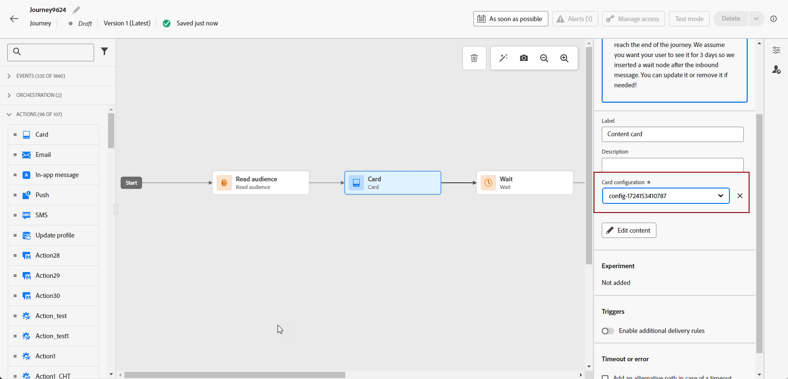

# Create content cards {#create-content-card}

>[!BEGINSHADEBOX]

**Table of content**

* [Get started with content cards](get-started-content-card.md)
* [Content cards prerequisites](content-card-configuration-prereq.md)
* [Configure content cards channel in Journey Optimizer](content-card-configuration.md)
* **Create content cards**
* [Design content cards](design-content-card.md)
* [Content cards report](content-card-report.md)

>[!ENDSHADEBOX]

>[!AVAILABILITY]
>
>Content cards are currently only available for a set of organizations (Limited Availability). To gain access, contact your Adobe representative.

>[!BEGINTABS]

>[!TAB Add Content cards to a journey]

To add an Content cards to a journey, follow these steps:

1. Open your journey, then drag and drop a **[!UICONTROL Card]** activity from the **[!UICONTROL Actions]** section of the palette.

    

1. Enter a **[!UICONTROL Label]** and **[!UICONTROL Description]** for your message.

1. Choose your [Content card configuration](content-card-configuration.md) to use.

    

1. You can now start designing your content with the **[!UICONTROL Edit content]** button. [Learn more](design-content-card.md)

1. Enable the **[!UICONTROL Enable additional delivery rules]** option. Then, **[!UICONTROL Edit rules]** to choose the event(s) and criteria that will trigger your message. Rule builders enable users to specify criteria and values that, when met, trigger a set of actions.

    

    1. Click **[!UICONTROL Add condition]** to select your event.
        
        +++See available Event.
        
        | Package | Trigger | Definition |
        |---|---|---|
        |Send data to Platform|Sent data to Platform|Triggered when the mobile app issues an edge experience event to send data to Adobe Experience Platform. Usually the API call [sendEvent](https://developer.adobe.com/client-sdks/documentation/edge-network/api-reference/#sendevent) from the AEP Edge extension.|
        |Core tracking|Track action| Triggered when the legacy functionality offered in mobile code API [trackAction](https://developer.adobe.com/client-sdks/documentation/mobile-core/api-reference/#trackaction) is called.|
        |Core tracking|Track state |Triggered when the legacy functionality offered in mobile code API [trackState](https://developer.adobe.com/client-sdks/documentation/mobile-core/api-reference/#trackstate) is called.|
        |Core tracking|Collect PII|Triggered when the legacy functionality offered in mobile code API [collectPII](https://developer.adobe.com/client-sdks/documentation/mobile-core/api-reference/#collectpii) is called.|
        |Application lifecycle|Application launch|Triggered at every run, including crashes and installs. Also triggered on a resume from the background when the lifecycle session timeout has been exceeded.|
        |Application lifecycle|Application install|Triggered at the first run after installation or re-installation.|
        |Application lifecycle|Application update|Triggered at the first run after an upgrade or when the version number changes.|
        |Application lifecycle|Application close|Triggered when the application is closed. |
        |Application lifecycle|Application crash|Triggered when the application is not backgrounded before being closed. The event is sent when the application is started after the crash. Adobe Mobile crash reporting does not implement a global uncaught exception handler.|

        +++

    1. Choose the **[!UICONTROL Or]** condition if you want to add more **[!UICONTROL Triggers]** to further expand your rule.

    1. Choose the **[!UICONTROL And]** condition if you want to add **[!UICONTROL Traits]** and better fine-tune your rule.

        +++See available Traits.
        
        | Package | Traits | Definition |
        |---|---|---|
        |Device info|Carrier name|Triggered when one of the Carrier name from the list is met.|
        |Device info|Device name|Triggered when one of the Device name is met.|
        |Device info|Locale|Triggered when one of the language from the list is met.|
        |Device info|OS version|Triggered when one of the specified OS version is met.|
        |Device info|Previous OS version|Triggered when one of the specified Previous OS version is met.|
        |Device info|Run mode|Triggered if Run mode is either application or extension.|
        |Application lifecycle|App ID| Triggered when the specified App ID is met.| 
        |Application lifecycle|Day of week|Triggered when the specified day of week is met.|
        |Application lifecycle|Day since first use|Triggered when the specified number of day since first use is met.|
        |Application lifecycle|Day since last use|Triggered when the specified number of day since last use is met.|
        |Application lifecycle|Day since upgrade|Triggered when the specified number of day since last upgrade is met.|
        |Application lifecycle|Install date|Triggered when the specified Install date is met.|
        |Application lifecycle|Launches|Triggered when the specified number of Launches is met.|
        |Application lifecycle|Time of day|Triggered when the specified Time of day is met.|

        +++
        
    1. Click **[!UICONTROL Make group]** to group triggers together.

1. If necessary, complete your journey flow by dragging and dropping additional actions or events. [Learn more](../building-journeys/about-journey-activities.md)

1. Once your Content card is ready, finalize the configuration and publish your journey to activate it.

For more information on how to configure a journey, refer to [this page](../building-journeys/journey-gs.md).

>[!TAB Add Content cards to a campaign]

To start building your content cards through a campaign, follow the steps below.

1. Create a campaign. [Learn more](../campaigns/create-campaign.md)

1. Select the type of campaign that you want to execute

    * **[!UICONTROL Scheduled - Marketing]**: execute the campaign immediately or on a specified date. Scheduled campaigns are aimed at sending **marketing** messages. They are configured and executed from the user interface.

    * **[!UICONTROL API-triggered - Marketing/Transactional]**: execute the campaign using an API call. API-triggered campaigns are aimed at sending either **marketing**, or **transactional** messages, i.e. messages sent out following an action performed by an individual: password reset, cart purchase etc. [Learn how to trigger a campaign using APIs](../campaigns/api-triggered-campaigns.md)

    

1. In the **[!UICONTROL Properties]** section, specify a name and a description for the campaign.

1. In the **Audience** section, click the **[!UICONTROL Select audience]** button to display the list of available Adobe Experience Platform audiences. [Learn more on audiences](../audience/about-audiences.md)

1. In the **[!UICONTROL Identity namespace]** field, choose the namespace to use in order to identify the individuals from the selected segment. [Learn more on namespaces](../event/about-creating.md#select-the-namespace)

1. Select the **[!UICONTROL Content card]** action.

    

1. Select or create a new [Content card configuration](content-card-configuration.md).

1. To test the content of your message, click **[!UICONTROL Create experiment]**. This allows you to test multiple variables of a delivery on sample populations to determine which treatment has the greatest impact on the targeted audience. [Learn more about content experiment](../content-management/content-experiment.md).

1. If additional triggers are required, use the **[!UICONTROL Enable additional delivery rules]** toggle. Additional delivery rules are not required.
    
    Click **[!UICONTROL Edit triggers]** to select the event(s) and criteria for message delivery. The rule builder lets you specify conditions and values that, when met, trigger actions.

    

1. You can schedule your campaign to a specific date or set to recur at regular intervals. [Learn more](../campaigns/create-campaign.md#schedule)

1. You can now start designing your content with the **[!UICONTROL Edit content]**. [Learn more](design-content-card.md)

    

>[!ENDTABS]
