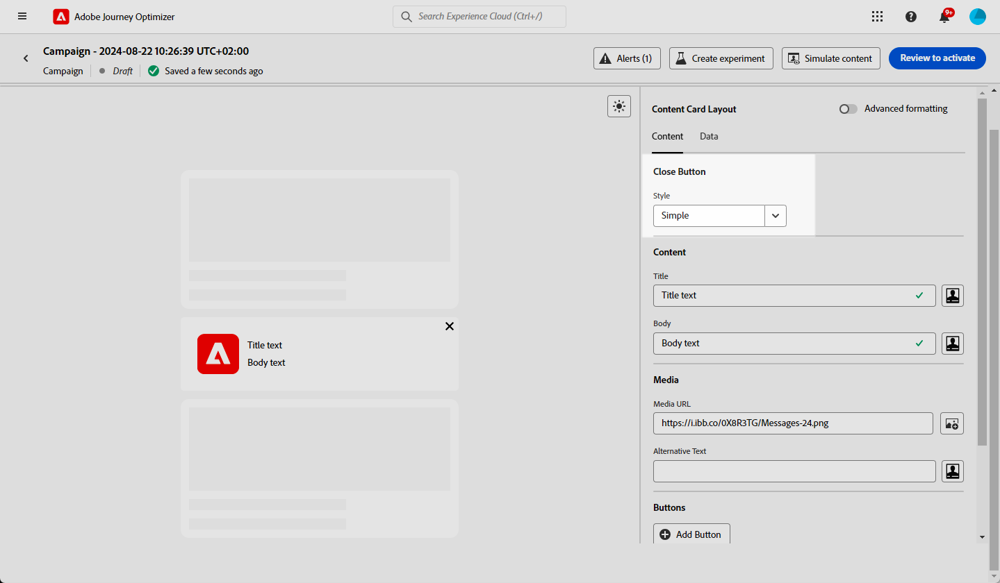
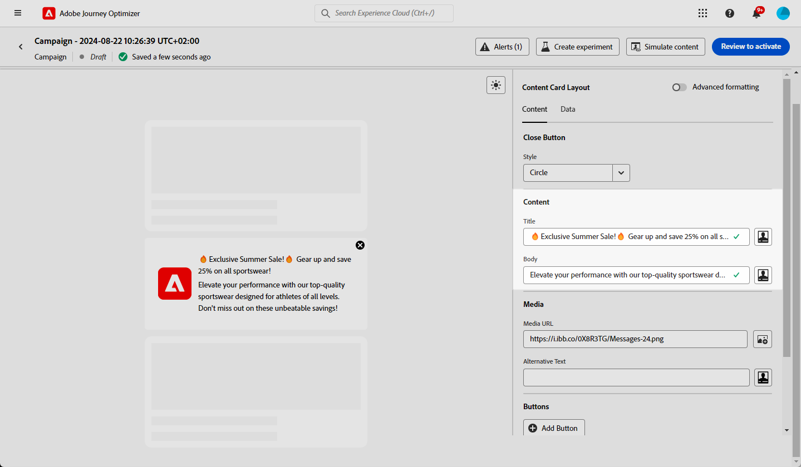
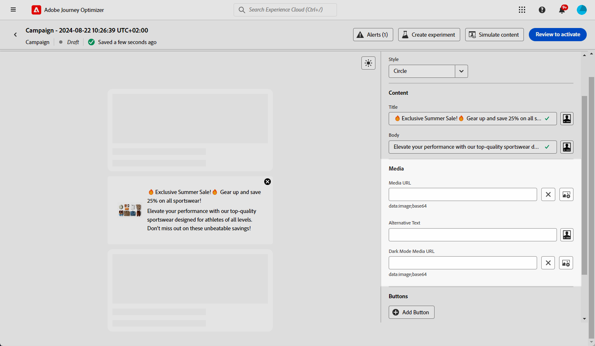
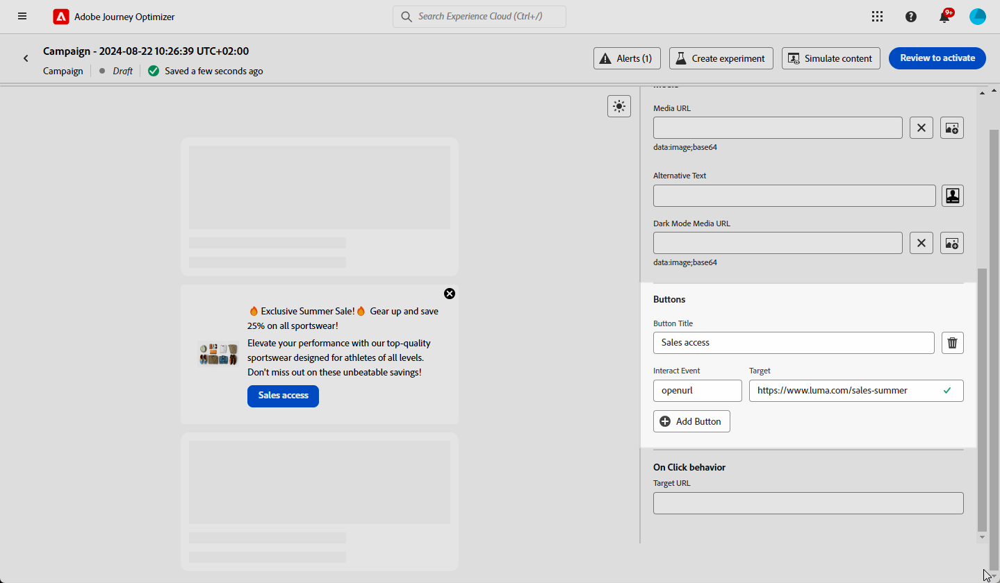
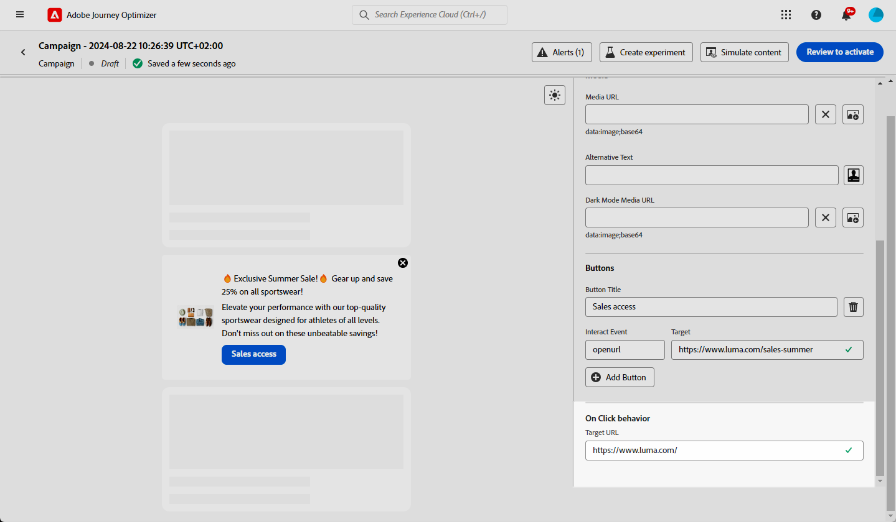
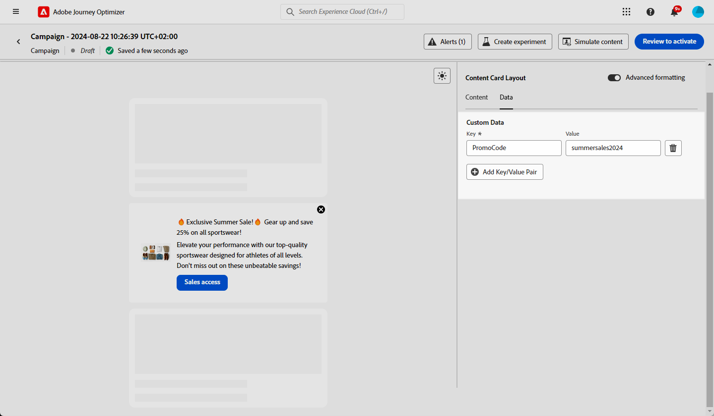

# Design content cards content {#design-content-card}

The authoring construct for Cards provides a form-based authoring experience that provides marketers basic inputs that can be used to be rendered by the developer.

Once your content is defined and personalized, you can review and activate it. Your campaign will be sent according to the set schedule. [Learn more in this page](../campaigns/review-activate-campaign.md).

## Content tab {#content-tab}

From the **[!UICONTROL Content]** tab, you can customize your content cards by defining both their content and the design of the **[!UICONTROL Close]** button. Additionally, you can enhance your content with media and add action buttons directly from this tab.

### Close button {#close-button}

Choose the **[!UICONTROL Style]** for your **[!UICONTROL Close button]** to customize its appearance.

You can select from the following styles:

* **[!UICONTROL None]**
* **[!UICONTROL Simple]**
* **[!UICONTROL Circle]**

### Content {#title-body}

To compose your message, enter your text in the **[!UICONTROL Title]** and **[!UICONTROL Body]** fields.

If you want to tailor your message further, use the **[!UICONTROL Personalization]** icon to add personalized elements. For detailed instructions on how to use the personalization features, refer to [this section](../personalization/personalize.md).

<!--
+++More options with advanced formatting

If the **[!UICONTROL Advanced formatting mode]** is switched on, you can choose for your **[!UICONTROL Header]** and **[!UICONTROL Body]**:

* the **[!UICONTROL Font]**
* the **[!UICONTROL Pt size]**
* the **[!UICONTROL Font Color]**
* the **[!UICONTROL Alignment]**
+++
-->

### Media {#add-media}

The **[!UICONTROL Media]** field lets you enhance your content cards by adding media, which can make your presentation more engaging for end users.

To include media, either type in the URL of the media you want to use or click the **[!UICONTROL Select Assets]** icon to choose from assets stored in your Assets library. [Learn more about asset management](../content-management/assets.md).

<!--
+++More options with advanced formatting

If the **[!UICONTROL Advanced formatting mode]** is switched on, you can add an **[!UICONTROL Alternative text]** for screen reading applications and another asset in the **[!UICONTROL Dark Mode Media URL]** field.

+++
-->

### Buttons {#add-buttons}

Add buttons for users to interact with your content cards.

1. Click **[!UICONTROL Add button]** to create a new action button.

1. Edit the button **[!UICONTROL Title]** field to specify the label that will be displayed on the button.

1. Select an **[!UICONTROL Interact event]** to define what action will be triggered when users click or interact with the button.

1. In the **[!UICONTROL Target]** field, enter the web URL or deeplink where users will be directed after interacting with the button.

<!--
+++More options with advanced formatting

If the **[!UICONTROL Advanced formatting mode]** is switched on, you can choose for your **[!UICONTROL Buttons]**:

* the **[!UICONTROL Font]**
* the **[!UICONTROL Pt size]**
* the **[!UICONTROL Font Color]**
* the **[!UICONTROL Alignment]**

+++
-->

### On Click behavior

In the **[!UICONTROL Target URL]** field, enter the web URL or deeplink that will direct users to the desired destination after they interact with your content card. This could be an external website, a specific page within your app, or any other location you want users to be taken to based on their interaction.

## Data tab

## Custom data {#custom-data}

In the **[!UICONTROL Custom data]** section, click **[!UICONTROL Add Key/Value pair]** to include custom variables in the payload. These key/value pairs allow you to pass additional data, depending on your specific configuration. This allows you to add personalized or dynamic content, tracking information, or any other data relevant to your setup.
