# Access and manage content templates {#access-manage-templates}

## Access content templates {#access}

To access the content template list, select **[!UICONTROL Content Management]** > **[!UICONTROL Content Templates]** from the left menu.

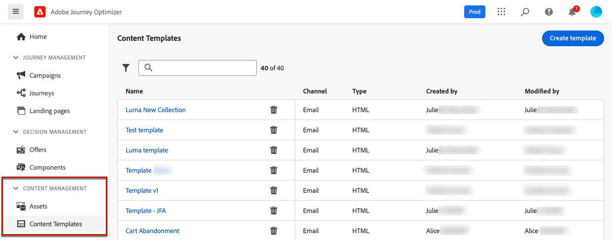

All the templates that were created on the current sandbox - either from a journey or a campaign using the **[!UICONTROL Save as template]** option, either from the **[!UICONTROL Content Templates]** menu - are displayed. [Learn how to create templates](#create-content-templates)

The pane on the left allows you to organize content templates into folders. By default, all templates are displayed. When selecting a folder, only the templates and folders included in the selected folder are displayed. [Learn more](#folders)

>[!NOTE]
>
>Content template folders are only available for a set of organizations (Limited Availability) and will be gradually rolled out to more users.

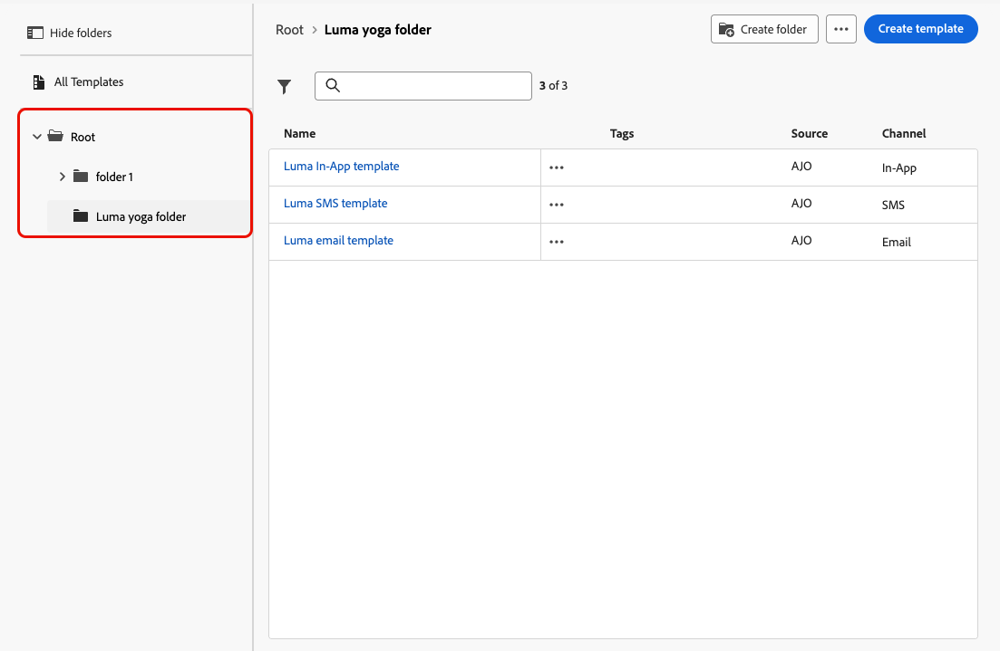

To find a specific item, start typing a name in the search field. When a [folder](#folders) is selected, the search applies to all content templates or folders in the first level of hierarchy of that folder<!--(not nested items)-->.

You can sort content templates by:
* Type
* Channel
* Creation or modification date
* Tags - [Learn more on tags](../start/search-filter-categorize.md#tags)

You can also choose to display only the items that yourself created or modified.

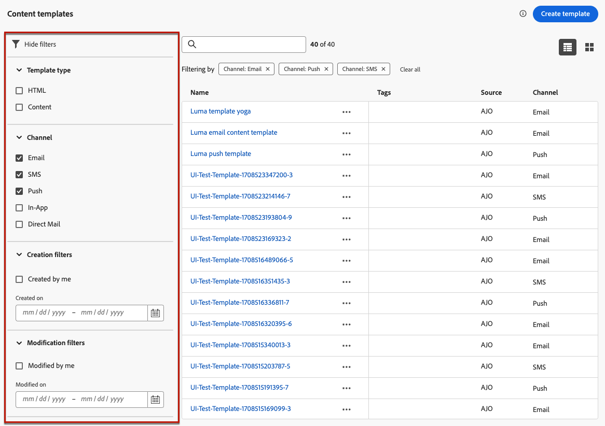

## Use folders to manage content templates {#folders}

>[!AVAILABILITY]
>
>Content template folders are only available for a set of organizations (Limited Availability) and will be gradually rolled out to more users.

To easily navigate your content templates, you can use folders to organize them more effectively into a structured hierarchy. This enables you to categorize and manage the items according to your organization needs.

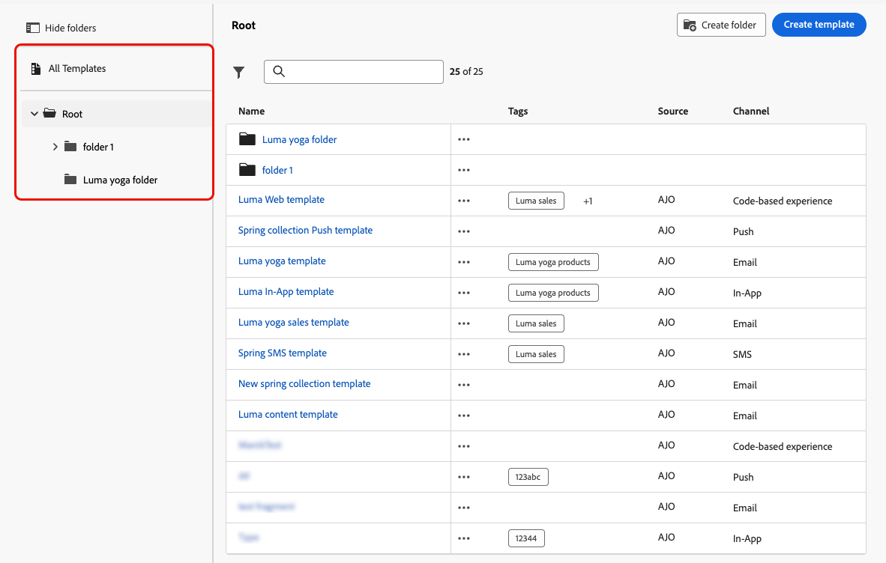

1. Click the **[!UICONTROL All content templates]** button to display all the items previsously created without the folder grouping.

1. Click the **[!UICONTROL Root]** folder to display all the folders created.

    >[!NOTE]
    >
    >If you have not created folders yet, all the content templates are displayed.

1. Click any folder inside the **[!UICONTROL Root]** folder to display its content.

1. Upon clicking the **[!UICONTROL Root]** folder or any other folder, the **[!DNL Create folder]** button displays. Select it.

    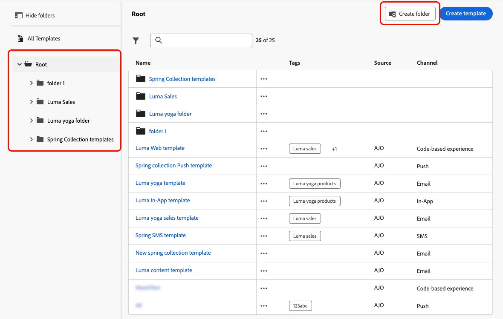

1. Type a name for the new folder and click **[!UICONTROL Save]**. The new folder displays on top of the content template list inside the **[!UICONTROL Root]** folder, or inside the folder currently selected.

1. You can click the **[!UICONTROL More actions]** button to rename or delete the folder.

    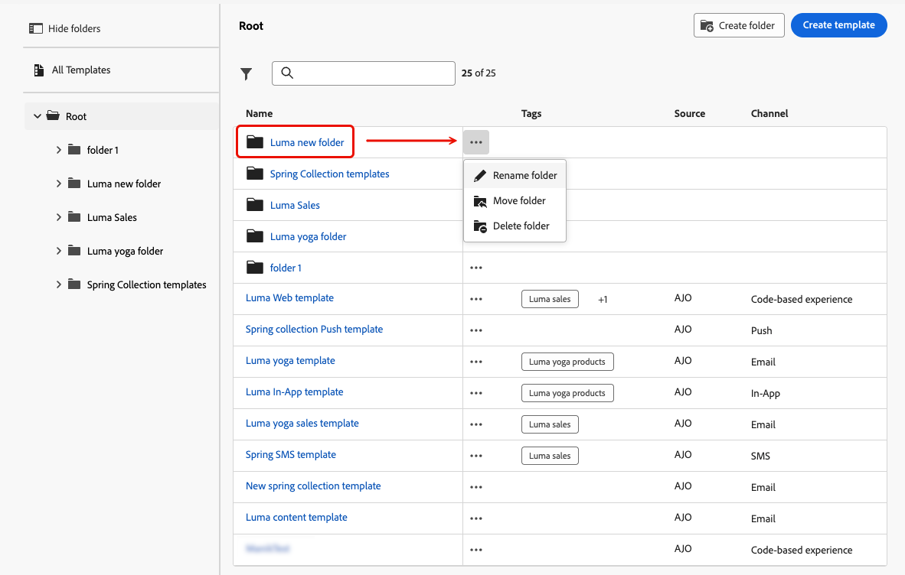

1. Using the **[!UICONTROL More actions]** button, you can also move the content template to another existing folder.

    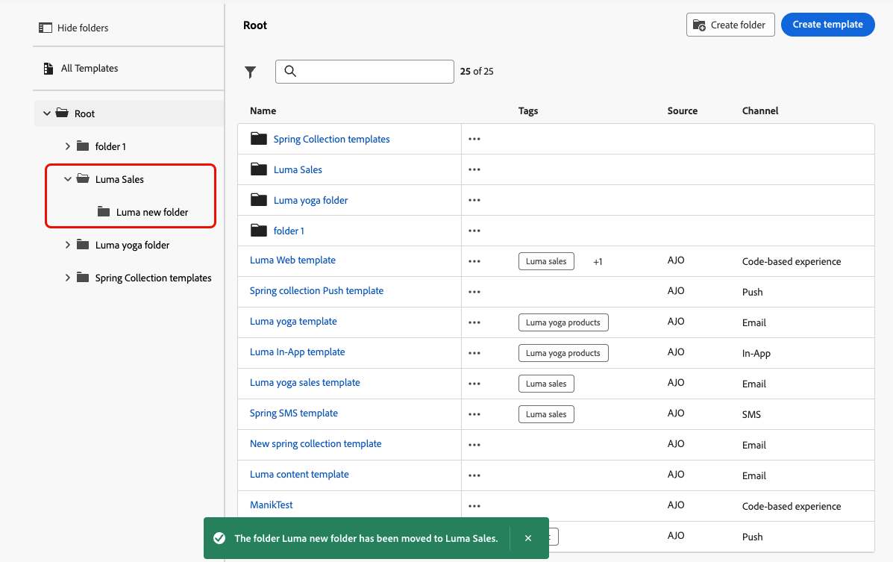

1. Now you can navigate to the folder that you just created. Each new content template you [create](create-content-templates.md) from here is saved into the current folder.

    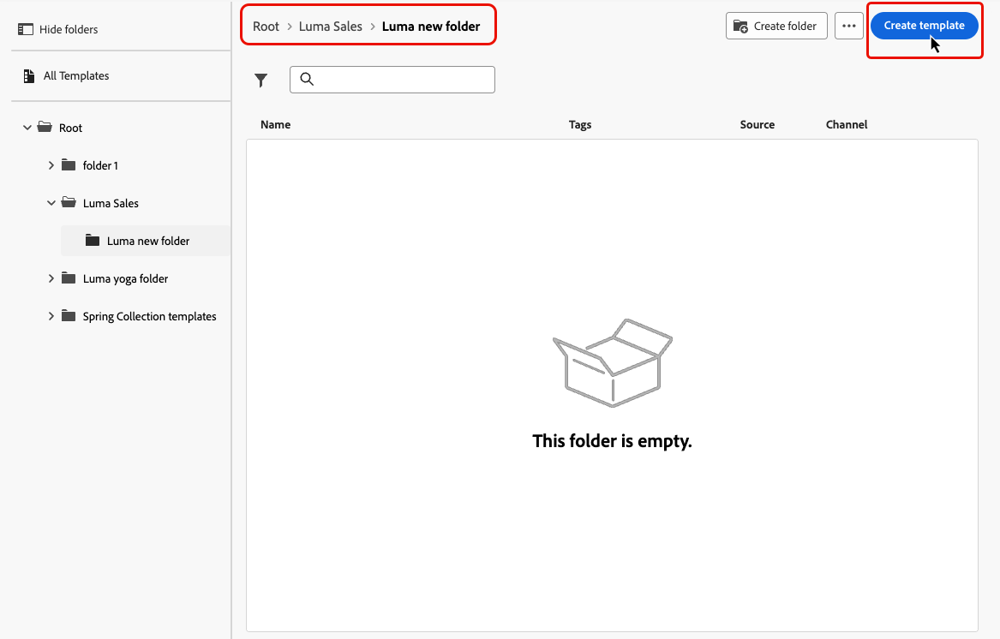

## Edit and delete content templates {#edit}

* To edit a template content, click the desired item from the list and make the desired changes. You can also edit the content template properties by clicking the edit button next to the template's name.

    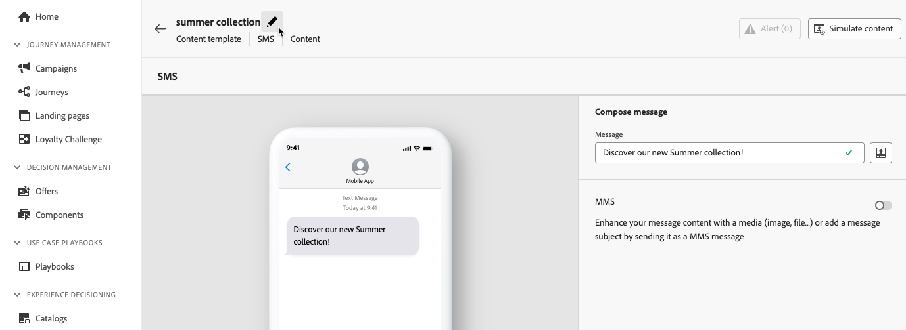

* To delete a template, select the **[!UICONTROL More actions]** button next to the desired template and select **[!UICONTROL Delete]**.

    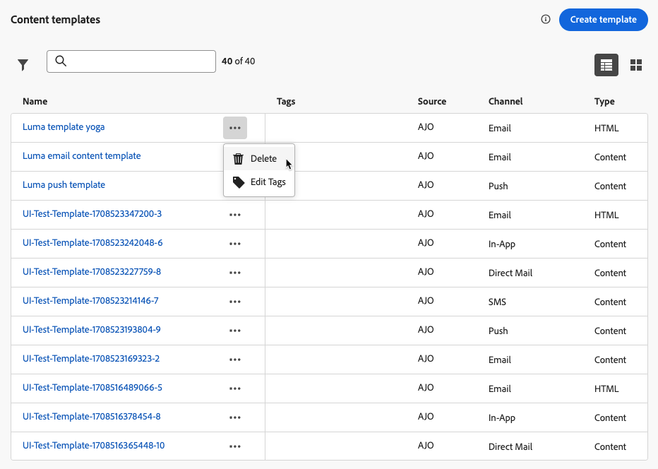

>[!NOTE]
>
>When a template is edited or deleted, campaigns or journeys including content created using this template are not impacted.

## [!BADGE Limited Availability]{type=Informative} Display templates as thumbnails {#template-thumbnails}

Select the **[!UICONTROL Grid view]** mode to display each template as a thumbnail.

>[!AVAILABILITY]
>
>This capability is released in Limited Availability (LA) for a small set of customers.

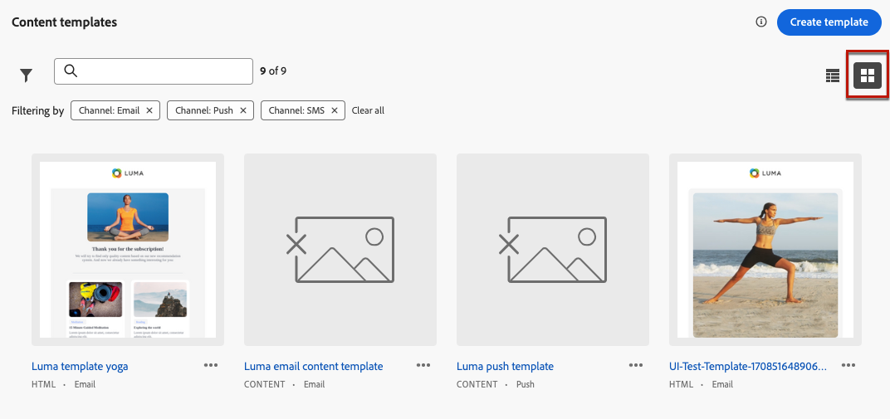

>[!NOTE]
>
>Currently proper thumbnails can only be generated for HTML-type email content templates.

When you update a content, you may have to wait a few seconds before the changes are reflected in the thumbnail.

## Export content templates to another sandbox {#export}

Journey Optimizer allows you to copy a content template from one sandbox to another. For example, you can copy a template from your Stage sandbox environment to your Production sandbox.

The copy process is carried via a **package export and import** between the source and target sandboxes. Detailed information on how to export objects and import them into a target sandbox are available in this section: [Copy objects to another sandbox](../configuration/copy-objects-to-sandbox.md)
