# Work with Adobe Experience Manager Content Advisor {#aem-content-advisor}

>[!AVAILABILITY]
>
>Adobe Experience Manager Content Advisor is available in channel authoring workflows only.

Adobe Experience Manager Content Advisor replaces deterministic discovery with standardized intent-driven discovery from a unified surface. It enables unified, AI-powered discovery of Assets and Content Fragments directly within Journey Optimizer authoring workflows, improving marketer productivity and campaign efficiency.

## Available features

### For Assets {#asset-features}

Adobe Experience Manager Content Advisor provides the following asset features:

* +++ AI semantic search
    
    Search for assets using natural language instead of exact keywords or file names. Describe what you need in plain language, for example "coffee in the mountains", and the AI finds contextually relevant assets based on meaning and content, not just text matches.
    
    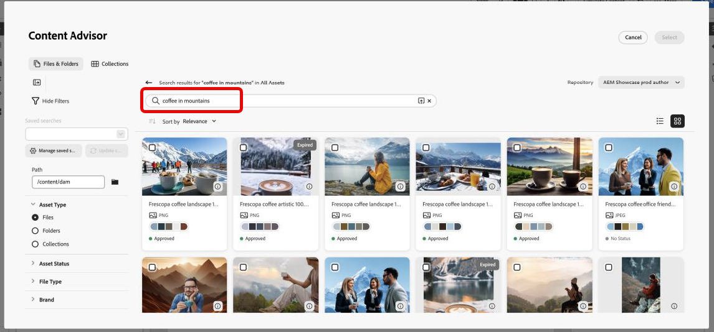{zoomable="yes"}

    +++

* +++ Recent search history

    Access your recent searches to quickly reuse keywords and contexts. This saves time when working on similar campaigns or when you need to refine previous searches.

    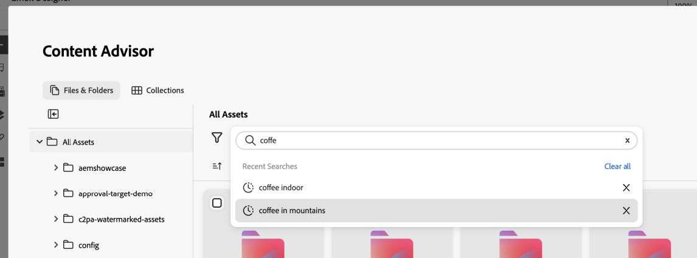{zoomable="yes"}

    +++ 

* +++ Upload brief

    Upload a marketing brief document to automatically surface assets that align with your campaign context. The AI analyzes your brief and suggests relevant assets based on the content and requirements described in the document.

    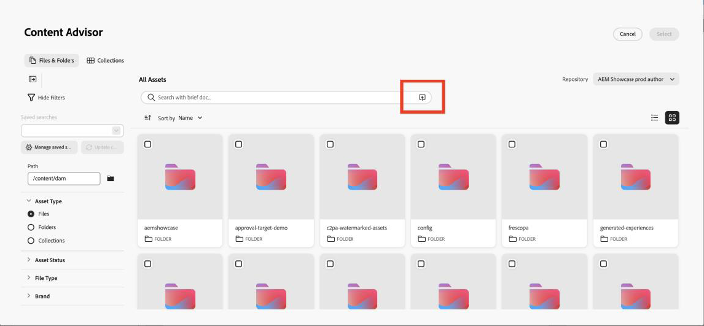{zoomable="yes"}

    +++

* +++ Asset information panel

    View detailed metadata and properties for any asset using the **Info** icon. This includes asset dimensions, file size, creation date, tags, and other relevant information to help you make informed decisions.

    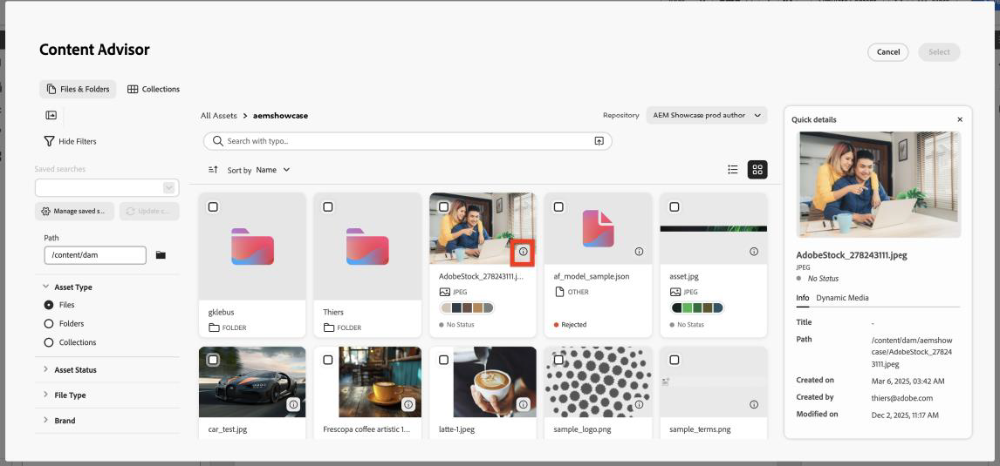{zoomable="yes"}

    +++

* +++ Dynamic Media panel

    Access dynamic renditions, smart crops, and on-the-fly modifications based on repository configuration.

    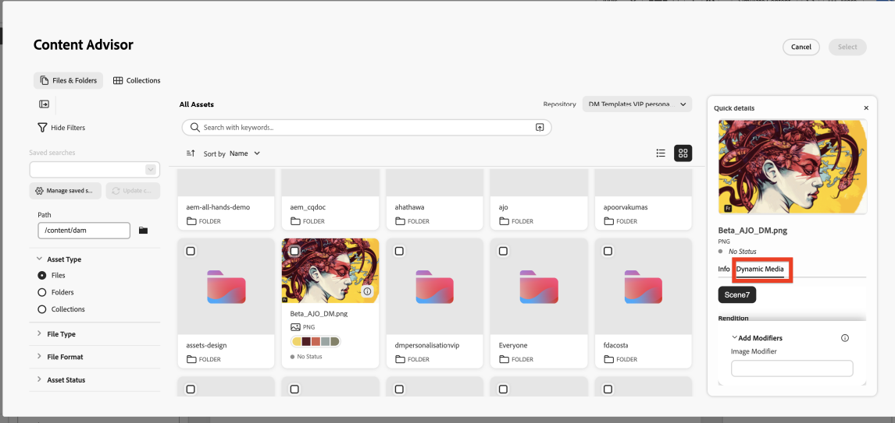{zoomable="yes"}

    The Dynamic Media panel provides access to dynamic renditions, smart crops, and on-the-fly modifications. You can enter modifiers directly in the panel to create custom renditions.

    **Availability**

    Dynamic Media availability depends on your repository configuration:

    * **Scene7**: Available for published assets (except Video and PDF). [Learn more on Dynamic Media Scene7 modifiers](https://experienceleague.adobe.com/docs/dynamic-media-developer-resources/image-serving-api/image-serving-api/http-protocol-reference/command-reference/r-is-http-modifiers.html){target="_blank"}

    * **OpenAPI**: Available for approved assets (except Video). [Learn more on Dynamic Media with OpenAPI modifiers](https://experienceleague.adobe.com/docs/experience-manager-cloud-service/content/assets/dynamicmedia/image-profiles.html){target="_blank"}

    * **Both Scene7 and OpenAPI**: Available when both configurations exist and the asset meets the criteria.

    **Stack selection**

    The buttons you see depend on your repository configuration:

    * **Scene7 button only**: Repository has Scene7 configuration and asset is published to Dynamic Media.
    * **OpenAPI button only**: Repository has OpenAPI configuration and asset is approved.
    * **Both buttons**: Repository has both configurations and asset is both published and approved.
    +++

### For Content Fragment {#content-fragment-features}

Adobe Experience Manager Content Advisor provides the following Content Fragment features:

* +++ Template view listing 

    Switch between thumbnail and table views to browse Content Fragments in the format that works best for your workflow. Thumbnail view provides visual context, while table view shows detailed information in a structured format.

    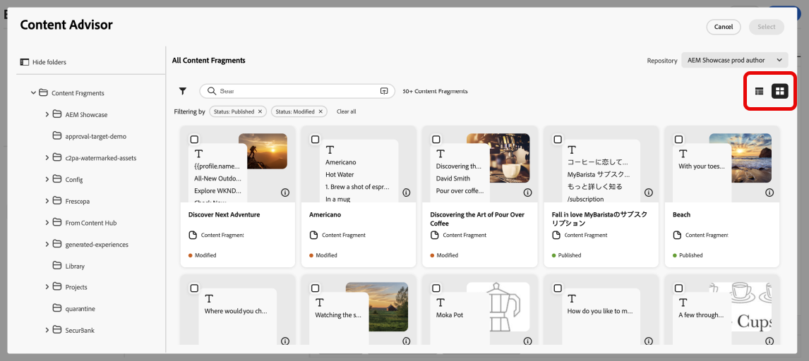{zoomable="yes"}

    +++

* +++ Info panel 

    Click the **[!UICONTROL Info]** icon to open a right panel displaying fragment variations, properties, and **[!UICONTROL Referenced By]** details. The **[!UICONTROL Referenced By]** section shows all Adobe Experience Manager entities where the fragment is used, with links to view these references directly in Adobe Experience Manager.

    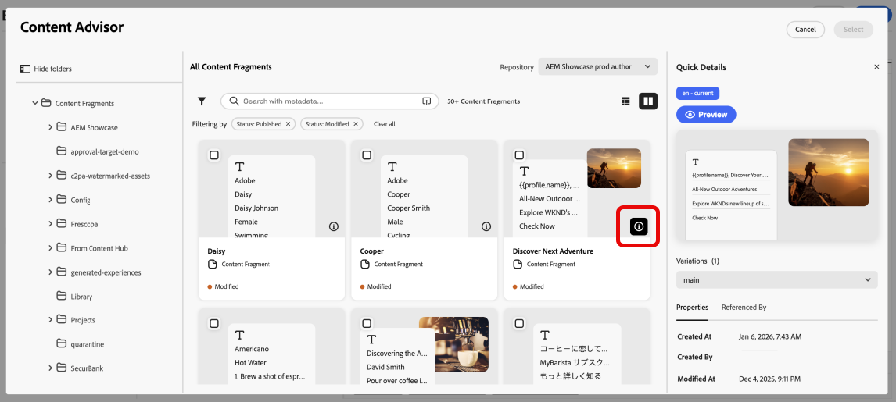{zoomable="yes"}

    +++

* +++ Open in Adobe Experience Manager

    Quickly open any Content Fragment directly in Adobe Experience Manager for editing using the icon next to the title. This seamless integration lets you switch between Journey Optimizer and Adobe Experience Manager without losing context.

    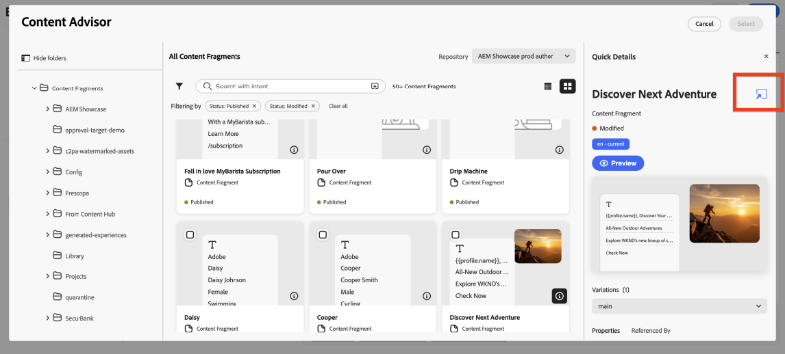{zoomable="yes"}

    +++

* +++ JSON preview

    Preview the JSON structure of Content Fragments in a clean, organized tabular format. This helps you understand the fragment's data structure and verify content before using it in your campaigns.

    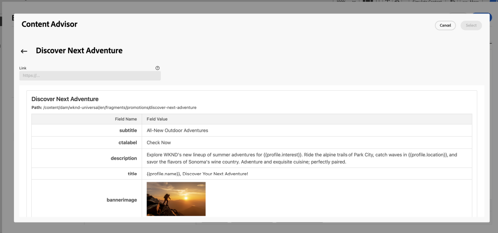{zoomable="yes"}

    +++

## Access Adobe Experience Manager Content Advisor {#access}

To access Adobe Experience Manager Content Advisor in Journey Optimizer, follow these steps:

1. Create a campaign in Adobe Journey Optimizer and add a channel action, for example Email.

1. Click **[!UICONTROL Edit Content]**, then click **[!UICONTROL Edit Email Body]** to open the content editor.

1. Drag and drop an HTML or Text component into your email content.

1. Hover over the component and click **[!UICONTROL Show the source code]** (for HTML components) or **[!UICONTROL Add Personalization]** (for Text components).

1. In the Personalization Editor, choose your content entry point:

    * To add an asset, click **[!UICONTROL Assets]** then **[!UICONTROL Open Asset Selector]**.

        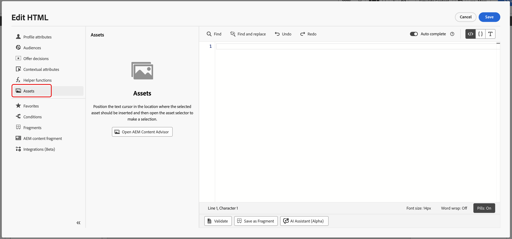{zoomable="yes"}

    * To add an Adobe Experience Manager Content Fragment, click **[!UICONTROL AEM Content Fragment]** then **[!UICONTROL Open AEM CF Selector]**.

        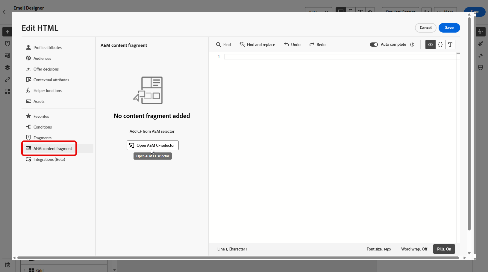{zoomable="yes"}

1. Select your Adobe Experience Manager repository.

    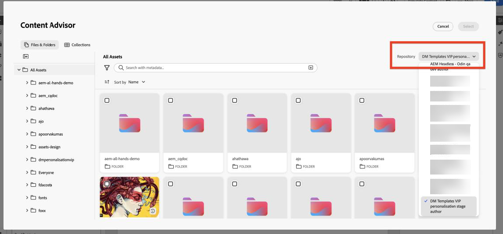{zoomable="yes"}

1. Browse and select the asset or content fragment you want to use, then insert it into your content.
