# Personalize your brand {#brands-personalize}

## About the brand {#about-brand}

Use the **[!UICONTROL About the brand]** tab to establish the core identity of your brand—outlining its purpose, personality, tagline, and other defining attributes.

1. Start by filling in the foundational information for your brand in the **[!UICONTROL Key details]** category:

    * **[!UICONTROL Brand Kit Name]**: Enter your brand kit name.

    * **[!UICONTROL When to Use]**: Specify scenarios or contexts where this brand kit should be applied.

    * **[!UICONTROL Brand Name]**: Enter the official name of the brand.

    * **[!UICONTROL Brand Description]**: Provide an overview of what this brand represents.

    * **[!UICONTROL Default Tagline]**: Add the primary tagline associated with the brand.

      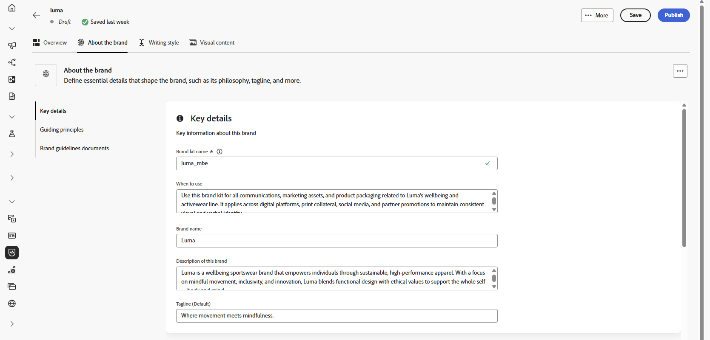

1. In the **[!UICONTROL Guiding principles]** category, clarify the core direction and philosophy of your brand:

    * **[!UICONTROL Mission]**: Detail your brand's purpose.

    * **[!UICONTROL Vision]**: Describe your long-term goal or desired future state.

    * **[!UICONTROL Market Positioning]**: Explain how your brand is positioned in the market.

      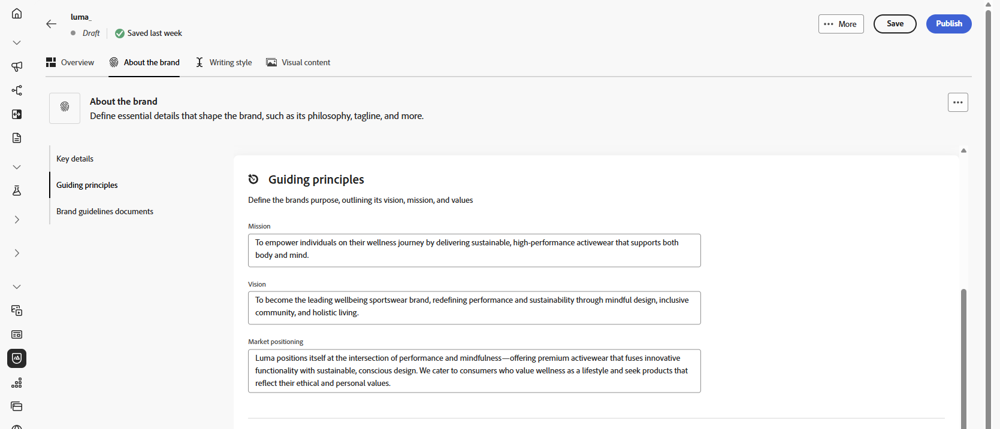

1. From the **[!UICONTROL Core brand values]** category, click  to add brand's core values and fill in the details:

    * **[!UICONTROL Value]**: Name a core brand value.

    * **[!UICONTROL Description]**: Explain what this value means to your brand.

    * **[!UICONTROL Behaviors]**: Outline the actions or attitudes that reflect this value in practice.

    * **[!UICONTROL Manifestations]**: Give examples of how this value is expressed in real-world branding.

      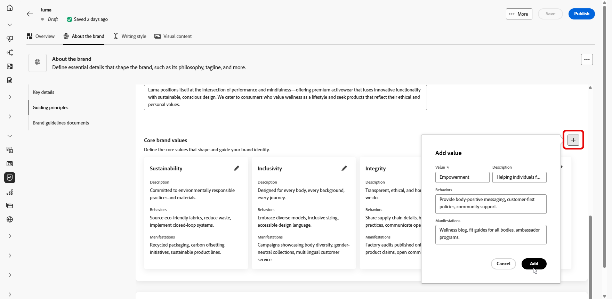

1. If needed, click the icon to update or delete one of your core brand value.

    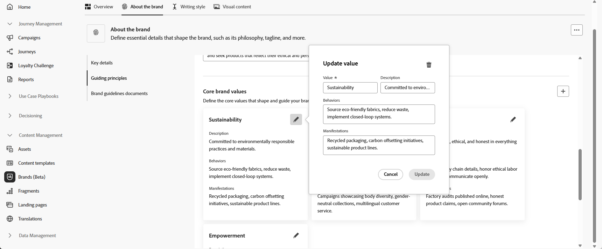

You can now further personalize your brand or [publish your brand](brands.md#create-brand-kit).

## Writing style {#writing-style}

>[!CONTEXTUALHELP]
>id="ajo_brand_writing_style"
>title="Writing style alignment score"
>abstract="The Writing style section defines standards for language, formatting, and structure to ensure clear, consistent content. The alignment score, rated from high to low, shows how well your content follows these guidelines and highlights areas for improvement."

The **[!UICONTROL Writing style]** section outlines the standards for writing content, detailing how language, formatting, and structure should be used to maintain clarity, coherence, and consistency across all materials.

+++ Available category and examples

<table>
  <thead>
    <tr>
      <th>Category</th>
      <th>Subcategory</th>
      <th>Guidelines Example</th>
      <th>Exclusions Example</th>
    </tr>
  </thead>
  <tbody>
    <tr>
      <td rowspan="4">Content Creation Standards</td>
      <td>Brand Messaging Standards</td>
      <td>Highlight innovation and customer-first messaging.</td>
      <td>Do not overpromise product capabilities.</td>
    </tr>
    <tr>
      <td>Tagline Usage</td>
      <td>Place the tagline beneath the logo on all digital marketing assets.</td>
      <td>Do not modify or translate the tagline.</td>
    </tr>
    <tr>
      <td>Core Messaging</td>
      <td>Emphasize the key benefit statement—such as improved productivity.</td>
      <td>Do not use unrelated value propositions.</td>
    </tr>
    <tr>
      <td>Naming Standards</td>
      <td>Use simple, descriptive names such as "ProScheduler".</td>
      <td>Do not use complex terms or special characters.</td>
    </tr>
    <tr>
      <td rowspan="5">Brand Communication Style</td>
      <td>Brand Personality Traits</td>
      <td>Friendly and approachable.</td>
      <td>Do not be defeatist.</td>
    </tr>
    <tr>
      <td>Writing Mechanics</td>
      <td>Keep sentences short and impactful.</td>
      <td>Do not use excessive jargon.</td>
    </tr>
    <tr>
      <td>Situational Tone</td>
      <td>Maintain a professional tone in crisis communications.</td>
      <td>Do not be dismissive in support communications.</td>
    </tr>
    <tr>
      <td>Word Choice Guidelines</td>
      <td>Use words like "innovative" and "smart".</td>
      <td>Avoid words like "cheap" or "hack".</td>
    </tr>
    <tr>
      <td>Language Standards</td>
      <td>Follow American English conventions.</td>
      <td>Do not mix British and American spellings.</td>
    </tr>
    <tr>
      <td rowspan="3">Legal Compliance Standards</td>
      <td>Trademark Standards</td>
      <td>Always use the &#8482; or &#174; symbol.</td>
      <td>Do not omit legal symbols when required.</td>
    </tr>
    <tr>
      <td>Copyright Standards</td>
      <td>Include copyright notices on marketing materials.</td>
      <td>Do not use third-party content without permission.</td>
    </tr>
    <tr>
      <td>Disclaimer Standards</td>
      <td>Display disclaimers legibly on digital assets.</td>
      <td>Do not hide disclaimers in non-visible areas.</td>
    </tr>
</table>

+++

 

To personalize your **[!UICONTROL Writing Style]**:

1. From the **[!UICONTROL Writing Style]** tab, click  to add a guideline, exception or exclusion.

1. Enter your guideline, exception or exclusion. You can also include **[!UICONTROL Examples]** to better illustrate how it should be applied.

    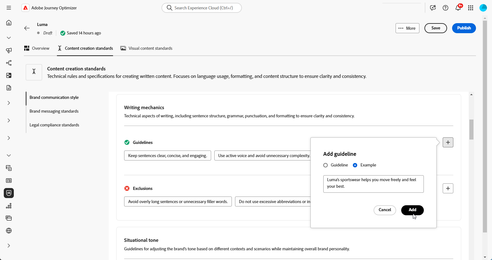

1. Specify the **Usage context** for your guideline, exception or exclusion:

    * **[!UICONTROL Channel type]**: Choose where this guideline, exception, or exclusion should apply. For example, you may want a specific writing style to appear only in Email, Mobile, Prints, or other communication channels.

    * **[!UICONTROL Element type]**: Specify which content element the rule applies to. This could include elements such as Headings, Buttons, Links, or other components within your content.

      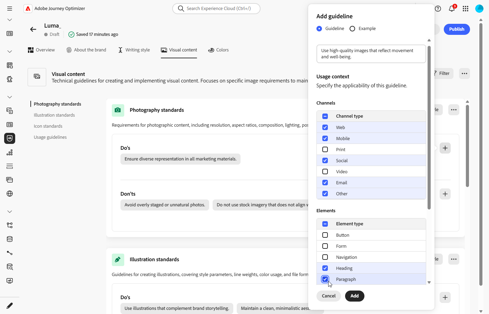

1. Once your guideline, exception, or exclusion is set up, click **[!UICONTROL Add]**. 

1. If needed, select one of your guideline or exclusion to update or delete.

1. Click the  to edit your example or the icon to delete it. 

    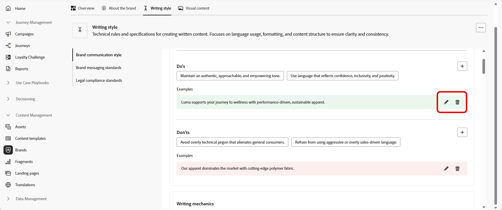

You can now further personalize your brand or [publish your brand](#create-brand-kit).

## Visual content {#visual-content}

>[!CONTEXTUALHELP]
>id="ajo_brand_imagery"
>title="Visual content alignment score"
>abstract="The Visual Content Alignment Score indicates how well your content matches your configured brand guidelines. Scored from high to low, it helps you assess alignment at a glance. Explore the different categories to identify areas for improvement and pinpoint elements that may be off-brand."

The **[!UICONTROL Visual Content]** section defines the standards for imagery and design, detailing the specifications needed to maintain a unified and consistent brand look.

+++ Available categories and examples

<table>
  <thead>
    <tr>
      <th>Category</th>
      <th>Guidelines Example</th>
      <th>Exclusions Example</th>
    </tr>
  </thead>
  <tbody>
    <tr>
      <td>Photography Standards</td>
      <td>Use natural lighting for outdoor shots.</td>
      <td>Avoid overly edited or pixelated images.</td>
    </tr>
    <tr>
      <td>Illustration Standards</td>
      <td>Use clean, minimalistic styles.</td>
      <td>Avoid overly complex.</td>
    </tr>
    <tr>
      <td>Icon standards</td>
      <td>Use a consistent 24px grid system.</td>
      <td>Do not mix icon dimensions, use inconsistent stroke weights, or deviate from grid rules.</td>
    </tr>
    <tr>
      <td>Usage guidelines</td>
      <td>Choose lifestyle images that reflect real customers using the product in professional environments.</td>
      <td>Do not use imagery that contradicts brand tone or appears out of context.</td>
    </tr>
</table>

+++

 

To personalize your **[!UICONTROL Visual content]**:

1. From the **[!UICONTROL Visual content]** tab, click  to add a guideline, exclusion or example. 

1. Enter your guideline, exclusion or example.

    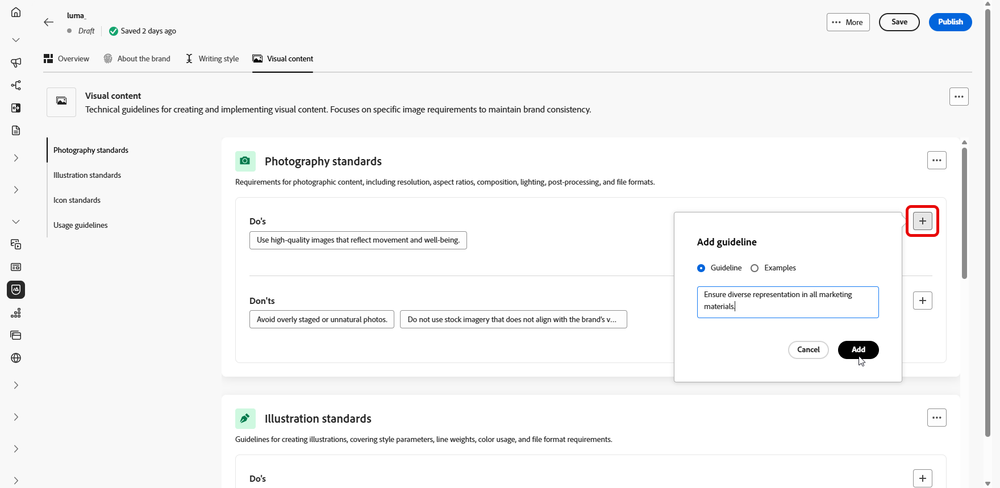

1. Specify the **Usage context** for your guideline or exclusion:

    * **[!UICONTROL Channel type]**: Choose where this guideline, exception, or exclusion should apply. For example, you may want a specific writing style to appear only in Email, Mobile, Prints, or other communication channels.

    * **[!UICONTROL Element type]**: Specify which content element the rule applies to. This could include elements such as Headings, Buttons, Links, or other components within your content.

      

1. Once your guideline, exception, or exclusion is set up, click **[!UICONTROL Add]**. 

1. To add an image showing correct usage, select **[!UICONTROL Example]** and click **[!UICONTROL Select image]**. You can also add an image showing incorrect usage as an exclusion example.

    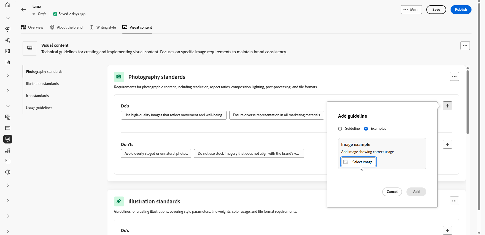

1. If needed, select one of your guideline or exclusion to update or delete.

1. Select one your example to update it, replace the image or click the icon to delete it. 

    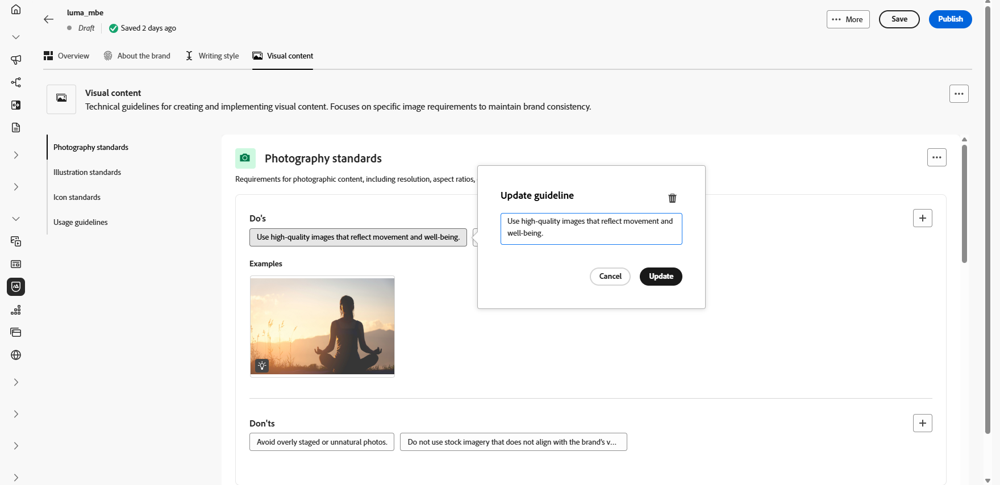

You can now further personalize your brand or [publish your brand](brands.md#create-brand-kit).

<!--
## Colors {#colors}

The **[!UICONTROL Colors]** section the standards for your brand's color system, outlining how colors are selected, organized, and applied across experiences. It ensures consistent use of primary, secondary, accent, and neutral colors to maintain a cohesive, accessible, and recognizable brand identity.

+++ Available categories and examples

<table>
  <thead>
    <tr>
      <th>Category</th>
      <th>Guidelines Example</th>
      <th>Exclusions Example</th>
    </tr>
  </thead>
  <tbody>
    <tr>
      <td>Primary colors</td>
      <td>Use primary brand colors for logos, headers, and main call-to-action elements.</td>
      <td>Do not substitute or modify primary brand colors.</td>
    </tr>
    <tr>
      <td>Secondary colors</td>
      <td>Use secondary colors to support layouts, illustrations, and UI components.</td>
      <td>Do not let secondary colors overpower primary brand colors.</td>
    </tr>
    <tr>
      <td>Accent colors</td>
      <td>Use accent colors sparingly for buttons, links, and alerts.</td>
      <td>Do not use accent colors for large background areas.</td>
    </tr>
    <tr>
      <td>Neutral colors</td>
      <td>Use neutral colors for text, dividers, borders, and subtle UI elements.</td>
      <td>Avoid using neutrals with poor contrast or heavy color casts.</td>
    </tr>
    <tr>
      <td>Background colors</td>
      <td>Use light or neutral backgrounds to ensure readability and visual clarity.</td>
      <td>Do not place text or logos on low-contrast backgrounds.</td>
    </tr>
    <tr>
      <td>Additional colors</td>
      <td>Use additional colors only for data visualization or approved campaigns.</td>
      <td>Do not introduce unapproved or off-brand colors.</td>
    </tr>
    <tr>
      <td>Color scales</td>
      <td>Use approved tints and shades for UI states such as hover, active, and disabled.</td>
      <td>Do not create unofficial shades or gradients.</td>
    </tr>
    <tr>
      <td>Usage guidelines</td>
      <td>Maintain consistent color usage and accessible contrast across all assets.</td>
      <td>Do not mix conflicting palettes or apply colors inconsistently.</td>
    </tr>
</table>

+++

 

To personalize your **[!UICONTROL Colors]**:

1. From the **[!UICONTROL Colors]** tab, click  to add a color, guideline or exclusion. 

1. Enter your color information to define it accurately:

    * **Color name**: Provide a clear, descriptive name to identify the color within your brand system.

    * **Color value**: Choose your color using the hue picker or enter precise values using RGB, HEX, or Pantone name/code to ensure consistency across digital and print assets.

    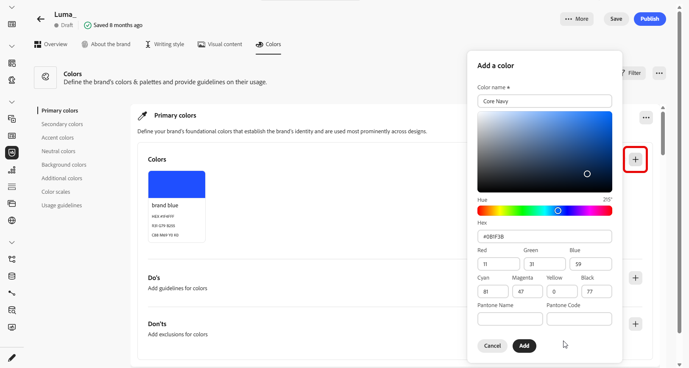

1. Review your selection to confirm accuracy and visual consistency and click **[!UICONTROL Add]** to save your color.

1. Then, enter your guideline or exclusion.

1. Specify the Usage context for your guideline or exclusion:

    * **[!UICONTROL Channel type]**: Choose where this guideline, exception, or exclusion should apply. For example, you may want a specific writing style to appear only in Email, Mobile, Prints, or other communication channels.

    * **[!UICONTROL Element type]**: Specify which content element the rule applies to. This could include elements such as Headings, Buttons, Links, or other components within your content.

      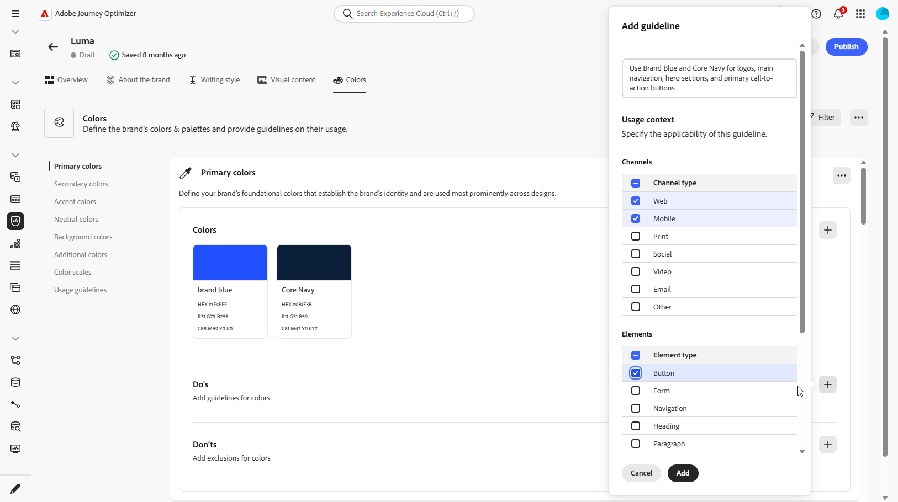
  
1. Once your guideline, exception, or exclusion is set up, click **[!UICONTROL Add]**. 

1. If needed, select one of your guideline or exclusion to update or delete.

1. Select one your guideline or exclusion to update it. Click the icon to delete it. 

    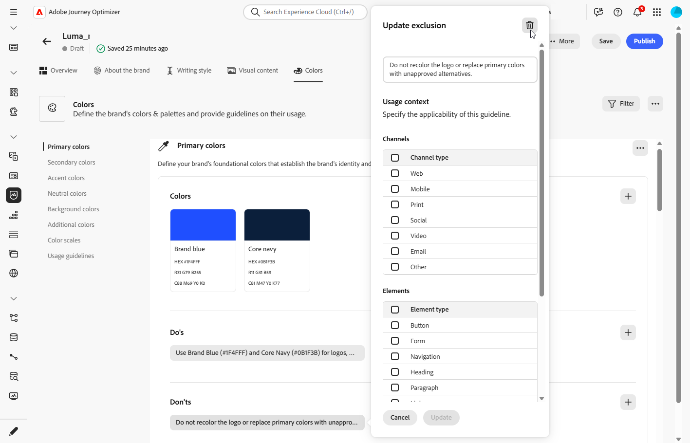

1. Click **[!UICONTROL Add group]** to define additional colors for your brand or to add a color scale group.

You can now further personalize your brand or [publish your brand](brands.md#create-brand-kit).
-->

