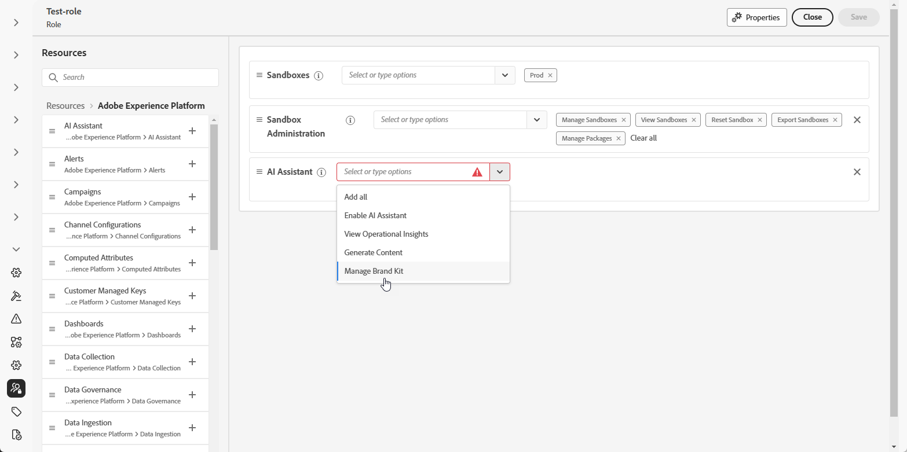
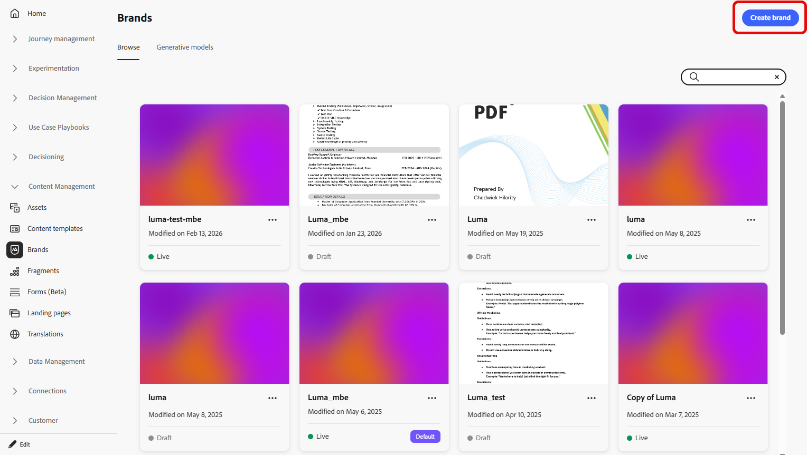
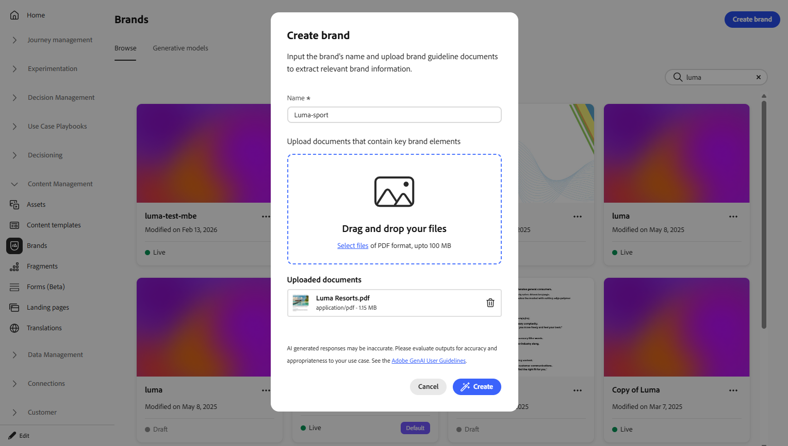
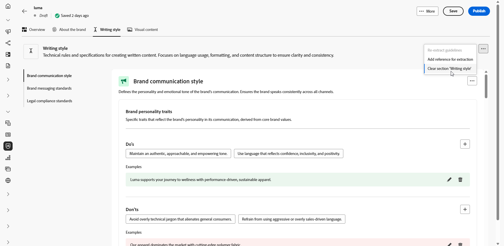
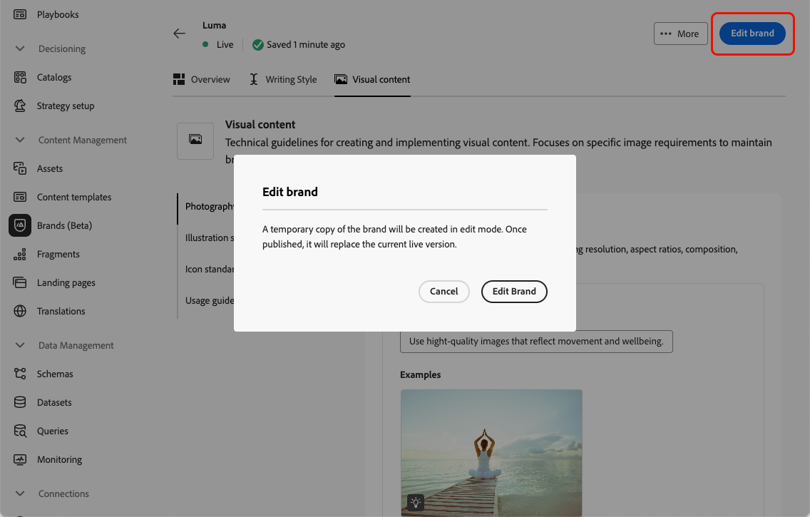
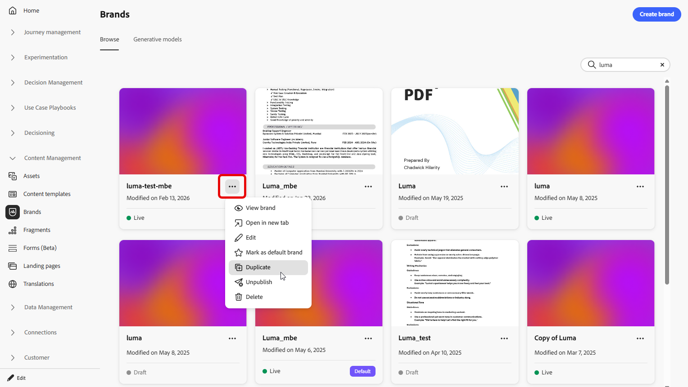
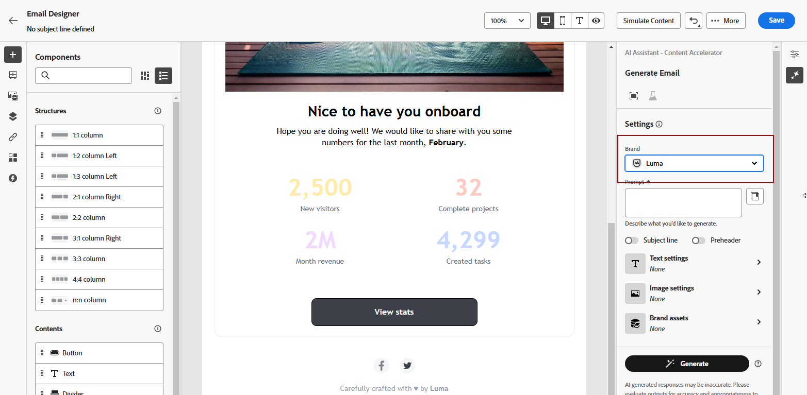
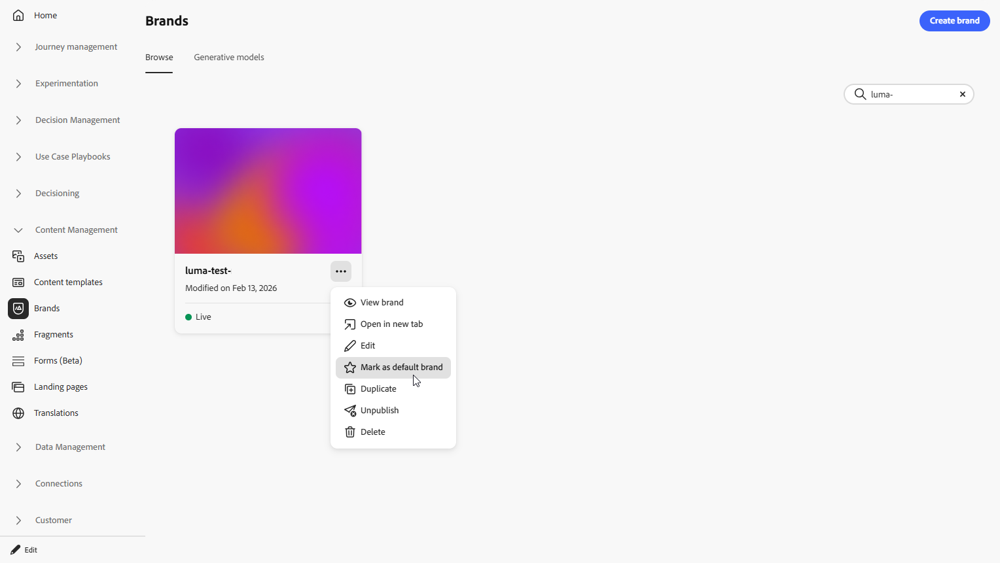

# Create & manage your brands {#brands}

>[!CONTEXTUALHELP]
>id="ajo_brand_overview"
>title="Get started with brands"
>abstract="Create and customize your own brands to define your unique visual and verbal identity while making it easier to generate content that matches your brand's style and voice."

>[!CONTEXTUALHELP]
>id="ajo_brand_ai_menu"
>title="Select your Brand"
>abstract="Choose your brand to ensure that all AI-generated content is tailored to align with your brand's specifications and guidelines."

>[!CONTEXTUALHELP]
>id="ajo_brand_score_overview"
>title="Brand selection"
>abstract="Select your brand to ensure that your content is crafted in alignment with its specific guidelines, standards, and identity, maintaining consistency and brand integrity."

>[!AVAILABILITY]
>
>You must agree to the [user agreement](https://www.adobe.com/legal/licenses-terms/adobe-dx-gen-ai-user-guidelines.html){target="_blank"} before you can use the AI Assistant in Adobe Journey Optimizer. For more information, contact your Adobe representative.

Brand guidelines are a detailed set of rules and standards that establish a brand's visual and verbal identity. They act as a reference to maintain consistent brand representation across all marketing and communication platforms.

In [!DNL Journey Optimizer], you now have the option to manually input and organize your brand details or upload brand guideline documents for automatic information extraction.

## Access brands {#generative-access}

To access the **[!UICONTROL Brands]** menu in [!DNL Adobe Journey Optimizer], users need to be granted the **[!UICONTROL Manage brand kit]** or **[!UICONTROL Enable AI assistant]** permissions. [Learn more](../administration/permissions.md)

+++  Learn how to assign brand related permissions

To assign permissions for brands, follow these steps:

1. In the **Permissions** product, go to the **Roles** tab and select the desired **Role**.

1. Click **Edit** to modify the permissions.

1. Add the **AI Assistant** resource, then select **Manage brand kit** or **[!UICONTROL Enable Ai assistant]** from the drop-down menu. 

    Note that **[!UICONTROL Enable Ai assistant]** permission only provides read-only access to the **[!UICONTROL Brands]** menu.

    {zoomable="yes"}

1. Click **Save** to apply changes.

    Any users already assigned to this role will have their permissions automatically updated.

1. To assign this role to new users, navigate to the **Users** tab within the **Roles** dashboard and click **Add User**.

1. Enter the user's name, email address, or choose from the list, then click **Save**.

1. If the user was not previously created, refer to the [this documentation](https://experienceleague.adobe.com/en/docs/experience-platform/access-control/abac/permissions-ui/users).

+++

## Create and manage your brand {#create-brand-kit}

>[!CONTEXTUALHELP]
>id="ajo_brands_create"
>title="Create your brand"
>abstract="Enter your brand name and upload your brand guidelines file. The tool will automatically extract key details, making it easier to maintain your brand's identity."

To create and manage your brand guideline, you can either enter the details yourself, or upload your brand guidelines document to have the information extracted automatically:

1. In the **[!UICONTROL Brands]** menu, click **[!UICONTROL Create brand]**.

    

1. Enter a **[!UICONTROL Name]** for your brand.

1. Drag and drop or select your file to upload your brand guidelines and extract automatically relevant brand information. Click **[!UICONTROL Create brand]**.

    The information extraction process now begins. Note that it may take several minutes to complete.

    

1. Your Content and visual creation standards are now automatically populated. Browse through the different tabs to adapt the information as needed. [Learn more](#personalize)

1. From the advanced menu of each section or category, you can add references to extract relevant brand information automatically.

    To remove existing content, use the **[!UICONTROL Clear section]** or **[!UICONTROL Clear category]** options.

    

1. Once configured, click **[!UICONTROL Save]**, then **[!UICONTROL Publish]** to make your brand guideline available in AI Assistant.

1. To make modifications to your published brand, click **[!UICONTROL Edit brand]**. 

    >[!NOTE]
    >
    >This creates a temporary copy in edit mode, replacing the live version once published.

    

1. From your **[!UICONTROL Brands]** dashboard, open the advanced menu by clicking the  icon to: 

    * View brand
    * Edit
    * Duplicate
    * Publish
    * Unpublish
    * Delete

    

Your brand guidelines are now accessible from the **[!UICONTROL Brand]** drop-down in AI Assistant menu, enabling it to generate content and assets aligned with your specifications. [Learn more about AI Assistant](gs-generative.md)

### Set a default brand {#default-brand}

You can designate a default brand to be automatically applied when generating content and calculating alignment scores during campaign creation.

To set a default brand, go to your **[!UICONTROL Brands]** dashboard. Open the advanced menu by clicking the by clicking the  icon and select **[!UICONTROL Mark as default brand]**.

## Personalize your brand {#personalize}

### About the brand {#about-brand}

Use the **[!UICONTROL About the brand]** tab to establish the core identity of your brand—outlining its purpose, personality, tagline, and other defining attributes.

1. Start by filling in the foundational information for your brand in the **[!UICONTROL Key details]** category:

    * **[!UICONTROL Brand Kit Name]**: Enter your brand kit name.

    * **[!UICONTROL When to Use]**: Specify scenarios or contexts where this brand kit should be applied.

    * **[!UICONTROL Brand Name]**: Enter the official name of the brand.

    * **[!UICONTROL Brand Description]**: Provide an overview of what this brand represents.

    * **[!UICONTROL Default Tagline]**: Add the primary tagline associated with the brand.

      

1. In the **[!UICONTROL Guiding principles]** category, clarify the core direction and philosophy of your brand:

    * **[!UICONTROL Mission]**: Detail your brand's purpose.

    * **[!UICONTROL Vision]**: Describe your long-term goal or desired future state.

    * **[!UICONTROL Market Positioning]**: Explain how your brand is positioned in the market.

      

1. From the **[!UICONTROL Core brand values]** category, click  to add brand's core values and fill in the details:

    * **[!UICONTROL Value]**: Name a core brand value.

    * **[!UICONTROL Description]**: Explain what this value means to your brand.

    * **[!UICONTROL Behaviors]**: Outline the actions or attitudes that reflect this value in practice.

    * **[!UICONTROL Manifestations]**: Give examples of how this value is expressed in real-world branding.

      

1. If needed, click the icon to update or delete one of your core brand value.

    

You can now further personalize your brand or [publish your brand](#create-brand-kit).

### Writing style {#writing-style}

>[!CONTEXTUALHELP]
>id="ajo_brand_writing_style"
>title="Writing style alignment score"
>abstract="The Writing style section defines standards for language, formatting, and structure to ensure clear, consistent content. The alignment score, rated from high to low, shows how well your content follows these guidelines and highlights areas for improvement."

The **[!UICONTROL Writing style]** section outlines the standards for writing content, detailing how language, formatting, and structure should be used to maintain clarity, coherence, and consistency across all materials.

+++ Available category and examples

<table>
  <thead>
    <tr>
      <th>Category</th>
      <th>Subcategory</th>
      <th>Guidelines Example</th>
      <th>Exclusions Example</th>
    </tr>
  </thead>
  <tbody>
    <tr>
      <td rowspan="4">Content Creation Standards</td>
      <td>Brand Messaging Standards</td>
      <td>Highlight innovation and customer-first messaging.</td>
      <td>Do not overpromise product capabilities.</td>
    </tr>
    <tr>
      <td>Tagline Usage</td>
      <td>Place the tagline beneath the logo on all digital marketing assets.</td>
      <td>Do not modify or translate the tagline.</td>
    </tr>
    <tr>
      <td>Core Messaging</td>
      <td>Emphasize the key benefit statement—such as improved productivity.</td>
      <td>Do not use unrelated value propositions.</td>
    </tr>
    <tr>
      <td>Naming Standards</td>
      <td>Use simple, descriptive names such as "ProScheduler".</td>
      <td>Do not use complex terms or special characters.</td>
    </tr>
    <tr>
      <td rowspan="5">Brand Communication Style</td>
      <td>Brand Personality Traits</td>
      <td>Friendly and approachable.</td>
      <td>Do not be defeatist.</td>
    </tr>
    <tr>
      <td>Writing Mechanics</td>
      <td>Keep sentences short and impactful.</td>
      <td>Do not use excessive jargon.</td>
    </tr>
    <tr>
      <td>Situational Tone</td>
      <td>Maintain a professional tone in crisis communications.</td>
      <td>Do not be dismissive in support communications.</td>
    </tr>
    <tr>
      <td>Word Choice Guidelines</td>
      <td>Use words like "innovative" and "smart".</td>
      <td>Avoid words like "cheap" or "hack".</td>
    </tr>
    <tr>
      <td>Language Standards</td>
      <td>Follow American English conventions.</td>
      <td>Do not mix British and American spellings.</td>
    </tr>
    <tr>
      <td rowspan="3">Legal Compliance Standards</td>
      <td>Trademark Standards</td>
      <td>Always use the &#8482; or &#174; symbol.</td>
      <td>Do not omit legal symbols when required.</td>
    </tr>
    <tr>
      <td>Copyright Standards</td>
      <td>Include copyright notices on marketing materials.</td>
      <td>Do not use third-party content without permission.</td>
    </tr>
    <tr>
      <td>Disclaimer Standards</td>
      <td>Display disclaimers legibly on digital assets.</td>
      <td>Do not hide disclaimers in non-visible areas.</td>
    </tr>
</table>

+++

 

To personalize your **[!UICONTROL Writing Style]**:

1. From the **[!UICONTROL Writing Style]** tab, click  to add a guideline, exception or exclusion.

1. Enter your guideline, exception or exclusion and click **[!UICONTROL Add]**.

    

1. Select one of your guideline or exclusion to update or delete.

1. Click the  to edit your example or the icon to delete it. 

    

You can now further personalize your brand or [publish your brand](#create-brand-kit).

### Visual content {#visual-content}

>[!CONTEXTUALHELP]
>id="ajo_brand_imagery"
>title="Visual content alignment score"
>abstract="The Visual Content Alignment Score indicates how well your content matches your configured brand guidelines. Scored from high to low, it helps you assess alignment at a glance. Explore the different categories to identify areas for improvement and pinpoint elements that may be off-brand."

The **[!UICONTROL Visual Content]** section defines the standards for imagery and design, detailing the specifications needed to maintain a unified and consistent brand look.

+++ Available categories and examples

<table>
  <thead>
    <tr>
      <th>Category</th>
      <th>Guidelines Example</th>
      <th>Exclusions Example</th>
    </tr>
  </thead>
  <tbody>
    <tr>
      <td>Photography Standards</td>
      <td>Use natural lighting for outdoor shots.</td>
      <td>Avoid overly edited or pixelated images.</td>
    </tr>
    <tr>
      <td>Illustration Standards</td>
      <td>Use clean, minimalistic styles.</td>
      <td>Avoid overly complex.</td>
    </tr>
    <tr>
      <td>Icon standards</td>
      <td>Use a consistent 24px grid system.</td>
      <td>Do not mix icon dimensions, use inconsistent stroke weights, or deviate from grid rules.</td>
    </tr>
    <tr>
      <td>Usage guidelines</td>
      <td>Choose lifestyle images that reflect real customers using the product in professional environments.</td>
      <td>Do not use imagery that contradicts brand tone or appears out of context.</td>
    </tr>
</table>

+++

 

To personalize your **[!UICONTROL Visual content]**:

1. From the **[!UICONTROL Visual content]** tab, click  to add a guideline, exclusion or example. 

1. Enter your guideline, exclusion or example and click **[!UICONTROL Add]**.

    

1. To add an image showing correct usage, select **[!UICONTROL Example]** and click **[!UICONTROL Select image]**. You can also add an image showing incorrect usage as an exclusion example.

    

1. Select one of your guideline or exclusion to update or delete.

1. Select one your guideline or exclusion to update it. Click the icon to delete it. 

    

You can now further personalize your brand or [publish your brand](#create-brand-kit).
