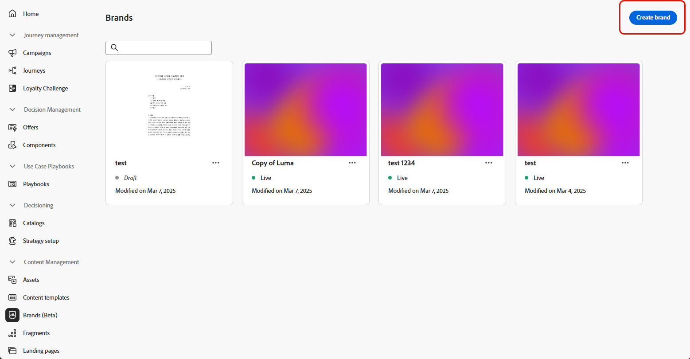
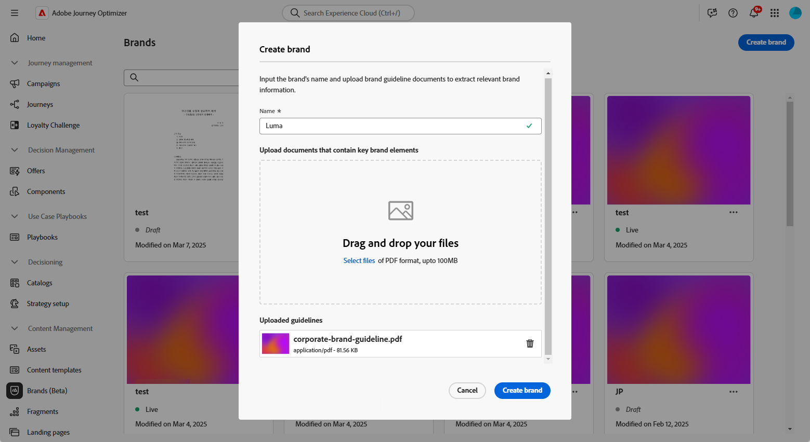
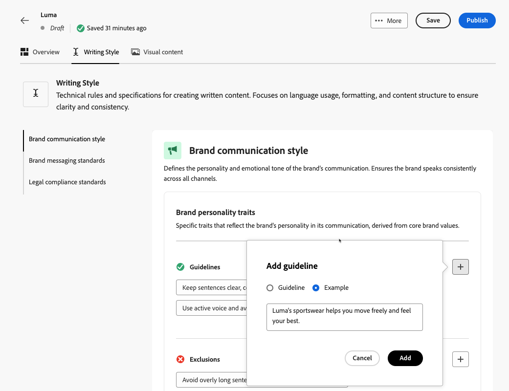
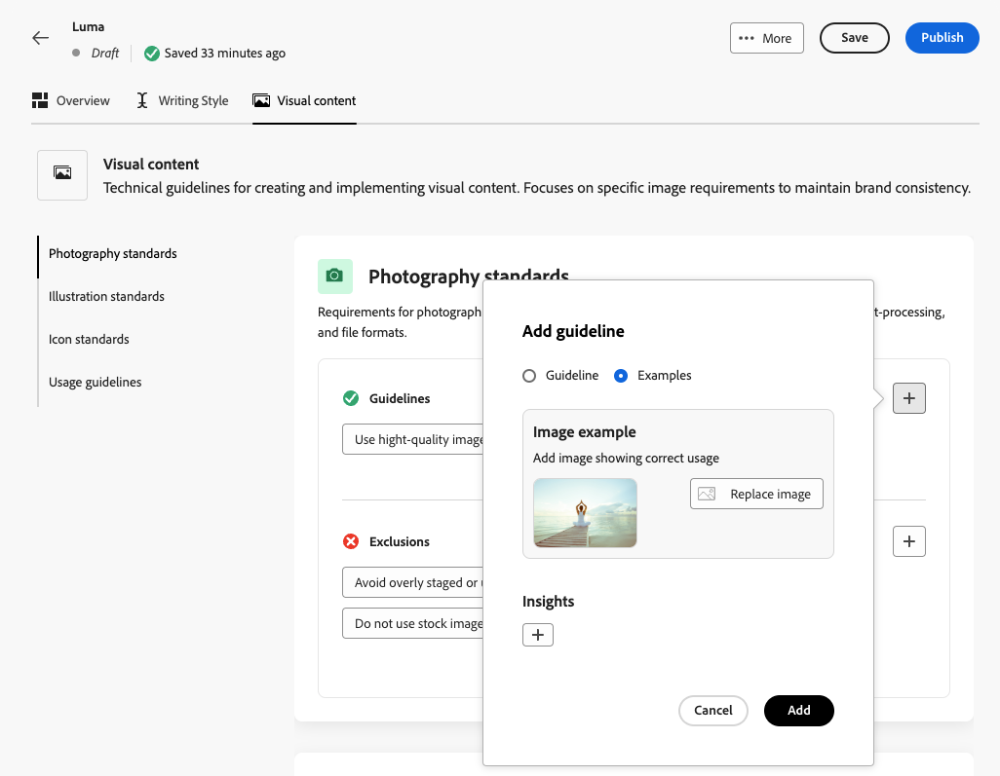
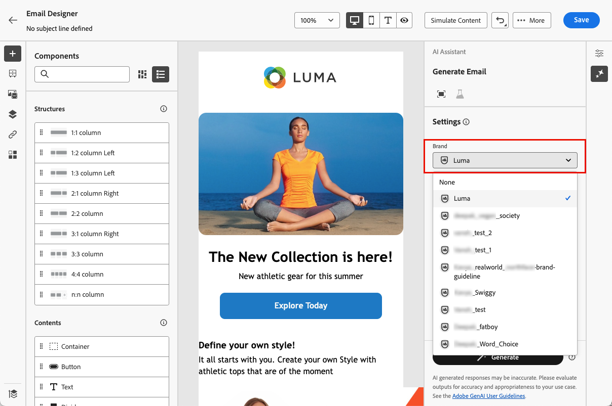

# Create and manage your brands {#brands}

>[!AVAILABILITY]
>
>This capability is released as a private beta. It will be progressively available to all customers in future releases.

Brand guidelines are a detailed set of rules and standards that establish a brand's visual and verbal identity. They act as a reference to maintain consistent brand representation across all marketing and communication platforms.

<!--Upload feature currently behind feature flag--

In [!DNL Journey Optimizer], you now have the option to manually input and organize your brand details or upload brand guideline documents for automatic information extraction.-->

## Access Brands {#generative-access}

To access the **[!UICONTROL Brands]** menu in [!DNL Adobe Journey Optimizer], users need to be granted the **[!UICONTROL Managed brand kit]** or **[!UICONTROL Enable AI assistant]** permissions. [Learn more](../administration/permissions.md)

+++  Learn how to assign brand related permissions

1. In the **Permissions** product, go to the **Roles** tab and select the desired **Role**.

1. Click **Edit** to modify the permissions.

1. Add the **AI Assistant** resource, then select **Managed brand kit** or **[!UICONTROL Enable Ai assistant]** from the drop-down menu. 

    Note that **[!UICONTROL Enable Ai assistant]** permission only provides read-only access to the **[!UICONTROL Brands]** menu.

    {zoomable="yes"}

1. Click **Save** to apply changes.

    Any users already assigned to this role will have their permissions automatically updated.

1. To assign this role to new users, navigate to the **Users** tab within the **Roles** dashboard and click **Add User**.

1. Enter the user's name, email address, or choose from the list, then click **Save**.

1. If the user was not previously created, refer to the [this documentation](https://experienceleague.adobe.com/en/docs/experience-platform/access-control/abac/permissions-ui/users).

+++

## Create your brand {#create-brand-kit}

To create and manage your brand guidelines, follow the steps below.

<!--Upload feature currently behind feature flag--

To create and manage your Brand guideline, you can either enter the details yourself, or upload your brand guidelines document to have the information extracted automatically:-->

1. In the **[!UICONTROL Brands]** menu, click **[!UICONTROL Create brand]**.

    

1. Enter a **[!UICONTROL Name]** for your brand<!--and a **[!UICONTROL Description]** to your brand guideline-->.

    

<!--Upload feature currently behind feature flag so hidden from doc - should be available again by EOM (Feb)--

1. Drag and drop or select your file to upload your brand guidelines and extract automatically relevant brand information. Click **[!UICONTROL Create brand]**.

    The information extraction process now begins. Note that it may take several minutes to complete.

    

1. Your Content and visual creation standards are now automatically populated. Browse through the different tabs to adapt the information as needed.

-->

1. From the **[!UICONTROL Writing Style]** tab, click  to add a guideline or exclusion, including examples.

    

1. From the **[!UICONTROL Visual content]** tab, click  to add another guideline or exclusion. 

1. To add an image showing correct usage, select **[!UICONTROL Example]** and click **[!UICONTROL Select image]**. You can also add an image showing incorrect usage as an exclusion example.

    

1. Once configured, click **[!UICONTROL Save]**, then **[!UICONTROL Publish]** to make your brand guideline available in the AI assistant.

1. To make modifications to your published brand, click **[!UICONTROL Edit brand]**. 

    >[!NOTE]
    >
    >This creates a temporary copy in edit mode, replacing the live version once published.

    

1. From your **[!UICONTROL Brands]** dashboard, open the advanced menu by clicking the  icon to: 

    * View brand
    * Edit
    * Duplicate
    * Publish
    * Unpublish
    * Delete

    

Your brand guidelines are now accessible from the **[!UICONTROL Brand]** drop-down in the AI assistant menu, enabling it to generate content and assets aligned with your specifications. [Learn more on the AI assistant](gs-generative.md)

