# Create a content experiment {#content-experiment}

>[!CONTEXTUALHELP]
>id="ajo_campaigns_content_experiment"
>title="Content experiment"
>abstract="You can choose to vary the message content or subject in order to define multiple treatments and determine the best combination for your audiences."

>[!NOTE]
>
>Before starting with Content Experiment, make sure that your reporting configuration is set for your custom datasets. Learn more in [this section](../reports/reporting-configuration.md).

The Journey Optimizer Content Experiment enables you to define multiple delivery treatments in order to measure which one performs best for your target audience. You can choose to vary the delivery content or subject. The audience of interest is randomly allocated to each treatment to determine which one works best in terms of the specified metric.

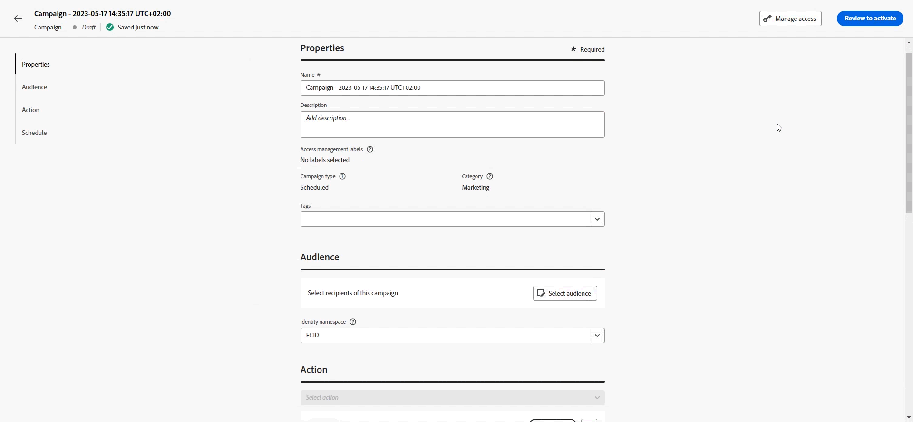

In the example below, the delivery target has been split into two groups, each representing 45% of the targeted population, and a holdout group of 10%, who will not receive the delivery.

Each person in the targeted audience will receive one version of an email, with a subject line that is one of the following two:

* one directly promoting a 10% offer on the new collection and an image.
* the other one only advertising a special offer without specifying the 10% off without any image. 

The goal here is to see if recipients will interact with the email depending on the received experiment. We therefore will choose **[!UICONTROL Email Opens]** as the primary goal metric in this Content Experiment.

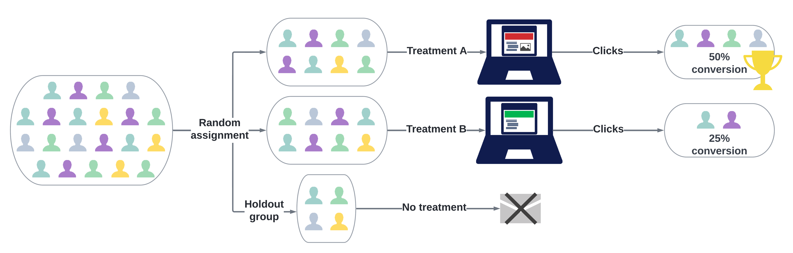

➡️ Learn how to use content experiments to compare decisions with the code-based experience channel in [this use case](../experience-decisioning/experience-decisioning-uc.md).

## Create your content {#campaign-experiment}

1. Begin by creating and configuring your [campaign](../campaigns/create-campaign.md) or [journey](../building-journeys/journeys-message.md) according to your requirements.

1. From the **[!UICONTROL Edit content]** window, start personalizing the treatment A.

    For this treatment, we will specify the special offer directly in the subject line and add personalization.

    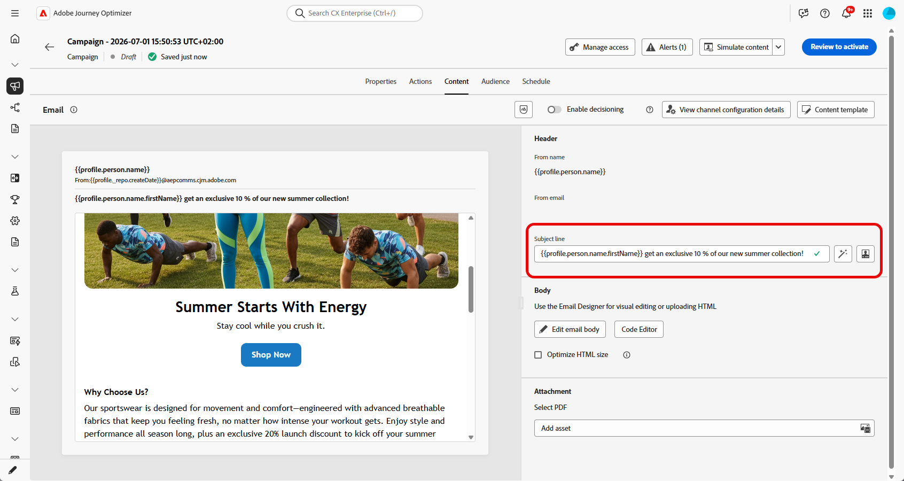

1. Create or import your original content and personalize it as needed.

## Configure your content experiment {#configure-experiment}

>[!CONTEXTUALHELP]
>id="ajo_campaigns_content_experiment_dimension"
>title="Dimension"
>abstract="Choose the specific dimension to track for your Experiment, such as specific clicks or views of specific pages."

>[!CONTEXTUALHELP]
>id="ajo_campaigns_content_experiment_success_metric"
>title="Success metric"
>abstract="Success metric is used to track and evaluate the best performing treatment in an experiment. Be sure to set up your dataset for certain metrics before using it."

>[!AVAILABILITY]
>
>Direct Mail supports the Holdout functionality but does not currently support Treatments.

For you content experiment, you can choose between three types of experiment:

* **[!UICONTROL A/B experiment]**: define the traffic split between treatments at the start of the test. Performance is evaluated based on your chosen primary metric, the Experimentation Accelerator, then, reports the observed lift between treatments.

* **[!UICONTROL Multi-armed bandit]**: traffic split between treatments is handled automatically. Every 7 days, performance on the primary metric is reviewed, and weights are adjusted accordingly. Reporting in the Experimentation Accelerator continues to show Lift, as A/B tests.

* **[!UICONTROL Bring your own Multi-armed bandit]**: traffic split between treatments is handled automatically. You have the flexibility to determine when and how it should change by using the Experiment APIs to adjust allocations in real time.

➡️ [Learn more on the difference between A/B and Multi-armed bandit experiments](mab-vs-ab.md)

>[!BEGINTABS]

>[!TAB A/B experiment]

1. When your message is personalized, from the **[!UICONTROL Actions]** tab, click **[!UICONTROL Create experiment]** to start configuring your content experiment.

    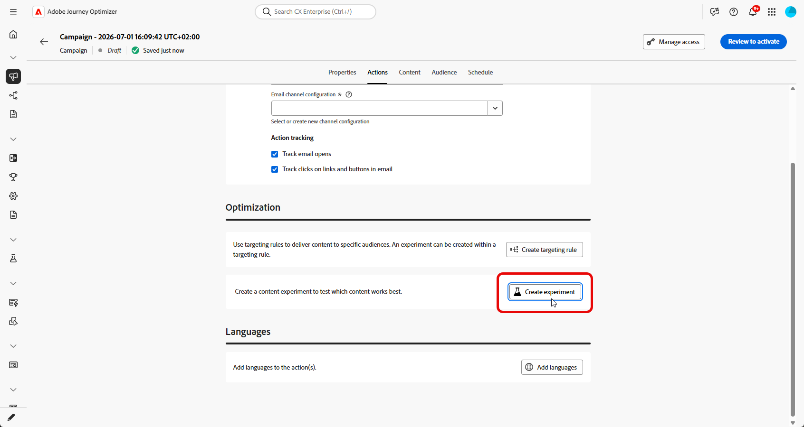

1. Select the **[!UICONTROL Success metric]** you want to set for your experiment.

    For this example, select **[!UICONTROL Email open]** to test if profiles open their emails if the promo code is in the subject line.

    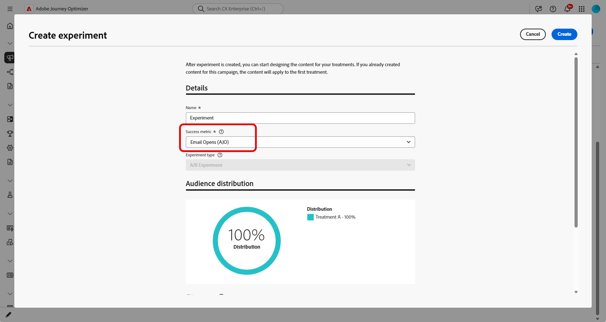

1. When setting up an experiment using the In-app or Web channel and choosing the **[!UICONTROL Inbound Clicks]**, **[!UICONTROL Unique Inbound Clicks]**, **[!UICONTROL Page Views]** , or **[!UICONTROL Unique Page Views metrics]** , the **[!UICONTROL Dimensions]** field enables you to precisely track and monitor clicks and views on specific pages.

    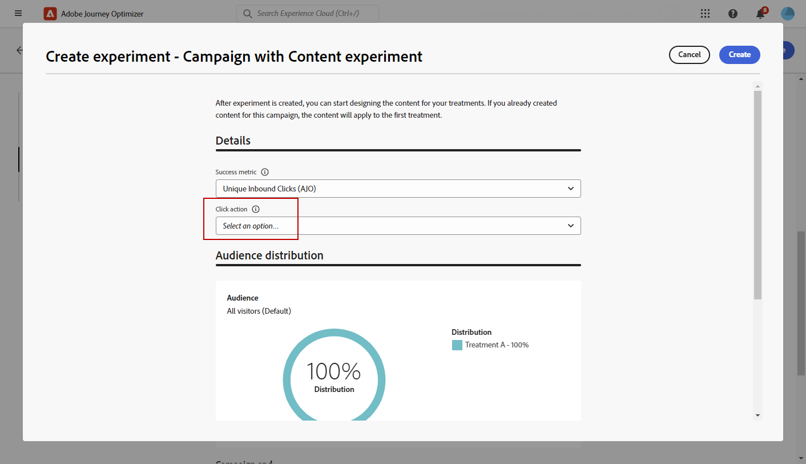

1. If you created an API-triggered campaign, select **[!UICONTROL A/B Experiment]** from the **[!UICONTROL Experiment type]** drop-down.

1. Click **[!UICONTROL Add treatment]** to create as many new treatment as needed.

    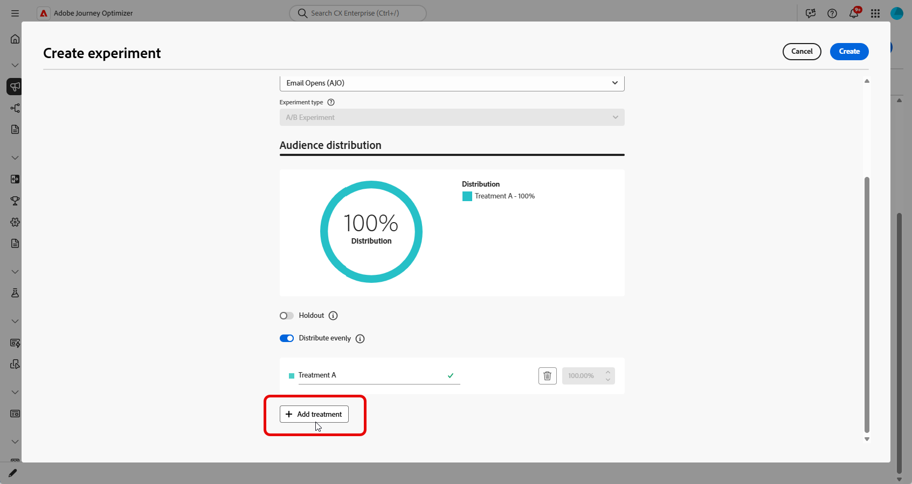

    >[!CAUTION]
    >
    >When creating a Code-based experiment, note following limitations:
    >* **Treatment count**: Creating more than 3-5 treatments may cause performance and interface issues. If you encounter errors when adding treatments, try reducing the number of treatments or add them incrementally until the issue is resolved.
    >* **Reserved keywords**: Avoid using reserved keywords such as "holdout" in your treatment names, as this may cause decision node mapping errors and prevent the experiment from working correctly.

1. Change the **[!UICONTROL Title]** of your treatment to better differentiate them.

1. Choose to add a **[!UICONTROL Holdout]** group to your delivery. This group will not receive any content from this campaign. 

    Switching on the toggle bar will automatically take 10% of your population, you can adjust this percentage if needed.

    >[!IMPORTANT]
    >
    >When a holdout group is used in an action for content experimentation, the holdout assignment only applies to that specific action. After the action is completed, profiles in the holdout group will continue down the journey path and can receive messages from other actions. Therefore, ensure that any subsequent messages do not rely on the receipt of a message by a profile that might be in a holdout group. If they do, you may need to remove the holdout assignment.

    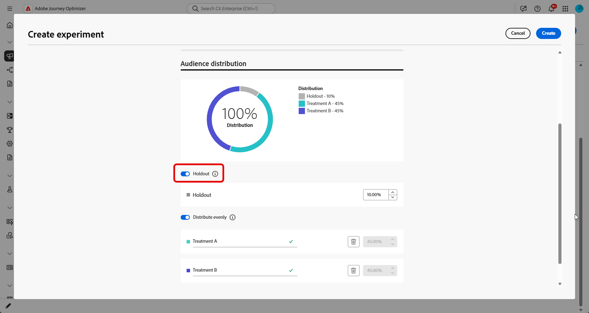

1. You can then choose to allocate a precise percentage to each **[!UICONTROL Treatment]** or simply switch on the **[!UICONTROL Distribute evenly]** toggle bar.

    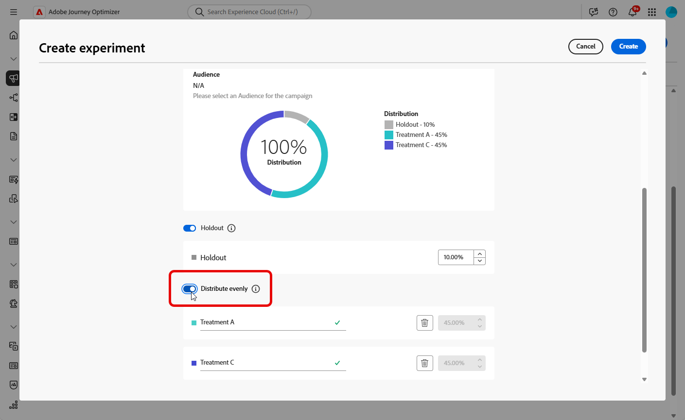

1. Enable the auto-scale experiment to automatically roll out the winning variation of your experiment. [Learn more on how to scale the winner](#scale-winner)

    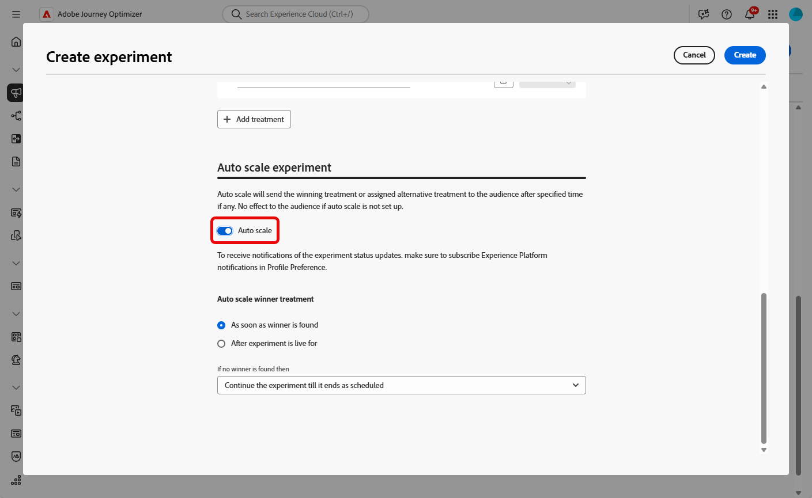

1. Click **[!UICONTROL Create]** when your configuration is set.

>[!TAB Multi-armed bandit]

Note that Multi-armed bandit experiment is only available with the following:

* Inbound Channels
* Unitary Journeys
* API Triggered Campaigns (Both transactional and Operational)
* Outbound Channels if the schedule is reoccurring

1. When your message is personalized, from the **[!UICONTROL Actions]** tab, click **[!UICONTROL Create experiment]** to start configuring your content experiment.

    

1. Select the **[!UICONTROL Success metric]** you want to set for your experiment.

    For this example, select **[!UICONTROL Email open]** to test if profiles open their emails if the promo code is in the subject line.

    

1. If you created an API-triggered campaign, select **[!UICONTROL Multi-armed bandit]** from the **[!UICONTROL Experiment type]** drop-down.

    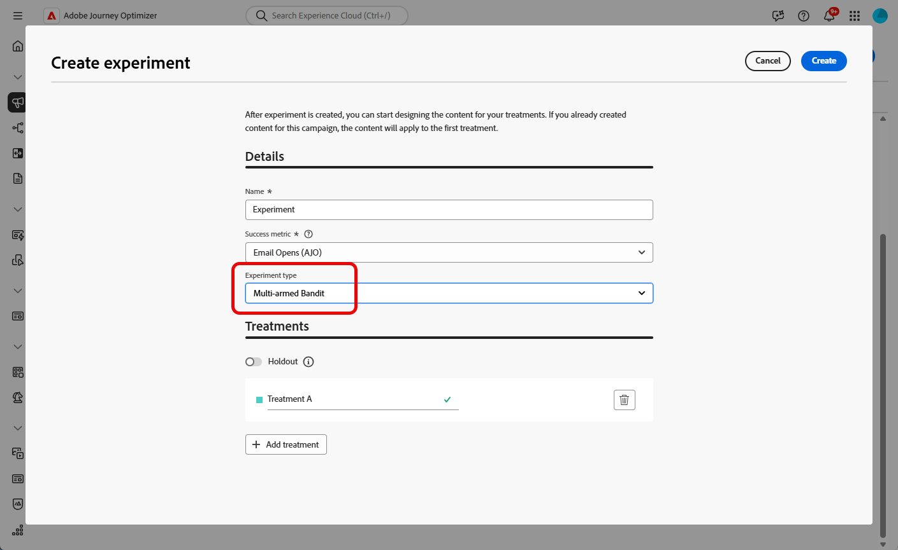

1. Click **[!UICONTROL Add treatment]** to create as many new treatment as needed.

    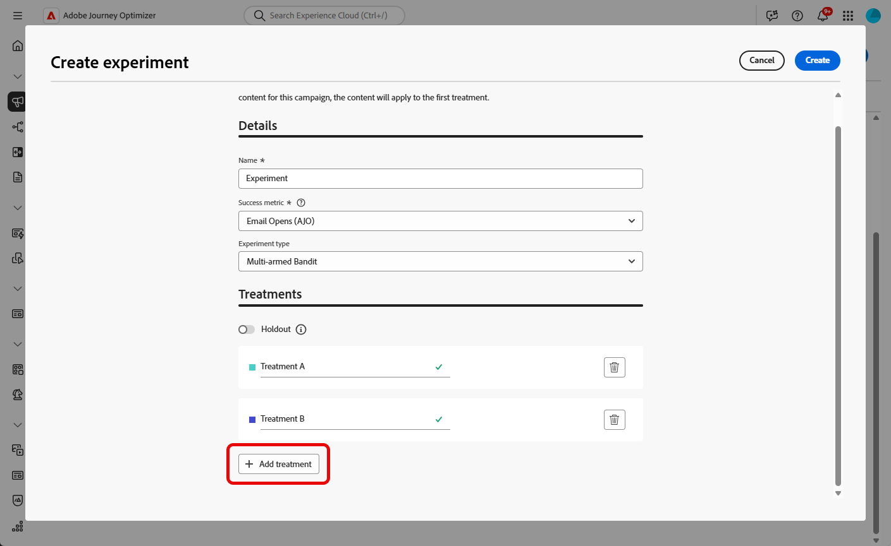

1. Change the **[!UICONTROL Title]** of your treatment to better differentiate them.

1. Choose to add a **[!UICONTROL Holdout]** group to your delivery. This group will not receive any content from this campaign. 

    Switching on the toggle bar will automatically take 10% of your population, you can adjust this percentage if needed.

    >[!IMPORTANT]
    >
    >When a holdout group is used in an action for content experimentation, the holdout assignment only applies to that specific action. After the action is completed, profiles in the holdout group will continue down the journey path and can receive messages from other actions. Therefore, ensure that any subsequent messages do not rely on the receipt of a message by a profile that might be in a holdout group. If they do, you may need to remove the holdout assignment.

    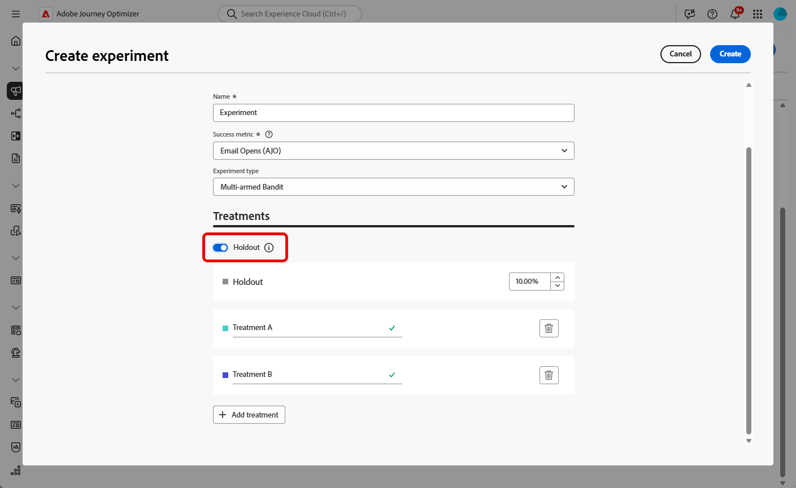

>[!TAB Bring your own Multi-armed bandit]

Note that Bring your own Multi-armed bandit experiment is only available with the following:

* Inbound Channels
* Unitary Journeys
* API Triggered Campaigns (Both transactional and Operational)
* Outbound Channels if the schedule is reoccurring

1. When your message is personalized, from the **[!UICONTROL Actions]** tab, click **[!UICONTROL Create experiment]** to start configuring your content experiment.

    

1. Select the **[!UICONTROL Success metric]** you want to set for your experiment.

    For this example, select **[!UICONTROL Email open]** to test if profiles open their emails if the promo code is in the subject line.

    

1. If you created an API-triggered campaign, select **[!UICONTROL Bring your own Multi-armed bandit]** from the **[!UICONTROL Experiment type]** drop-down.

    

1. Click **[!UICONTROL Add treatment]** to create as many new treatment as needed.

    

1. Change the **[!UICONTROL Title]** of your treatment to better differentiate them.

1. Choose to add a **[!UICONTROL Holdout]** group to your delivery. This group will not receive any content from this campaign. 

    Switching on the toggle bar will automatically take 10% of your population, you can adjust this percentage if needed.

    >[!IMPORTANT]
    >
    >When a holdout group is used in an action for content experimentation, the holdout assignment only applies to that specific action. After the action is completed, profiles in the holdout group will continue down the journey path and can receive messages from other actions. Therefore, ensure that any subsequent messages do not rely on the receipt of a message by a profile that might be in a holdout group. If they do, you may need to remove the holdout assignment.

    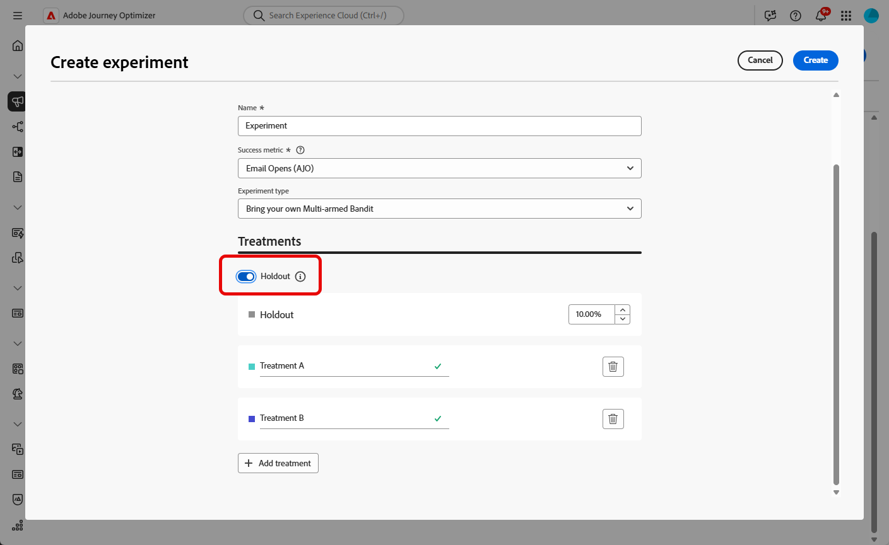

>[!ENDTABS]

## Design your treatments {#treatment-experiment}

1. From the **[!UICONTROL Edit content]** window, select your treatment B to change the content.

    Here, we choose to not specify the offer in the **[!UICONTROL Subject line]**.

    

1. Click **[!UICONTROL Edit email body]** to further personalize your treatment B.

    

1. After designing your treatments, click **[!UICONTROL More actions]** to access options related to your treatments: **[!UICONTROL Rename]**, **[!UICONTROL Duplicate]** and **[!UICONTROL Delete]**.

    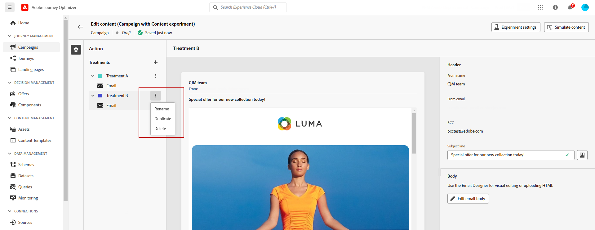

1. If needed, access the **[!UICONTROL Experiment settings]** menu to change your treatments configuration.

    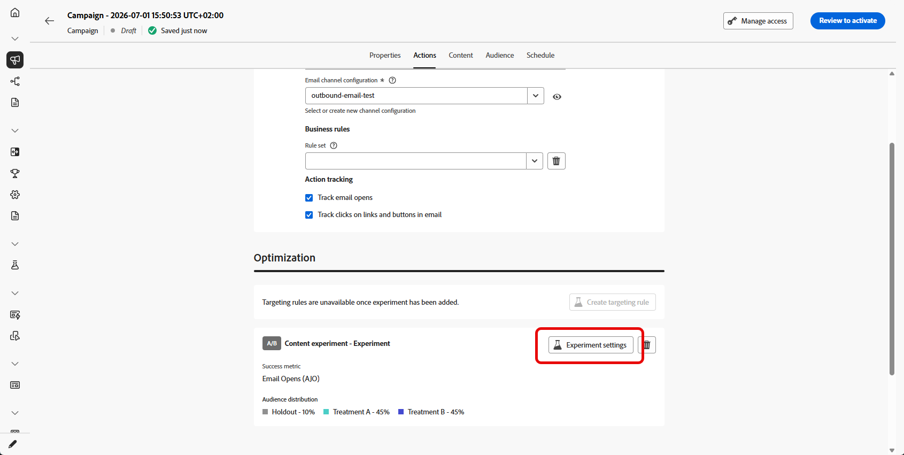

1. Once your message content has been defined, click the **[!UICONTROL Simulate content]** button to control the rendering of your delivery, and check personalization settings with test profiles. [Learn more](../content-management/preview-test.md)

After configuring your experimentation, you can follow the success of your delivery with your report. [Learn more](../reports/campaign-global-report-cja-experimentation.md)

## Scale the winner {#scale-winner}

>[!AVAILABILITY]
>
>The Scale the Winner feature is currently supported for the following channels:
>
>* Inbound Channels (e.g., Web, In-app message, Code-based experience) in any journey or campaign.
>* Outbound Channels (e.g., Email, Push notification, SMS) in API-triggered transactional campaigns.

Scale the Winner enables you to automatically or manually roll out the winning variation of an experiment to your full audience. This feature ensures that, once a winner is determined, you can amplify its reach and effectiveness without constantly monitoring the experiment.

You can choose between two modes:

* **Auto-scaling**: Configure auto-scaling settings when creating your experiment by choosing the timing and conditions for scaling the winning treatment or a fallback option if no winner emerges.

* **Manual Scaling**: Manually review experiment results and initiate the rollout of the winning treatment, maintaining full control over timing and decisions.

### Auto-scaling {#autoscaling}

Auto-scaling lets you set predefined rules for when to roll out the winning treatment or a fallback—based on the experiment's results.

Note that once auto-scaling has occurred, manual scaling is no longer available.

To enable auto-scale in your experiments:

1. Set up your campaign or journey and configure your experiment as needed. [Learn more](#configure-experiment)

1. Enable the auto-scale option when setting up your experiment.

    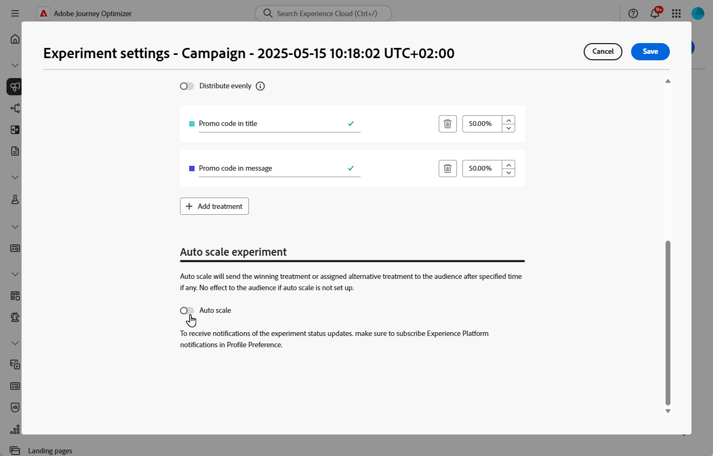

1. Select when the winner should be scaled:

    * As soon as winner is found.
    * After experiment is live for the selected time.
    
    The auto-scale time must be scheduled before the experiment's end date. If it is set for a time after the end date, a validation warning will appear, and the campaign or journey will not be published.

    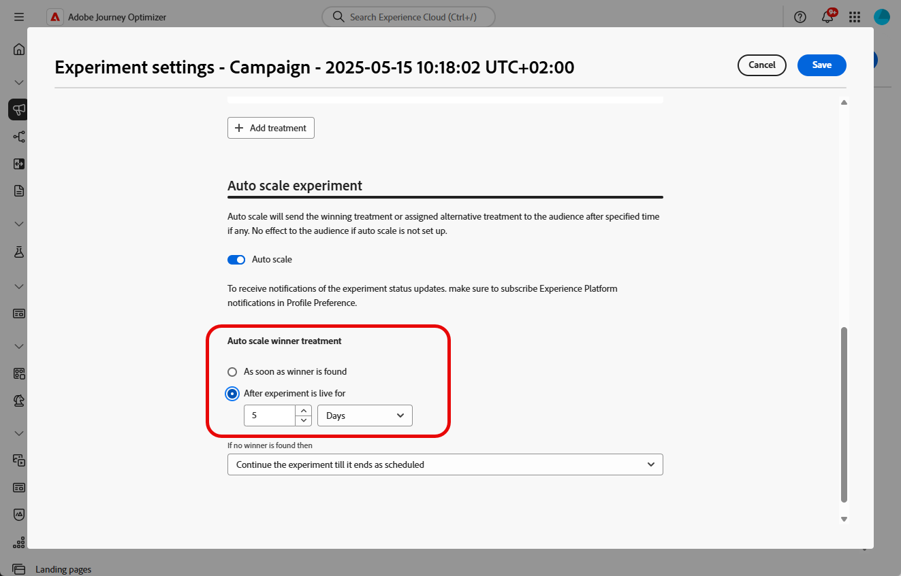

1. Choose the fallback behavior if no winner is found by scale time:

    * Continue experiment till its ends as scheduled.
    * Scale the alternative treatment after a specified time.

Once all parameters are met, your winning or alternative treatment is sent to your audience.

### Manual scaling {#manual-scaling}

Manual scaling gives you the ability to review experiment results and decide when to roll out the winning treatment on your own schedule.

Note that if you manually scale the winner before the scheduled auto-scale time, the auto-scale is canceled.

To manually scale the winner of your experiments:

1. Set up your campaign or journey and configure your experiment as needed. [Learn more](#configure-experiment)

1. Let the experiment run until a winner is identified or statistical significance is achieved.

1. Open your campaign dashboard or select your channel activity in your journey. 
    
    Review the results in the **[!UICONTROL Content Experiment]** menu to identify the top-performing treatment.

    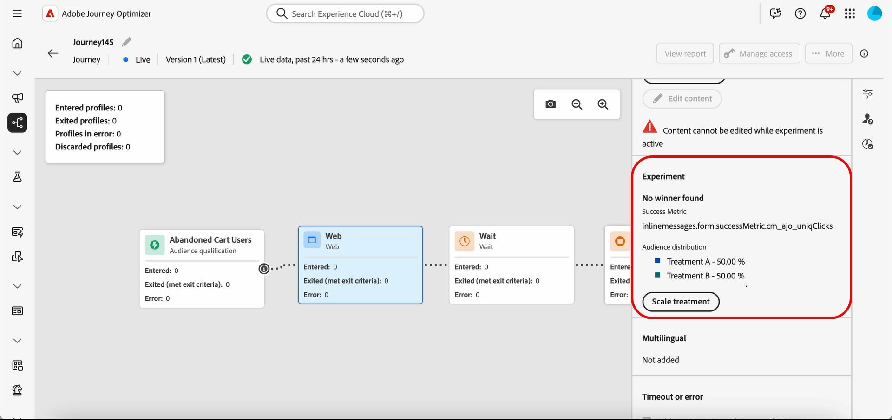

1. Click **[!UICONTROL Scale treatment]** to push the winning treatment to the rest of your audience.

    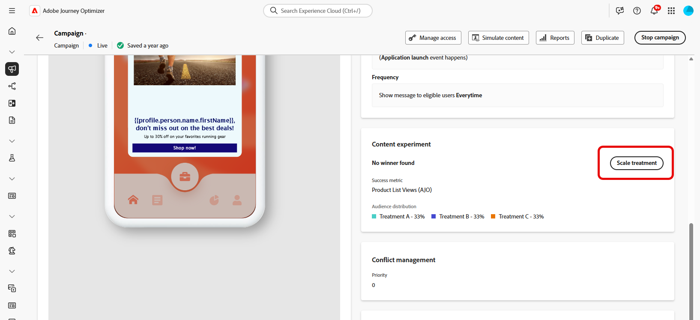

1. Select the treatment you want to scale from the drop-down menu and click **[!UICONTROL Scale]**.

    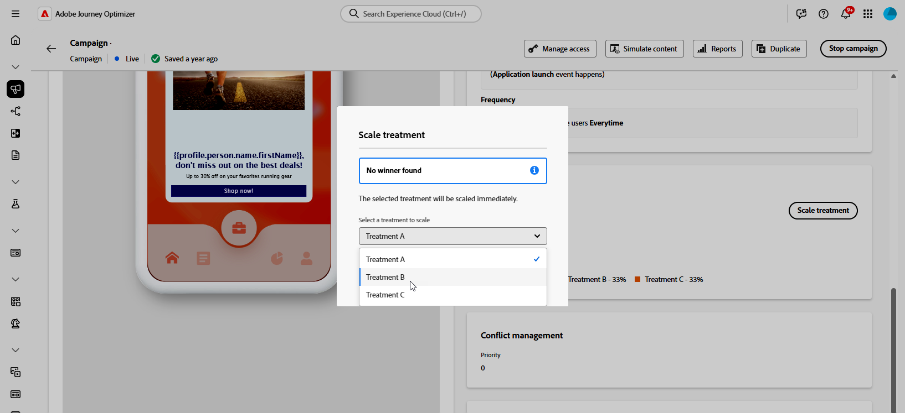

Note that scaling the treatment may take up to one hour. You will receive a notification once the manual scaling process is finished.

