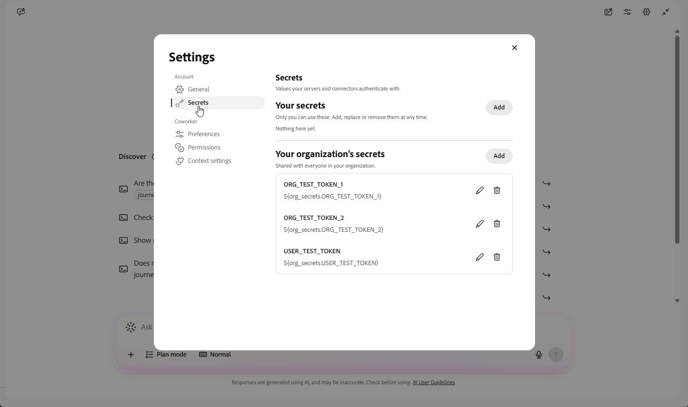

# Coworker for content management {#content-management-coworker-skills}

>[!BEGINSHADEBOX]

**On this page:** Explore Coworker capabilities in Adobe Journey Optimizer for managing content assets and planning, creating, and refining on-brand content across channels.

>[!ENDSHADEBOX]

Coworker capabilities in Adobe Journey Optimizer help you manage content assets and create channel-ready marketing content. Use Content Management to discover templates, fragments, and landing pages, and create or update supported assets and journey or campaign inline content. Use Channel Content to shape campaign strategy, generate and refine on-brand copy and images, assess content readiness, and prepare accessible email HTML.

Learn more:

* [Coworker skills for Journey Optimizer](../start/ai-features.md#cx-coworker-skills) — overview of Coworker skills across Journeys, Loyalty, Content Management, and Decisioning in Journey Optimizer.
* [Coworker documentation](https://experienceleague.adobe.com/en/docs/cx-enterprise-ai/experience-cloud-ai/coworker/overview){target="_blank"} — overview of Coworker's Campaigns, Chat, and Projects capabilities.
* [Coworker Chat UI guide](https://experienceleague.adobe.com/en/docs/cx-enterprise-ai/experience-cloud-ai/coworker/chat/ui-guide){target="_blank"} — how to access and navigate Coworker Chat.

## Content Management tools {#content-management}

>[!AVAILABILITY]
>
>Content Management is available for all customers who have access to Coworker.

Journey Optimizer users are able to discover and manage content assets — content templates, fragments, landing pages, and journey/campaign inline message content — directly from Coworker using natural language prompts. It lets you go from "tell me about my content" to "go build, update, and publish it," without leaving the conversation. This capability is powered by 15 read and write-capable MCP tools for Journey Optimizer content.

### Key use cases

| Use Case | Description | Skills | Sample Prompts |
| --- | --- | --- |
| Browse and inspect content | List available content templates, fragments, or landing pages, and retrieve their structure, metadata, and status. Retrieve the inline message content configured on a journey or campaign action node. | Content Management | List my email content templates.  Show me the fragments available for my summer campaign.  Get the details of landing page page-123.  What content is configured for the email variant of the action node in campaign camp-789? |
| Create content templates | Create a new content template for any channel. | Content Management | Create an email template named Summer Sale with this HTML content.  Create a new SMS template called Flash Alert. |
| Update content templates | Fully replace the content of an existing template. | Content Management | Update template abc-123 with this new HTML body. |
| Create, update, clone, and publish fragments | Create a new HTML or expression fragment. Update an existing fragment's content or metadata. Clone an existing fragment under a new name. Submit a draft fragment for publication. | Content Management | Create an HTML fragment named Promo Banner with this markup.  Update fragment frag-456 to change its name to Promo Banner V2.  Clone fragment abc-123 as Promo Banner - Summer (Variant B).  Publish fragment frag-456. |
| Update inline message content | Replace one channel variant on a campaign or journey action node's inline message. List the channel variants defined on a journey or campaign action node. | Content Management | Update the email variant of the action node in campaign camp-789 with this new content.  What channel variants are defined on this action node? |

### Prompting best practices

* **Reference IDs when known**: Provide the template, fragment, landing page, or campaign/journey ID when asking to get, update, clone, or publish a specific asset.
* **Be explicit about the channel**: When creating a template or fragment, specify the channel or content type (email, HTML fragment, expression fragment).
* **Confirm before publishing**: Review a fragment's content after creating or updating it before asking Coworker to publish it.
* **Provide complete replacement content**: Update operations replace content in full, so include the complete HTML body or variant content in your prompt.

## Channel Content {#ce-channel-content}

>[!AVAILABILITY]
>
>Channel Content is available for all customers who have access to CX Coworker. Generating images with a custom, brand-trained model requires production access to Firefly Services.

Channel Content takes a brief, journey, campaign, or prompt and turns it into planned, on-brand copy and images across channels, locales, audiences, and variants, including final, accessible, assembled email HTML. Content can be explored and strategized, authored, evaluated for readiness, revised, and saved back to the active solution (Adobe Journey Optimizer or another supported activation solution).

### Available skills

The following skills are available under the **Channel Content** plugin:

| Use Case | Description | Skills | Sample Prompts |
| --- | --- | --- |
| Orchestrate Content Authoring | Runs the full authoring lifecycle from a brief, journey, campaign, or prompt, ideating, generating, reviewing, and saving content, including copy, images, and the compliance, accessibility, and fidelity checks across supported channels. | orchestrate-content-authoring | "Run full content authoring for our Fall Sale email campaign from this brief, then review and save the final HTML." |
| Explore Content Strategy | Works out what a campaign or message should say before copy is written, comparing message maps and touchpoint sequencing at the campaign level, and deciding section order, emphasis, and CTA at the message level. | explore-content-strategy | "Compare a single winback email with a three-touch email and SMS program."  "Give me three campaign directions for this launch before we choose one."  "Help decide what this email should say and in what order before we write the copy." |
| Content Brief | Turns an approved campaign direction into concrete writing requirements, including tone, key messages, offer, must-say points, channel, locale, and variants, plus a plan for producing the content. | content-brief | "Turn this brief into writing requirements for a warm winback email to lapsed US subscribers: 20% off through Sunday, with CTR as the KPI."  "We want to promote our spring sale over email and SMS for new subscribers and loyal members. Structure the requirements and create a separate whole-copy brief for each channel and audience."  "Capture this welcome-email brief for English and Spanish audiences, including the localized legal-footer requirements, then prepare it for copy drafting, not HTML design." |
| Generate Content | Drafts a single net-new marketing message or copy variant for one channel, based on a stated audience, offer, tone, CTA, and length. First-draft creation only. | generate-content | "Write three subject-line options and preview text for our spring promotion email."  "Generate warm, concise SMS copy for lapsed customers with a 20% offer."  "Create on-brand launch copy for email, push, and SMS from the approved campaign direction." |
| Check Content Readiness | Assesses existing content, including an assembled email, for brand voice, editorial quality, accessibility, and compliance, then surfaces explainable blockers and next steps. | check-content-readiness | "Is this email copy ready to send? Check brand voice, clarity, accessibility, and compliance."  "Review this SMS for editorial quality, engagement, and any blockers before approval."  "Check the assembled email for legal-footer, accessibility, and send-readiness issues." |
| Revise and Regenerate Content | Applies a specific, confirmed change to existing content, such as fixing a review finding, adjusting tone, translating, or swapping a subject line or CTA, while preserving the artifact. | revise-regenerate-content | "Apply the highest-severity fixes from this evaluation report to the SMS."  "Make the tone warmer while preserving the approved offer and CTA."  "Change the hero headline to 'Final hours to save' and show me the revised content." |
| Generate Image | Produces and manipulates visuals for an approved placement, including hero images, crops, overlays, variations, or signed assets, confirming the plan before applying it. | generate-image | "Generate a premium hero image for this spring-sale email using the approved brand direction."  "Create a mobile-friendly crop of this product image for the email hero."  "Make two visual variations of this campaign image."  "Generate a similar image to the given image." |
| Assess Content Design | Evaluates how content actually renders, including hierarchy, spacing, imagery, CTA placement, and responsiveness, and recommends copy or image changes to close the gaps. | assess-content-design | "How does this email look visually? Check hierarchy, spacing, density, imagery, and the CTA."  "Does the hero take up too much space in this landing-page HTML?"  "Compare this built email with the approved design comp and call out the biggest visual mismatches." |
| Save Channel Content | Saves approved campaign content as a draft asset or fills it into its source template in Adobe Journey Optimizer or another supported solution. | save-channel-content | "Save this approved email copy as a solution draft."  "Fill the approved content into the source template and prepare it for review."  "The email is approved; save the channel content and prepare the handoff for delivery." |
| Build Email from Figma | Builds final email HTML directly from a live Figma frame when its copy, layout, and imagery are what should ship unchanged, with no separate layout plan involved.  

How to use this skill
<ol><li>Sign in to Coworker and go to <strong>[!UICONTROL Settings]</strong> &gt; <strong>[!UICONTROL Secrets]</strong>.  {zoomable="yes"}</li><li>Under <strong>[!UICONTROL Your secrets]</strong>, click <strong>[!UICONTROL Add]</strong>.</li><li>In <strong>[!UICONTROL Name]</strong>, enter <code>FIGMA_ACCESS_TOKEN</code>.</li><li>Generate a Figma Personal Access Token with at least the <strong>File content: Read-only</strong> scope. <a href="https://help.figma.com/hc/en-us/articles/8085703771159-Manage-personal-access-tokens#h_01JHJXYMB9CREBR8PB5VJ1Q5ME">Learn how to generate a Figma personal access token</a>.</li><li>Paste the token into <strong>[!UICONTROL Value]</strong>, then click <strong>[!UICONTROL Save]</strong>.</li></ol>
 | build-email-from-figma | "Build the final email HTML from this Figma frame; the copy in the design is what should ship."  "Turn this approved desktop and mobile Figma design into a responsive email."  "Build this email from the Figma frame and preserve the design's image crops, CTA, and text exactly." |
| Brand Lookup | Finds, resolves, and applies approved brand guidelines, including voice, imagery, and legal, ahead of any workflow that generates or evaluates on-brand content. | brand-lookup | "What published brand kits are available for this campaign?"  "Pull the writing and visual guidelines for our Acme brand." |

### Prompting best practices

* **Start with the brief**: Provide the campaign objective, audience, and channels up front so the content plan reflects your intended scope.
* **Specify plan dimensions**: Call out the channels, touchpoints, locales, audiences, and variants you want represented in the content plan.
* **Include brand context**: Reference your brand kit or voice guidelines so generated copy and images stay on-brand.
* **State character limits**: Provide channel character limits explicitly, and review generated copy to confirm it fits before publishing.
* **Request all relevant reviews**: Ask for brand, compliance, design, and accessibility review before treating content as send-ready.
* **Review before saving**: Evaluate and edit generated content before asking Coworker to save it back to Adobe Journey Optimizer or another supported activation solution.

{{$include /help/_includes/do-not-localize/start/ai-augmented-content-management-coworker-skills.md}}
