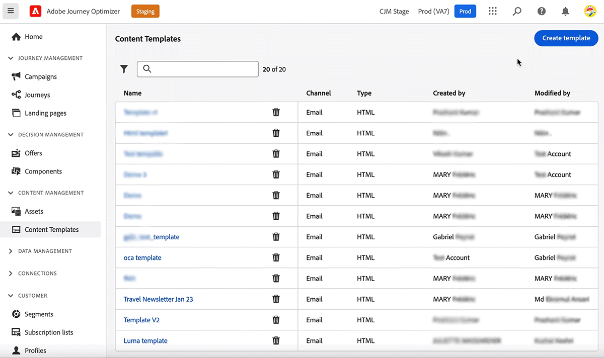

# Get started with content templates {#content-templates}

>[!NOTE]
>
>Starting from March 2025, HTML-type content templates are deprecated. You can still use existing HTML content templates previously created in [!DNL Journey Optimizer].

For an accelerated and improved design process, create standalone templates to reuse custom content easily across [!DNL Journey Optimizer] campaigns and journeys.

This functionality allows content-oriented users to work on templates outside campaigns or journeys. Marketing users can then reuse and adapt these standalone content templates inside their own journeys or campaigns.

<!---->

For example, a user within your company may focus solely on content and have no access to campaigns or journeys. This user can create an email template that your organization's marketers can select as a starting point for all emails.

You can create content templates for the Email, Push, In-App, SMS, and Direct Mail channels.

>[!AVAILABILITY]
>
>Currently content templates are not available for the Web channel.

To create, edit, and delete content templates, ensure you have the **[!DNL Manage library items]** permission included in the **[!DNL Content Library Manager]** product profile. [Learn more](../administration/ootb-product-profiles.md#content-library-manager)

➡️ [Learn how to create and use templates in this video](#video-templates)

>[!NOTE]
>
>You can also create and manage content templates using APIs. For more information, refer to the [Journey Optimizer APIs documentation](https://developer.adobe.com/journey-optimizer-apis/references/content/){target="_blank"}.

## How-to video {#video-templates}

Learn how to create, edit, and use content templates in [!DNL Journey Optimizer].

>[!VIDEO](https://video.tv.adobe.com/v/3413743/?quality=12)
