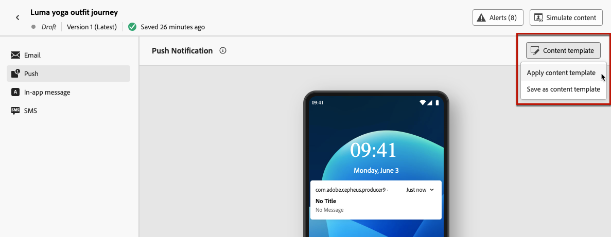

# Work with content templates {#content-templates}
 
For an accelerated and improved design process, you can create standalone templates to easily reuse custom content across [!DNL Journey Optimizer] campaigns and journeys.

This functionality enables content-oriented users to work on templates outside campaigns or journeys. Marketing users can then reuse and adapt these standalone content templates inside their own journeys or campaigns.

<!---->

>[!NOTE]
>
>Currently content templates are not available for the Web channel.

For example, a user within your company is in charge of content only, and therefore has no access to campaigns or journeys. However, this user can create an email template that your organization's marketers will be able to select for use in all emails as a starting point.

You can also create and manage content templates using APIs. For more on this, refer to the [Journey Optimizer APIs documentation](https://developer.adobe.com/journey-optimizer-apis/references/content/){target="_blank"}.

➡️ [Learn how to create and use templates in this video](#video-templates)

>[!CAUTION]
>
>To create, edit and delete content templates, you must have the **[!DNL Manage library items]** permission included in the **[!DNL Content Library Manager]** product profile. [Learn more](../administration/ootb-product-profiles.md#content-library-manager)

## Access and manage templates {#access-manage-templates}

To access the content template list, select **[!UICONTROL Content Management]** > **[!UICONTROL Content Templates]** from the left menu.

All the templates that were created on the current sandbox - either from a journey or a campaign using the **[!UICONTROL Save as template]** option, either from the **[!UICONTROL Content Templates]** menu - are displayed. [Learn how to create templates](#create-content-templates)

You can sort content templates by:
* Type
* Channel
* Creation or modification date
* Tags - [Learn more on tags](../start/search-filter-categorize.md#tags)

You can also choose to display only the items that yourself created or modified.

<!--Select the **[!UICONTROL Grid view]** mode to display each template as a thumbnail. 

>[!NOTE]
>
>Currently proper thumbnails can only be generated for HTML-type email content templates.

When you update a content, you may have to wait a few seconds before the changes are reflected in the thumbnail.

-->

* To edit a template content, click the desired item from the list and select **[!UICONTROL Edit content]**.

    

* To delete a template, select the **[!UICONTROL More actions]** button next to the desired template and select **[!UICONTROL Delete]**.

    

>[!NOTE]
>
>When a template is edited or deleted, campaigns or journeys including content created using this template are not impacted.

## Create content templates {#create-content-templates}

>[!CONTEXTUALHELP]
>id="ajo_create_template"
>title="Define your own content template"
>abstract="Create a standalone custom template from scratch to make your content reusable across multiple journeys and campaigns."

There are two ways you can create content templates:

* Create a content template from scratch, using the left rail **[!UICONTROL Content Templates]** menu. [Learn how](#create-template-from-scratch)

* When designing your content within a campaign or a journey, save it as a template. [Learn how](#save-as-template)

Once saved, your content template is available for use in a campaign or a journey. Whether created from scratch or from a previous content, you can now use this template when building any content within [!DNL Journey Optimizer]. [Learn how](#use-content-templates)

>[!NOTE]
>
>* Changes made to content templates are not propagated to campaigns or journeys, whether they are live or draft.
>
>* Similarly, when templates are used in a campaign or a journey, any edits you make to your campaign and journey content do not impact the previously used content template.

### Create template from scratch {#create-template-from-scratch}

To create a content template from scratch, follow the steps below.

1. Access the content template list through the **[!UICONTROL Content Management]** > **[!UICONTROL Content Templates]** left menu.

1. Select **[!UICONTROL Create template]**.

1. Fill in the template details and select the desired channel.

    

    >[!NOTE]
    >
    >Currently all channels are available except Web.

1. Choose a **[!UICONTROL Type]** for the selected channel.

    

    * For **[!UICONTROL Email]**, if you select **[!UICONTROL Content]**, you can define the [Subject line](../email/create-email.md#define-email-content) as part of your template. If you select **[!UICONTROL HTML]**, you can only define the content of the email body.

    * For **[!UICONTROL SMS]**, **[!UICONTROL Push]**, **[!UICONTROL In-App]** and **[!UICONTROL Direct Mail]**, only the default type is available for the current channel. You still need to select it.

1. Select or create Adobe Experience Platform tags from the **[!UICONTROL Tags]** field to categorize your template for improved search. [Learn more](../start/search-filter-categorize.md#tags)

1. To assign custom or core data usage labels to the template, you can select **[!UICONTROL Manage access]**. [Learn more on Object Level Access Control (OLAC)](../administration/object-based-access.md).

1. Click **[!UICONTROL Create]** and design your content as needed, the same way you would do for any content inside a journey or a campaign - according to the channel you selected.

    

    Learn how to create content for the different channels in the following sections:
    * [Define email content](../email/get-started-email-design.md)
    * [Define push content](../push/design-push.md)
    * [Define SMS content](../sms/create-sms.md#sms-content)
    * [Define direct mail content](../direct-mail/create-direct-mail.md)
    * [Define In-app content](../in-app/design-in-app.md)

1. If you are creating an **[!UICONTROL Email]** template with the **[!UICONTROL HTML]** type, you can test your content. [Learn how](#test-template)

1. Once your template is ready, click **[!UICONTROL Save]**.

1. Click the arrow next to the template name to go back to the **[!UICONTROL Details]** screen.

    

This template is now ready to be used when building any content within [!DNL Journey Optimizer]. [Learn how](#use-content-templates)

### Save as template {#save-as-template}

>[!CONTEXTUALHELP]
>id="ajo_messages_depecrated_inventory"
>title="Learn how to migrate your messages"
>abstract="On July 25 2022, the Messages menu disappeared and messages are now authored directly from a Journey. If you want to re-use your legacy messages in journeys, you need to save them as templates."

When designing any content in a campaign or a journey, you can save it for future reuse. To do this, follow the steps below.

1. From the message **[!UICONTROL Edit content]** screen, click the **[!UICONTROL Content template]** button.

1. Select **[!UICONTROL Save as content template]** from the drop-down menu.

    

    If you are in the [Email Designer](../email/get-started-email-design.md), you can also select this option from the **[!UICONTROL More]** drop-down list on top right of the screen.

    

1. Add a name and description for this template.

    

    >[!NOTE]
    >
    >The current channel and type are automatically filled in and cannot be edited. For email templates created from the [Email Designer](../email/get-started-email-design.md), the **[!UICONTROL HTML]** type is automatically selected.

1. Select or create an Adobe Experience Platform tag from the **Tags** field to categorize your template. [Learn more](../start/search-filter-categorize.md#tags)

1. To assign custom or core data usage labels to the template, you can select **[!UICONTROL Manage access]**. [Learn more](../administration/object-based-access.md).

1. Click **[!UICONTROL Save]**.

1. The template is saved into the **[!UICONTROL Content Templates]** list, accessible from the [!DNL Journey Optimizer] dedicated menu. It becomes a standalone content template that can be accessed, edited and deleted as any other item on that list. [Learn more](#access-manage-templates)

You can now use this template when building any content within [!DNL Journey Optimizer]. [Learn how](#use-content-templates)

>[!NOTE]
>
>Any change to that new template is not propagated to the content it comes from. Similarly, when the original content is edited within that content, the new template is not modified.

## Test email content templates {#test-template}

You can test the rendering of some of your email templates, whether created from scratch or from an existing content. To do so, follow the steps below.

>[!CAUTION]
>
>Currently testing content templates is only available for **[!UICONTROL Email]** templates with the **[!UICONTROL HTML]** type.

1. Access the content template list through the **[!UICONTROL Content Management]** > **[!UICONTROL Content Templates]** menu and select any email template.

1. Click **[!UICONTROL Edit content]** from the **[!UICONTROL Template properties]**.

1. Click **[!UICONTROL Simulate Content]** and select a test profile to check your rendering. [Learn more](../content-management/preview-test.md)

    

1. You can send a proof to test your content and have it approved by some internal users before using it in a journey or a campaign.

    * To do so, click the **[!UICONTROL Send proof]** button and follow the steps described in [this section](../content-management/proofs.md).
    
    * Before sending the proof, you must select the [email surface](../configuration/channel-surfaces.md) that will be used to test your content.

        

>[!CAUTION]
>
>Currently tracking is not supported when testing email content templates, meaning that tracking events, UTM parameters and landing page links will not be effective in the proofs that are being sent from a template. To test tracking, [use the content template](../email/use-email-templates.md) in an email and [send a proof](../content-management/preview-test.md#send-proofs).

## Use content templates {#use-content-templates}

When creating content for any channel (except Web) in [!DNL Journey Optimizer], you can use a custom template that you either:

* Created from scratch using the **[!UICONTROL Content templates]** menu. [Learn more](#create-template-from-scratch)

* Saved from an existing content in a journey or a campaign  using the **[!UICONTROL Save as content template]** option. [Learn more](#save-as-template)

To start building your content with one of these templates, follow the steps below.

1. Whether in a campaign or journey, after selecting **[!UICONTROL Edit content]**, click the **[!UICONTROL Content template]** button.

1. Select **[!UICONTROL Apply content template]**.

    

1. Select the template of your choice from the list. Only templates compatible with the selected channel and/or type are displayed.

    

    >[!NOTE]
    >
    >From this screen, you can also create a new template using the dedicated button, which opens a new tab.

1. Click **[!UICONTROL Confirm]**. The template is applied to your content.

1. Continue editing your content as desired.

>[!NOTE]
>
>To start designing an email from a content template using the [Email Designer](../email/get-started-email-design.md), follow the steps described in [this section](../email/use-email-templates.md).

## How-to video {#video-templates}

Learn how to create, edit, and use content templates in [!DNL Journey Optimizer].

>[!VIDEO](https://video.tv.adobe.com/v/3413743/?quality=12)
