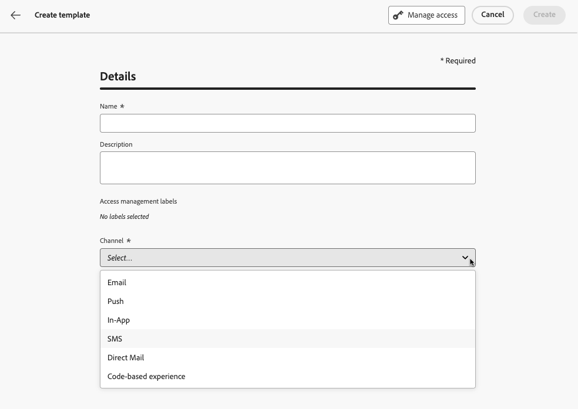
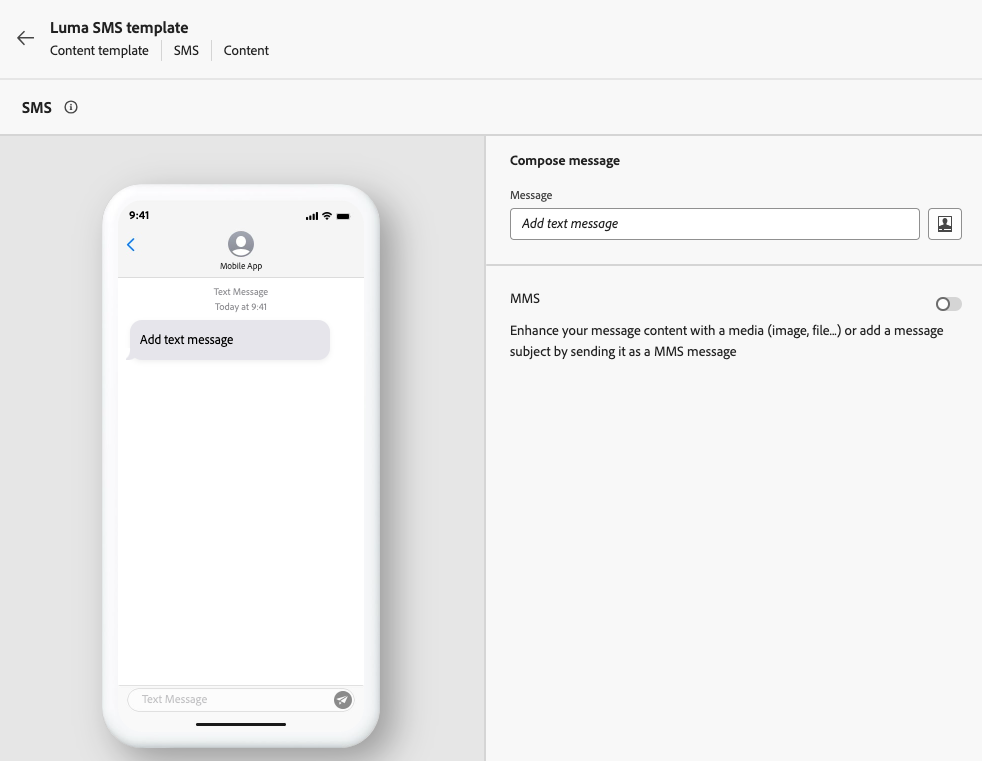
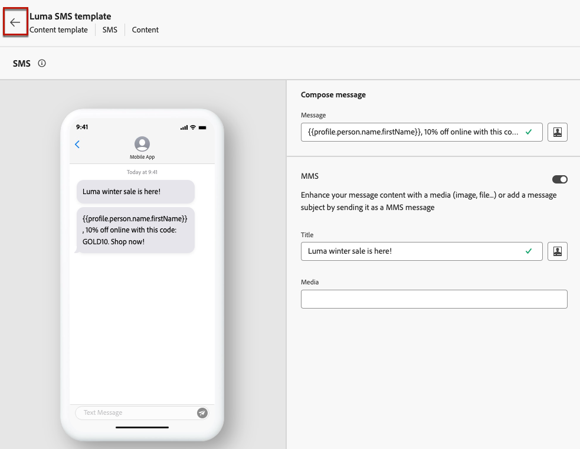
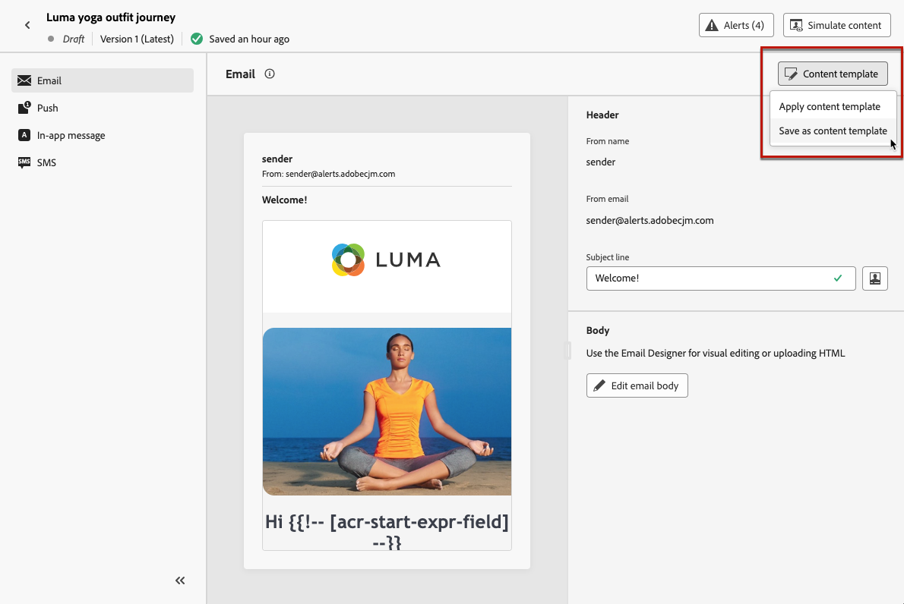
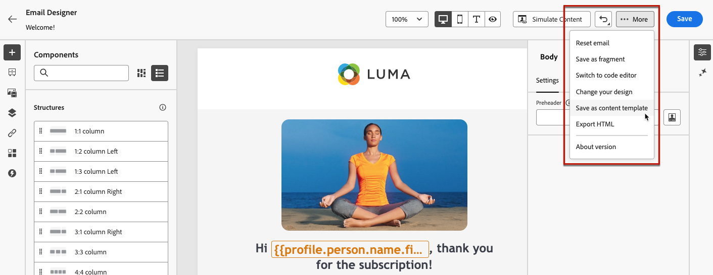
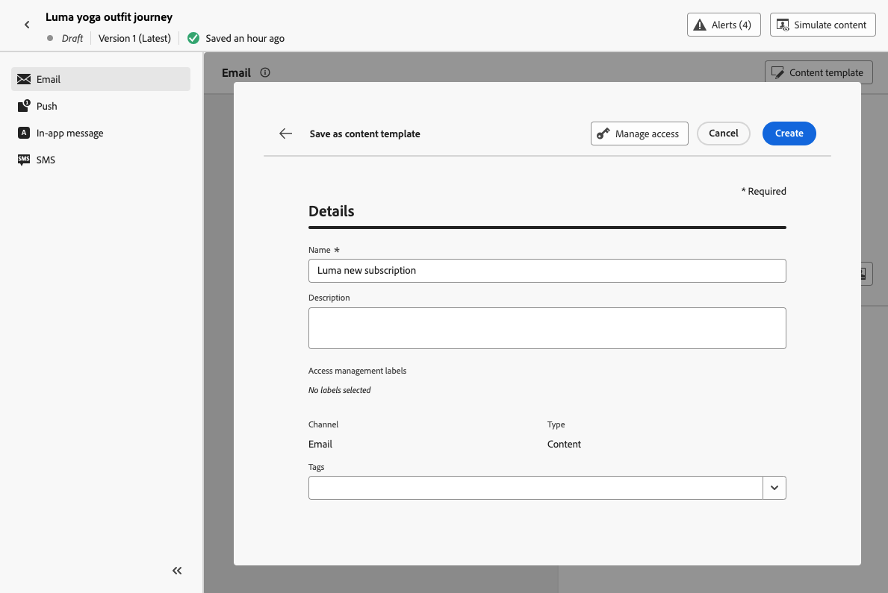

# Create content templates {#create-content-templates}
 
>[!CONTEXTUALHELP]
>id="ajo_create_template"
>title="Define your own content template"
>abstract="Create a standalone custom template from scratch to make your content reusable across multiple journeys and campaigns."

There are two ways to create content templates:

* Create a content template from scratch, using the left rail **[!UICONTROL Content templates]** menu. [Learn how](#create-template-from-scratch)

* When designing your content within a campaign or a journey, save it as a template. [Learn how](#save-as-template)

Once saved, your content template is available for use in a campaign or a journey. Whether created from scratch or from previous content, you can use this template when building any content within [!DNL Journey Optimizer]. [Learn how](#use-content-templates)

>[!NOTE]
>
>* Changes made to content templates are not propagated to campaigns or journeys, whether they are live or draft.
>
>* Similarly, when templates are used in a campaign or a journey, any edits made to your campaign and journey content do not impact the previously used content template.

## Create template from scratch {#create-template-from-scratch}

>[!NOTE]
>
>Starting from March 2025, HTML-type content templates are deprecated. Existing HTML content templates previously created in [!DNL Journey Optimizer] can still be used.

To create a content template from scratch, follow the steps below.

1. Access the content template list through the **[!UICONTROL Content Management]** > **[!UICONTROL Content Templates]** left menu.

1. Select **[!UICONTROL Create template]**.

1. Fill in the template details and select the desired channel.

    

    >[!NOTE]
    >
    >Currently all channels are available except Web.

1. Select or create Adobe Experience Platform tags from the **[!UICONTROL Tags]** field to categorize your template for improved search. [Learn more](../start/search-filter-categorize.md#tags)

1. To assign custom or core data usage labels to the template, select **[!UICONTROL Manage access]**. [Learn more about Object Level Access Control (OLAC)](../administration/object-based-access.md).

1. Click **[!UICONTROL Create]** and design your content as needed, the same way you would for any content inside a journey or a campaign, according to the channel you selected.

    

    Learn how to create content for the different channels in the following sections:
    * [Define email content](../email/get-started-email-design.md)
    * [Define push content](../push/design-push.md)
    * [Define SMS content](../sms/create-sms.md#sms-content)
    * [Define direct mail content](../direct-mail/create-direct-mail.md)
    * [Define In-app content](../in-app/design-in-app.md)
    * [Define web content](../web/create-web.md#edit-web-content)   
    * [Define code-based experience content](../code-based/create-code-based.md)

        >[!NOTE]
        >
        >You can add decision policies to code-based experience content templates. [Learn more](../experience-decisioning/create-decision.md#add-decision)

1. You can test your content. [Learn how](#test-template)

1. Once your template is ready, click **[!UICONTROL Save]**.

1. Click the arrow next to the template name to return to the **[!UICONTROL Details]** screen.

    

This template is now ready to be used when building any content within [!DNL Journey Optimizer]. [Learn how](#use-content-templates)

>[!NOTE]
>
>When creating an email content template, you can quickly apply a specific styling that fits your brand and design by applying a theme to your content. [Learn more](../email/apply-email-themes.md)

## Save content as content template {#save-as-template}

When designing any content in a campaign or a journey, you can save it for future reuse. To do this, follow the steps below.

1. From the message **[!UICONTROL Edit content]** screen, click the **[!UICONTROL Content template]** button.

1. Select **[!UICONTROL Save as content template]** from the drop-down menu.

    

    If you are in the [Email Designer](../email/get-started-email-design.md), you can also select this option from the **[!UICONTROL More]** drop-down list in the top-right corner of the screen.

    

1. Add a name and description for this template.

    

    >[!NOTE]
    >
    >The current channel is automatically filled in and cannot be edited.

1. Select or create an Adobe Experience Platform tag from the **Tags** field to categorize your template. [Learn more](../start/search-filter-categorize.md#tags)

1. To assign custom or core data usage labels to the template, select **[!UICONTROL Manage access]**. [Learn more](../administration/object-based-access.md).

1. Click **[!UICONTROL Save]**.

1. The template is saved into the **[!UICONTROL Content Templates]** list, accessible from the [!DNL Journey Optimizer] dedicated menu. It becomes a standalone content template that can be accessed, edited and deleted as any other item on that list. [Learn more](#access-manage-templates)

You can now use this template when building any content within [!DNL Journey Optimizer]. [Learn how](#use-content-templates)

>[!NOTE]
>
>Any change to the new template is not propagated to the content it originates from. Similarly, when the original content is edited, the new template is not modified.

