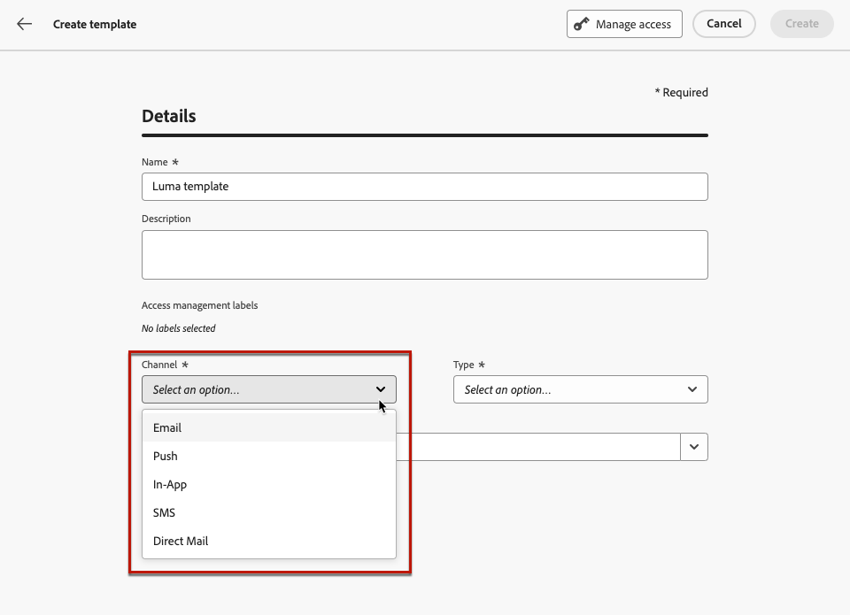
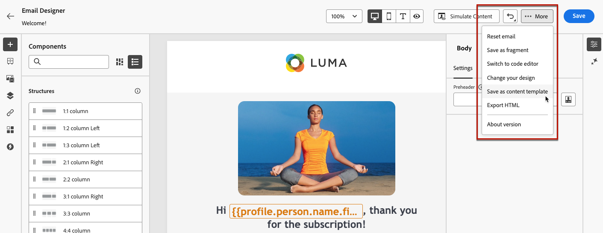
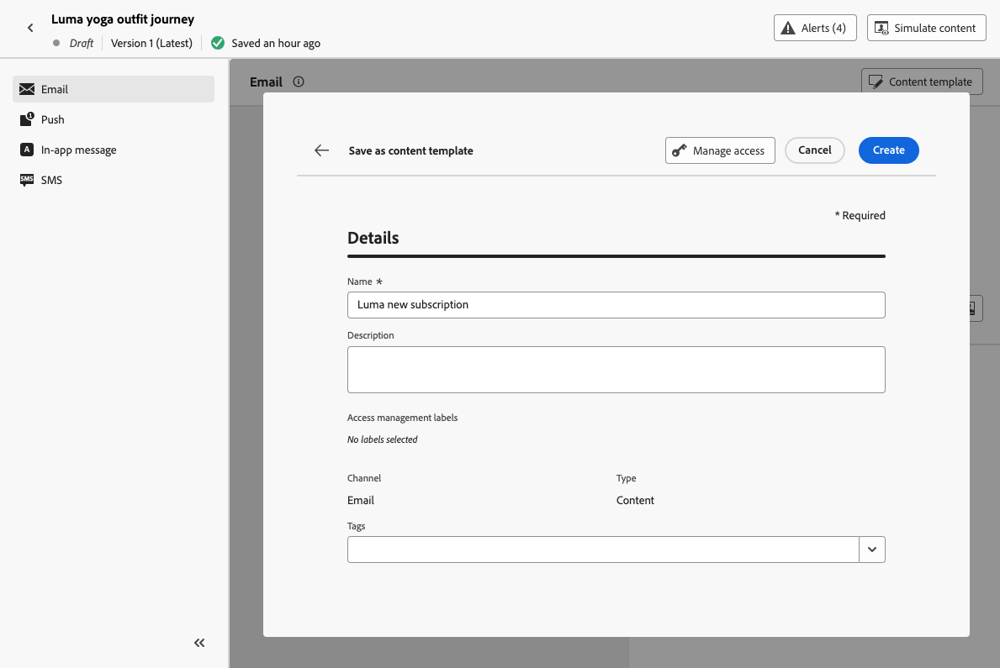

# Create content templates {#create-content-templates}
 
>[!CONTEXTUALHELP]
>id="ajo_create_template"
>title="Define your own content template"
>abstract="Create a standalone custom template from scratch to make your content reusable across multiple journeys and campaigns."

There are two ways you can create content templates:

* Create a content template from scratch, using the left rail **[!UICONTROL Content Templates]** menu. [Learn how](#create-template-from-scratch)

* When designing your content within a campaign or a journey, save it as a template. [Learn how](#save-as-template)

Once saved, your content template is available for use in a campaign or a journey. Whether created from scratch or from a previous content, you can now use this template when building any content within [!DNL Journey Optimizer]. [Learn how](#use-content-templates)

>[!NOTE]
>
>* Changes made to content templates are not propagated to campaigns or journeys, whether they are live or draft.
>
>* Similarly, when templates are used in a campaign or a journey, any edits you make to your campaign and journey content do not impact the previously used content template.

## Create template from scratch {#create-template-from-scratch}

To create a content template from scratch, follow the steps below.

1. Access the content template list through the **[!UICONTROL Content Management]** > **[!UICONTROL Content Templates]** left menu.

1. Select **[!UICONTROL Create template]**.

1. Fill in the template details and select the desired channel.

    

    >[!NOTE]
    >
    >Currently all channels are available except Web.

1. Choose a **[!UICONTROL Type]** for the selected channel.

    

    * For **[!UICONTROL Email]**, if you select **[!UICONTROL Content]**, you can define the [Subject line](../email/create-email.md#define-email-content) as part of your template. If you select **[!UICONTROL HTML]**, you can only define the content of the email body.

    * For **[!UICONTROL SMS]**, **[!UICONTROL Push]**, **[!UICONTROL In-App]** and **[!UICONTROL Direct Mail]**, only the default type is available for the current channel. You still need to select it.

1. Select or create Adobe Experience Platform tags from the **[!UICONTROL Tags]** field to categorize your template for improved search. [Learn more](../start/search-filter-categorize.md#tags)

1. To assign custom or core data usage labels to the template, you can select **[!UICONTROL Manage access]**. [Learn more on Object Level Access Control (OLAC)](../administration/object-based-access.md).

1. Click **[!UICONTROL Create]** and design your content as needed, the same way you would do for any content inside a journey or a campaign - according to the channel you selected.

    

    Learn how to create content for the different channels in the following sections:
    * [Define email content](../email/get-started-email-design.md)
    * [Define push content](../push/design-push.md)
    * [Define SMS content](../sms/create-sms.md#sms-content)
    * [Define direct mail content](../direct-mail/create-direct-mail.md)
    * [Define In-app content](../in-app/design-in-app.md)

1. If you are creating an **[!UICONTROL Email]** template with the **[!UICONTROL HTML]** type, you can test your content. [Learn how](#test-template)

1. Once your template is ready, click **[!UICONTROL Save]**.

1. Click the arrow next to the template name to go back to the **[!UICONTROL Details]** screen.

    

This template is now ready to be used when building any content within [!DNL Journey Optimizer]. [Learn how](#use-content-templates)

## Save content as content template {#save-as-template}

>[!CONTEXTUALHELP]
>id="ajo_messages_depecrated_inventory"
>title="Learn how to migrate your messages"
>abstract="On July 25 2022, the Messages menu disappeared and messages are now authored directly from a Journey. If you want to re-use your legacy messages in journeys, you need to save them as templates."

When designing any content in a campaign or a journey, you can save it for future reuse. To do this, follow the steps below.

1. From the message **[!UICONTROL Edit content]** screen, click the **[!UICONTROL Content template]** button.

1. Select **[!UICONTROL Save as content template]** from the drop-down menu.

    

    If you are in the [Email Designer](../email/get-started-email-design.md), you can also select this option from the **[!UICONTROL More]** drop-down list on top right of the screen.

    

1. Add a name and description for this template.

    

    >[!NOTE]
    >
    >The current channel and type are automatically filled in and cannot be edited. For email templates created from the [Email Designer](../email/get-started-email-design.md), the **[!UICONTROL HTML]** type is automatically selected.

1. Select or create an Adobe Experience Platform tag from the **Tags** field to categorize your template. [Learn more](../start/search-filter-categorize.md#tags)

1. To assign custom or core data usage labels to the template, you can select **[!UICONTROL Manage access]**. [Learn more](../administration/object-based-access.md).

1. Click **[!UICONTROL Save]**.

1. The template is saved into the **[!UICONTROL Content Templates]** list, accessible from the [!DNL Journey Optimizer] dedicated menu. It becomes a standalone content template that can be accessed, edited and deleted as any other item on that list. [Learn more](#access-manage-templates)

You can now use this template when building any content within [!DNL Journey Optimizer]. [Learn how](#use-content-templates)

>[!NOTE]
>
>Any change to that new template is not propagated to the content it comes from. Similarly, when the original content is edited within that content, the new template is not modified.
