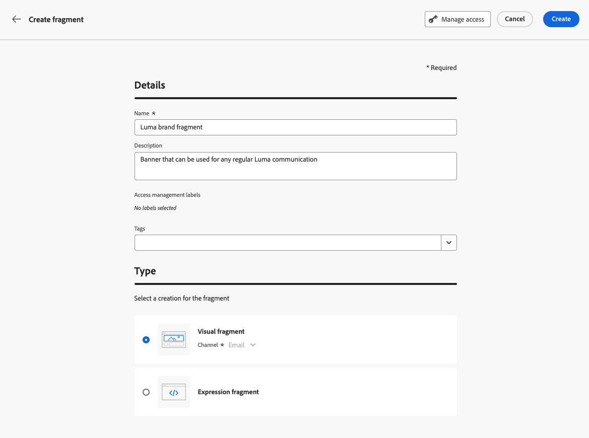
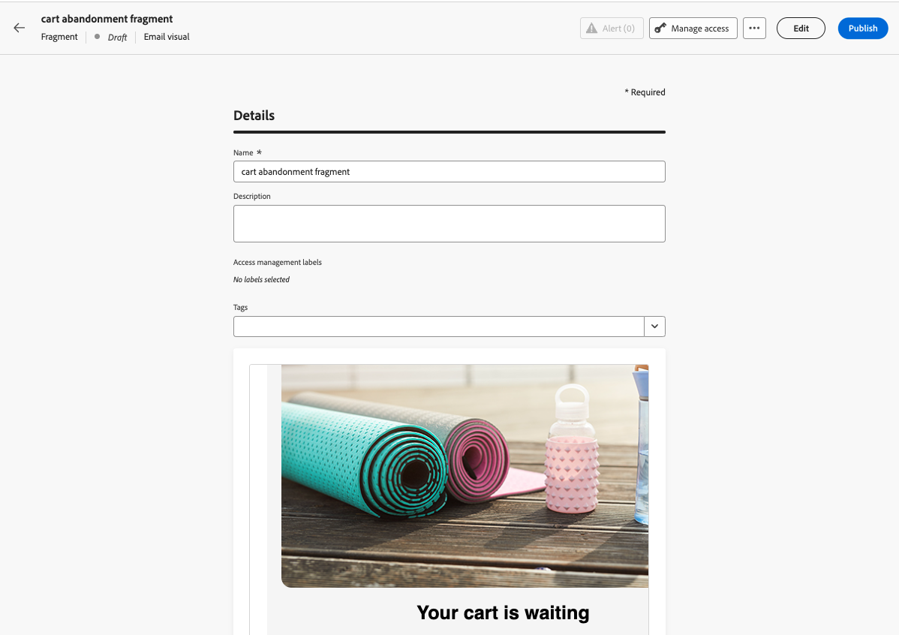

# Create a fragment {#create-fragments}
 
>[!CONTEXTUALHELP]
>id="ajo_create_visual_fragment"
>title="Select the visual type"
>abstract="Create a standalone visual fragment to make your content reusable in an email within a journey or a campaign, or in a content template."
>additional-url="https://experienceleague.adobe.com/en/docs/journey-optimizer/using/channels/email/design-email/add-content/use-visual-fragments" text="Add visual fragments to your emails"

>[!CONTEXTUALHELP]
>id="ajo_create_expression_fragment"
>title="Select the expression type"
>abstract="Create a standalone expression fragment to make your content reusable across multiple journeys and campaigns. When using the personalization editor, you can leverage all the expression fragments that have been created on the current sandbox."
>additional-url="https://experienceleague.adobe.com/en/docs/journey-optimizer/using/content-management/personalization/expression-editor/use-expression-fragments" text="Leverage expression fragments"

Fragments can be created from scratch from the **[!UICONTROL Fragments]** left menu. In addition, you can also save a portion of existing content as fragment when designing content. [Learn how](#save-as-fragment)

Once saved, your fragment is available for use in a journey, a campaign or a template. You can use this fragment when building any content within journeys and campaigns. See [Add visual fragments](../email/use-visual-fragments.md) and [Leverage expression fragments](../personalization/use-expression-fragments.md).

To create a fragment, follow the steps below.

## Define the fragment's properties {#properties}

1. Access the fragment list through the **[!UICONTROL Content Management]** > **[!UICONTROL Fragments]** left menu.

1. Select **[!UICONTROL Create fragment]** and fill in the fragment name and description (if needed).

    

1. Select or create Adobe Experience Platform tags from the **[!UICONTROL Tags]** field to categorize your fragment for improved search. [Learn how to work with Unified Tags](../start/search-filter-categorize.md#tags)

1. Select the fragment type: **Visual fragment** or **Expression fragment**. [Learn more](../content-management/fragments.md#visual-expression)

    >[!NOTE]
    >
    >Currently, visual fragments are available for the **Email** channel only.

1. If you are creating an expression fragment, select the type of code you want to use: **[!UICONTROL HTML]**, **[!UICONTROL JSON]** or **[!UICONTROL Text]**.

    

1. To assign custom or core data usage labels to the fragment, click the **[!UICONTROL Manage access]** button in the upper section of the screen. [Learn more on Object Level Access Control (OLAC)](../administration/object-based-access.md).

1. Click **[!UICONTROL Create]** to design the content of your fragment.

## Design the fragment content {#content}

After you have configured the fragment's properties, the Email Designer or the personalization editor opens, depending on the type of fragment you are creating.

* For visual fragments, edit your content as needed, the same way you would do for any email inside a journey or a campaign. [Learn more](../email/get-started-email-design.md) 

    

* For expression fragments, leverage the [!DNL Journey Optimizer] personalization editor with all its personalization and authoring capabilities to build your fragment content. [Learn more](../personalization/personalization-build-expressions.md)

    

When your content is ready, click the **[!UICONTROL Save]** button. The fragment is created and added to the fragment list with the **[!UICONTROL Draft]** status. You can preview it and publish it to make it available in journeys and campaigns.

## Preview and publish the fragment {#publish}

>[!NOTE]
>
>To publish a fragment, you must have the [Publish Fragment](../administration/ootb-product-profiles.md#content-library-manager) user permission.

If your fragment is ready to go live, you can preview and publish it to make it available in your journeys and campaigns. To do so, follow the steps below.

1. Go back to the fragment creation screen after designing its content, or open it from the list of fragments.

1. A preview of the fragment is available under the **[!UICONTROL Tags]** field, allowing to check its rendering. If you need to make any change, click the **[!UICONTROL Edit]** button in the upper section of the screen to open the Email Designer or the personalization editor depending on the fragment type.

    

1. Click the **[!UICONTROL Publish]** button in the upper-right corner to publish the fragment.

1. If the fragment is being used in a live journey or campaign, a message opens to inform you. Click the **[!UICONTROL See more]** link to access the list of journeys and/or campaigns where it is referenced. [Learn how to explore references of a fragment](../content-management/manage-fragments.md#explore-references)

    {width="70%" align="center"}

    Click **[!UICONTROL Confirm]** to publish the fragment and update it in the live journeys/campaigns that are using it.

The fragment is now **[!UICONTROL Live]**, and becomes available when building any content within the [!DNL Journey Optimizer] Email Designer or personalization editor.

* [Learn how to use visual fragments](../email/use-visual-fragments.md)
* [Learn how to use expression fragments](../personalization/use-expression-fragments.md)
