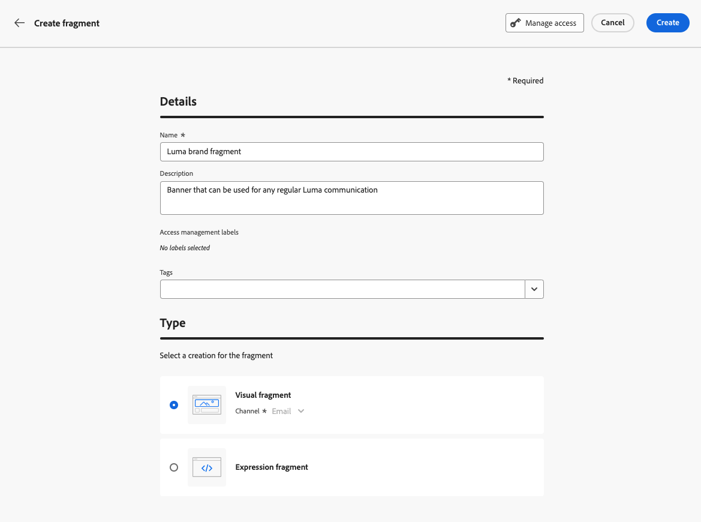
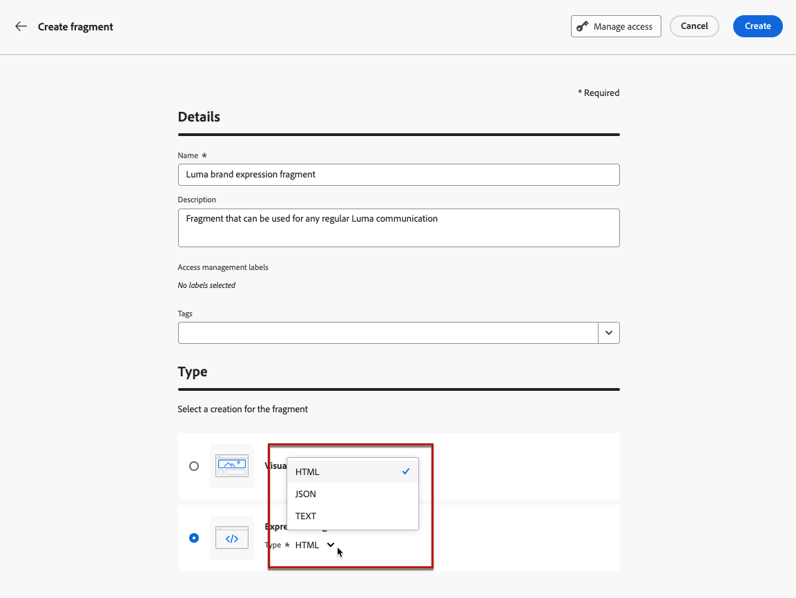
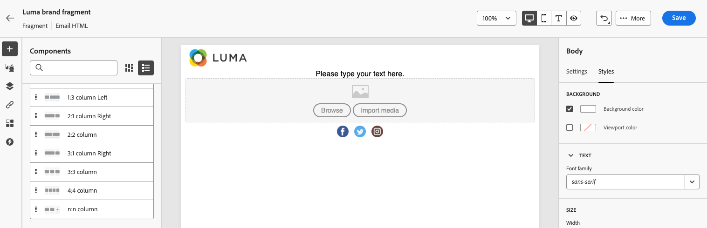
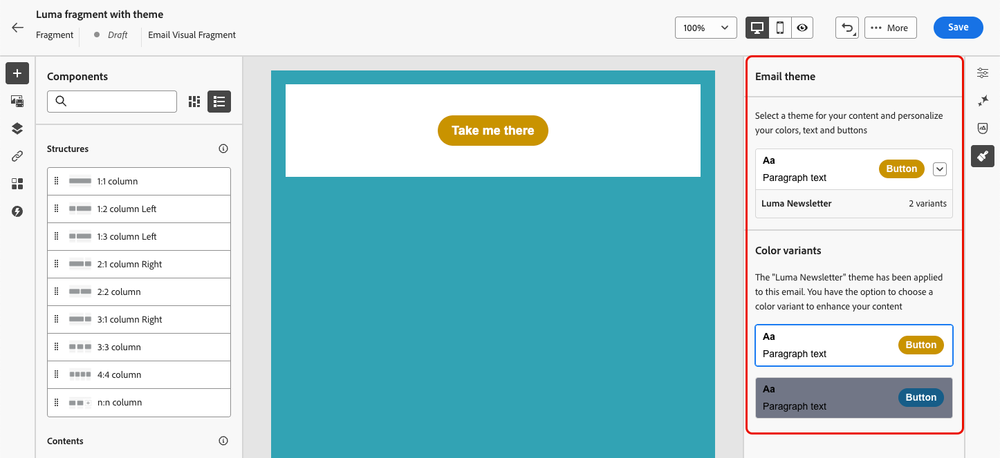
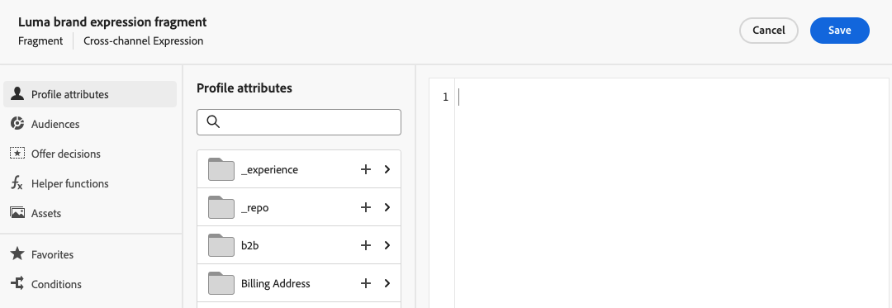
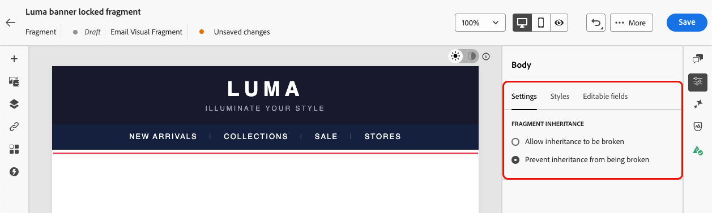
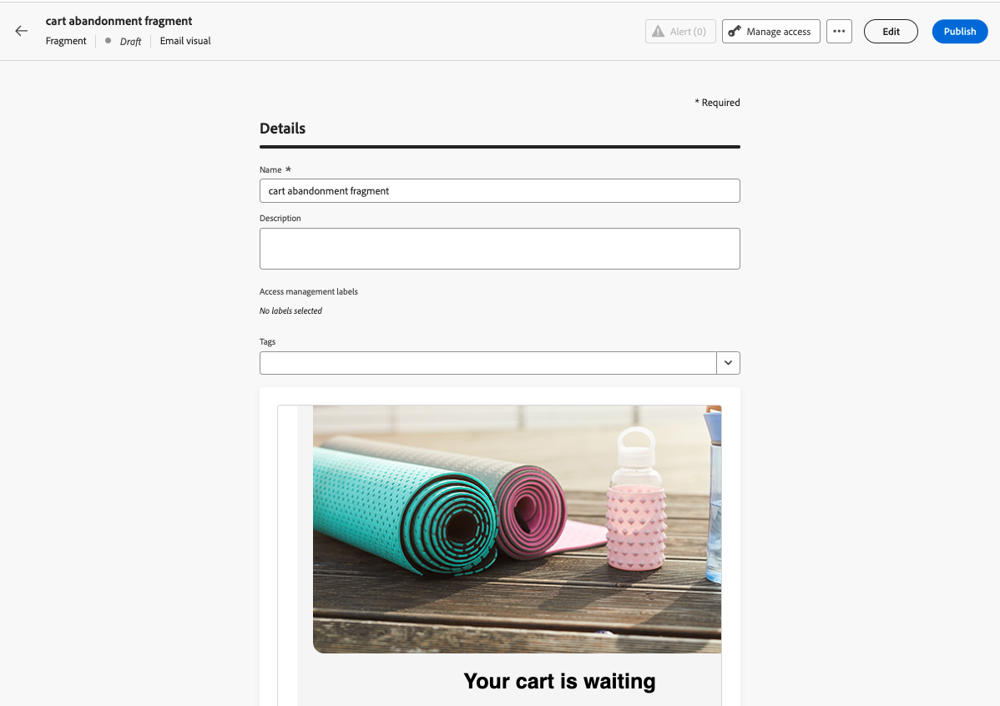
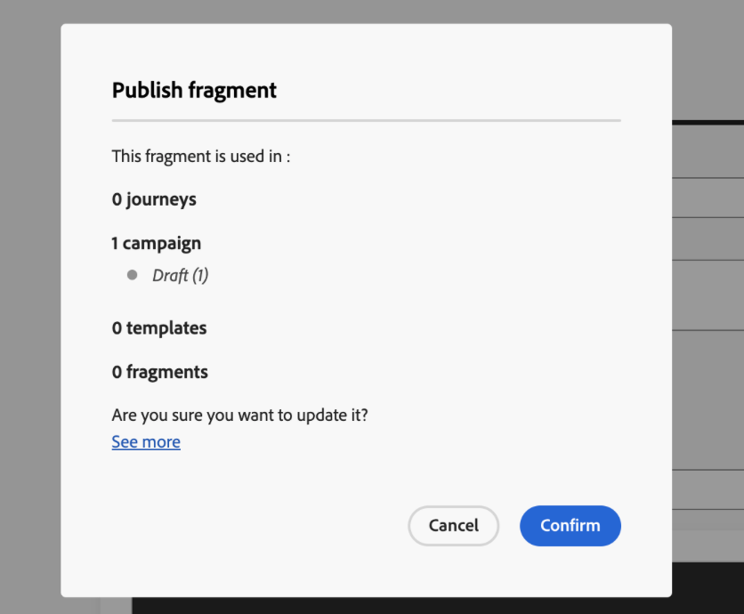

# Create a fragment {#create-fragments}

>[!BEGINSHADEBOX]

**On this page:** Learn how to create, design, lock, preview, and publish visual and expression fragments so you can reuse content across Adobe Journey Optimizer campaigns and journeys.

>[!ENDSHADEBOX]

>[!CONTEXTUALHELP]
>id="ajo_create_visual_fragment"
>title="Select the visual type"
>abstract="Create a standalone visual fragment to make your content reusable in an email within a journey or a campaign, or in a content template."
>additional-url="https://experienceleague.adobe.com/en/docs/journey-optimizer/using/channels/email/design-email/add-content/use-visual-fragments" text="Add visual fragments to your emails"

>[!CONTEXTUALHELP]
>id="ajo_create_expression_fragment"
>title="Select the expression type"
>abstract="Create a standalone expression fragment to make your content reusable across multiple journeys and campaigns. When using the personalization editor, you can leverage all the expression fragments that have been created on the current sandbox."
>additional-url="https://experienceleague.adobe.com/en/docs/journey-optimizer/using/content-management/personalization/personalization-build-expressions" text="Work with the personalization editor"

Fragments can be created from scratch from the **[!UICONTROL Fragments]** left menu. In addition, you can also save a portion of existing content as fragment when designing content. [Learn how](save-fragments.md#)

Once saved, your fragment is available for use in a journey, a campaign or a template. You can use this fragment when building any content within journeys and campaigns. See [Add visual fragments](../email/use-visual-fragments.md) and [Leverage expression fragments](../personalization/use-expression-fragments.md).

To create a fragment, follow the steps below.

## Define the fragment's properties {#properties}

1. Access the fragment list through the **[!UICONTROL Content Management]** > **[!UICONTROL Fragments]** left menu.

1. Select **[!UICONTROL Create fragment]** and fill in the fragment name and description (if needed).

    

1. Select or create Adobe Experience Platform tags from the **[!UICONTROL Tags]** field to categorize your fragment for improved search. [Learn how to work with Unified Tags](../start/search-filter-categorize.md#tags)

1. Select the fragment type: **Visual fragment** or **Expression fragment**. [Learn more](../content-management/fragments.md#visual-expression)

    >[!NOTE]
    >
    >Currently, visual fragments are available for the **Email** channel only.

1. If you are creating an expression fragment, select the type of code you want to use: **[!UICONTROL HTML]**, **[!UICONTROL JSON]** or **[!UICONTROL Text]**.

    

1. To assign custom or core data usage labels to the fragment, click the **[!UICONTROL Manage access]** button in the upper section of the screen. [Learn more about Object Level Access Control (OLAC)](../administration/object-based-access.md).

1. Click **[!UICONTROL Create]** to design the content of your fragment.

## Design the fragment content {#content}

After you have configured the fragment's properties, the Email Designer or the personalization editor opens, depending on the type of fragment you are creating.

>[!NOTE]
>
>[Contextual attributes](../personalization/personalization-build-expressions.md) are not supported within fragments.
>
>When tracking is enabled in a journey or a campaign, if you add links to a fragment and if this fragment is used in a message, these links are tracked such as all other links included in the message. [Learn more on links and tracking](../email/message-tracking.md)

* For visual fragments, edit your content as needed, the same way you would do for any email inside a journey or a campaign. [Learn more](../email/get-started-email-design.md) 

    

    To quickly apply a specific styling that fits your brand and design, you can apply a [theme](../email/apply-email-themes.md) to your fragment.

    

    >[!CAUTION]
    >
    >Fragments are not cross-compatible between the Use Themes and Manual Styling modes. When using a fragment in email content, make sure you are applying a theme that you have defined for this fragment. [Learn more](../email/apply-email-themes.md#leverage-themes-fragment)

* For expression fragments, leverage the [!DNL Journey Optimizer] personalization editor with all its personalization and authoring capabilities to build your fragment content. [Learn more](../personalization/personalization-build-expressions.md)

    

    >[!NOTE]
    >
    >JSON-type expression fragments are syntactically validated upon saving, with any errors shown as warning alerts.

When your content is ready, click the **[!UICONTROL Save]** button.

>[!NOTE]
>
>Visual fragments cannot exceed 100KB. Expression fragments cannot exceed 200KB.
    
The fragment is created and added to the fragment list with the **[!UICONTROL Draft]** status. You can preview it and publish it to make it available in journeys and campaigns.

### Lock a visual fragment {#lock-visual-fragment}

If you are creating or editing a visual fragment, you can lock it to prevent editors from modifying or detaching it when used in emails.

Selecting this option ensures the fragment stays synchronized wherever it is used, helping enforce brand, maintain consistency and comply with legal requirements.

To lock a visual fragment, follow the steps below.

1. In the fragment content edition screen, go to the **[!UICONTROL Settings]** tab.

1. By default, the fragment is unlocked. Select **[!UICONTROL Prevent inheritance from being broken]** to lock the fragment.

1. Click **[!UICONTROL Confirm]**.

    >[!NOTE]
    >
    >This setting can be updated at any time. However, changes apply to future usages only. Existing emails using this fragment are not modified.

{width="70%" align="center"}

Now when using this fragment in an email, it is locked and cannot be detached from the original fragment. [Learn more](../email/use-visual-fragments.md#locked-fragments)

New updates to the original locked fragment are automatically propagated to all emails using it.

## Preview and publish the fragment {#publish}

>[!NOTE]
>
>To publish a fragment, you must have the [Publish Fragment](../administration/ootb-product-profiles.md#content-library-manager) user permission.

If your fragment is ready to go live, you can preview and publish it to make it available in your journeys and campaigns. To do so, follow the steps below.

1. Go back to the fragment creation screen after designing its content, or open it from the list of fragments.

1. A preview of the fragment is available under the **[!UICONTROL Tags]** field, allowing to check its rendering. If you need to make any change, click the **[!UICONTROL Edit]** button in the upper section of the screen to open the Email Designer or the personalization editor, depending on the fragment type. [Learn more](manage-fragments.md#edit-fragments)

    

1. Click the **[!UICONTROL Publish]** button in the upper-right corner to publish the fragment.

1. If the fragment is being used in a live journey or campaign, a message opens to inform you. Click the **[!UICONTROL See more]** link to access the list of journeys and/or campaigns where it is referenced. [Learn how to explore references of a fragment](../content-management/manage-fragments.md#explore-references)

    {width="70%" align="center"}

    Click **[!UICONTROL Confirm]** to publish the fragment and update it in the live journeys/campaigns that are using it.

The fragment is now **[!UICONTROL Live]**, and becomes available when building any content within the [!DNL Journey Optimizer] Email Designer or personalization editor.

* [Learn how to use visual fragments](../email/use-visual-fragments.md)
* [Learn how to use expression fragments](../personalization/use-expression-fragments.md)

>[!CAUTION]
>
>Once it has been published, you cannot add new personalized attributes to a live fragment. If you want to add personalization attributes, you must duplicate the fragment. [Learn more](manage-fragments.md#adding-new-attributes)

