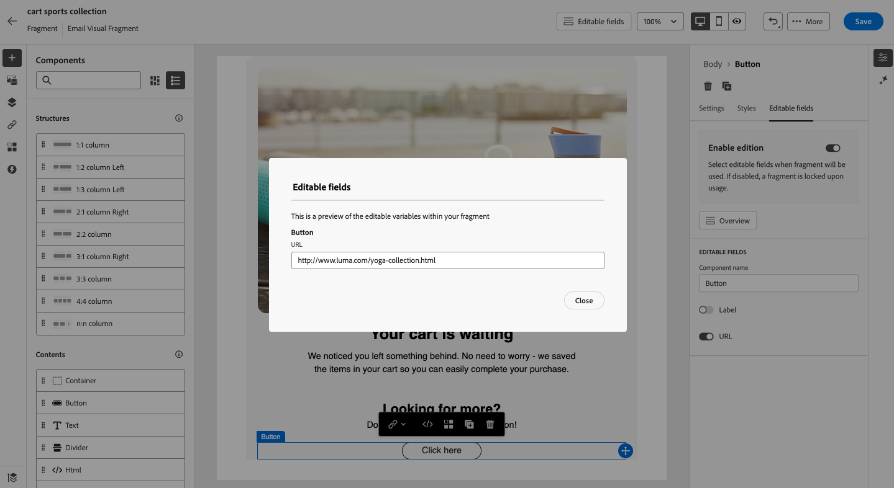

# Customizable fragments {#customizable-fragments}

When fragments are used in a campaign or journey action, they are locked by default due to inheritance. This means any changes made to a fragment are automatically propagated to all campaigns and journeys where the fragment is used. With customizable fragments, specific fields within a fragment can be defined as editable when the fragment is added to a campaign or journey action. For example, suppose you have a fragment with a banner, some text, and a button. You can designate certain fields, such as the image or button target URL, as editable. This allows users to modify these elements when they incorporate the fragment into their campaign or journey, providing a tailored experience without affecting the original fragment.

Customizable fragments eliminate the need to break fragment inheritance, which previously stopped centralized changes at fragment level from being propagated to the campaigns and journeys. This approach allows content portions to be adjusted at the time of use, offering the flexibility to override default values with context-specific details.

By leveraging customizable fragments, you can efficiently manage and personalize your content without creating entirely new content blocks or disrupting the inheritance from the original fragment. This ensures that changes made at the fragment level are still propagated, while allowing for necessary customization at the campaign or journey level.

Both visual and expression fragments can be marked as customizable. For detailed instructions on how to proceed with each type of fragment, refer to the sections below.

## Add editable fields in visual fragments {#visual}

To make portions of a visual fragment editable, follow these steps:

>[!NOTE]
>
>Editable fields can be added to **image**, **text** and **button** components. For **HTML** components, editable fields are added using the personalization editor, similar to expression fragments. [Learn how to add editable field in HTML componenets and expression fragments](#expression)

1. Open the fragment content edition screen.

1. Select the component in your fragment where you want to configure editable fields.

1. The component properties pane opens on the right hand-side. Select the **Editable fields** tab then toggle the **Enable edition** option.

1. All the fields that can be edited for the selected component are listed in the pane. The available fields for editing depend on the selected component type.

    In the example below, we allow the editing of the "Click here" button URL.

    

1. Click the **Overview** to check all the editable fields and their default values.

    In this example, the button URL field displays with the default value defined in the component. This value will be customizable by users after they have added the fragment to their content.

    

1. When ready, save your changes to update the fragment.

1. After adding the fragment into an email, users will be able to customize all the editable fields configured in the fragment. [Learn how to customize editable fields in a visual fragment](../email/use-visual-fragments.md#customize-fields)

## Add editable fields in HTML components and expression fragments {#expression}

To make portions of an HTML component or an expression fragment editable, you must use a specific syntax in the expression editor. This involves declaring a **variable** with a default value that users can override after adding the fragment to their content.

For example, suppose you want to create a fragment to add to your emails, and allow users to customize a specific color used in different locations, such as frames or buttons' background colors. When creating your fragment, you need to declare a variable with a **unique ID**, for example "color", and call it at the desired locations in the fragment content where you want to apply this color. When adding the fragment to their content, users will be able to customize the color used wherever the variable is referenced.

For HTML components, only specific elements can become editable fields. Expand the section below for more information.

+++Editable elements in HTML components:

The elements below can become editable fields in an HTML component: 

* A portion of text 
* A full URL for link or image (doesn’t work with portion of a URL) 
* Entire CSS property (doesn’t work with partial property) 

For example, in the code below, each element highlighted in red can become a property:

{width="70%"}

+++

To declare a variable and use it in your fragment, follow these steps:

1. Open your expression fragment then edit its content in the personalization editor. For HTML components, select the component in the fragment and click the **Show the source code** button. 

    

1. Declare the variable you want users to edit. Navigate to the **Helper functions** menu in the left navigation pane and add the **inline** helper function. The syntax to declare and call the variable is automatically added in your content.
    
    

1. Replace `"name"` with a unique ID to identify the editable field.

    >[!NOTE]
    >
    >The field ID must be unique and must not have spaces. This ID should be used everywhere in your content where you want to display the variable's value.

1. Adapt the syntax to suit your needs by adding parameters detailed in the table below:

    | Action | Parameter| Example |
    | ------- | ------- | ------- |
    |Declare an editable field with a **default value**. When adding the fragment to your content, this default value will be used if you don't customize it.|Add the default value between the inline tags.|`{{#inline "editableFieldID"}}default_value{{/inline}}`|
    |Define a **label** for the editable field. This label will display in the Email Designer when editing the fragment's fields.|`name="title"`|`{{#inline "editableFieldID" name="title"}}default_value{{/inline}}`|
    |Declare an editable field containing an **Image source** that needs to be published.|`assetType="image"`|`{{#inline "editableFieldID" assetType="image"}}default_value{{/inline}}`|
    |Declare an editable field containing an **URL** that needs to be tracked. Note that out-of-the-box "Mirror page URL" and "Unsubscribe link" predefined blocks cannot become editable fields.|`assetType="url"`|`{{#inline "editableFieldID" assetType="url"}}default_value{{/inline}}`|

1. Use the `{{{name}}}` syntax in your code at every place where you want to display the value of the editable field. Replace `name` with the unique ID of the field defined earlier.

    

1. Save your fragment.

When adding the fragment to their email content, users can now override the variables' default values with their chosen values:

* For expression fragments, a specific syntax is used to override variables values. [Learn how to customize editable fields in an expression fragment](../personalization/use-expression-fragments.md#customize-fields)

* For HTML components, the variable displays in the list of editable fields in the Email Designer. [Learn how to customize editable fields in a visual fragment](../email/use-visual-fragments.md#customize-fields)

## Editable expression fragment example {#example}

In the example below, we are creating an expression fragment presenting new sports collections. By default, the fragment  displays this content: *Looking for more? Don't miss our latest sports collection!*

We want to allow users to replace "sports" in this content with the sport of their choice. For example: *Looking for more? Don't miss our latest yoga collection!*

To do so:

1. Declare a "sport" variable with the ID "sport".

    By default, if users don't change the variable's value after adding the fragment in their content, it will show the value defined between the `{{#inline}}` and `{{/inline}}` tags, i.e. "sports".

1. Add the ``{{{sport}}}`` syntax in the fragment content where you want to display the variable value, i.e. "sports" by default, or the value chosen by users.

    

1. When adding the expression fragment to their content, users can change the variable's value with their choice directly from the expression editor. [Learn how to customize editable fields in an expression fragment](../personalization/use-expression-fragments.md#customize-fields)

    
