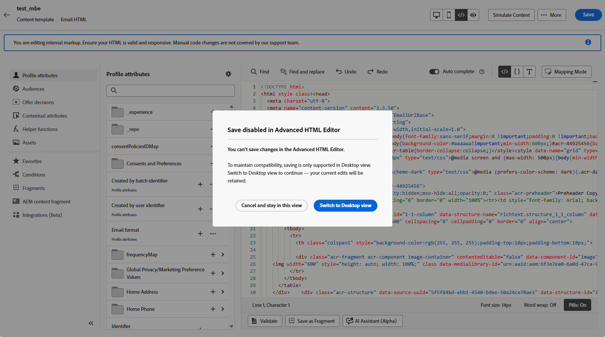

# Edit email templates with the advanced HTML editor {#email-template-expert-mode}

>[!AVAILABILITY]
>
>This capability is available in Limited Availability. Contact your Adobe representative to gain access.

The **advanced HTML editor** is an expert mode that lets you view and edit the raw source code of email content templates directly from the [!DNL Journey Optimizer] Email Designer interface.

This capability lets you insert advanced expressions—such as conditions—directly in the source. When you switch back to the visual (Desktop) view, the content is re-rendered so you can check how it looks and continue editing in either view.

>[!NOTE]
>
>This feature is only available in content templates and for the Email channel.

## Guardrails {#guardrails}

When you use the advanced HTML editor, the following guardrails are in place to protect content compatibility and set expectations.

* Currently, there is **no validation process** in the advanced HTML editor. Syntax errors and broken layouts are not checked. Make sure to review your content carefully before saving.

* Future system updates may revert changes made to default markup. Be aware that **your changes may be overwritten**.

* Issues caused by custom code and manual changes **cannot be troubleshooted** or resolved by the [!DNL Adobe] support team. Ensure you have a backup of your content in case you need to revert to a previous version.

* To ensure content compatibility, **saving is not available** in advanced HTML view. When you are ready to save your changes, you must switch back to the Desktop view.

>[!WARNING]
>
>The advanced HTML editor in the content template is not the same as **[!UICONTROL Code your own]** mode in the Email Designer. In [!UICONTROL Code your own] mode, you cannot switch back to the visual editor—once you choose that path, you stay in code-only editing. The advanced HTML editor, by contrast, lets you toggle between HTML view and Desktop (visual) view at any time. [Learn more about the code editor](../email/code-content.md)

## Switch to advanced HTML view {#switch-to-desktop-view}

1. Open or create an [email template](../content-management/create-content-templates.md) and open the [Email Designer](../email/get-started-email-design.md) to edit the content.

1. Click the **[!UICONTROL HTML]** button in the top-right corner of the screen.

    

1. The first time you open the advanced HTML editor, a warning message is displayed. Review it carefully and click **[!UICONTROL OK]** to continue. [Learn more](#guardrails)

    >[!NOTE]
    >
    >This warning appears only the first time you open the advanced HTML editor and resets each month.

    {zoomable="yes"}

1. The advanced HTML editor is displayed.

    

1. Add the desired changes to your email content.

    >[!WARNING]
    >
    >Make sure to enter correct HTML and CSS code as there is no syntax validation process and no support is provided by [!DNL Adobe]. [Learn more](#guardrails)

1. Saving is not available in advanced HTML view. Switch back to Desktop view to save your changes.

    {zoomable="yes"}

    >[!NOTE]
    >
    >Content can only be saved in Desktop view for content compatibility reasons. Your edits are preserved when you switch views.
