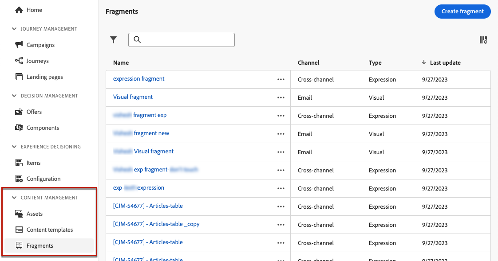

# Get started with fragments {#fragments}
 
>[!CONTEXTUALHELP] 
>id="ajo_create_fragment"
>title="Define your own fragments"
>abstract="Create and manage standalone fragments to make your content reusable across multiple journeys and campaigns."
>additional-url="https://experienceleague.adobe.com/en/docs/journey-optimizer/using/content-management/fragments/create-fragments" text="Create fragments"

A fragment is a reusable component that can be referenced in one or more emails across [!DNL Journey Optimizer] campaigns and journeys. This functionality allows you to prebuild multiple custom content blocks that can be used by marketing users to quickly assemble email contents in an improved design process.

➡️ [Learn how to manage, author and use fragments in these videos](#video-fragments)

To make the best use of fragments:

* **Create your own fragments**: Create visual or expression fragments, either from scratch or by saving content as fragment. [Learn how to create a fragment](create-fragments.md). In addition, you can leverage Journey Optimizer **Content REST API** to manage content fragments. For more on this, refer to the [Journey Optimizer APIs documentation](https://developer.adobe.com/journey-optimizer-apis/references/content){target="_blank"}.
* **Reuse your fragments:** Use them as many times as needed in your content. See [Add visual fragments](../email/use-visual-fragments.md) and [Leverage expression fragments](../personalization/use-expression-fragments.md)

## Before starting {#fragment-prerequisites}

To create, edit, archive, and publish fragments you need the **[!DNL Manage library items]** and **[Publish Fragment]** permissions included in the **[!DNL Content Library Manager]** product profile. [Learn more](../administration/ootb-product-profiles.md#content-library-manager)

In this version, the following limitations apply:

* **Visual fragments** are available for the Email channel only.
* **Expression fragments** are not available for the In-app channel.

More guardrails applying to fragments are available in [this section](../start/guardrails.md#fragments-guardrails).

## Visual & expression fragments {#visual-expression}

Two types of fragments are available:

* **Visual fragments** are pre-defined visual blocks that you can reuse across multiple email deliveries using the [Email Designer](../email/get-started-email-design.md), or in [content templates](../email/use-email-templates.md).
* **Expression fragments** are pre-defined expressions that are available from a dedicated entry in the [personalization editor](../personalization/personalization-build-expressions.md).

All created fragments are accessible from the **[!UICONTROL Content Management]** > **[!UICONTROL Fragments]**  left menu. [Learn how to manage fragments](../content-management/manage-fragments.md)

## How-to video {#video-fragments}

Learn how to manage, author, and use **visual fragments** in [!DNL Journey Optimizer].

>[!VIDEO](https://video.tv.adobe.com/v/3419932/?quality=12)

Learn how to manage, author, and use **expression fragments** in [!DNL Journey Optimizer].

>[!VIDEO](https://video.tv.adobe.com/v/3424587/?quality=12)
