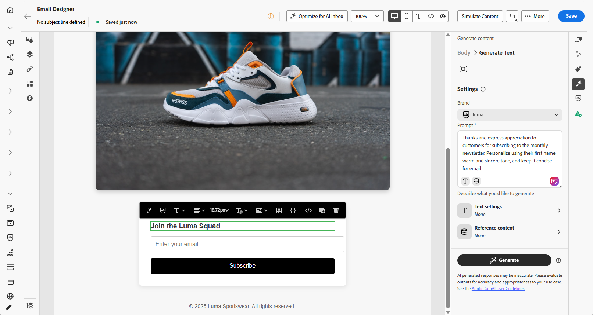
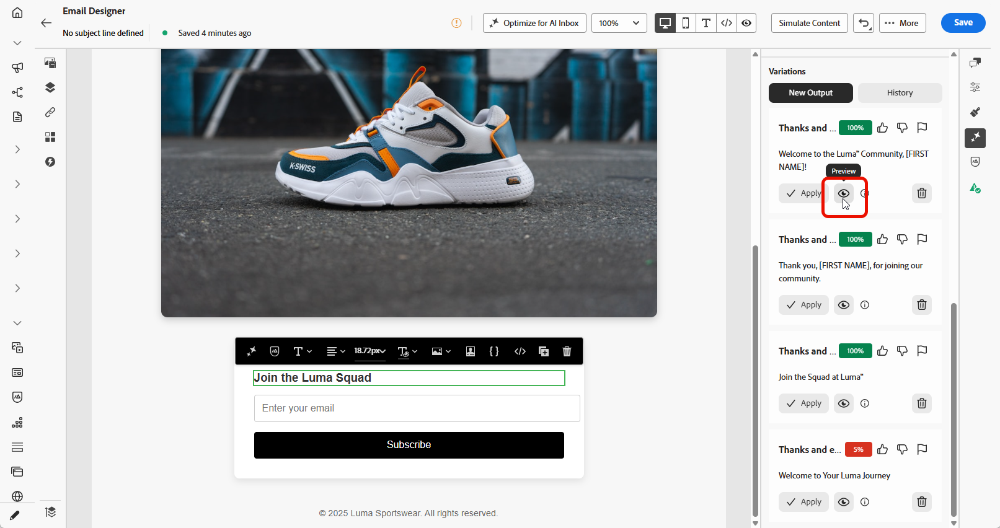
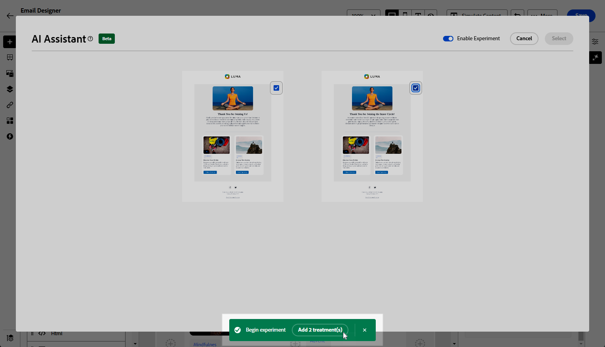

# Content experiment with AI Assistant{#generative-experimentation}

>[!IMPORTANT]
>
>Before starting using this capability, read out related [Guardrails and Limitations](gs-generative.md#generative-guardrails).
> 
>
>You must agree to a [user agreement](https://www.adobe.com/legal/licenses-terms/adobe-dx-gen-ai-user-guidelines.html) before you can use AI Assistant in Journey Optimizer. For more information, contact your Adobe representative.

Once you've crafted and personalized your messages, elevate your content with AI Assistant in Adobe Journey Optimizer, which includes the Content Experiment feature. This tool allows you to define multiple delivery treatments, varying content, to measure performance for your target audience.

1. Create your campaign and use AI Assistant to generate your variants. 

    In this example, we generated a subscription confirmation email with a promo code.

    

1. Browse through the generated **[!UICONTROL Variations]** and click **[!UICONTROL Preview]** to view a full-screen version of the selected variation.

    

1. Select **[!UICONTROL Enable Experiment]** to start creating **[!UICONTROL Treatments]** for your Experimentation.

1. Select the Variations you want to include to your experiment.

1. Click **Add to experiment**.

    

1. From your Content Experiment, you can now start configuring your content experimentation. [Learn more about Content Experiment](../content-management/content-experiment.md)

1. When your Content experiment is ready, from your campaign summary page, you can click **[!UICONTROL Review to activate]** to display a summary of the campaign. Alerts display if any parameter is incorrect or missing. [Learn more](../content-management/content-experiment.md#treatment-experiment)

1. Before launching your campaign, double-check that all configurations are correct, and then click on **[!UICONTROL Activate]**.

After successfully configuring and personalizing your campaign, you can track your campaign in the campaign report. [Learn more](../reports/campaign-global-report-cja.md)
