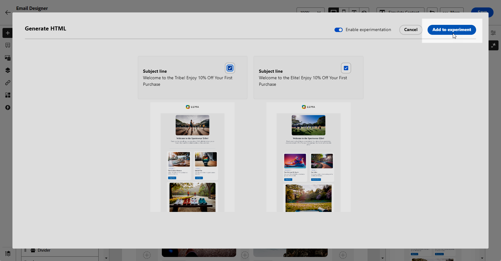

# Content experiment with the AI Assistant {#generative-experimentation}

>[!BEGINSHADEBOX]

**Table of content**

* [Get started with the AI Assistant](gs-generative.md)
* [Email generation with the AI Assistant](generative-email.md)
* [SMS generation with the AI Assistant](generative-sms.md)
* [Push generation with the AI Assistant](generative-push.md)
* **[Content experiment with the AI Assistant](generative-experimentation.md)**

>[!ENDSHADEBOX]

Once you've crafted and personalized your messages, elevate your content with the Journey Optimizer AI Assistant, which includes the Content Experiment feature. This tool allows you to define multiple delivery treatments, varying content, to measure performance for your target audience.

1. Create your campaign and use the AI assistant to generate your variants. 

    In this example, we generated a subscription confirmation email with a promo code.

    

1. Browse through the generated **[!UICONTROL Variations]** and click **[!UICONTROL Preview]** to view a full-screen version of the selected variation.

    

1. Select **[!UICONTROL Enable Experiment]** to start creating **[!UICONTROL Treatments]** for your Experimentation.

1. Select the Variations you want to include to your experiment.

1. Click **Add X treatment(s)**.

    

1. Access the **[!UICONTROL Experiment settings]** or **[!UICONTROL Actions]** menus to further personalize your Experiment. [Learn more](../campaigns/content-experiment.md)

    

1. After defining your message content, click the **[!UICONTROL Simulate content]** button to control the rendering, and check personalization settings with test profiles. [Learn more](../content-management/preview-test.md)

1. When your content is ready, from your campaign summary page, you can click **[!UICONTROL Review to activate]** to display a summary of the campaign. Alerts display if any parameter is incorrect or missing.

1. Before launching your campaign, double-check that all configurations are correct, and then click on **[!UICONTROL Activate]**.

After successfully configuring and personalizing your campaign, you can track your campaign in the campaign report. [Learn more](../reports/campaign-global-report.md)
