# Generate full content with AI Assistant {#generative-full-content}

>[!IMPORTANT]
>
>Before starting using this capability, read out related [Guardrails and Limitations](gs-generative.md#generative-guardrails).
> 
>
>You must agree to a [user agreement](https://www.adobe.com/legal/licenses-terms/adobe-dx-gen-ai-user-guidelines.html) before you can use AI Assistant in Journey Optimizer. For more information, contact your Adobe representative.

Use AI Assistant in Journey Optimizer to generate complete content experiences across your email, web, landing pages, and push notification channels. AI Assistant helps you optimize the impact of your deliveries by creating comprehensive content that resonates with your audience.

## For Email and Web Channels {#email-web-channels}

AI Assistant can produce complete content experiences for your email campaigns, web pages, and landing pages, generating both text and images. This robust functionality helps you create compelling, on-brand content that connects with your audience across all digital touchpoints.

### Access and configure {#access-configure}

Before you begin creating content with AI Assistant, you will need to set up your campaign or journey and open the content editor. Use the steps below to prepare your workspace and access the AI Assistant panel.

1. Create and configure your campaign or journey:
   * **Email**: After creating and configuring your email campaign, click **[!UICONTROL Edit content]**. [Learn more](../campaigns/create-campaign.md)
   * **Web**: After creating and configuring your web page, click **[!UICONTROL Edit web page]**. [Learn more](../web/create-web.md)
   * **Landing Page**: After creating and configuring your landing page, click **[!UICONTROL Open designer]**. [Learn more](../landing-pages/create-lp.md)

1. From the right-hand menu, select **[!UICONTROL AI Assistant]** (or **[!UICONTROL Show Content Assistant]** for web).

    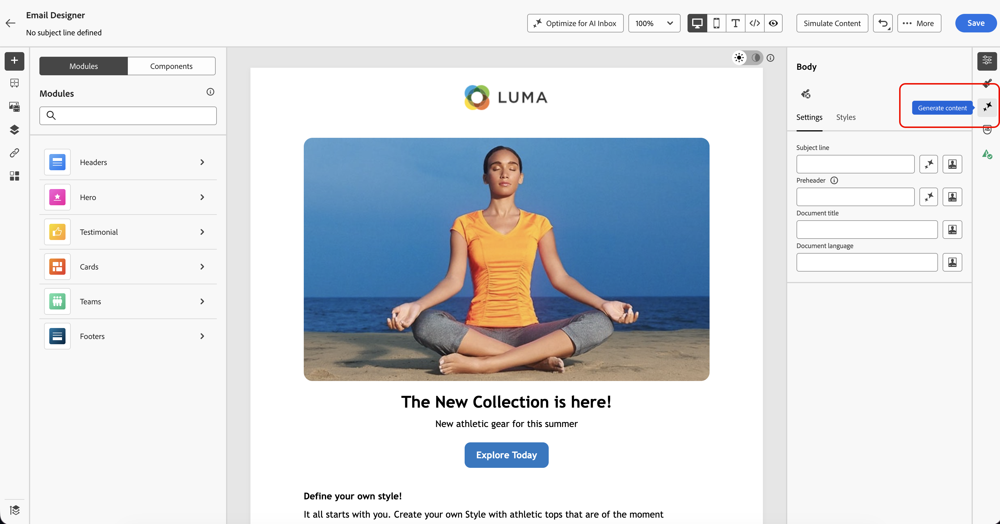{zoomable="yes"}

### Generate content {#generate-content}

With AI Assistant open, you can now configure the generation settings to create content that matches your brand and campaign goals. Customize text and image parameters, add brand assets, and provide prompts to guide the AI in generating relevant variations for your audience.

1. Select your **[!UICONTROL Brand]** to ensure AI-generated content aligns with your brand specifications. [Learn more](brands.md) on Brands.

1. Fine tune the content by describing what you want to generate in the **[!UICONTROL Prompt]** field. 

    If you are looking for assistance in crafting your prompt, access the **[!UICONTROL Prompt Library]** which provides a diverse range of prompt ideas to improve your campaigns. [Learn more on prompt best practices](ai-assistant-prompting-guide.md)

    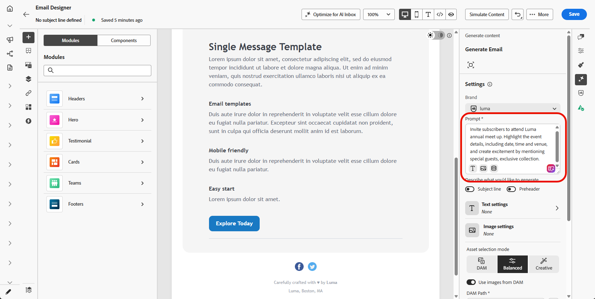{zoomable="yes"}

1. **For Emails**, you can toggle the **[!UICONTROL Subject line]** and **[!UICONTROL Preheader]** options to include them in the variant generation.

1. Tailor your prompt with the **[!UICONTROL Text settings]** option:

    * **[!UICONTROL Communication strategy]**: Choose the most suitable communication style for your generated text.
    * **[!UICONTROL Languages]**: Choose the language of your generated content.
    * **[!UICONTROL Tone]**: The tone should resonate with your audience. Whether you want to sound informative, playful, or persuasive, AI Assistant can adapt the message accordingly.

        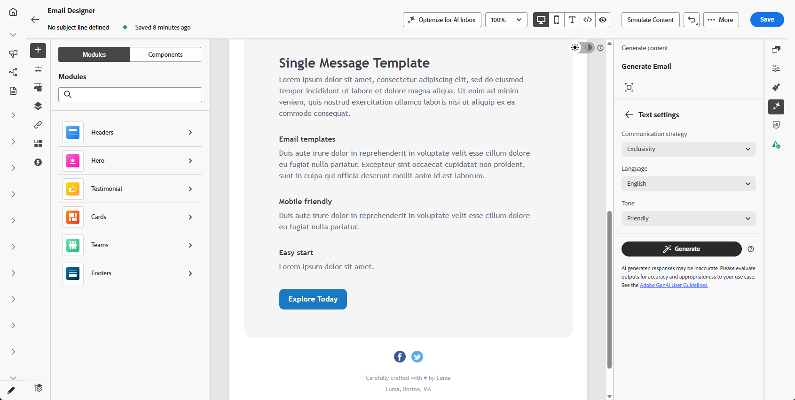{zoomable="yes"}

1. Choose your **[!UICONTROL Image settings]**:

    * **[!UICONTROL Generative model]**: Select from available built-in models, custom Firefly models trained on your brand assets, or third-party image generation providers to create images that align with your specific needs and brand requirements. [Learn more](generative-models.md). For **Gemini** with **text overlays** on images, see [Use Gemini as generative model for text-overlay image](generative-uc.md#generative-gemini).
    * **[!UICONTROL Content type]**: This categorizes the nature of the visual element, distinguishing between different forms of visual representation such as photos, graphics, or art.
    * **[!UICONTROL Visual intensity]**: You can control the image's impact by adjusting its intensity. A lower setting (2) will create a softer, more restrained appearance, while a higher setting (10) will make the image more vibrant and visually powerful.
    * **[!UICONTROL Color & tone]**: The overall appearance of the colors within an image and the mood or atmosphere it conveys.
    * **[!UICONTROL Lighting]**: This refers to the lightning present in an image, which shapes its atmosphere and highlights specific elements.
    * **[!UICONTROL Composition]**: This refers to the arrangement of elements within the frame of an image

        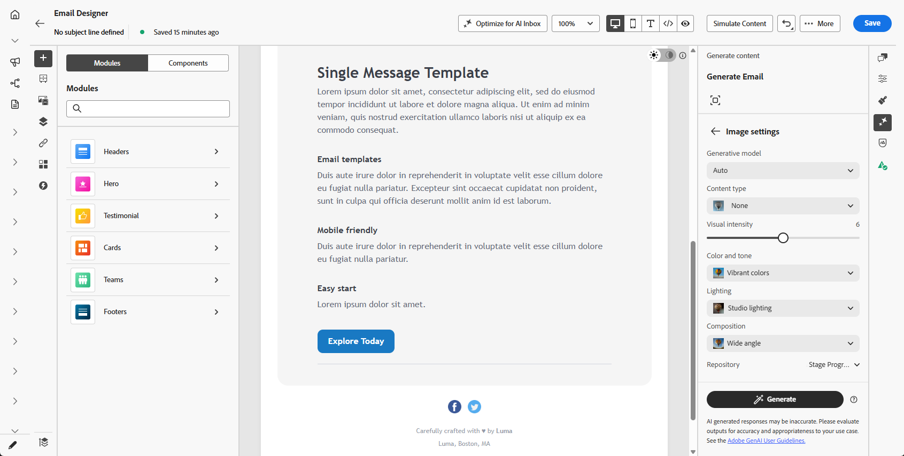{zoomable="yes"}

1. From the **[!UICONTROL Reference content]** menu, click **[!UICONTROL Upload file]** to add any brand asset which contains content that can provide additional context AI Assistant or select a previously uploaded one.

    Previously uploaded files are available in the **[!UICONTROL Uploaded reference content]** drop-down. Simply toggle the assets you wish to include in your generation.

    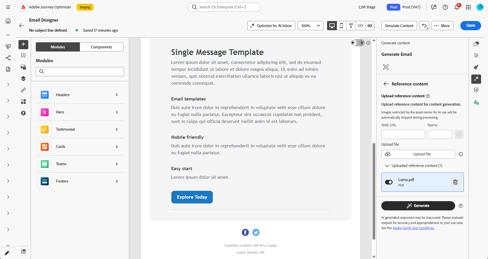{zoomable="yes"}

1. Once your prompt is ready, click **[!UICONTROL Generate]**.

### Refine and finalize {#refine-finalize}

After generating content variations, you can fine-tune the results to ensure they meet your exact requirements. Review the brand alignment, adjust tone and language, and prepare the content for activation in your campaign or journey.

1. After generation, browse through the **[!UICONTROL Variations]**.

1. Click the percentage icon to view your **[!UICONTROL Brand Alignment Score]** and identify any misalignments with your brand.

    Learn more on [Brand alignment score](brands-score.md).

    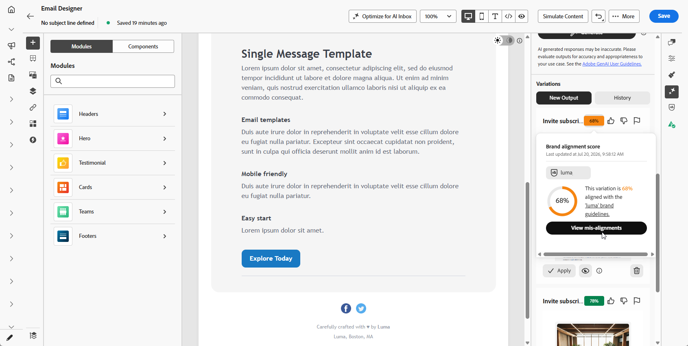{zoomable="yes"}

1. Click **[!UICONTROL Preview]** to view a full-screen version of the selected variation or **[!UICONTROL Apply]** to replace your current content.

1. Navigate to the **[!UICONTROL Refine]** option within the **[!UICONTROL Preview]** window to access additional customization features:

    * **[!UICONTROL Rephrase]**: Rewrite the message while preserving its meaning. This option helps you generate alternative wording, improve flow, or adjust phrasing without changing the core message.

    * **[!UICONTROL Use simpler language]**: Leverage AI Assistant to simplify your language, ensuring clarity and accessibility for a wider audience.

    * **[!UICONTROL Translate]**: Simplify your language to ensure clarity and accessibility for a wider audience.

    * **[!UICONTROL Change tone]**: Adjust the tone of the message to better match your communication style, i.e. making it more friendly, professional, urgent, or inspirational.

    * **[!UICONTROL Change Communication strategy]**: Modify the messaging approach based on your objectives, such as creating urgency, or emphasizing exciting appeal.

        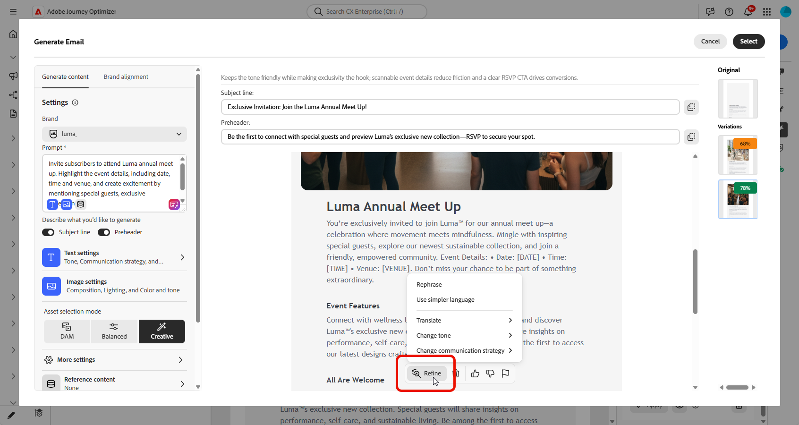{zoomable="yes"}

1. Open the **[!UICONTROL Brand Alignment]** tab to see how your content aligns with your [brand guidelines](brands.md).

1. Click **[!UICONTROL Select]** once you found the appropriate content. 

    You can also enable experiment for your content. [Learn more](generative-experimentation.md)

1. Insert personalization fields to customize your content based on profiles data. Then, click the **[!UICONTROL Simulate content]** button to control the rendering, and check personalization settings with test profiles. [Learn more](../personalization/personalize.md)

1. Review and activate your content:
   * **Email**: When you have defined your content, audience and schedule, you are ready to prepare your email campaign. [Learn more](../campaigns/review-activate-campaign.md)
   * **Web**: Once you defined your web campaign settings and edited your content as desired, you can review and activate your web campaign. [Learn more](../web/create-web.md#activate-web-campaign)
   * **Landing Page**: Once your landing page is ready, you can publish it to make it available for use in a message. [Learn more](../landing-pages/create-lp.md#publish-landing-page)

## For mobile channels {#mobile-channels}

AI Assistant also supports content generation for mobile push notifications, enabling you to create engaging titles, messages, and images for your mobile apps. This helps you maintain consistent, high-quality communication across all customer touchpoints, including mobile.

### Access and configure {#mobile-access-configure}

To use AI Assistant for push notifications, first set up your push campaign and open the content editor. The steps below will guide you through preparing your campaign and accessing the AI Assistant tools.

1. After creating and configuring your push notification campaign, click **[!UICONTROL Edit content]**.

    For more information on how to configure your push notification campaign, refer to [this page](../push/create-push.md).

1. Fill in the **[!UICONTROL Basic details]** for your campaign. Once done, click **[!UICONTROL Edit content]**.

1. Personalize your push notification as needed. [Learn more](../push/design-push.md)

1. Access the **[!UICONTROL Show AI Assistant]** menu.

    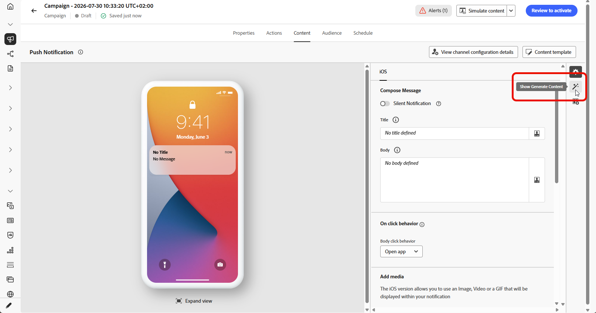{zoomable="yes"}

### Generate content {#mobile-generate-content}

Once you have accessed AI Assistant for push notifications, you can configure the generation settings to create compelling mobile content. Define your text and image preferences, select brand assets, and use prompts to generate push notification variations that engage your mobile users.

1. Enable the **[!UICONTROL Use original content]** option for AI Assistant to personalize new content based on the selected content.

1. Select your **[!UICONTROL Brand]** to ensure AI-generated content aligns with your brand specifications. [Learn more](brands.md) on Brands.

   Note that Brands feature is released as a private beta and will be progressively available to all customers in future releases.

1. Fine tune the content by describing what you want to generate in the **[!UICONTROL Prompt]** field. 

    If you are looking for assistance in crafting your prompt, access the **[!UICONTROL Prompt Library]** which provides a diverse range of prompt ideas to improve your campaigns.
    
    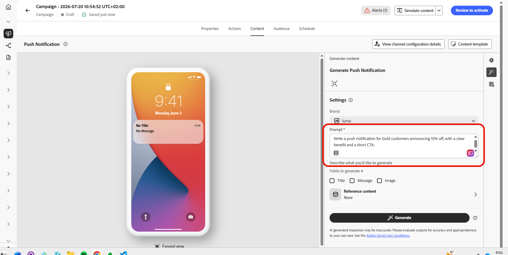{zoomable="yes"}

1. Choose which field you want to generate: **[!UICONTROL Title]**, **[!UICONTROL Message]** and/or **[!UICONTROL Image]**.

1. Tailor your prompt with the **[!UICONTROL Text settings]** option:

    * **[!UICONTROL Communication strategy]**: Choose the most suitable communication style for your generated text.
    * **[!UICONTROL Languages]**: Choose the language of your generated content.
    * **[!UICONTROL Tone]**: The tone of your push notifications should resonate with your audience. Whether you want to sound informative, playful, or persuasive, AI Assistant can adapt the message accordingly.

        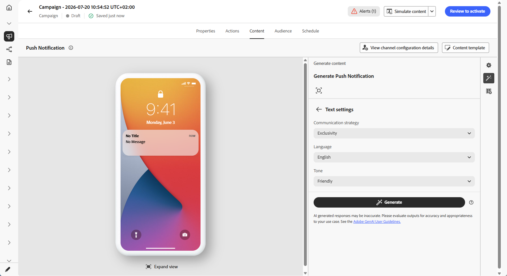{zoomable="yes"} 

1. Choose your **[!UICONTROL Image settings]**:

    * **[!UICONTROL Generative model]**: Select from available built-in models, custom Firefly models trained on your brand assets, or third-party image generation providers to create images that align with your specific needs and brand requirements. [Learn more](generative-models.md). For **Gemini** with **text overlays** on images, see [Use Gemini as generative model for text-overlay image](generative-uc.md#generative-gemini).
    * **[!UICONTROL Content type]**: This categorizes the nature of the visual element, distinguishing between different forms of visual representation such as photos, graphics, or art.
    * **[!UICONTROL Visual intensity]**: You can control the image's impact by adjusting its intensity. A lower setting (2) will create a softer, more restrained appearance, while a higher setting (10) will make the image more vibrant and visually powerful.
    * **[!UICONTROL Color & tone]**: The overall appearance of the colors within an image and the mood or atmosphere it conveys.
    * **[!UICONTROL Lighting]**: This refers to the lightning present in an image, which shapes its atmosphere and highlights specific elements.
    * **[!UICONTROL Composition]**: This refers to the arrangement of elements within the frame of an image

        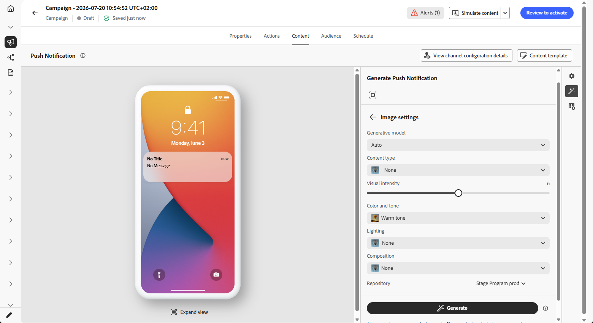{zoomable="yes"} 

1. From the **[!UICONTROL Reference content]** menu, click **[!UICONTROL Upload file]** to add any brand asset which contains content that can provide additional context AI Assistant or select a previously uploaded one.

    Previously uploaded files are available in the **[!UICONTROL Uploaded reference content]** drop-down. Simply toggle the assets you wish to include in your generation.

1. Once your prompt is ready, click **[!UICONTROL Generate]**.

### Refine and finalize {#mobile-refine-finalize}

After reviewing your generated push notification variations, you can polish the content to perfection. Use refinement tools to adjust language and tone, verify brand alignment, and personalize the content before activating your push campaign.

1. Browse through the generated **[!UICONTROL Variations]**.

1. Click the percentage icon to view your **[!UICONTROL Brand Alignment Score]** and identify any misalignments with your brand.

    Learn more on [Brand alignment score](brands-score.md).

    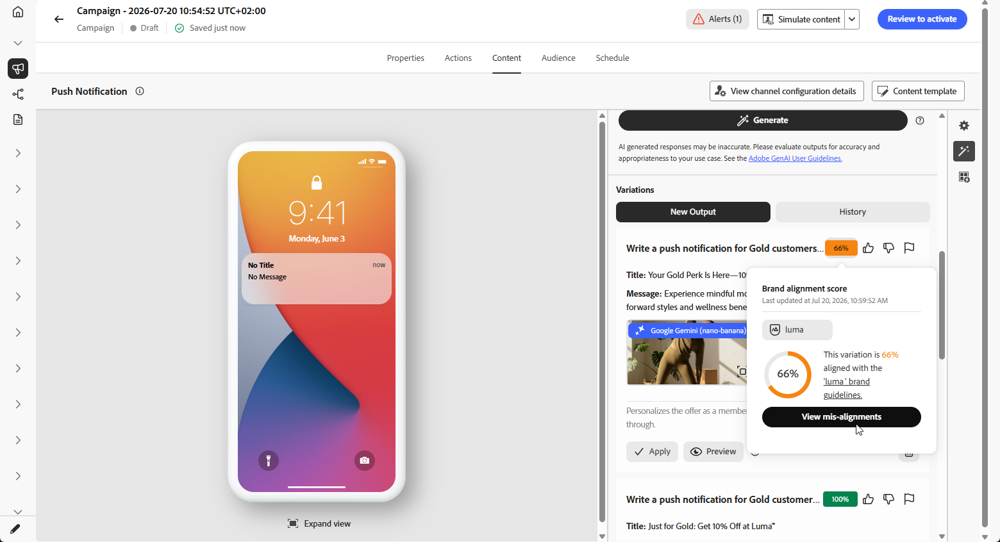{zoomable="yes"}

1. Click **[!UICONTROL Preview]** to view a full-screen version of the selected variation or click **[!UICONTROL Apply]** to replace your current content.

1. Navigate to the **[!UICONTROL Refine]** option within the **[!UICONTROL Preview]** window to access additional customization features:

    * **[!UICONTROL Use as reference content]**: The chosen variant will serve as the reference content for generating other results.

    * **[!UICONTROL Rephrase]**: Rewrite the message while preserving its meaning. This option helps you generate alternative wording, improve flow, or adjust phrasing without changing the core message.

    * **[!UICONTROL Use simpler language]**: Leverage AI Assistant to simplify your language, ensuring clarity and accessibility for a wider audience.

    * **[!UICONTROL Change tone]**: Adjust the tone of the message to better match your communication style, i.e. making it more friendly, professional, urgent, or inspirational.

    * **[!UICONTROL Change Communication strategy]**: Modify the messaging approach based on your objectives, such as creating urgency, or emphasizing exciting appeal.

        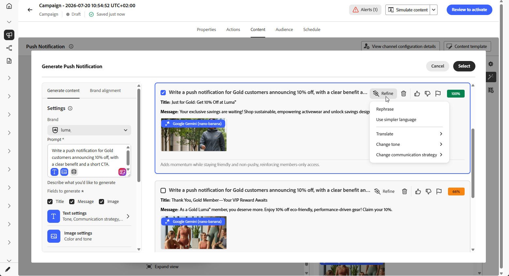{zoomable="yes"}

1. Open the **[!UICONTROL Brand Alignment]** tab to see how your content aligns with your [brand guidelines](brands.md).

1. Click **[!UICONTROL Select]** once you found the appropriate content.

    You can also enable experiment for your content. [Learn more](generative-experimentation.md)

1. Insert personalization fields to customize your push notification content based on profiles data. Then, click the **[!UICONTROL Simulate content]** button to control the rendering, and check personalization settings with test profiles. [Learn more](../personalization/personalize.md)

When you have defined your content, audience and schedule, you are ready to prepare your push campaign. [Learn more](../campaigns/review-activate-campaign.md)

## How-to video {#video}

Learn how to use AI Assistant in Journey Optimizer to generate full content experiences.

>[!VIDEO](https://video.tv.adobe.com/v/3433552)
