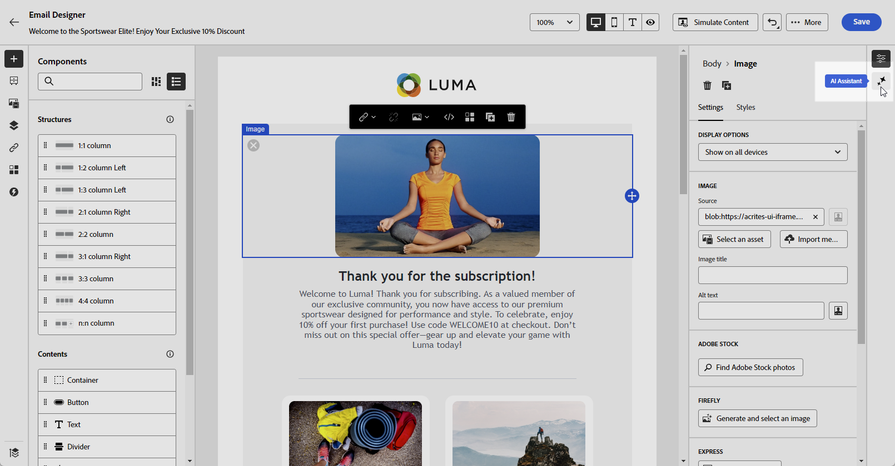
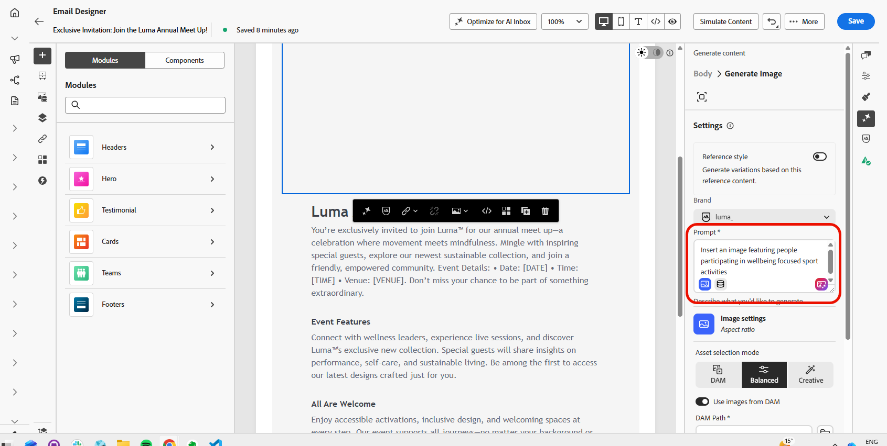
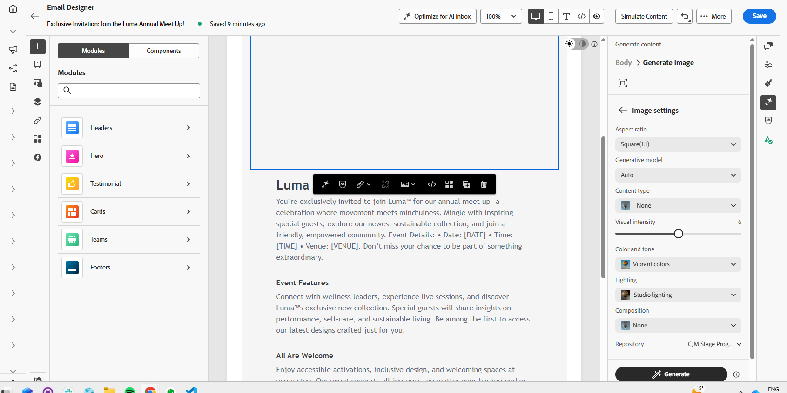
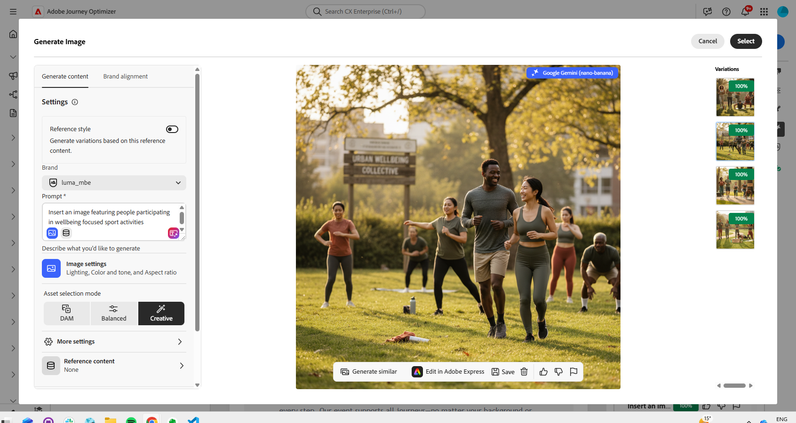
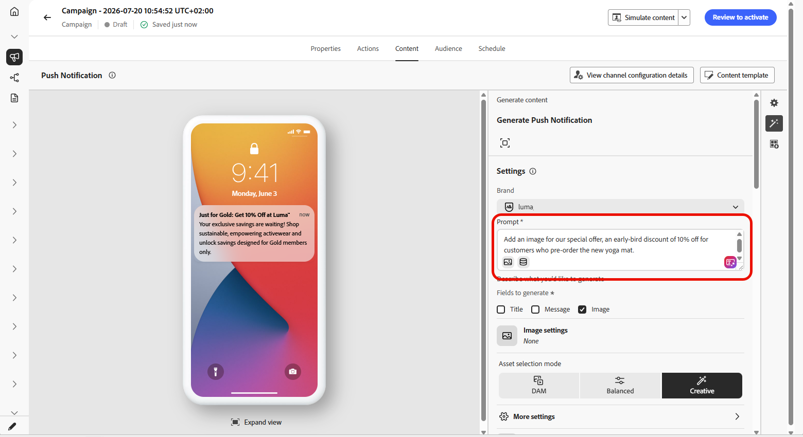

# Generate images with AI Assistant {#generative-image}

>[!IMPORTANT]
>
>Before starting using this capability, read out related [Guardrails and Limitations](gs-generative.md#generative-guardrails).
> 
>
>You must agree to a [user agreement](https://www.adobe.com/legal/licenses-terms/adobe-dx-gen-ai-user-guidelines.html) before you can use AI Assistant in Journey Optimizer. For more information, contact your Adobe representative.

Use AI Assistant in Journey Optimizer to generate compelling visual content that enhances your messages across email, web, landing pages, and push notifications. AI Assistant helps you optimize and improve your assets, ensuring a more user-friendly and engaging experience for your audience.

## For Email and Web Channels {#email-web-channels}

AI Assistant can generate complete visual experiences for your email campaigns, web experiences, and landing pages. This capability allows you to produce on-brand, attention-grabbing images that resonate with your audience across digital touchpoints.

### Access and configure {#access-configure}

To start generating images with AI Assistant, first set up your campaign or journey and open the content editor. Follow the steps below to prepare your workspace and access the AI Assistant panel.

1. Create and configure your campaign or journey:
   * **Email**: After creating and configuring your email campaign, click **[!UICONTROL Edit content]**. [Learn more](../email/create-email.md)
   * **Web**: After creating and configuring your web page, click **[!UICONTROL Edit web page]**. [Learn more](../web/create-web.md)
   * **Landing Page**: After creating and configuring your landing page, click **[!UICONTROL Open designer]**. [Learn more](../landing-pages/create-lp.md)

1. Select the asset you want to change with AI Assistant.

1. From the right-hand menu, select **[!UICONTROL AI Assistant]** (or **[!UICONTROL Show Content Assistant]** for web).

    {zoomable="yes"}

### Generate content {#generate-content}

Learn how to craft effective prompts and configure image settings to generate visually compelling images with AI Assistant. Customize parameters such as aspect ratio, visual intensity, and lighting to create images that align with your brand and campaign objectives.

1. Enable the **[!UICONTROL Reference style]** option for AI Assistant to personalize new content based on the reference content. You can also upload an image to add context to your variation.

1. Select your **[!UICONTROL Brand]** to ensure AI-generated content aligns with your brand specifications. [Learn more](brands.md) on Brands.

1. Fine tune the content by describing what you want to generate in the **[!UICONTROL Prompt]** field. 

    If you are looking for assistance in crafting your prompt, access the **[!UICONTROL Prompt Library]** which provides a diverse range of prompt ideas to improve your campaigns.

    {zoomable="yes"}

1. Tailor your prompt with the **[!UICONTROL Image settings]** option:

    * **[!UICONTROL Aspect ratio]**: This determines the width and height of the asset. You have the option to choose from common ratios such as 16:9, 4:3, 3:2, or 1:1, or you can enter a custom size.
    * **[!UICONTROL Content type]**: This categorizes the nature of the visual element, distinguishing between different forms of visual representation such as photos, graphics, or art.
    * **[!UICONTROL Visual intensity]**: You can control the image's impact by adjusting its intensity. A lower setting (2) will create a softer, more restrained appearance, while a higher setting (10) will make the image more vibrant and visually powerful.
    * **[!UICONTROL Color & tone]**: The overall appearance of the colors within an image and the mood or atmosphere it conveys.
    * **[!UICONTROL Lighting]**: This refers to the lightning present in an image, which shapes its atmosphere and highlights specific elements.
    * **[!UICONTROL Composition]**: This refers to the arrangement of elements within the frame of an image

        {zoomable="yes"}

1. From the **[!UICONTROL Reference content]** menu, click **[!UICONTROL Upload file]** to add any brand asset which contains content that can provide additional context AI Assistant or select a previously uploaded one.

    Previously uploaded files are available in the **[!UICONTROL Uploaded reference content]** drop-down. Simply toggle the assets you wish to include in your generation.

1. Once you are satisfied with your prompt configuration, click **[!UICONTROL Generate]**.

### Refine and finalize {#refine-finalize}

After generating image variations, you can review the results, check brand alignment, edit in Adobe Express, and select the best option for your content.

1. Browse the **[!UICONTROL Variation suggestions]** to find the desired Asset.

1. Click the percentage icon to view your **[!UICONTROL Brand Alignment Score]** and identify any misalignments with your brand.

    Learn more on [Brand alignment score](brands-score.md).

    {zoomable="yes"}

1. Click **[!UICONTROL Preview]** to view a full-screen version of the selected variation or **[!UICONTROL Apply]** to replace your current content.

1. Navigate to the **[!UICONTROL Refine]** option within the **[!UICONTROL Preview]** window to access additional customization features:

    * **[!UICONTROL Generate Similar]** to view related images to this variant.
    * **[!UICONTROL Edit in Adobe Express]** to further customize your asset. 

        [Learn more on Adobe Express integration](../integrations/express.md)

    * **[!UICONTROL Save]** to store the assets for later access.

        {zoomable="yes"}

1. Click **[!UICONTROL Select]** once you found the appropriate content.

    You can also enable experiment for your content. [Learn more](generative-experimentation.md)

1. After defining your message content, click the **[!UICONTROL Simulate content]** button to control the rendering, and check personalization settings with test profiles. [Learn more](../personalization/personalize.md)

1. Review and activate your content:
   * **Email**: When you have defined your content, audience and schedule, you are ready to prepare your email campaign. [Learn more](../campaigns/review-activate-campaign.md)
   * **Web**: Once you defined your web campaign settings and edited your content as desired, you can review and activate your web campaign. [Learn more](../web/create-web.md#activate-web-campaign)
   * **Landing Page**: Once your landing page is ready, you can publish it to make it available for use in a message. [Learn more](../landing-pages/create-lp.md#publish-landing-page)

## For Mobile Channels {#mobile-channels}

AI Assistant enables you to generate engaging images for push notifications, helping you create visually compelling mobile communications that capture attention and resonate with your audience.

### Access and configure {#mobile-access-configure}

To use AI Assistant for push notifications, you will need to set up your push delivery and navigate to the content editor. These steps will guide you through creating your delivery and accessing the AI Assistant features.

1. After creating and configuring your push notification delivery, click **[!UICONTROL Edit content]**.

    For more information on configuring your push delivery, refer to [this page](../push/create-push.md).

1. Personalize your push notification as needed. [Learn more](../push/design-push.md)

1. Access the **[!UICONTROL Show AI Assistant]** menu.

    {zoomable="yes"}

### Generate content {#mobile-generate-content}

After accessing AI Assistant, you can adjust the generation settings to create images that align with your brand and support your push notification objectives. Configure the prompt and image parameters to generate visuals optimized for mobile displays.

1. Select your **[!UICONTROL Brand]** to ensure AI-generated content aligns with your brand specifications. [Learn more](brands.md) on Brands.

   Note that Brands feature is released as a private beta and will be progressively available to all customers in future releases.

1. Fine tune the content by describing what you want to generate in the **[!UICONTROL Prompt]** field. 

    If you are looking for assistance in crafting your prompt, access the **[!UICONTROL Prompt Library]** which provides a diverse range of prompt ideas to improve your campaigns.
    
    {zoomable="yes"}

1. Select **[!UICONTROL Image]** as field to generate.

1. Choose your **[!UICONTROL Image settings]**:

    * **[!UICONTROL Content type]**: This categorizes the nature of the visual element, distinguishing between different forms of visual representation such as photos, graphics, or art.
    * **[!UICONTROL Visual intensity]**: You can control the image's impact by adjusting its intensity. A lower setting (2) will create a softer, more restrained appearance, while a higher setting (10) will make the image more vibrant and visually powerful.
    * **[!UICONTROL Color & tone]**: The overall appearance of the colors within an image and the mood or atmosphere it conveys.
    * **[!UICONTROL Lighting]**: This refers to the lightning present in an image, which shapes its atmosphere and highlights specific elements.
    * **[!UICONTROL Composition]**: This refers to the arrangement of elements within the frame of an image

        {zoomable="yes"}

1. From the **[!UICONTROL Reference content]** menu, click **[!UICONTROL Upload file]** to add any brand asset which contains content that can provide additional context AI Assistant or select a previously uploaded one.

    Previously uploaded files are available in the **[!UICONTROL Uploaded reference content]** drop-down. Simply toggle the assets you wish to include in your generation.

1. Once your prompt is ready, click **[!UICONTROL Generate]**.

### Refine and finalize {#mobile-refine-finalize}

After generating image variations for your push notifications, you can fine-tune the results to ensure they meet your exact requirements. Review the brand alignment, edit in Adobe Express if needed, and select the best image for your mobile campaign.

1. Browse through the generated **[!UICONTROL Variations]**.

1. Click the percentage icon to view your **[!UICONTROL Brand Alignment Score]** and identify any misalignments with your brand.

    Learn more on [Brand alignment score](brands-score.md).

    {zoomable="yes"}

1. Click **[!UICONTROL Preview]** to view a full-screen version of the selected variation or **[!UICONTROL Apply]** to replace your current content.

1. Open the **[!UICONTROL Brand Alignment]** tab to see how your content aligns with your [brand guidelines](brands.md).

1. Click **[!UICONTROL Select]** once you found the appropriate content.

    You can also enable experiment for your content. [Learn more](generative-experimentation.md)

When you have defined your content, audience and schedule, you are ready to prepare your push campaign. [Learn more](../campaigns/review-activate-campaign.md)
