# Landing page generation with the AI Assistant {#generative-lp}

>[!IMPORTANT]
>
>Before starting using this capability, read out related [Guardrails and Limitations](gs-generative.md#generative-guardrails).
> 
>
>You must agree to a [user agreement](https://www.adobe.com/legal/licenses-terms/adobe-dx-gen-ai-user-guidelines.html) before you can use the AI Assistant in Journey Optimizer. For more information, contact your Adobe representative.

Transform your landing pages with the AI Assistant in Journey Optimizer, powered by generative AI. 

Effortlessly create impactful content, including complete pages, tailored text snippets, and customized visuals that resonate with your audience, driving higher engagement and interaction.

Explore the tabs below to learn how to use the AI Assistant in Journey Optimizer.

>[!BEGINTABS]

>[!TAB Full landing page generation]

In the following example, we will leverage the AI Assistant to refine an existing Landing page template.

1. After creating and configuring your landing page, click **[!UICONTROL Edit content]**.

    For more information on how to configure your landing page, refer to [this page](../landing-pages/create-lp.md).

1. Personalize your layout as needed and access the **[!UICONTROL AI Assistant]** menu.

    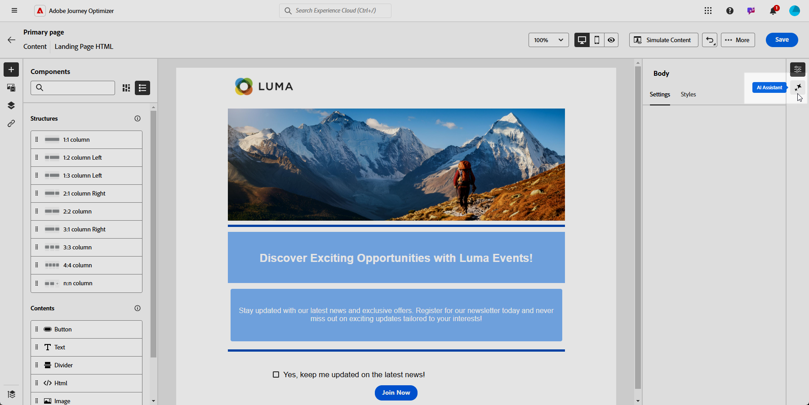{zoomable="yes"}

1. Enable the **[!UICONTROL Use original content]** option for the AI Assistant to personalize new content based on the selected content.

1. Fine tune the content by describing what you want to generate in the **[!UICONTROL Prompt]** field. 

    If you are looking for assistance in crafting your prompt, access the **[!UICONTROL Prompt Library]** which provides a diverse range of prompt ideas to improve your landing page.

    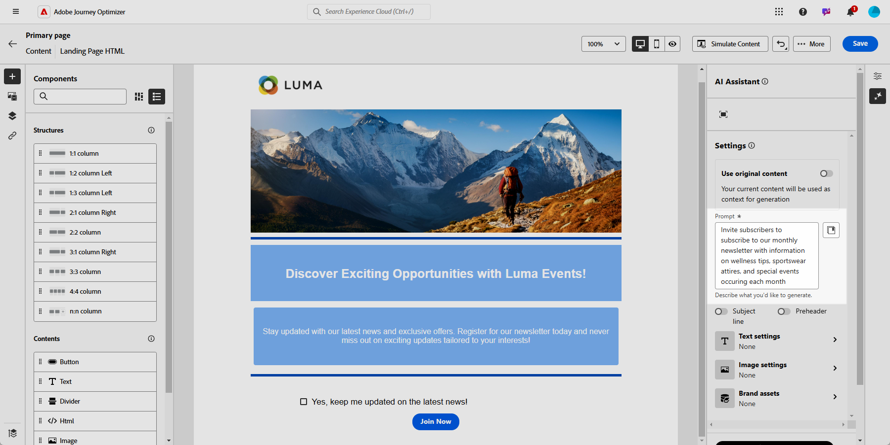{zoomable="yes"}

1. Tailor your prompt with the **[!UICONTROL Text settings]** option:

    * **[!UICONTROL Communication strategy]**: Choose the most suitable communication style for your generated text.
    * **[!UICONTROL Languages]**: Spanish, Italian, Swedish and Norwegian languages options are released as a private beta and will be progressively available to all customers in future releases.
    * **[!UICONTROL Tone]**: The tone of your landing page should resonate with your audience. Whether you want to sound informative, playful, or persuasive, the AI Assistant can adapt the message accordingly.

    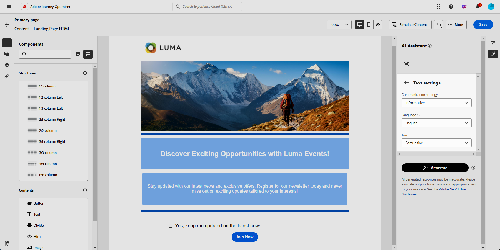{zoomable="yes"}

1. Choose your **[!UICONTROL Image settings]**:

    * **[!UICONTROL Content type]**: This categorizes the nature of the visual element, distinguishing between different forms of visual representation such as photos, graphics, or art.
    * **[!UICONTROL Visual intensity]**: You can control the image's impact by adjusting its intensity. A lower setting (2) will create a softer, more restrained appearance, while a higher setting (10) will make the image more vibrant and visually powerful.
    * **[!UICONTROL Color & tone]**: The overall appearance of the colors within an image and the mood or atmosphere it conveys.
    * **[!UICONTROL Lighting]**: This refers to the lightning present in an image, which shapes its atmosphere and highlights specific elements.
    * **[!UICONTROL Composition]**: This refers to the arrangement of elements within the frame of an image

    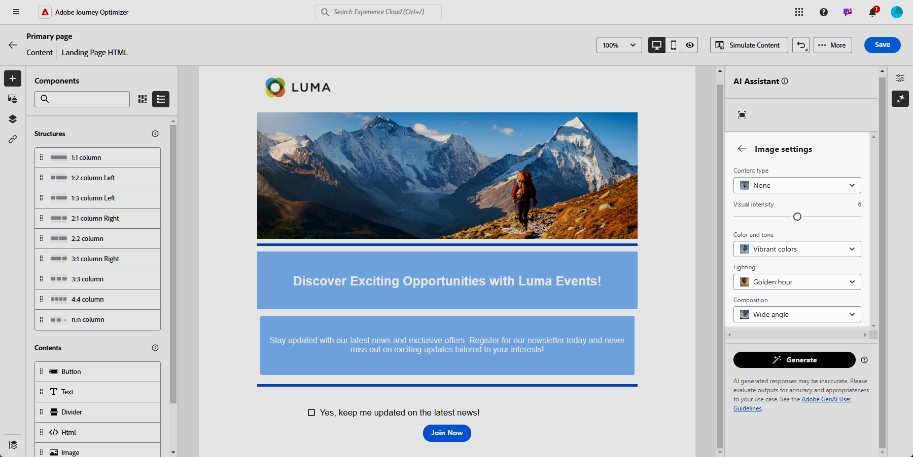{zoomable="yes"}

1. From the **[!UICONTROL Brand assets]** menu, click **[!UICONTROL Upload brand asset]** to add any brand asset which contains content that can provide additional context the AI Assistant or select a previously uploaded one.

    Previously uploaded files are available in the **[!UICONTROL Uploaded brand assets]** drop-down. Simply toggle the assets you wish to include in your generation.

    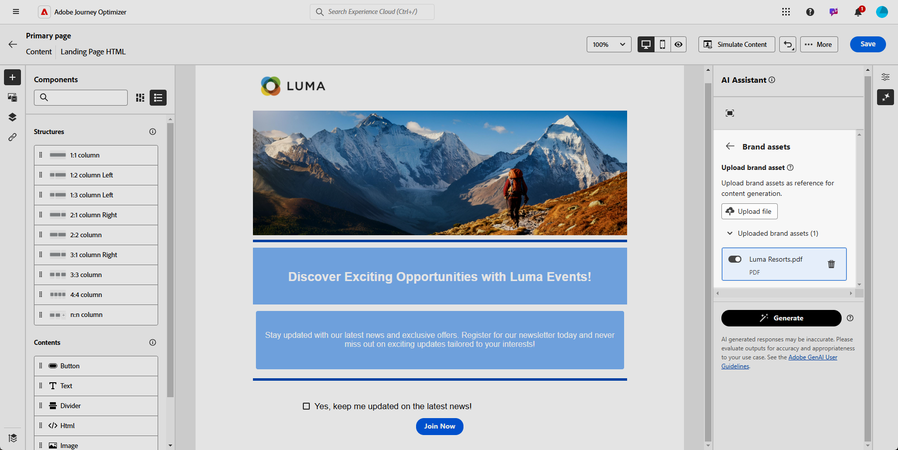{zoomable="yes"}

1. Once your prompt is ready, click **[!UICONTROL Generate]**.

1. Browse through the generated **[!UICONTROL Variations]** and click **[!UICONTROL Preview]** to view a full-screen version of the selected variation.

1. Navigate to the **[!UICONTROL Refine]** option within the **[!UICONTROL Preview]** window to access additional customization features:

    * **[!UICONTROL Rephrase]**: The AI Assistant can rephrase your message in different ways, keeping your writing fresh and engaging for diverse audiences.

    * **[!UICONTROL Use simpler language]**: Leverage the AI Assistant to simplify your language, ensuring clarity and accessibility for a wider audience.
    
    You can also change the **[!UICONTROL Tone]** and **[!UICONTROL Communication strategy]** of your text.

    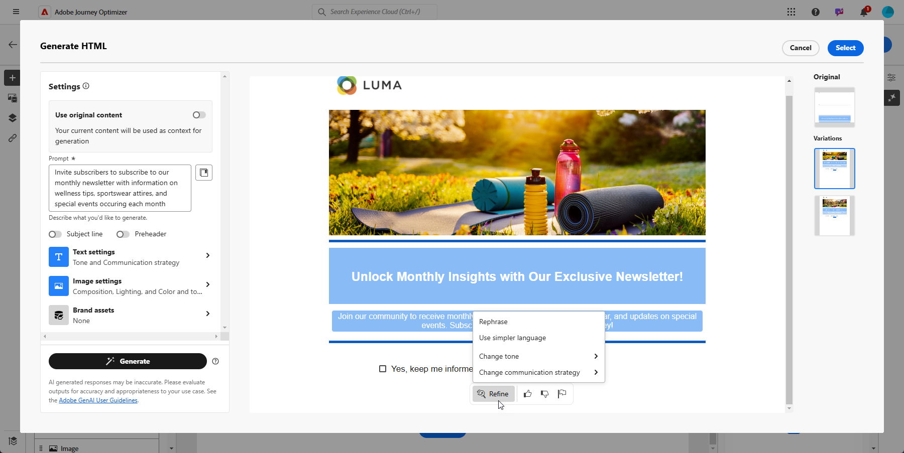{zoomable="yes"}

1. Click **[!UICONTROL Select]** once you found the appropriate content. 

1. Insert personalization fields to customize your landing page content based on profiles data. Then, click the **[!UICONTROL Simulate content]** button to control the rendering, and check personalization settings with test profiles. [Learn more](../personalization/personalize.md)

Once your landing page is ready, you can publish it to make it available for use in a message. [Learn more](../landing-pages/create-lp.md#publish-landing-page)

>[!TAB Text only generation]

In the following example, we will leverage the AI Assistant to enhance the content of our landing page.

1. After creating and configuring your landing page, click **[!UICONTROL Edit content]**.

    For more information on how to configure your landing page, refer to [this page](../landing-pages/create-lp.md).

1. Select a **[!UICONTROL Text component]** to only target a specific content. and access the **[!UICONTROL AI Assistant]** menu.

    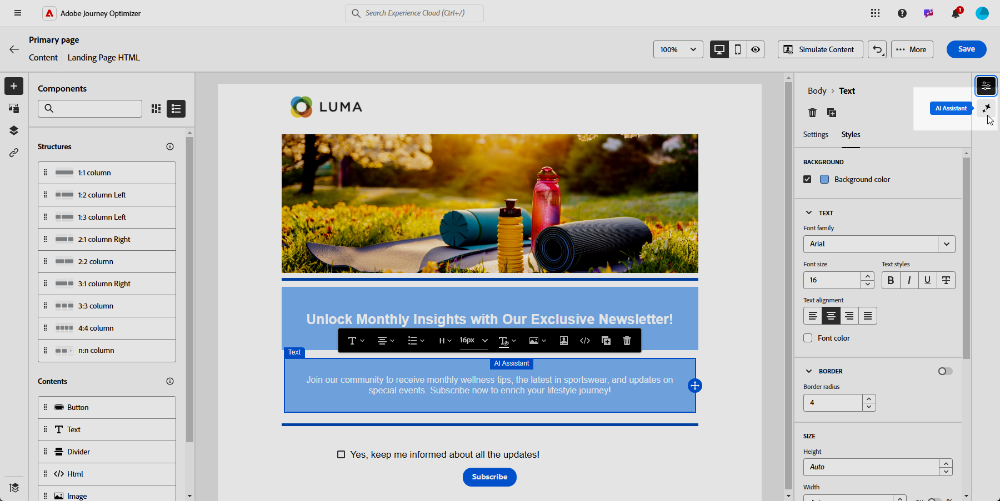{zoomable="yes"}

1. Enable the **[!UICONTROL Use original content]** option for the AI Assistant to personalize new content based on the selected content.

1. Fine tune the content by describing what you want to generate in the **[!UICONTROL Prompt]** field. 

    If you are looking for assistance in crafting your prompt, access the **[!UICONTROL Prompt Library]** which provides a diverse range of prompt ideas to improve your landing pages.

    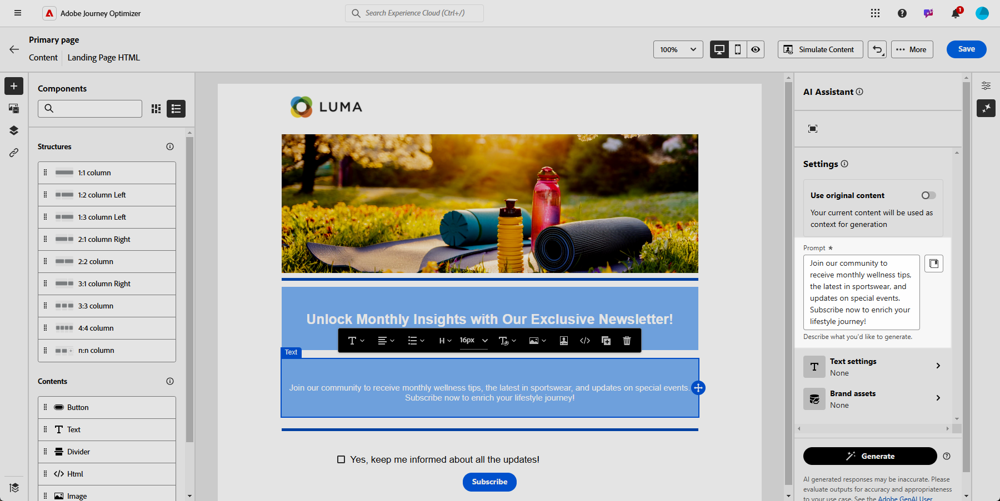{zoomable="yes"}

1. Tailor your prompt with the **[!UICONTROL Text settings]** option:

    * **[!UICONTROL Communication strategy]**: Choose the most suitable communication style for your generated text.
    * **[!UICONTROL Languages]**: Spanish, Italian, Swedish and Norwegian languages options are released as a private beta and will be progressively available to all customers in future releases.
    * **[!UICONTROL Tone]**: The tone of your landing page should resonate with your audience. Whether you want to sound informative, playful, or persuasive, the AI Assistant can adapt the message accordingly.
    * **Text Length**: Use the slider to select the desired length of your text.

    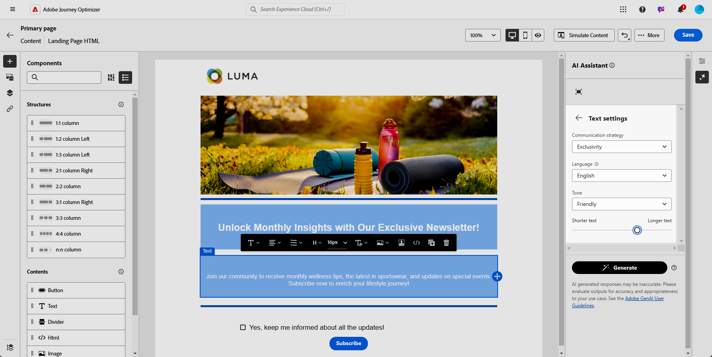{zoomable="yes"} 
    
1. From the **[!UICONTROL Brand assets]** menu, click **[!UICONTROL Upload brand asset]** to add any brand asset which contains content that can provide additional context the AI Assistant or select a previously uploaded one.

    Previously uploaded files are available in the **[!UICONTROL Uploaded brand assets]** drop-down. Simply toggle the assets you wish to include in your generation.

    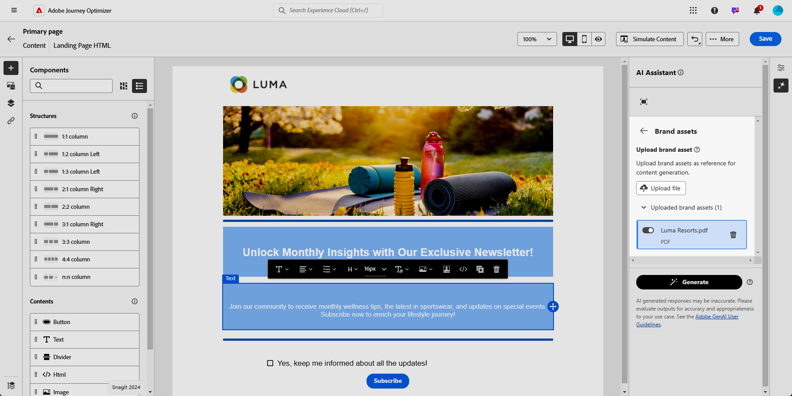{zoomable="yes"}

1. Once your prompt is ready, click **[!UICONTROL Generate]**.

1. Browse through the generated **[!UICONTROL Variations]** and click **[!UICONTROL Preview]** to view a full-screen version of the selected variation.

1. Navigate to the **[!UICONTROL Refine]** option within the **[!UICONTROL Preview]** window to access additional customization features:

    * **[!UICONTROL Use as reference content]**: The chosen variant will serve as the reference content for generating other results.

    * **[!UICONTROL Elaborate]**: The AI Assistant can help you expand on specific topics, providing additional details for better understanding and engagement.

    * **[!UICONTROL Summarize]**: Lengthy information can overload landing page recipients. Use the AI Assistant to condense key points into clear, concise summaries that grab attention and encourage them to read further.

    * **[!UICONTROL Rephrase]**:The AI Assistant can rephrase your message in different ways, keeping your writing fresh and engaging for diverse audiences.

    * **[!UICONTROL Use simpler language]**: Leverage the AI Assistant to simplify your language, ensuring clarity and accessibility for a wider audience.

    You can also change the **[!UICONTROL Tone]** and **[!UICONTROL Communication strategy]** of your text.

    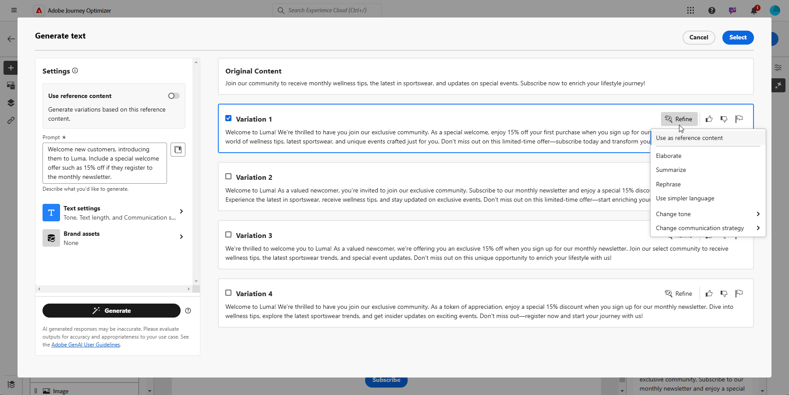{zoomable="yes"}

1. Click **[!UICONTROL Select]** once you found the appropriate content.

1. Insert personalization fields to customize your landing page content based on profiles data. Then, click the **[!UICONTROL Simulate content]** button to control the rendering, and check personalization settings with test profiles. [Learn more](../personalization/personalize.md)

Once your landing page is ready, you can publish it to make it available for use in a message. [Learn more](../landing-pages/create-lp.md#publish-landing-page)

>[!TAB Image only generation]

In the example below, learn how to leverage the AI Assistant to optimize and improve your assets, ensuring a more user-friendly experience. 

1. After creating and configuring your landing page, click **[!UICONTROL Edit content]**.

    For more information on how to configure your landing page, refer to [this page](../landing-pages/create-lp.md).

1. Select the asset you want to change with the AI Assistant.

1. From the right-hand menu, select **[!UICONTROL AI Assistant]**.

    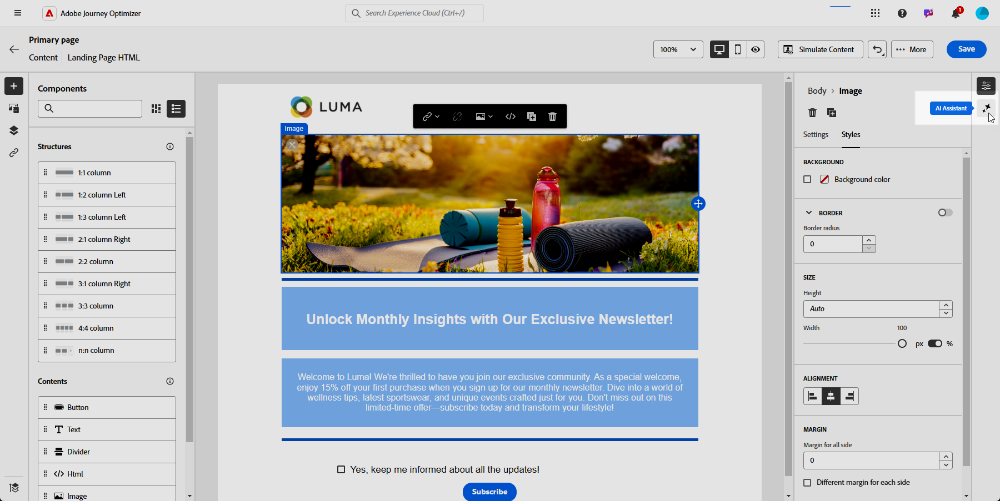{zoomable="yes"}

1. Enable the **[!UICONTROL Reference style]** option for the AI Assistant to personalize new content based on the reference content. You can also upload an image to add context to your variation.

1. Fine tune the content by describing what you want to generate in the **[!UICONTROL Prompt]** field. 

    If you are looking for assistance in crafting your prompt, access the **[!UICONTROL Prompt Library]** which provides a diverse range of prompt ideas to improve your landing pages.

    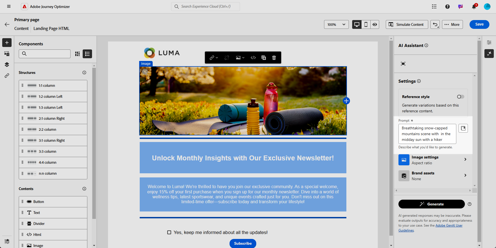{zoomable="yes"}

1. Tailor your prompt with the **[!UICONTROL Image settings]** option:

    * **[!UICONTROL Aspect ratio]**: This determines the width and height of the asset. You have the option to choose from common ratios such as 16:9, 4:3, 3:2, or 1:1, or you can enter a custom size.
    * **[!UICONTROL Content type]**: This categorizes the nature of the visual element, distinguishing between different forms of visual representation such as photos, graphics, or art.
    * **[!UICONTROL Visual intensity]**: You can control the image's impact by adjusting its intensity. A lower setting (2) will create a softer, more restrained appearance, while a higher setting (10) will make the image more vibrant and visually powerful.
    * **[!UICONTROL Color & tone]**: The overall appearance of the colors within an image and the mood or atmosphere it conveys.
    * **[!UICONTROL Lighting]**: This refers to the lightning present in an image, which shapes its atmosphere and highlights specific elements.
    * **[!UICONTROL Composition]**: This refers to the arrangement of elements within the frame of an image

    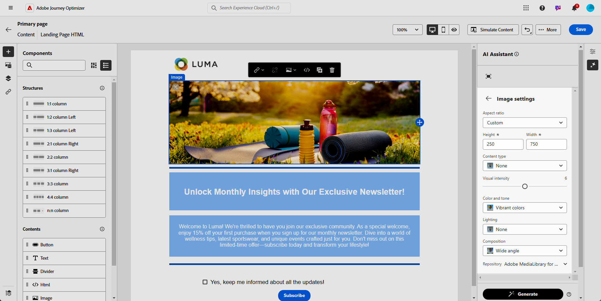{zoomable="yes"}

1. From the **[!UICONTROL Brand assets]** menu, click **[!UICONTROL Upload brand asset]** to add any brand asset which contains content that can provide additional context the AI Assistant or select a previously uploaded one.

    Previously uploaded files are available in the **[!UICONTROL Uploaded brand assets]** drop-down. Simply toggle the assets you wish to include in your generation.

1. Once you are satisfied with your prompt configuration, click **[!UICONTROL Generate]**.

1. Browse the **[!UICONTROL Variation suggestions]** to find the desired Asset.

    Click **[!UICONTROL Preview]** to view a full-screen version of the selected variation.

1. Choose **[!UICONTROL Generate Similar]** if you want to view related images to this variant.

    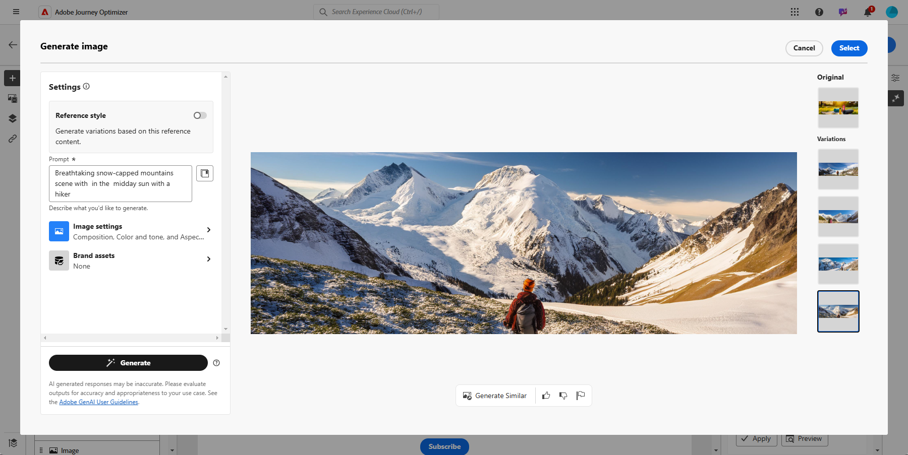{zoomable="yes"}

1. Click **[!UICONTROL Select]** once you found the appropriate content.

1. After defining your message content, click the **[!UICONTROL Simulate content]** button to control the rendering, and check personalization settings with test profiles. [Learn more](../personalization/personalize.md)

Once your landing page is ready, you can publish it to make it available for use in a message. [Learn more](../landing-pages/create-lp.md#publish-landing-page)

>[!ENDTABS]
