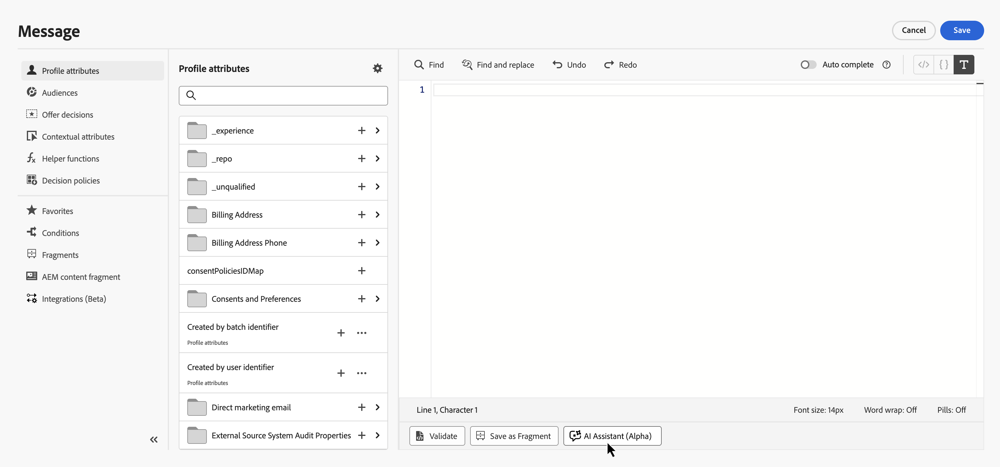
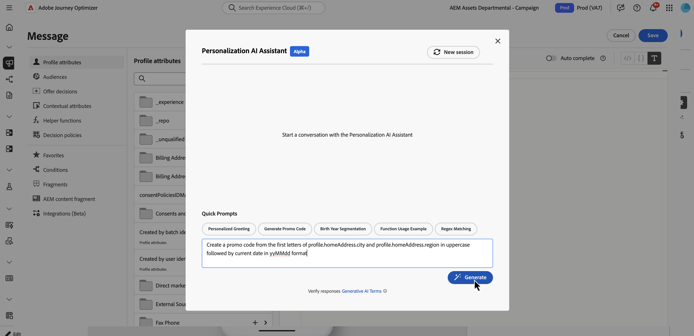
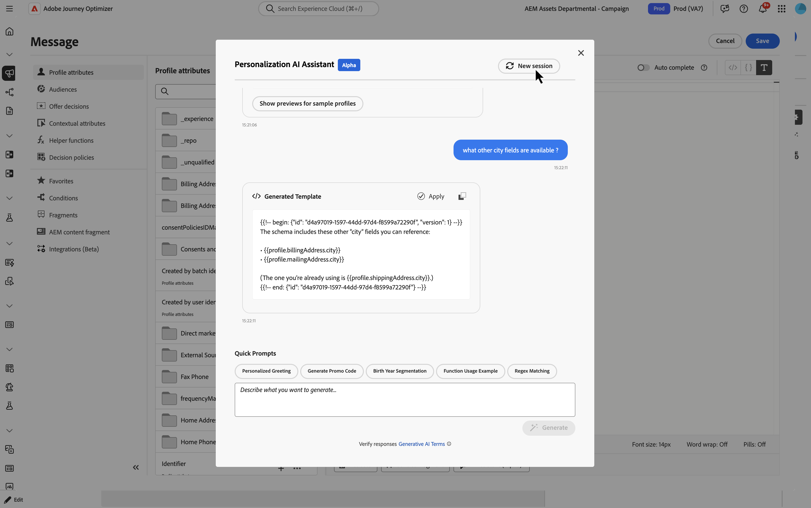
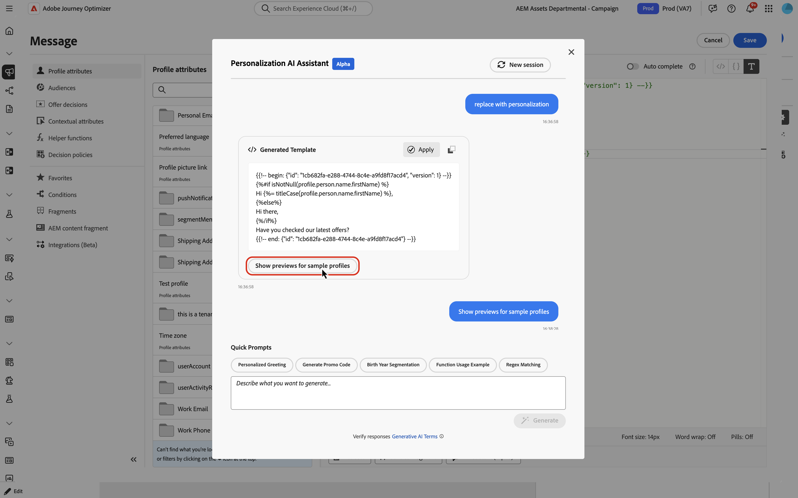
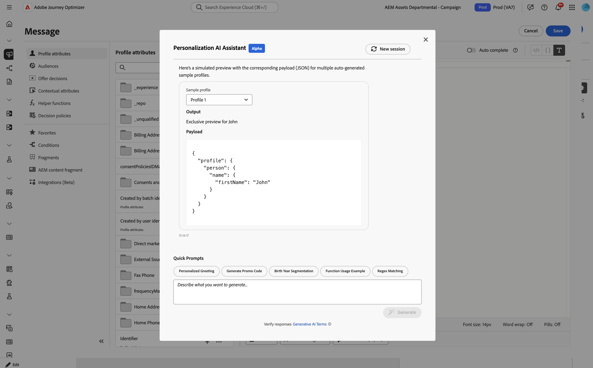
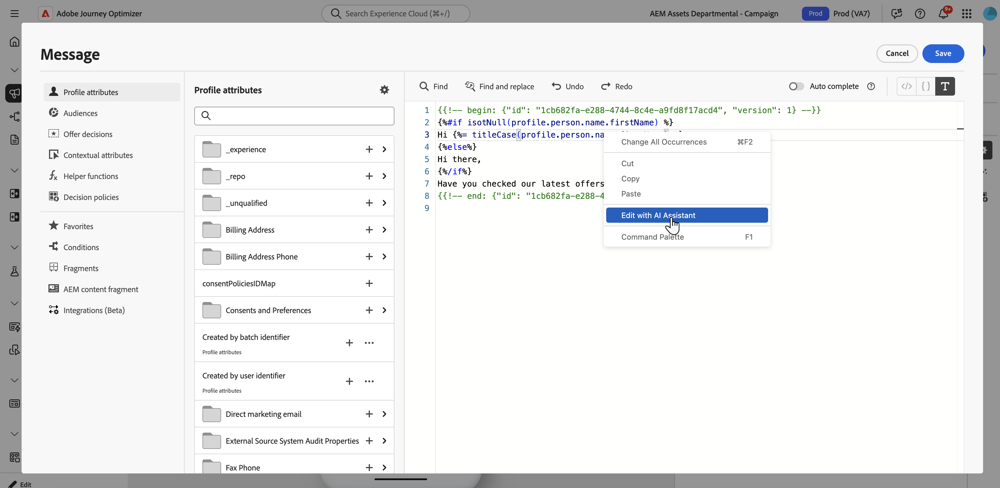
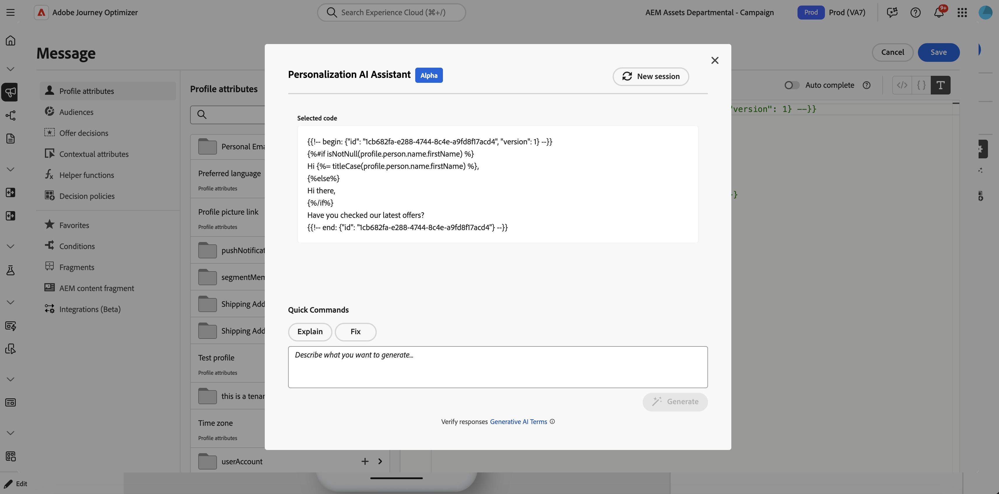
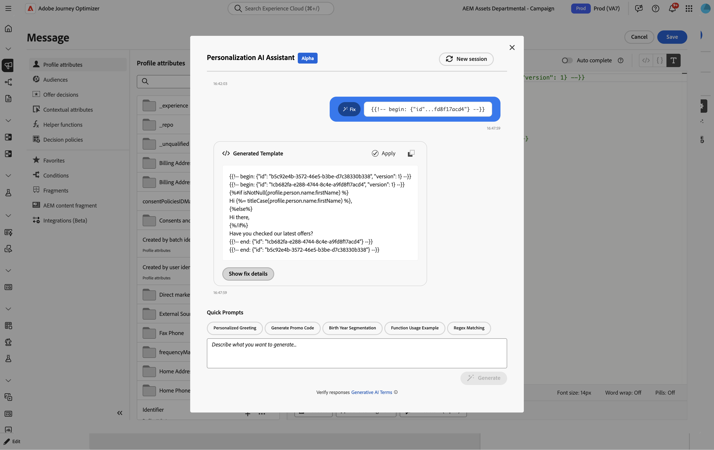

# AI Assistant for Personalization Expressions{#generative-personalization-expressions}

>[!IMPORTANT]
>
>Before starting using this capability, read out related [Guardrails and Limitations](gs-generative.md#generative-guardrails).
> 
>
>You must agree to a [user agreement](https://www.adobe.com/legal/licenses-terms/adobe-dx-gen-ai-user-guidelines.html) before you can use AI Assistant in Journey Optimizer. For more information, contact your Adobe representative.

## Overview {#where-available}

In the [!UICONTROL Personalization Editor], [!UICONTROL AI Assistant] helps you generate new personalization from plain language, explain what existing expressions do, and fix issues in selected code, so that you spend less time on syntax and manual field discovery. You can also iterate on a selection or ask for other changes in conversation.

* For broader AI Assistant setup and languages, see [Get started with AI Assistant](gs-generative.md).
* For more information on personalization in [!DNL Journey Optimizer], see [Get started with personalization](../personalization/personalize.md).
* For prompt ideas, see [AI prompt best practices](ai-assistant-prompting-guide.md).

You use [!UICONTROL AI Assistant] in the [!UICONTROL Personalization Editor] wherever that editor is available — for example in the subject line, body, and other fields that open it. For where and how to open the editor, see [Add personalization](../personalization/personalization-build-expressions.md#where).

Depending on your campaign or journey context, the assistant can work with data and constructs the [!UICONTROL Personalization Editor] already exposes — for example profile attributes, segment membership, helper functions, and related personalization sources.

>[!NOTE]
>
>The assistant keeps context from your prompts only while [!UICONTROL AI Assistant] stays open in that editor session. If you close the assistant or the [!UICONTROL Personalization Editor], the conversation is not saved; the next time you open the assistant, you start a new conversation.

## Generate personalization expressions {#generate}

These steps cover generating personalization expressions from scratch. To work with code already in the editor, see [Edit, fix or explain existing code](#edit-existing).

1. In your message or content, open the **[!UICONTROL Personalization Editor]**.

1. Place your cursor in the editor where you want generated personalization code to be inserted, then click the **[!UICONTROL AI Assistant]** button.

    

1. In the text field, describe the personalization expression you want in plain language — for example which profile attributes, segments, or logic you need, then click **[!UICONTROL Generate]**.

    You can also use ready-to-use prompts from the **[!UICONTROL Quick Prompts]** section, such as personalized greeting, promo code generation, and more.

    

1. You can keep discussing with the assistant in a multi-turn conversation: it keeps context from your prompts so you can refine the same expression step by step. To start over, click the **[!UICONTROL New session]** button.

    

1. After you generate an expression, click **[!UICONTROL Show previews for sample profiles]** to see how the expression evaluates with sample data and to view the associated payload as JSON. For this check, the assistant generates a limited set of synthetic sample profiles; they are not saved or stored in your organization.

    If you need more sample profiles, type **Preview** in the discussion with the assistant so it can generate additional preview profiles.

    

    +++Preview example

    

    +++

    >[!NOTE]
    >
    >This control is for a quick check of your personalization code in the editor — not a full message preview of your content. For complete validation of the experience, use your usual simulation flow. [Learn how to preview & test your content](../content-management/preview-test.md)

1. To implement the output in your personalization expression, click **[!UICONTROL Apply]**. The assistant output is inserted at the cursor location in the personalization editor. To replace code that is already there instead, select that code in the editor first, then use **[!UICONTROL Edit with AI Assistant]** (see [Edit, fix or explain existing code](#edit-existing)).

    You can also copy the output and paste it where you need it using the  icon.

## Edit, fix or explain existing code {#edit-existing}

You can select an existing personalization expression and use AI Assistant to fix personalization issues, explain what the code does, or ask for other changes.

1. Select existing personalization code in the editor.

1. Right-click the selection and choose **[!UICONTROL Edit with AI Assistant]** so the assistant uses your selection as context.

    

1. **[!UICONTROL AI Assistant]** opens. In **[!UICONTROL Quick Commands]**, click **[!UICONTROL Explain]** or **[!UICONTROL Fix]**, or use the text field to ask for other changes and start a conversation.

    

1. When you use **[!UICONTROL Fix]**, click **[!UICONTROL Show fix details]** in the discussion to show an explanation of the fix and a line-by-line before and after preview.

    

1. As when you generate a personalization expression, click **[!UICONTROL Apply]** to implement the assistant output. It replaces the code you had selected in the personalization editor. For example, if you asked for an explanation of the code, applying will add comments in the expression that describe what it does.
