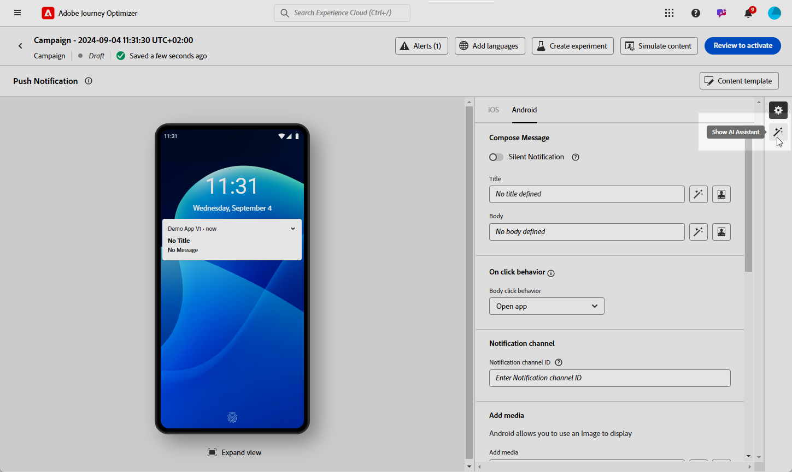
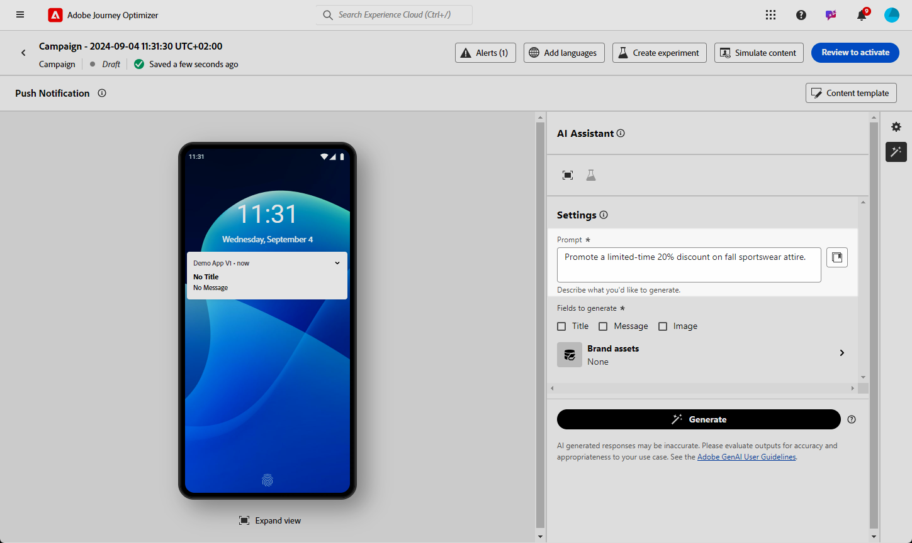
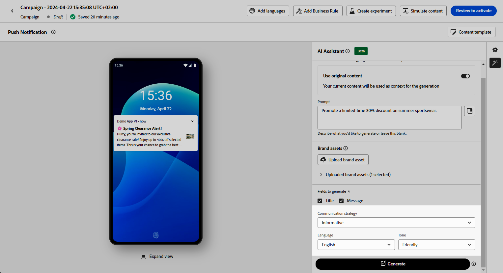
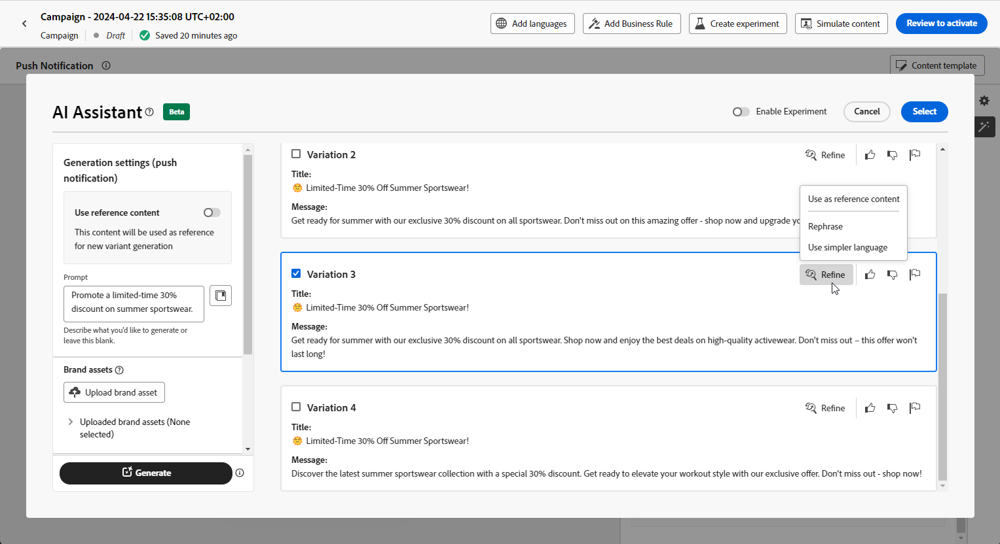
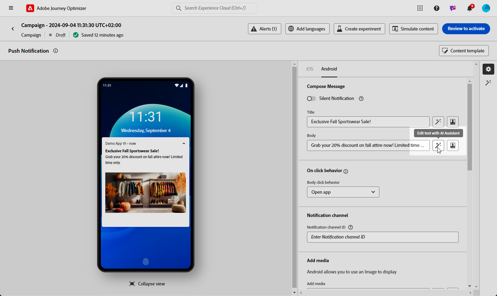
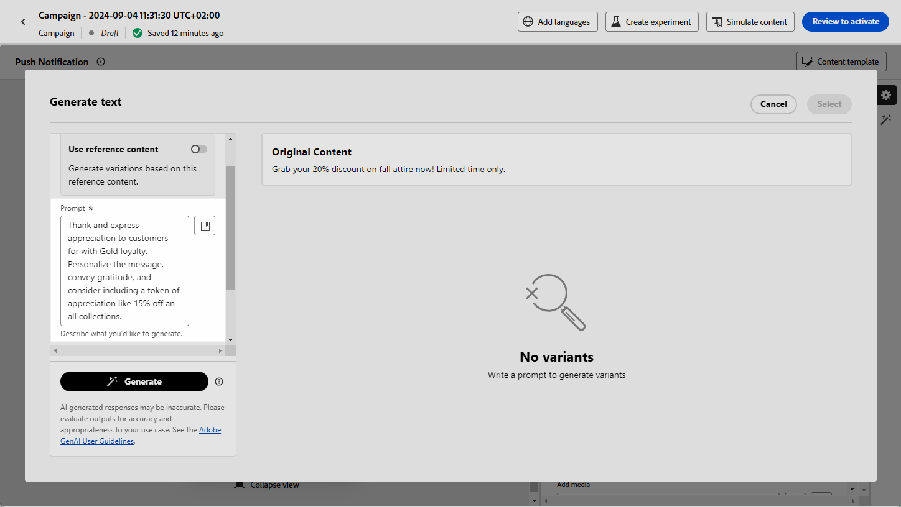
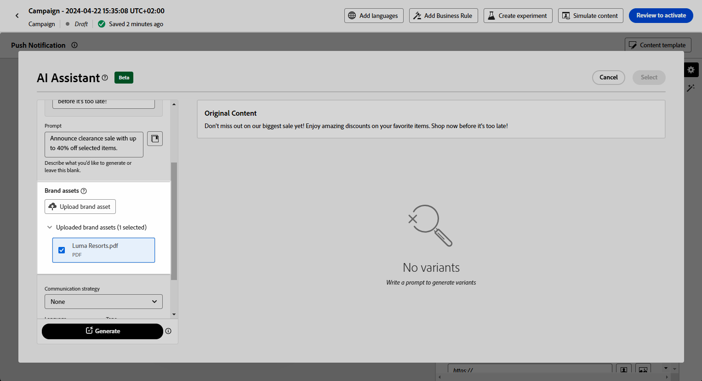
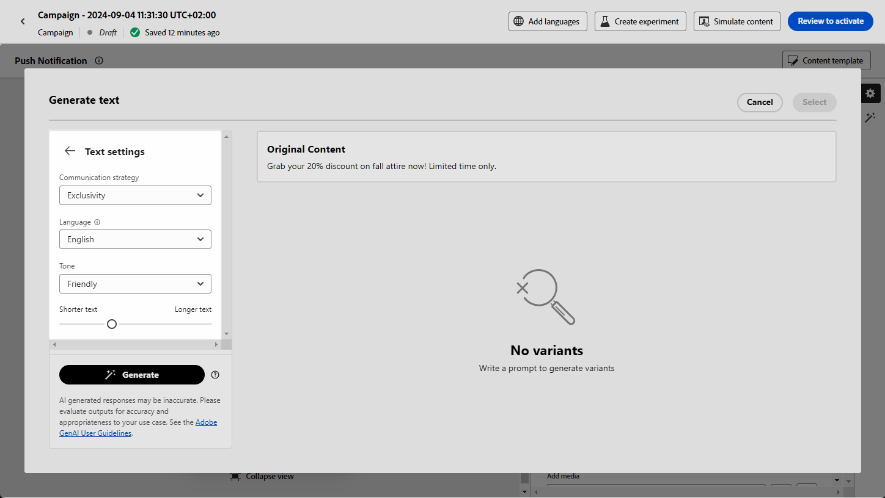
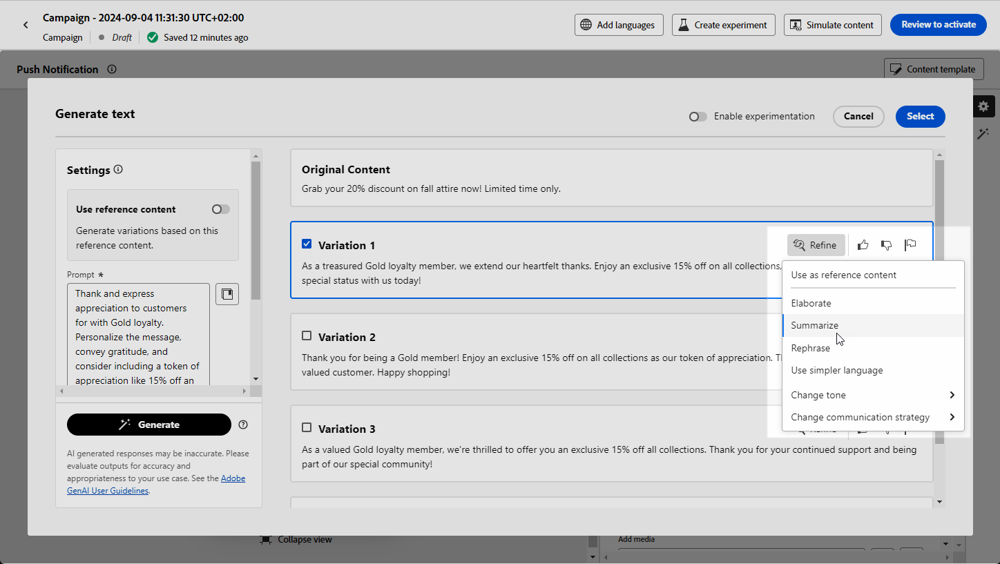

# Push generation with the AI Assistant {#generative-push}

>[!BEGINSHADEBOX]

**Table of content**

* [Get started with the AI Assistant](gs-generative.md)
* [Email generation with the AI Assistant](generative-email.md)
* [SMS generation with the AI Assistant](generative-sms.md)
* **[Push generation with the AI Assistant](generative-push.md)**
* [Content experiment with the AI Assistant](generative-experimentation.md)

>[!ENDSHADEBOX]

>[!NOTE]
>
>Before starting using this capability, read out related [Guardrails and Limitations](gs-generative.md#generative-guardrails).

Once you have created and personalized your messages, take your push notification content to the next level with Journey Optimizer AI Assistant.

Explore the tabs below to learn how to use the AI Assistant in Journey Optimizer.

>[!BEGINTABS]

>[!TAB Full push generation]

In this particular example, learn how to send an engaging Push notification using AI Assistant.

Follow these steps:

1. After creating and configuring your push notification campaign, click **[!UICONTROL Edit content]**.

    For more information on how to configure your push notification campaign, refer to [this page](../push/create-push.md).

1. Fill in the **[!UICONTROL Basic details]** for your campaign. Once done, click **[!UICONTROL Edit content]**.

1. Personalize your push notification as needed. [Learn more](../push/design-push.md)

1. Access the **[!UICONTROL Show AI Assistant]** menu.

    {zoomable="yes"}

1. Enable the **[!UICONTROL Use original content]** option for the AI Assistant to personalize new content based on your campaign content, name, and selected audience.
    
    Your prompt must always be tied to a specific context.

1. Fine tune the content by describing what you want to generate in the **[!UICONTROL Prompt]** field. 

    If you are looking for assistance in crafting your prompt, access the **[!UICONTROL Prompt Library]** which provides a diverse range of prompt ideas to improve your campaigns.
    
    {zoomable="yes"}

1. Select **[!UICONTROL Upload brand asset]** to add any brand asset which contains content that can provide additional context the AI Assistant.

1. Choose which field you want to generate: **[!UICONTROL Title]** and/or **[!UICONTROL Message]**.

1. Tailor your prompt with the different options:

    * **[!UICONTROL Communication strategy]**: Choose the most suitable communication style for your generated text.
    * **[!UICONTROL Language]**: Select the language in which you want your content to be generated.
    * **[!UICONTROL Tone]**: The tone of your email should resonate with your audience. Whether you want to sound informative, playful, or persuasive, the AI Assistant can adapt the message accordingly.

    {zoomable="yes"}  

1. Once your prompt is ready, click **[!UICONTROL Generate]**.

1. Browse through the generated **[!UICONTROL Variations]** and click **[!UICONTROL Preview]** to view a full-screen version of the selected variation.

1. Navigate to the **[!UICONTROL Refine]** option within the **[!UICONTROL Preview]** window to access additional customization features:

    * **[!UICONTROL Use as reference content]**: The chosen variant will serve as the reference content for generating other results.

    * **[!UICONTROL Rephrase]**: The AI Assistant can rephrase your message in different ways, keeping your writing fresh and engaging for diverse audiences.

    * **[!UICONTROL Use simple Language]**: Leverage the AI Assistant to simplify your language, ensuring clarity and accessibility for a wider audience.

    {zoomable="yes"}

1. Click **[!UICONTROL Select]** once you found the appropriate content.

    You can also enable experiment for your content. [Learn more](generative-experimentation.md)

1. Insert personalization fields to customize your email content based on profiles data. Then, click the **[!UICONTROL Simulate content]** button to control the rendering, and check personalization settings with test profiles. [Learn more](../personalization/personalize.md)

When you have defined your content, audience and schedule, you are ready to prepare your push campaign. [Learn more](../campaigns/review-activate-campaign.md)

>[!TAB Text generation]

In this particular example, learn how to use the AI Assistant for specific content. Follow these steps:

1. After creating and configuring your push notification campaign, click **[!UICONTROL Edit content]**.

    For more information on how to configure your push campaign, refer to [this page](../push/create-push.md).

1. Fill in the **[!UICONTROL Basic details]** for your campaign. Once done, click **[!UICONTROL Edit content]**.

1. Personalize your push notification as needed. [Learn more](../push/design-push.md)

1. Access the **[!UICONTROL Show AI Assistant]** menu next to your **[!UICONTROL Title]** or **[!UICONTROL Message]** fields.

    {zoomable="yes"}

1. Enable the **[!UICONTROL Use reference content]** option for the AI Assistant to personalize new content based on your campaign content, name, and selected audience.
    
    Your prompt must always be tied to a specific context.

1. Fine tune the content by describing what you want to generate in the **[!UICONTROL Prompt]** field. 

    If you are looking for assistance in crafting your prompt, access the **[!UICONTROL Prompt Library]** which provides a diverse range of prompt ideas to improve your campaigns.
    
    {zoomable="yes"}

1. Select **[!UICONTROL Upload brand asset]** to add any brand asset which contains content that can provide additional context the AI Assistant.

    {zoomable="yes"}

1. Tailor your prompt with the different options:

    * **[!UICONTROL Communication strategy]**: Choose the most suitable communication style for your generated text.
    * **[!UICONTROL Language]**: Select the language in which you want your content to be generated.
    * **[!UICONTROL Tone]**: The tone of your email should resonate with your audience. Whether you want to sound informative, playful, or persuasive, the AI Assistant can adapt the message accordingly.
    * **[!UICONTROL Length]**: Select the length of your content using the range slider. 

    {zoomable="yes"}  

1. Once your prompt is ready, click **[!UICONTROL Generate]**.

1. Browse through the generated **[!UICONTROL Variations]** and click **[!UICONTROL Preview]** to view a full-screen version of the selected variation.

1. Navigate to the **[!UICONTROL Refine]** option within the **[!UICONTROL Preview]** window to access additional customization features:

    * **[!UICONTROL Use as reference content]**: The chosen variant will serve as the reference content for generating other results.

    * **[!UICONTROL Elaborate]**: The AI Assistant can help you expand on specific topics, providing additional details for better understanding and engagement.

    * **[!UICONTROL Summarize]**: Lengthy information can overload email recipients. Use the AI Assistant to condense key points into clear, concise summaries that grab attention and encourage them to read further.

    * **[!UICONTROL Rephrase]**:The AI Assistant can rephrase your message in different ways, keeping your writing fresh and engaging for diverse audiences.

    * **[!UICONTROL Use simpler language]**: Leverage the AI Assistant to simplify your language, ensuring clarity and accessibility for a wider audience.

    {zoomable="yes"}

1. Click **[!UICONTROL Select]** once you found the appropriate content.

    You can also enable experiment for your content. [Learn more](generative-experimentation.md)

1. Insert personalization fields to customize your email content based on profiles data. Then, click the **[!UICONTROL Simulate content]** button to control the rendering, and check personalization settings with test profiles. [Learn more](../personalization/personalize.md)

When you have defined your content, audience and schedule, you are ready to prepare your push campaign. [Learn more](../campaigns/review-activate-campaign.md)

>[!ENDTABS]
