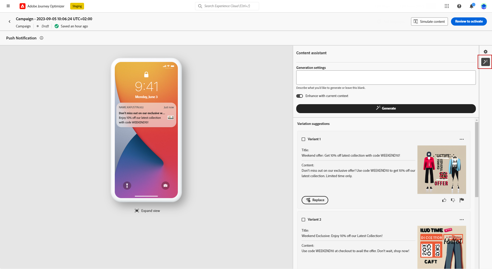

# Push generation with the AI Assistant {#generative-push}

>[!BEGINSHADEBOX]

**Table of content**

* [Email generation with the AI Assistant](generative-email.md)
* [SMS generation with the AI Assistant](generative-SMS.md)
* **[Push generation with the AI Assistant](generative-push.md)**
* [Web page generation with the AI Assistant](generative-web.md)
* [Content experiment with the AI Assistant](generative-experimentation.md)

>[!ENDSHADEBOX]

Once you have created and personalized your messages, take your content to the next level with Journey Optimizer AI Assistant.

In this particular example, learn how to send an engaging Push notification using AI Assistant. Follow these steps:

1. After creating and configuring your Push notification campaign, click **[!UICONTROL Create content]**.

1. Use the AI Assistant to change the **[!UICONTROL Title]**.

    Next to your **[!UICONTROL Header]** field, click **[!UICONTROL Edit with Text generation assistant]**.

    

1. From the **[!UICONTROL User action]** menu, select the **[!UICONTROL Text refinement]**:

    * **[!UICONTROL Summarize]**: Use this option to shorten a text and keep the essential.
    
    * **[!UICONTROL Elaborate]**: Use this option to expand your content with additional creative variants from the AI Assistant.

    

1. Choose the tone of your variants with the **[!UICONTROL Change tone of voice]** menu.

1. From the **[!UICONTROL Free form]** menu, you can also choose to provide a prompt to better fine-tune your results.

    

1. Once you found the appropriate variant, click **[!UICONTROL User variant]** then **[!UICONTROL Apply]**.

    

1. After personalizing the **[!UICONTROL Body]** of your push notification, select **[!UICONTROL Show AI Assistant]**. 

    Here, a list of variations is already available using your original content.

    

1. Fine tune the content by describing what you want to generate. 
    
    Enable the **[!UICONTROL Enhance with current content]** option for the AI Assistant to personalize new content based on your message, campaign's name, and selected audience.
!
1. Click **[!UICONTROL Replace]** to change your content.

    You can select multiple **[!UICONTROL Variant]** to create **[!UICONTROL Treatments]** for your Experimentation. [Learn more](generative-experimentation.md)

    

1. After defining your message content, click the **[!UICONTROL Simulate content]** button to control the rendering, and check personalization settings with test profiles. [Learn more](../content-management/preview-test.md)

1. When your content is ready, from your campaign summary page, you can click **[!UICONTROL Review to activate]** to display a summary of the campaign. Alerts display if any parameter is incorrect or missing.

1. Before launching your campaign, double-check that all configurations are correct, and then click on **[!UICONTROL Activate]**.

After successfully configuring and personalizing your campaign, you can track your campaign in the campaign report. [Learn more](../reports/campaign-global-report.md)
