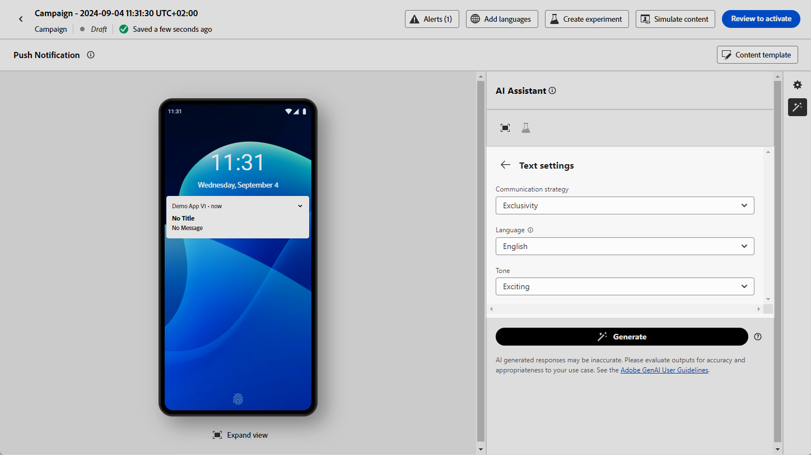
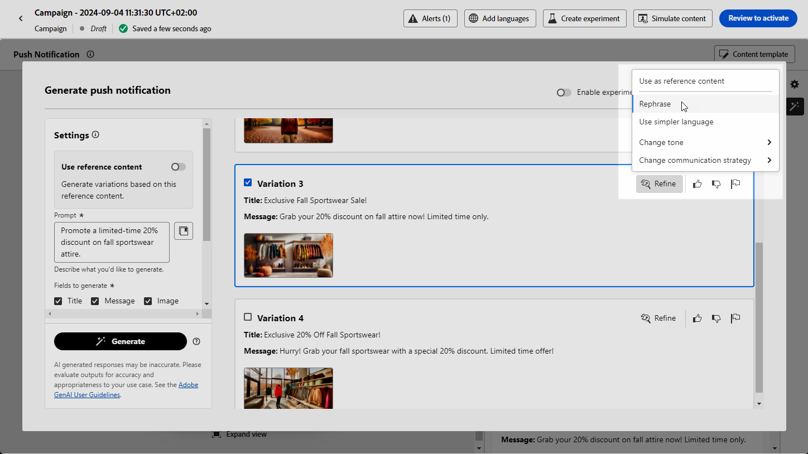

# Push generation with the AI Assistant {#generative-push}

>[!IMPORTANT]
>
>Before starting using this capability, read out related [Guardrails and Limitations](gs-generative.md#generative-guardrails).
> 
>
>You must agree to a [user agreement](https://www.adobe.com/legal/licenses-terms/adobe-dx-gen-ai-user-guidelines.html) before you can use the AI Assistant in Journey Optimizer. For more information, contact your Adobe representative.

Once you have created and personalized your messages, take your push notification content to the next level with the AI Assistant in Journey Optimizer.

Explore the tabs below to learn how to use the AI Assistant in Journey Optimizer.

>[!BEGINTABS]

>[!TAB Full push generation]

In this particular example, learn how to send an engaging Push notification using AI Assistant in Journey Optimizer.

Follow these steps:

1. After creating and configuring your push notification campaign, click **[!UICONTROL Edit content]**.

    For more information on how to configure your push notification campaign, refer to [this page](../push/create-push.md).

1. Fill in the **[!UICONTROL Basic details]** for your campaign. Once done, click **[!UICONTROL Edit content]**.

1. Personalize your push notification as needed. [Learn more](../push/design-push.md)

1. Access the **[!UICONTROL Show AI Assistant]** menu.

    {zoomable="yes"}

1. Enable the **[!UICONTROL Use original content]** option for the AI Assistant to personalize new content option based on the selected content.

1. Fine tune the content by describing what you want to generate in the **[!UICONTROL Prompt]** field. 

    If you are looking for assistance in crafting your prompt, access the **[!UICONTROL Prompt Library]** which provides a diverse range of prompt ideas to improve your campaigns.
    
    {zoomable="yes"}

1. Choose which field you want to generate: **[!UICONTROL Title]**, **[!UICONTROL Message]** and/or **[!UICONTROL Image]**.

1. Tailor your prompt with the **[!UICONTROL Text settings]** option:

    * **[!UICONTROL Communication strategy]**: Choose the most suitable communication style for your generated text.
    * **[!UICONTROL Languages]**: Spanish, Italian, Swedish and Norwegian languages options are released as a private beta and will be progressively available to all customers in future releases.
    * **[!UICONTROL Tone]**: The tone of your push notifications should resonate with your audience. Whether you want to sound informative, playful, or persuasive, the AI Assistant can adapt the message accordingly.

    {zoomable="yes"} 

1. Choose your **[!UICONTROL Image settings]**:

    * **[!UICONTROL Content type]**: This categorizes the nature of the visual element, distinguishing between different forms of visual representation such as photos, graphics, or art.
    * **[!UICONTROL Visual intensity]**: You can control the image's impact by adjusting its intensity. A lower setting (2) will create a softer, more restrained appearance, while a higher setting (10) will make the image more vibrant and visually powerful.
    * **[!UICONTROL Color & tone]**: The overall appearance of the colors within an image and the mood or atmosphere it conveys.
    * **[!UICONTROL Lighting]**: This refers to the lightning present in an image, which shapes its atmosphere and highlights specific elements.
    * **[!UICONTROL Composition]**: This refers to the arrangement of elements within the frame of an image

    {zoomable="yes"} 

1. From the **[!UICONTROL Brand assets]** menu, click **[!UICONTROL Upload brand asset]** to add any brand asset which contains content that can provide additional context the AI Assistant or select a previously uploaded one.

    Previously uploaded files are available in the **[!UICONTROL Uploaded brand assets]** drop-down. Simply toggle the assets you wish to include in your generation.

1. Once your prompt is ready, click **[!UICONTROL Generate]**.

1. Browse through the generated **[!UICONTROL Variations]** and click **[!UICONTROL Preview]** to view a full-screen version of the selected variation.

1. Navigate to the **[!UICONTROL Refine]** option within the **[!UICONTROL Preview]** window to access additional customization features:

    * **[!UICONTROL Use as reference content]**: The chosen variant will serve as the reference content for generating other results.

    * **[!UICONTROL Rephrase]**: The AI Assistant can rephrase your message in different ways, keeping your writing fresh and engaging for diverse audiences.

    * **[!UICONTROL Use simpler language]**: Leverage the AI Assistant to simplify your language, ensuring clarity and accessibility for a wider audience.

    You can also change the **[!UICONTROL Tone]** and **[!UICONTROL Communication strategy]** of your text.

    {zoomable="yes"}

1. Click **[!UICONTROL Select]** once you found the appropriate content.

    You can also enable experiment for your content. [Learn more](generative-experimentation.md)

1. Insert personalization fields to customize your push notification content based on profiles data. Then, click the **[!UICONTROL Simulate content]** button to control the rendering, and check personalization settings with test profiles. [Learn more](../personalization/personalize.md)

When you have defined your content, audience and schedule, you are ready to prepare your push campaign. [Learn more](../campaigns/review-activate-campaign.md)

>[!TAB Text only generation]

In this particular example, learn how to use the AI Assistant in Journey Optimizer for specific content. Follow these steps:

1. After creating and configuring your push notification campaign, click **[!UICONTROL Edit content]**.

    For more information on how to configure your push campaign, refer to [this page](../push/create-push.md).

1. Fill in the **[!UICONTROL Basic details]** for your campaign. Once done, click **[!UICONTROL Edit content]**.

1. Personalize your push notification as needed. [Learn more](../push/design-push.md)

1. Access the **[!UICONTROL Edit text with AI Assistant]** menu next to your **[!UICONTROL Title]** or **[!UICONTROL Message]** fields.

    {zoomable="yes"}

1. Enable the **[!UICONTROL Use reference content]** option for the AI Assistant to personalize new content based on the selected content.

1. Fine tune the content by describing what you want to generate in the **[!UICONTROL Prompt]** field. 

    If you are looking for assistance in crafting your prompt, access the **[!UICONTROL Prompt Library]** which provides a diverse range of prompt ideas to improve your campaigns.
    
    {zoomable="yes"}

1. Tailor your prompt with the **[!UICONTROL Text settings]** option:

    * **[!UICONTROL Communication strategy]**: Choose the most suitable communication style for your generated text.
    * **[!UICONTROL Languages]**: Spanish, Italian, Swedish and Norwegian languages options are released as a private beta and will be progressively available to all customers in future releases.
    * **[!UICONTROL Tone]**: The tone of your push notification should resonate with your audience. Whether you want to sound informative, playful, or persuasive, the AI Assistant can adapt the message accordingly.
    * **[!UICONTROL Length]**: Select the length of your content using the range slider. 

    {zoomable="yes"}

1. From the **[!UICONTROL Brand assets]** menu, click **[!UICONTROL Upload brand asset]** to add any brand asset which contains content that can provide additional context the AI Assistant or select a previously uploaded one.

    Previously uploaded files are available in the **[!UICONTROL Uploaded brand assets]** drop-down. Simply toggle the assets you wish to include in your generation.

1. Once your prompt is ready, click **[!UICONTROL Generate]**.

1. Navigate to the **[!UICONTROL Refine]** option within the **[!UICONTROL Preview]** window to access additional customization features:

    * **[!UICONTROL Use as reference content]**: The chosen variant will serve as the reference content for generating other results.

    * **[!UICONTROL Elaborate]**: The AI Assistant can help you expand on specific topics, providing additional details for better understanding and engagement.

    * **[!UICONTROL Summarize]**: Lengthy information can overload recipients. Use the AI Assistant to condense key points into clear, concise summaries that grab attention and encourage them to read further.

    * **[!UICONTROL Rephrase]**:The AI Assistant can rephrase your message in different ways, keeping your writing fresh and engaging for diverse audiences.

    * **[!UICONTROL Use simpler language]**: Leverage the AI Assistant to simplify your language, ensuring clarity and accessibility for a wider audience.

    You can also change the **[!UICONTROL Tone]** and **[!UICONTROL Communication strategy]** of your text.

    {zoomable="yes"}

1. Click **[!UICONTROL Select]** once you found the appropriate content.

    You can also enable experiment for your content. [Learn more](generative-experimentation.md)

1. Insert personalization fields to customize your push notification content based on profiles data. Then, click the **[!UICONTROL Simulate content]** button to control the rendering, and check personalization settings with test profiles. [Learn more](../personalization/personalize.md)

When you have defined your content, audience and schedule, you are ready to prepare your push campaign. [Learn more](../campaigns/review-activate-campaign.md)

>[!TAB Image only generation]

1. After creating and configuring your push notification campaign, click **[!UICONTROL Edit content]**.

    For more information on how to configure your push notification campaign, refer to [this page](../push/create-push.md).

1. Fill in the **[!UICONTROL Basic details]** for your campaign. Once done, click **[!UICONTROL Edit content]**.

1. Personalize your push notification as needed. [Learn more](../push/design-push.md)

1. Access the **[!UICONTROL Add media]** menu.

    {zoomable="yes"}

1. Enable the **[!UICONTROL Reference style]** option for the AI Assistant to personalize new content based on the reference content. You can also upload an image to add context to your variation.

1. Fine tune the content by describing what you want to generate in the **[!UICONTROL Prompt]** field. 

    If you are looking for assistance in crafting your prompt, access the **[!UICONTROL Prompt Library]** which provides a diverse range of prompt ideas to improve your campaigns.
    
    {zoomable="yes"}

1. Choose your **[!UICONTROL Image settings]**:

    * **[!UICONTROL Content type]**: This categorizes the nature of the visual element, distinguishing between different forms of visual representation such as photos, graphics, or art.
    * **[!UICONTROL Visual intensity]**: You can control the image's impact by adjusting its intensity. A lower setting (2) will create a softer, more restrained appearance, while a higher setting (10) will make the image more vibrant and visually powerful.
    * **[!UICONTROL Color & tone]**: The overall appearance of the colors within an image and the mood or atmosphere it conveys.
    * **[!UICONTROL Lighting]**: This refers to the lightning present in an image, which shapes its atmosphere and highlights specific elements.
    * **[!UICONTROL Composition]**: This refers to the arrangement of elements within the frame of an image

1. From the **[!UICONTROL Brand assets]** menu, click **[!UICONTROL Upload brand asset]** to add any brand asset which contains content that can provide additional context the AI Assistant or select a previously uploaded one.

    Previously uploaded files are available in the **[!UICONTROL Uploaded brand assets]** drop-down. Simply toggle the assets you wish to include in your generation.

1. Once your prompt is ready, click **[!UICONTROL Generate]**.

1. Browse through the generated **[!UICONTROL Variations]**.

    {zoomable="yes"}

1. Select **[!UICONTROL Generate Similar]** to view image variations that closely match the current option, providing alternative designs with a consistent theme.

1. Click **[!UICONTROL Select]** once you found the appropriate content.

    You can also enable experiment for your content. [Learn more](generative-experimentation.md)

When you have defined your content, audience and schedule, you are ready to prepare your push campaign. [Learn more](../campaigns/review-activate-campaign.md)

>[!ENDTABS]
