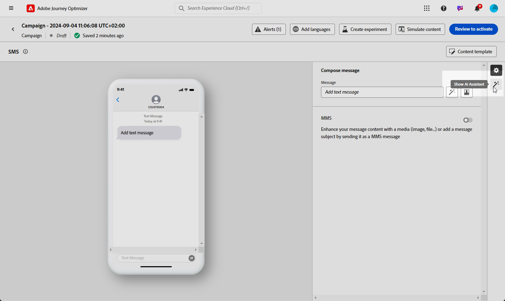

# SMS generation with the AI Assistant {#generative-sms}

>[!BEGINSHADEBOX]

**Table of content**

* [Get started with the AI Assistant](gs-generative.md)
* [Email generation with the AI Assistant](generative-email.md)
* [SMS generation with the AI Assistant](generative-sms.md)
* **[Push generation with the AI Assistant](generative-push.md)**
* [Content experiment with the AI Assistant](generative-experimentation.md)

>[!ENDSHADEBOX]

After crafting and tailoring your SMS messages to match your audience's preferences, elevate your communication with the AI Assistant in Journey Optimizer.

This resource offers insightful recommendations to fine-tune your content, helping your messages resonate and drive maximum engagement.

Explore the tabs below to learn how to use the AI Assistant in Journey Optimizer.

>[!NOTE]
>
>Before starting using this capability, read out related [Guardrails and Limitations](gs-generative.md#generative-guardrails).

>[!BEGINTABS]

>[!TAB Full SMS generation]

1. After creating and configuring your SMS campaign, click **[!UICONTROL Edit content]**.

    For more information on how to configure your SMS campaign, refer to [this page](../sms/create-sms.md).

1. Fill in the **[!UICONTROL Basic details]** for your campaign. Once done, click **[!UICONTROL Edit content]**.

1. Personalize your SMS message as needed. [Learn more](../sms/create-mms.md)

1. Access the **[!UICONTROL Show AI Assistant]** menu.

    {zoomable="yes"}

1. Enable the **[!UICONTROL Use original content]** option for the AI Assistant to personalize new content based on your campaign content, name, and selected audience.

    Your prompt must always be tied to a specific context.

1. Fine tune the content by describing what you want to generate in the **[!UICONTROL Prompt]** field. 

    If you are looking for assistance in crafting your prompt, access the **[!UICONTROL Prompt Library]** which provides a diverse range of prompt ideas to improve your campaigns.

    {zoomable="yes"}

1. Select **[!UICONTROL Upload brand asset]** to add any brand asset which contains content that can provide additional context the AI Assistant.

1. Tailor your prompt with the different options:

    * **[!UICONTROL Communication strategy]**: Select the desired communication approach for the generated text.
    * **[!UICONTROL Language]**: Choose the language for the variant's content.
    * **[!UICONTROL Tone]**: Ensure that the text is appropriate for your audience and purpose.
    * **[!UICONTROL Length]**: Select the length of your content using the range slider. 

    {zoomable="yes"}  

1. Once your prompt is ready, click **[!UICONTROL Generate]**.

1. Browse through the generated **[!UICONTROL Variations]** and click **[!UICONTROL Preview]** to view a full-screen version of the selected variation.

1. Navigate to the **[!UICONTROL Refine]** option within the **[!UICONTROL Preview]** window to access additional customization features and fine-tune your variation to your preferences:

    * **[!UICONTROL Use as reference content]**: The chosen variant will serve as the reference content for generating other results.

    * **[!UICONTROL Rephrase]**:The AI Assistant can rephrase your message in different ways, keeping your writing fresh and engaging for diverse audiences.

    * **[!UICONTROL Use simpler language]**: Leverage the AI Assistant to simplify your language, ensuring clarity and accessibility for a wider audience.

    {zoomable="yes"}  

1. Click **[!UICONTROL Select]** once you found the appropriate content.

    You can also enable experiment for your content. [Learn more](generative-experimentation.md)

1. Insert personalization fields to customize your SMS content based on profiles data. [Learn more about content personalization](../personalization/personalize.md)

1. After defining your message content, click the **[!UICONTROL Simulate content]** button to control the rendering, and check personalization settings with test profiles. [Learn more](../personalization/personalize.md)

When you have defined your content, audience and schedule, you are ready to prepare your SMS campaign. [Learn more](../campaigns/review-activate-campaign.md)

>[!TAB Text generation]

1. After creating and configuring your SMS campaign, click **[!UICONTROL Edit content]**.

    For more information on how to configure your SMS campaign, refer to [this page](../sms/create-sms.md).

1. Fill in the **[!UICONTROL Basic details]** for your campaign. Once done, click **[!UICONTROL Edit content]**.

1. Personalize your SMS message as needed. [Learn more](../sms/create-sms.md)

1. Access the **[!UICONTROL Edit text with AI Assistant]** menu next to your **[!UICONTROL Message]** field.

    {zoomable="yes"}

1. Enable the **[!UICONTROL Use reference content]** option for the AI Assistant to personalize new content based on your campaign content, name, and selected audience.

    Your prompt must always be tied to a specific context.

1. Fine tune the content by describing what you want to generate in the **[!UICONTROL Prompt]** field. 

    If you are looking for assistance in crafting your prompt, access the **[!UICONTROL Prompt Library]** which provides a diverse range of prompt ideas to improve your campaigns.

    {zoomable="yes"}

1. Select **[!UICONTROL Upload brand asset]** to add any brand asset which contains content that can provide additional context the AI Assistant.

1. Tailor your prompt with the different options:

    * **[!UICONTROL Communication strategy]**: Select the desired communication approach for the generated text.
    * **[!UICONTROL Language]**: Choose the language for the variant's content.
    * **[!UICONTROL Tone]**: Ensure that the text is appropriate for your audience and purpose.
    * **[!UICONTROL Length]**: Select the length of your content using the range slider. 

    {zoomable="yes"}  

1. Once your prompt is ready, click **[!UICONTROL Generate]**.

1. Browse through the generated **[!UICONTROL Variations]** and click **[!UICONTROL Preview]** to view a full-screen version of the selected variation.

1. Navigate to the **[!UICONTROL Refine]** option within the **[!UICONTROL Preview]** window to access additional customization features and fine-tune your variation to your preferences:

    * **[!UICONTROL Use as reference content]**: The chosen variant will serve as the reference content for generating other results.

    * **[!UICONTROL Rephrase]**:The AI Assistant can rephrase your message in different ways, keeping your writing fresh and engaging for diverse audiences.

    * **[!UICONTROL Use simpler language]**: Leverage the AI Assistant to simplify your language, ensuring clarity and accessibility for a wider audience.

    {zoomable="yes"}  

1. Click **[!UICONTROL Select]** once you found the appropriate content.

    You can also enable experiment for your content. [Learn more](generative-experimentation.md)

1. Insert personalization fields to customize your SMS content based on profiles data. [Learn more about content personalization](../personalization/personalize.md)

1. After defining your message content, click the **[!UICONTROL Simulate content]** button to control the rendering, and check personalization settings with test profiles.

When you have defined your content, audience and schedule, you are ready to prepare your SMS campaign. [Learn more](../campaigns/review-activate-campaign.md)

>[!ENDTABS]
