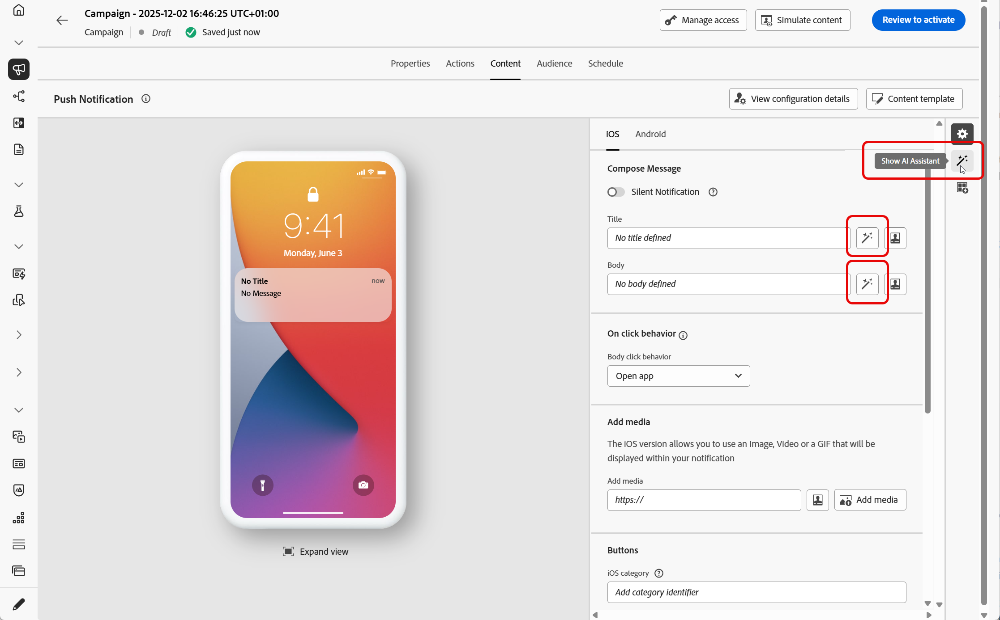
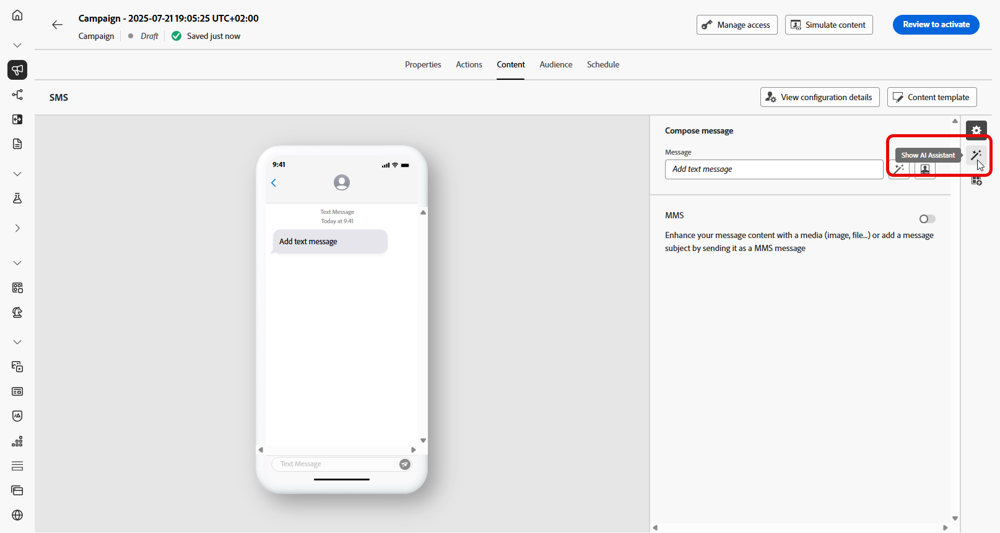
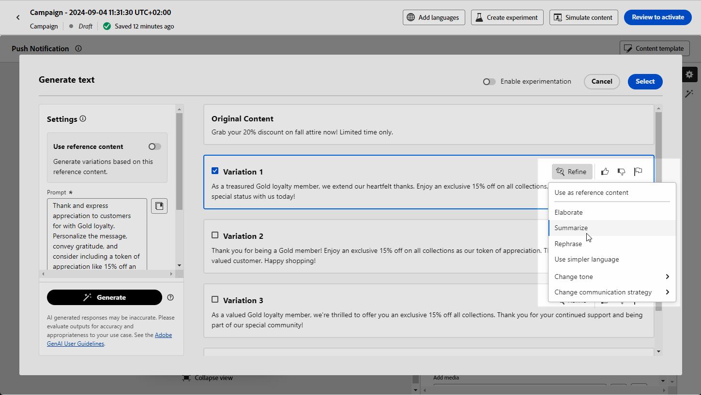

# Generate text with AI Assistant {#generative-text}

>[!IMPORTANT]
>
>Before starting using this capability, read out related [Guardrails and Limitations](gs-generative.md#generative-guardrails).
> 
>
>You must agree to a [user agreement](https://www.adobe.com/legal/licenses-terms/adobe-dx-gen-ai-user-guidelines.html) before you can use AI Assistant in Journey Optimizer. For more information, contact your Adobe representative.

Use AI Assistant in Journey Optimizer to generate engaging text content that resonates with your audience. Whether you need to enhance email copy, create compelling web content, craft persuasive landing page text, write push notification messages, or compose SMS messages, AI Assistant helps you deliver impactful text.

## For Email and Web Channels {#email-web-channels}

AI Assistant can generate high-quality text content for your email campaigns, web experiences, and landing pages. This capability enables you to create compelling, on-brand messaging that connects with your audience across digital touchpoints.

### Access and configure {#access-configure}

Before you can start generating text content with AI Assistant, you will need to set up your campaign or journey and access the content editor. Follow these steps to prepare your workspace and open the AI Assistant panel.

1. Create and configure your campaign or journey:

   * **Email**: After creating and configuring your email campaign, click **[!UICONTROL Edit content]**. [Learn more](../email/create-email.md)
   * **Web**: After creating and configuring your web page, click **[!UICONTROL Edit web page]**. [Learn more](../web/create-web.md)
   * **Landing Page**: After creating and configuring your landing page, click **[!UICONTROL Open designer]**. [Learn more](../landing-pages/create-lp.md)

1. Select a **[!UICONTROL Text component]** to only target a specific content and access the **[!UICONTROL AI Assistant]** menu (or **[!UICONTROL Show AI Assistant]** for web).

    {zoomable="yes"}

### Generate content {#generate-content}

Learn how to craft clear prompts, fine-tune settings, and generate tailored text using AI Assistant, ensuring that your messaging aligns with your brand and communication goals.

1. Enable the **[!UICONTROL Use original content]** option for AI Assistant to personalize new content based on the selected content.

1. Select your **[!UICONTROL Brand]** to ensure AI-generated content aligns with your brand specifications. [Learn more](brands.md) on Brands.

1. Fine tune the content by describing what you want to generate in the **[!UICONTROL Prompt]** field. 

    If you are looking for assistance in crafting your prompt, access the **[!UICONTROL Prompt Library]** which provides a diverse range of prompt ideas to improve your campaigns.

    {zoomable="yes"}

1. Tailor your prompt with the **[!UICONTROL Text settings]** option:

    * **[!UICONTROL Communication strategy]**: Choose the most suitable communication style for your generated text.
    * **[!UICONTROL Languages]**: Choose the language of your generated content.
    * **[!UICONTROL Tone]**: The tone should resonate with your audience. Whether you want to sound informative, playful, or persuasive, AI Assistant can adapt the message accordingly.
    * **Text Length**: Use the slider to select the desired length of your text.

    {zoomable="yes"} 
    
1. From the **[!UICONTROL Brand assets]** menu, click **[!UICONTROL Upload brand asset]** to add any brand asset which contains content that can provide additional context AI Assistant or select a previously uploaded one.

    Previously uploaded files are available in the **[!UICONTROL Uploaded brand assets]** drop-down. Simply toggle the assets you wish to include in your generation.

    {zoomable="yes"}

1. Once your prompt is ready, click **[!UICONTROL Generate]**.

### Refine and finalize {#refine-finalize}

Learn how to review the generated text, make refinements, and apply personalization to finalize your content, creating polished and engaging messages ready for delivery.

1. Browse through the generated **[!UICONTROL Variations]**.

    Click **[!UICONTROL Preview]** to view a full-screen version of the selected variation or click **[!UICONTROL Apply]** to replace your current content.

1. Click the percentage icon to view your **[!UICONTROL Brand Alignment Score]** and identify any misalignments with your brand.

    Learn more on [Brand alignment score](brands-score.md).

    {zoomable="yes"}

1. Navigate to the **[!UICONTROL Refine]** option within the **[!UICONTROL Preview]** window to access additional customization features:

    * **[!UICONTROL Use as reference content]**: The chosen variant will serve as the reference content for generating other results.

    * **[!UICONTROL Rephrase]**: Rewrite the message while preserving its meaning. This option helps you generate alternative wording, improve flow, or adjust phrasing without changing the core message.

    * **[!UICONTROL Use simpler language]**: Leverage AI Assistant to simplify your language, ensuring clarity and accessibility for a wider audience.

    * **[!UICONTROL Change tone]**: Adjust the tone of the message to better match your communication style, i.e. making it more friendly, professional, urgent, or inspirational.

    * **[!UICONTROL Change Communication strategy]**: Modify the messaging approach based on your objectives, such as creating urgency, or emphasizing exciting appeal.

    {zoomable="yes"}

1. Open the **[!UICONTROL Brand Alignment]** tab to see how your content aligns with your [brand guidelines](brands.md).

1. Click **[!UICONTROL Select]** once you found the appropriate content.

    You can also enable experiment for your content. [Learn more](generative-experimentation.md)

1. Insert personalization fields to customize your content based on profiles data. Then, click the **[!UICONTROL Simulate content]** button to control the rendering, and check personalization settings with test profiles. [Learn more](../personalization/personalize.md)

1. Review and activate your content:
   * **Email**: When you have defined your content, audience and schedule, you are ready to prepare your email campaign. [Learn more](../campaigns/review-activate-campaign.md)
   * **Web**: Once you defined your web campaign settings and edited your content as desired, you can review and activate your web campaign. [Learn more](../web/create-web.md#activate-web-campaign)
   * **Landing Page**: Once your landing page is ready, you can publish it to make it available for use in a message. [Learn more](../landing-pages/create-lp.md#publish-landing-page)

## For Mobile Channels {#mobile-channels}

AI Assistant can generate compelling text content for your push notifications and SMS messages, helping you create engaging mobile communications that resonate with your audience across all mobile touchpoints.

### Access and configure {#mobile-access-configure}

Before you begin generating text with AI Assistant for mobile channels, you must set up your campaign and access the AI Assistant. The access method varies slightly between push notifications and SMS messages.

1. Create and configure your mobile campaign:
   * **Push notifications**: After creating and configuring your push notification campaign, click **[!UICONTROL Edit content]**. [Learn more](../push/create-push.md)
   * **SMS**: After creating and configuring your SMS campaign, click **[!UICONTROL Edit content]**. [Learn more](../sms/create-sms.md)

1. Fill in the **[!UICONTROL Basic details]** for your campaign. Once done, click **[!UICONTROL Edit content]**.

1. Personalize your message as needed:
   * **Push notifications**: [Learn more](../push/design-push.md)
   * **SMS**: [Learn more](../sms/create-sms.md)

1. Access AI Assistant:
   * **For Push notifications**: Click the **[!UICONTROL Edit text with AI Assistant]** menu next to your **[!UICONTROL Title]** or **[!UICONTROL Message]** fields. You can also directly access the **AI assistant** menu.
   
       {zoomable="yes"}
   
   * **For SMS**: Click the **[!UICONTROL Edit text with AI Assistant]** menu next to your **[!UICONTROL Message]** or access the **[!UICONTROL Show AI Assistant]** menu.
   
       {zoomable="yes"}

### Generate content {#mobile-generate-content}

Once you have accessed AI Assistant, you can configure the generation settings to create mobile content that matches your brand and campaign goals. Customize text parameters, add brand assets, and provide prompts to guide the AI in generating relevant variations.

1. Select your **[!UICONTROL Brand]** to ensure AI-generated content aligns with your brand specifications. [Learn more](brands.md) on Brands.

   Note that Brands feature is released as a private beta and will be progressively available to all customers in future releases.

1. Fine tune the content by describing what you want to generate in the **[!UICONTROL Prompt]** field. 

    If you are looking for assistance in crafting your prompt, access the **[!UICONTROL Prompt Library]** which provides a diverse range of prompt ideas to improve your campaigns. [Learn more on prompt best practices](ai-assistant-prompting-guide.md)
    
    {zoomable="yes"}

1. **For Push notification**, choose which field you want to generate: Title and/or Message.

1. Tailor your prompt with the **[!UICONTROL Text settings]** option:

    * **[!UICONTROL Communication strategy]**: Choose the most suitable communication style for your generated text.
    * **[!UICONTROL Languages]**: Choose the language of your generated content.
    * **[!UICONTROL Tone]**: The tone should resonate with your audience. Whether you want to sound informative, playful, or persuasive, AI Assistant can adapt the message accordingly.

        {zoomable="yes"}

1. From the **[!UICONTROL Reference content]** menu, click **[!UICONTROL Upload file]** to add any brand asset which contains content that can provide additional context AI Assistant or select a previously uploaded one.

    Previously uploaded files are available in the **[!UICONTROL Uploaded reference content]** drop-down. Simply toggle the assets you wish to include in your generation.

1. Once your prompt is ready, click **[!UICONTROL Generate]**.

### Refine and finalize {#mobile-refine-finalize}

After generating text variations for your mobile messages, you can fine-tune the results to ensure they meet your exact requirements. Review the brand alignment, adjust tone and language, and prepare the content for activation.

1. After generation, browse through the **[!UICONTROL Variations]**.

1. Click the percentage icon to view your **[!UICONTROL Brand Alignment Score]** and identify any misalignments with your brand.

    Learn more on [Brand alignment score](brands-score.md).

    {zoomable="yes"}

1. Click **[!UICONTROL Preview]** to view a full-screen version of the selected variation or click **[!UICONTROL Apply]** to replace your current content.

1. Navigate to the **[!UICONTROL Refine]** option within the **[!UICONTROL Preview]** window to access additional customization features:

    * **[!UICONTROL Use as reference content]**: The chosen variant will serve as the reference content for generating other results.

    * **[!UICONTROL Rephrase]**: Rewrite the message while preserving its meaning. This option helps you generate alternative wording, improve flow, or adjust phrasing without changing the core message.

    * **[!UICONTROL Use simpler language]**: Leverage AI Assistant to simplify your language, ensuring clarity and accessibility for a wider audience.

    * **[!UICONTROL Translate]**: Simplify your language to ensure clarity and accessibility for a wider audience.

    * **[!UICONTROL Change tone]**: Adjust the tone of the message to better match your communication style, i.e. making it more friendly, professional, urgent, or inspirational.

    * **[!UICONTROL Change Communication strategy]**: Modify the messaging approach based on your objectives, such as creating urgency, or emphasizing exciting appeal.

        {zoomable="yes"}

1. Open the **[!UICONTROL Brand Alignment]** tab to see how your content aligns with your [brand guidelines](brands.md).

1. Click **[!UICONTROL Select]** once you found the appropriate content.

    You can also enable experiment for your content. [Learn more](generative-experimentation.md)

1. Insert personalization fields to customize your content based on profiles data. Then, click the **[!UICONTROL Simulate content]** button to control the rendering, and check personalization settings with test profiles. [Learn more](../personalization/personalize.md)

When you have defined your content, audience and schedule, you are ready to prepare your mobile campaign. [Learn more](../campaigns/review-activate-campaign.md)
