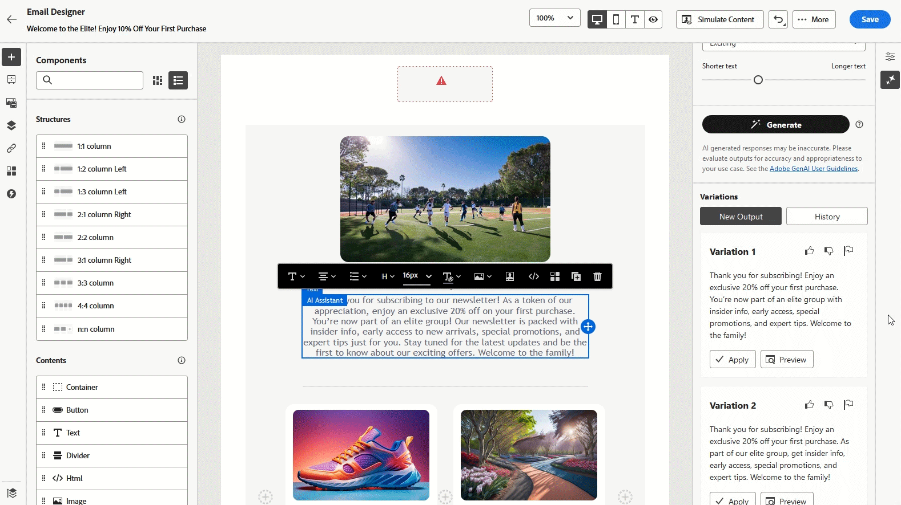
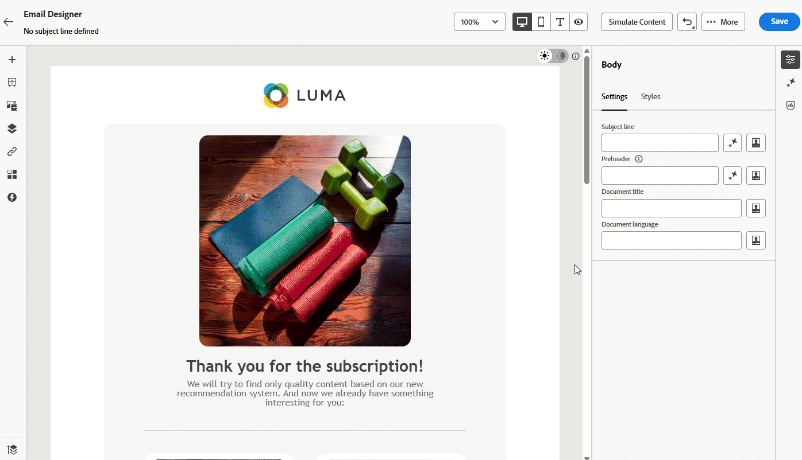
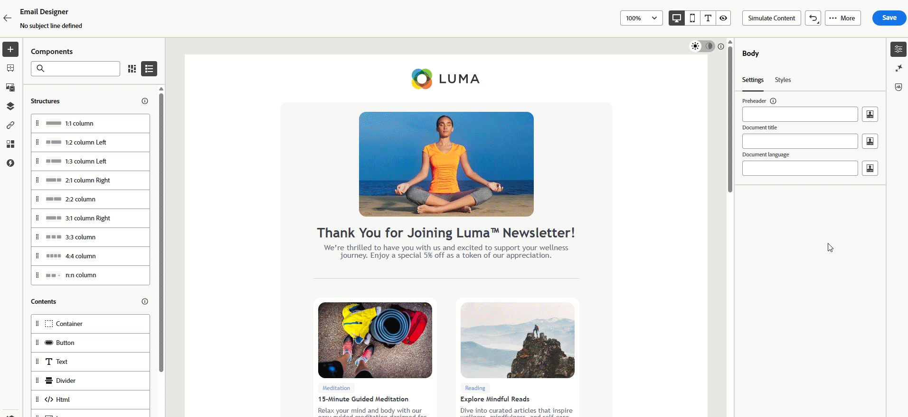
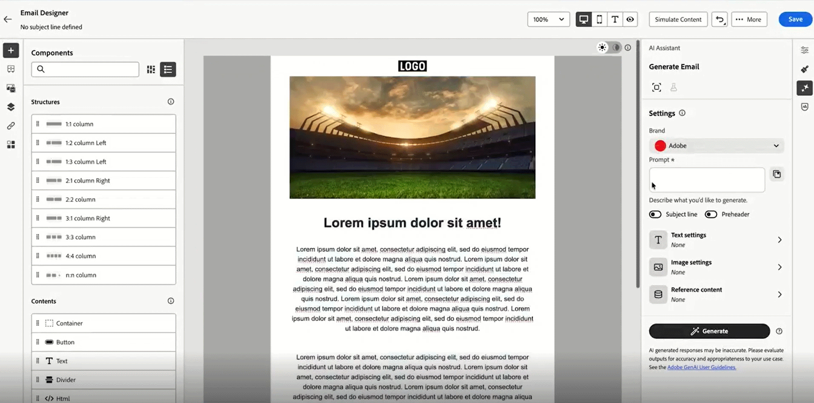
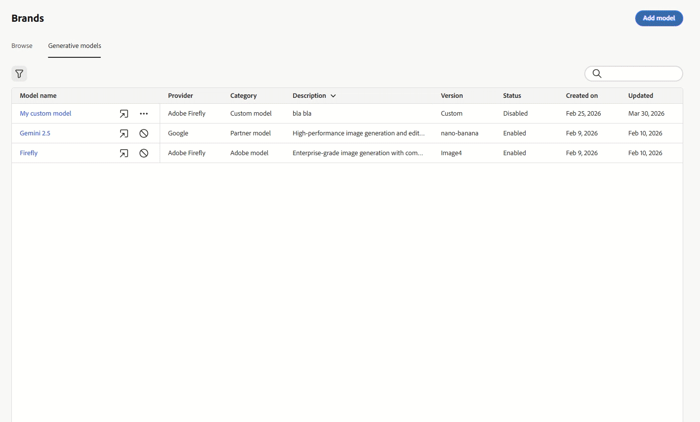
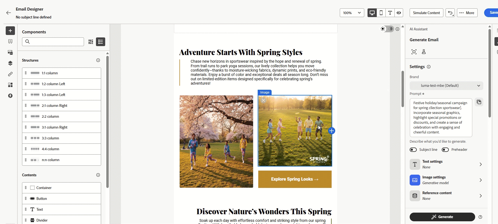

# AI Assistant use cases {#generative-uc}

>[!NOTE]
>
>Before starting using this capability, read out related [Guardrails and Limitations](gs-generative.md#generative-guardrails).

## Use existing content

Generate variations from the content and context already in your campaign so they remain consistent with your message and audience.

1. After setting up your campaign, select **[!UICONTROL Edit content]**.

1. Open the **[!UICONTROL AI Assistant]** section.

1. Turn on the **[!UICONTROL Use original content]** feature within AI Assistant to tailor new content according to your campaign details, including the campaign name and targeted audience.

1. Adjust the content by specifying your request in the **[!UICONTROL Prompt]** box and customize the settings as necessary.

1. When you are satisfied with the prompt, click **[!UICONTROL Generate]**.

1. Explore the available **[!UICONTROL Variations]** and click **[!UICONTROL Preview]** to see the selected variation in full screen.

When you have defined your content, audience and schedule, you are ready to prepare your email campaign. [Learn more](../campaigns/review-activate-campaign.md)

## Refine variation {#refine}

Adjust an AI-generated variation in place, tone, length, wording, and strategy, before you select the final text.

1. Once your campaign is set up and configured, click **[!UICONTROL Edit content]**.

1. Open the **[!UICONTROL AI Assistant]** menu.

1. Adjust the content by entering your desired request in the **[!UICONTROL Prompt]** box and modify the settings as necessary.

1. When you are ready, click **[!UICONTROL Generate]**.

1. Review the generated **[!UICONTROL Variations]** and select **[!UICONTROL Preview]** to see a full-screen view of the chosen option.

1. In the **[!UICONTROL Preview]** window, go to the **[!UICONTROL Refine]** option for further customization, including:

    * **[!UICONTROL Use as reference content]**: The selected variation will act as a reference to generate more content.

    * **[!UICONTROL Elaborate]**: Let AI Assistant expand on certain points, offering more depth and detail for better engagement.

    * **[!UICONTROL Summarize]**: For lengthy information, use AI Assistant to create concise summaries that are easier for email recipients to digest.

    * **[!UICONTROL Rephrase]**: The AI Assistant can present your message in different ways, helping to keep the content fresh for a variety of audiences.

    * **[!UICONTROL Use simpler language]**: Simplify the language with AI Assistant to ensure the message is clear and accessible to all readers.

    Additionally, you can adjust the **[!UICONTROL Tone]** and **[!UICONTROL Communication strategy]** of your content.

1. When you have found the right content, click **[!UICONTROL Select]**.

## Generate Similar image

When an image is almost suitable, generate additional options that preserve the same overall look and theme.

1. After setting up your campaign, select **[!UICONTROL Edit content]**.

1. Open the **[!UICONTROL AI Assistant]** section.

1. Adjust the content by specifying your request in the **[!UICONTROL Prompt]** box and customize the settings as necessary.

1. When you are satisfied with the prompt, click **[!UICONTROL Generate]**.

1. Browse the **[!UICONTROL Variation suggestions]** to find the desired Asset.

    Click **[!UICONTROL Preview]** to view a full-screen version of the selected variation.

1. Choose **[!UICONTROL Generate Similar]**  to explore image variations that closely resemble the current option, offering alternative designs with a similar theme.

1. Click **[!UICONTROL Select]** once you found the appropriate content.

## Upload a style reference

Upload a reference image so that new visuals follow a desired style, palette, or composition.

1. After setting up and configuring your email campaign, click **[!UICONTROL Edit content]**.

1. Choose the asset you want to modify using AI Assistant.

1. From the right-pane menu, choose **[!UICONTROL AI Assistant]**.

1. Turn on the **[!UICONTROL Reference style]** option so AI Assistant can generate new content using the reference material.

1. Click **[!UICONTROL Upload image]** to include an image that adds context to your variation.

1. Refine the content by specifying what you want to generate in the **[!UICONTROL Prompt]** box and adjust the settings as needed.

1. When you are satisfy with your prompt, click **[!UICONTROL Generate]**.

1. Review the **[!UICONTROL Variation suggestions]** to locate the asset you prefer.

1. Select **[!UICONTROL Preview]** to see the chosen variation in full-screen.

1. Once you find the suitable content, click **[!UICONTROL Select]**.

## Generate content across supported languages{#languages}

Produce text in the languages supported by AI Assistant by combining your prompt with explicit language settings.

1. Once your campaign is set up and configured, click **[!UICONTROL Edit content]**.

1. Open the **[!UICONTROL AI Assistant]** menu.

1. Adjust the content by entering your desired request in the **[!UICONTROL Prompt]** box in French, Spanish, German, Italian, Japanese, Swedish, Dutch or Norwegian.

1. Tailor your prompt with the **[!UICONTROL Text settings]** option and select the desired **[!UICONTROL Languages]** for your generated content.

1. Further personalize your prompt as needed and click **[!UICONTROL Generate]**.

1. Review the **[!UICONTROL Variation suggestions]** in your selected language.

1. Once you find the suitable content, click **[!UICONTROL Select]**.

## Use reference content for generation

You can give AI Assistant more context by adding **reference content**, a web page or uploaded files, so generated copy and suggestions stay closer to your source material.

1. When your campaign is ready, click **[!UICONTROL Edit content]**.

1. Open **[!UICONTROL AI Assistant]**.

1. Describe what you want in the **[!UICONTROL Prompt]** field.

1. In **[!UICONTROL Reference content]**, enter the page URL and a name that identifies it.

1. Click  to fetch the page and add it as reference content for generation.

1. To use a file instead, choose **[!UICONTROL Upload file option]** and select your document. Supported formats include .pdf, .png, .jpg, .jpeg, .zip, .md, .doc, .txt, and .docx.

1. In **[!UICONTROL Uploaded reference content]**, enable or disable individual references, or delete any you no longer need.

1. Adjust your prompt if needed, then click **[!UICONTROL Generate]**.

1. Review **[!UICONTROL Variation suggestions]** and click **[!UICONTROL Select]** on the variation you want to use.

## Use your generative model {#generative-model}

Register a custom generative model and route image generation through it from AI Assistant.

1. From the **[!UICONTROL Brands]** menu, open the **[!UICONTROL Generative Models]** tab and click **[!UICONTROL Add model]**.

1. Enter a **[!UICONTROL Name]** for the model and the **[!UICONTROL Model ID]**.

1. Optionally, enter a **[!UICONTROL Description]** to distinguish this model in the list.

1. Click **[!UICONTROL Test connection]** to verify the model configuration, then click **[!UICONTROL Save]**. The model is added to the models list.

1. From the campaign, click **[!UICONTROL Edit content]**.

1. Select the asset to be modified with AI Assistant and open the **[!UICONTROL AI Assistant]**.

1. Specify your request in the **[!UICONTROL Prompt]** field and adjust the remaining settings as appropriate.

1. Open **[!UICONTROL Image settings]** and select the **[!UICONTROL Generative model]** you previously configured.

1. Adjust the prompt as necessary, then click **[!UICONTROL Generate]**.

1. Review the **[!UICONTROL Variation suggestions]** in the selected language and click **[!UICONTROL Select]** once a suitable variation is identified.

## Use Gemini as generative model for text-overlay image

With **Gemini 2.5** selected as the generative model, you can produce image variants in AI Assistant, add text overlays from a URL, a file, or an AI-generated prompt, then position overlays before applying a final variation.

1. When your campaign is ready, click **[!UICONTROL Edit content]**.

1. Select the asset to use as the base image and open **[!UICONTROL AI Assistant]**.

1. Click **[!UICONTROL Open settings]** to adjust image generation options.

1. Under **[!UICONTROL Generative model]**, select **Gemini 2.5 (nano-banana)**.

1. Enter your request in the **[!UICONTROL Prompt]** field.

1. Choose how many variants you want, then click **[!UICONTROL Generate]**.

1. After generation, preview variants or refine settings to regenerate. From the advanced menu you can also:

    * **[!UICONTROL Create an image overlay]**
    * **[!UICONTROL Generate Similar]**
    * **[!UICONTROL Crop image]**
    * **[!UICONTROL Save to AEM assets]**
    * **[!UICONTROL Delete]**

1. Select **[!UICONTROL Create an image overlay]**. Add an overlay from a URL, upload a file, or use **[!UICONTROL Generate text overlay with AI]** and describe the overlay in the **[!UICONTROL Prompt]**.

1. Click **[!UICONTROL Generate]**.

1. Review **[!UICONTROL Overlay Variations]** and click **[!UICONTROL Apply]**.

1. Position the overlay on the image as needed. From the advanced menu you can:

    * **[!UICONTROL Delete overlay]**
    * **[!UICONTROL Move forward]**
    * **[!UICONTROL Move backward]**
    * **[!UICONTROL Duplicate]**

1. When the text overlay looks right, click **[!UICONTROL Save]**, then click **[!UICONTROL Apply]** on the variation you want to use.

