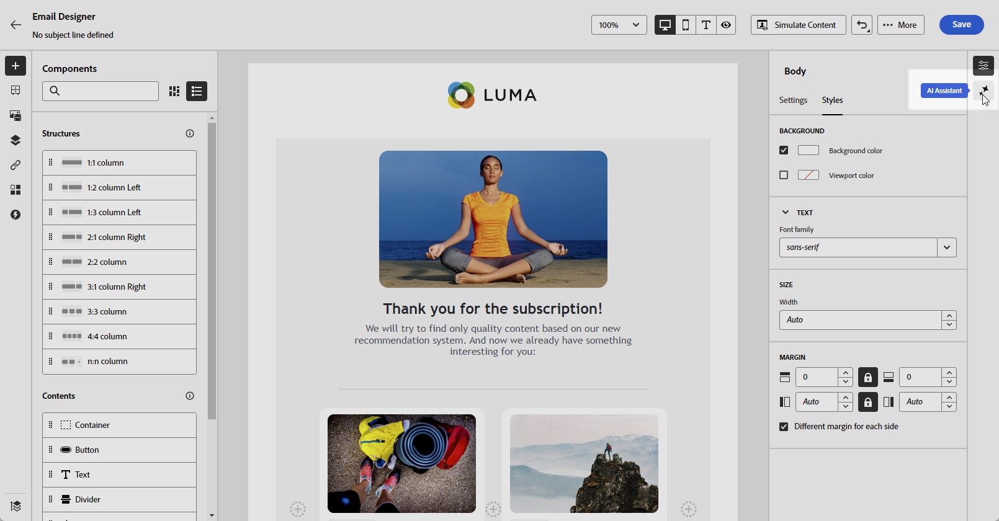
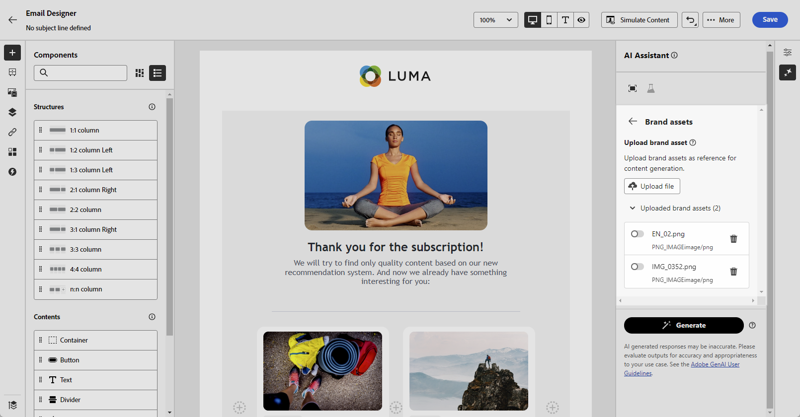
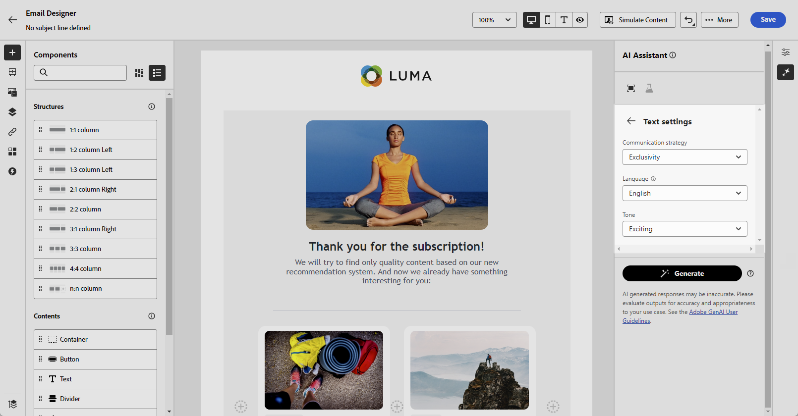
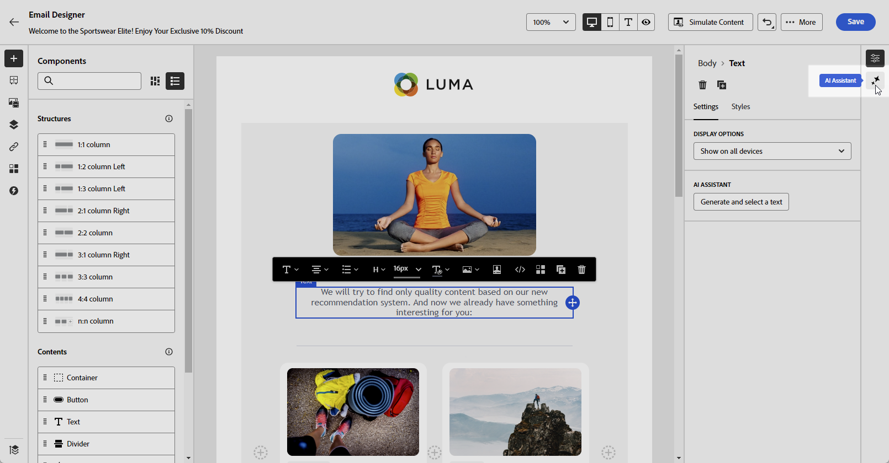
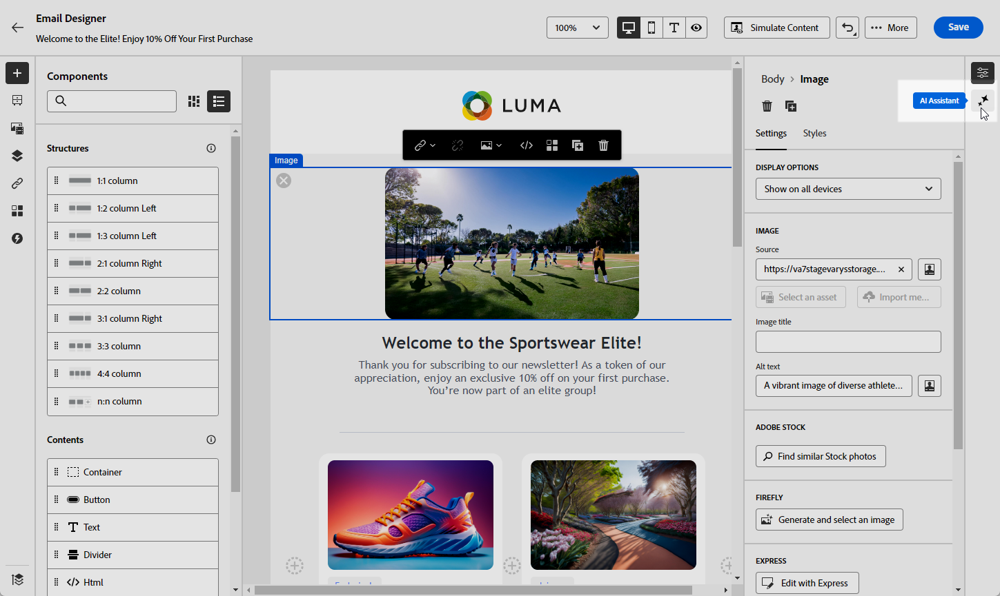
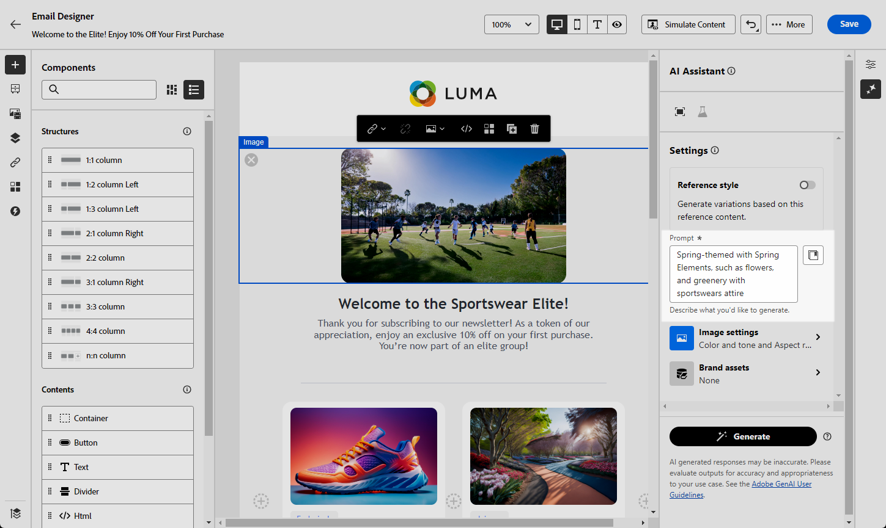

# Web generation with the AI Assistant {#generative-web}

>[!BEGINSHADEBOX]

**Table of content**

* [Get started with the AI Assistant](gs-generative.md)
* [Email generation with the AI Assistant](generative-email.md)
* [SMS generation with the AI Assistant](generative-SMS.md)
* [Push generation with the AI Assistant](generative-push.md)
* **[Web page generation with the AI Assistant](generative-web.md)**
* [Content experiment with the AI Assistant](generative-experimentation.md)

>[!ENDSHADEBOX]

Once you have created and personalized your emails, use Journey Optimizer AI Assistant in Campaign powered by generative AI to take your content to the next level.

The AI Assistant can help you optimize the impact of your deliveries by suggesting different content that is more likely to resonate with your audience.

>[!NOTE]
>
>Before starting using this capability, read out related [Guardrails and Limitations](generative-gs.md#guardrails-and-limitations).

>[!BEGINTABS]

>[!TAB Web page full generation]

In the following example, we will leverage the AI assistant to refine an existing email, customizing it for a special event.

1. After creating and configuring your email delivery, click **[!UICONTROL Edit content]**.

    For more information on how to configure your email delivery, refer to [this page](../email/create-email-content.md).

1. Personalize your email as needed and access the **[!UICONTROL AI Assistant]** menu.

    {zoomable="yes"}

1. Enable the **[!UICONTROL Use original content]** option for the AI Assistant to personalize new content based on your delivery, delivery name, and selected audience.
    
    Your prompt must always be tied to a specific context.

1. Fine tune the content by describing what you want to generate in the **[!UICONTROL Prompt]** field. 

    If you are looking for assistance in crafting your prompt, access the **[!UICONTROL Prompt Library]** which provides a diverse range of prompt ideas to improve your deliveries.

    {zoomable="yes"}

1. You can toggle the **[!UICONTROL Subject line]** or **[!UICONTROL Preheader]** to include them to the variant generation.

1. Click **[!UICONTROL Upload brand asset]** to add any brand asset which contains content that can provide additional context the AI Assistant or select a previously uploaded one.

    {zoomable="yes"}

1. Tailor your prompt with the different options:

    * **[!UICONTROL Communication strategy]**: Choose the most suitable communication style for your generated text.
    * **[!UICONTROL Language]**: Select the language in which you want your content to be generated.
    * **[!UICONTROL Tone]**: The tone of your email should resonate with your audience. Whether you want to sound informative, playful, or persuasive, the AI Assistant can adapt the message accordingly.
    * **[!UICONTROL Length]**: Choose the desired length of your content using the range slider.

    {zoomable="yes"}

1. Once your prompt is ready, click **[!UICONTROL Generate]**.

1. Browse through the generated **[!UICONTROL Variations]** and click **[!UICONTROL Preview]** to view a full-screen version of the selected variation.

1. Navigate to the **[!UICONTROL Refine]** option within the **[!UICONTROL Preview]** window to access additional customization features:

    * **[!UICONTROL Rephrase]**: The AI Assistant can rephrase your message in different ways, keeping your writing fresh and engaging for diverse audiences.

    * **[!UICONTROL Use simple Language]**: Leverage the AI Assistant to simplify your language, ensuring clarity and accessibility for a wider audience.

    {zoomable="yes"}

1. Click **[!UICONTROL Select]** once you found the appropriate content.

1. Insert personalization fields to customize your email content based on profiles data. Then, click the **[!UICONTROL Simulate content]** button to control the rendering, and check personalization settings with test profiles. [Learn more](../preview-test/preview-content.md)

    {zoomable="yes"}

When you have defined your content, audience and schedule, you are ready to prepare your email delivery. [Learn more](../monitor/prepare-send.md)

>[!TAB Web page text generation]

In the following example, we will leverage the AI assistant to enhance the content of our email invitation for our upcoming event.

1. After creating and configuring your email delivery, click **[!UICONTROL Edit content]**.

    For more information on how to configure your email delivery, refer to [this page](../email/create-email-content.md).

1. Select a **[!UICONTROL Text component]** to only target a specific content. and access the **[!UICONTROL AI Assistant]** menu.

    {zoomable="yes"}

1. Enable the **[!UICONTROL Use original content]** option for the AI Assistant to personalize new content based on your delivery, delivery name, and selected audience.

    Your prompt must always be tied to a specific context.

1. Fine tune the content by describing what you want to generate in the **[!UICONTROL Prompt]** field. 

    If you are looking for assistance in crafting your prompt, access the **[!UICONTROL Prompt Library]** which provides a diverse range of prompt ideas to improve your deliveries.

    {zoomable="yes"}

1. Click **[!UICONTROL Upload brand asset]** to add any brand asset which contains content that can provide additional context the AI Assistant.

    {zoomable="yes"}

1. Tailor your prompt with the different options:

    * **[!UICONTROL Communication strategy]**: Select the desired communication approach for the generated text.
    * **[!UICONTROL Language]**: Choose the language for the variant's content.
    * **[!UICONTROL Tone]**: Ensure that the text is appropriate for your audience and purpose.
    * **[!UICONTROL Length]**: Select the length of your content using the range slider. 

    {zoomable="yes"}

1. Once your prompt is ready, click **[!UICONTROL Generate]**.

1. Browse through the generated **[!UICONTROL Variations]** and click **[!UICONTROL Preview]** to view a full-screen version of the selected variation.

1. Navigate to the **[!UICONTROL Refine]** option within the **[!UICONTROL Preview]** window to access additional customization features:

    * **Use as reference content**: The chosen variant will serve as the reference content for generating other results.

    * **Elaborate**: The AI Assistant can help you expand on specific topics, providing additional details for better understanding and engagement.

    * **Summarize**: Lengthy information can overload email recipients. Use the AI Assistant to condense key points into clear, concise summaries that grab attention and encourage them to read further.

    * **Rephrase**:The AI Assistant can rephrase your message in different ways, keeping your writing fresh and engaging for diverse audiences.

    * **Use simple Language**: Leverage the AI Assistant to simplify your language, ensuring clarity and accessibility for a wider audience.

    {zoomable="yes"}

1. Click **[!UICONTROL Select]** once you found the appropriate content.

1. Insert personalization fields to customize your email content based on profiles data. Then, click the **[!UICONTROL Simulate content]** button to control the rendering, and check personalization settings with test profiles. [Learn more](../preview-test/preview-content.md)

    {zoomable="yes"}

When you have defined your content, audience and schedule, you are ready to prepare your email delivery. [Learn more](../monitor/prepare-send.md)

>[!TAB Web page image generation]

In the example below, learn how to leverage the AI Assistant to optimize and improve your assets, ensuring a more user-friendly experience. 

1. After creating and configuring your email delivery, click **[!UICONTROL Edit content]**.

    For more information on how to configure your email delivery, refer to [this page](../email/create-email-content.md).

1. Fill in the **[!UICONTROL Basic details]** for your delivery. Once done, click **[!UICONTROL Edit email content]**.

1. Select the asset you want to change with the AI Assistant.

1. From the right-hand menu, select **[!UICONTROL AI Assistant]**.

    {zoomable="yes"}

1. Fine tune the content by describing what you want to generate in the **[!UICONTROL Prompt]** field. 

    If you are looking for assistance in crafting your prompt, access the **[!UICONTROL Prompt Library]** which provides a diverse range of prompt ideas to improve your deliveries.

    {zoomable="yes"}

1. Click **[!UICONTROL Upload brand asset]** to add any brand asset which contains content that can provide additional context the AI Assistant.

    Your prompt must always be tied to a specific context.

1. Tailor your prompt with the different options:

    * **[!UICONTROL Aspect ratio]**: This determines the width and height of the asset. You have the option to choose from common ratios such as 16:9, 4:3, 3:2, or 1:1, or you can enter a custom size.
    * **[!UICONTROL Color & tone]**: The overall appearance of the colors within an image and the mood or atmosphere it conveys.
    * **[!UICONTROL Content type]**: This categorizes the nature of the visual element, distinguishing between different forms of visual representation such as photos, graphics, or art.
    * **[!UICONTROL Lighting]**: This refers to the lightning present in an image, which shapes its atmosphere and highlights specific elements.
    * **[!UICONTROL Composition]**: This refers to the arrangement of elements within the frame of an image

    {zoomable="yes"}

1. Once you are satisfied with your prompt configuration, click **[!UICONTROL Generate]**.

1. Browse the **[!UICONTROL Variation suggestions]** to find the desired Asset.

    Click **[!UICONTROL Preview]** to view a full-screen version of the selected variation.

    {zoomable="yes"}

1. Choose **[!UICONTROL Show Similar]** if you want to view related images to this variant.

1. Click **[!UICONTROL Select]** once you found the appropriate content.

    {zoomable="yes"}

1. After defining your message content, click the **[!UICONTROL Simulate content]** button to control the rendering, and check personalization settings with test profiles.  [Learn more](../preview-test/preview-content.md)

    {zoomable="yes"}

1. When you have defined your content, audience and schedule, you are ready to prepare your email delivery. [Learn more](../monitor/prepare-send.md)

>[!ENDTABS]

