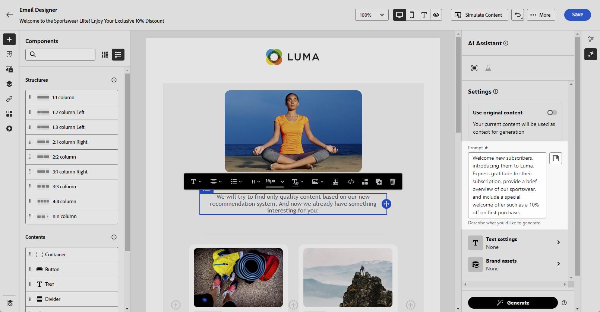
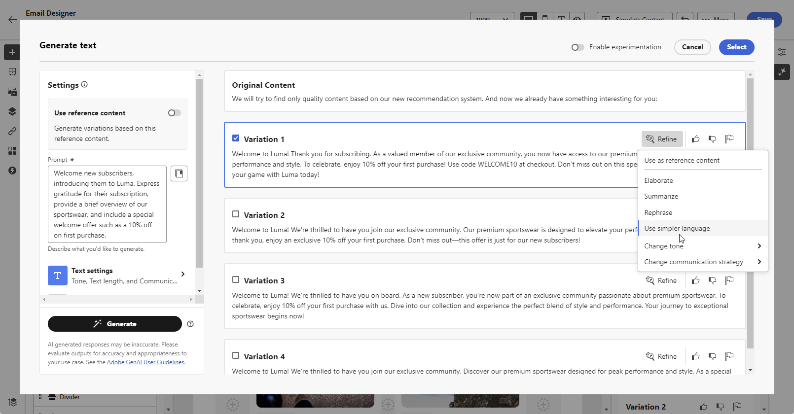

# Email generation with the AI Assistant {#generative-email}

>[!BEGINSHADEBOX]

**Table of content**

* [Get started with the AI Assistant](gs-generative.md)
* [Email generation with the AI Assistant](generative-email.md)
* [SMS generation with the AI Assistant](generative-SMS.md)
* [Push generation with the AI Assistant](generative-push.md)
* **[Web page generation with the AI Assistant](generative-web.md)**
* [Content experiment with the AI Assistant](generative-experimentation.md)

>[!ENDSHADEBOX]

Once you have created and personalized your emails, use Journey Optimizer AI Assistant in Campaign powered by generative AI to take your content to the next level.

The AI Assistant can help you optimize the impact of your deliveries by suggesting different content that is more likely to resonate with your audience.

>[!NOTE]
>
>Before starting using this capability, read out related [Guardrails and Limitations](generative-gs.md#guardrails-and-limitations).

## Content generation with the AI Assistant {#generative-text}

1. After creating and configuring your email delivery, click **[!UICONTROL Edit content]**.

    For more information on how to configure your email delivery, refer to [this page](../email/create-email-content.md).

1. Fill in the **[!UICONTROL Basic details]** for your delivery. Once done, click **[!UICONTROL Edit content]**.

1. Personalize your email as needed. [Learn more](content-components.md)

1. Access the **[!UICONTROL AI Assistant]** menu.

    You can also select a **[!UICONTROL Text component]** to only target a specific content.

    {zoomable="yes"}

1. Fine tune the content by describing what you want to generate in the **[!UICONTROL Prompt]** field. 

    If you are looking for assistance in crafting your prompt, access the **[!UICONTROL Prompt Library]** which provides a diverse range of prompt ideas to improve your deliveries.

    {zoomable="yes"}

1. Toggle the **[!UICONTROL Subject line]** or **[!UICONTROL Preheader]** to include them to the variant generation.

1. In the Context menu, enable the **[!UICONTROL Enhance with current context]** option for the AI Assistant to personalize new content based on your delivery, delivery name, and selected audience.

    >[!IMPORTANT]
    >
    > Your prompt must always be tied to a specific context by uploading a brand asset or enabling the **[!UICONTROL Enhance current content]** option.

1. Click **[!UICONTROL Upload brand asset]** to add any brand asset which contains content that can provide additional context the AI Assistant.

    {zoomable="yes"}

1. Select the **[!UICONTROL Communication strategy]** that best suits your needs. This will affect the tone and style of the generated text.

1. Choose the **[!UICONTROL Language]** and **[!UICONTROL Tone]** that you want the generated text to have. This will ensure that the text is appropriate for your audience and purpose.

    {zoomable="yes"}

1. Once your prompt is ready, click **[!UICONTROL Generate]**.

1. Browse through the generated **[!UICONTROL Variations]** and click **[!UICONTROL Apply]** once you found the appropriate content.

    Click **[!UICONTROL Preview]** to view a full-screen version of the selected variation.

    {zoomable="yes"}

1. Insert personalization fields to customize your email content based on profiles data. [Learn more about content personalization](../personalization/personalize.md)

    {zoomable="yes"}

1. After defining your message content, click the **[!UICONTROL Simulate content]** button to control the rendering, and check personalization settings with test profiles. [Learn more](../preview-test/preview-content.md)

    {zoomable="yes"}

1. When you have defined your content, audience and schedule, you are ready to prepare your email delivery. [Learn more](../monitor/prepare-send.md)

## Image generation with the AI Assistant {#generative-image}

Once you have created and personalized your email content, take your assets to the next level with Journey Optimizer AI Assistant. This powerful tool allows you to use Adobe Firefly directly in your email content. 

In the example below, learn how to use the AI Assistant to update and improve your assets for a better user experience. Follow these steps:

1. After creating and configuring your message, click **[!UICONTROL Create content]** and personalize it as needed.

1. Select the asset you want to change with the AI Assistant.

1. From the right-hand menu, select **[!UICONTROL Experience generation]**.

    

1. Add a prompt to better fine-tune your results and click **[!UICONTROL Generate]**.

    Enable the **[!UICONTROL Enhance with current content]** option for the AI Assistant to personalize new assets based on your message, campaign's name, and selected audience.

    

1. Browse the **[!UICONTROL Variation suggestions]** to find the desired Asset.

1. Once you choose your **[!UICONTROL Variant]**, access the advanced menu of your selected Asset. 

    

1. You can choose **[!UICONTROL Make similar]** to generate more variant based on the selected variant.

1. Click **[!UICONTROL Edit image]** to access the **[!UICONTROL Select New Image]** menu. 

1. From this menu, you can generate a new Asset or choose to use an existing one from your Assets folders.

    

1. Click **[!UICONTROL Insert]** to add the generated asset to your content.

    

1. Choose in which folder you wish to save your generated asset and click **[!UICONTROL Import]**.

    

1. After defining your message content, click the **[!UICONTROL Simulate content]** button to control the rendering, and check personalization settings with test profiles. [Learn more](../content-management/preview-test.md)

1. When your message is ready, from your campaign summary page, you can click **[!UICONTROL Review to activate]** to display a summary of the campaign. Alerts display if any parameter is incorrect or missing.

1. Before launching your campaign, double-check that all configurations are correct, and then click on **[!UICONTROL Activate]**.

