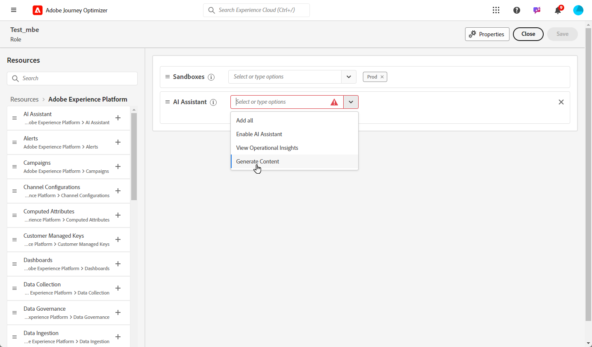

# Get started with the AI Assistant in Journey Optimizer - Content Accelerator {#gs-content-assistant}

>[!CONTEXTUALHELP]
>id="ajo_ai_generation_settings"
>title="AI Assistant in Journey Optimizer for Content Acceleration"
>abstract="Once you have crafted and personalized your delivery, you can use the AI Assistant in Journey Optimizer for Content Acceleration to enhance your content. This feature simplifies the process of personalization and content improvement by allowing you to fine-tune the content by describing what you want to generate."

>[!CONTEXTUALHELP]
>id="ajo_ai_generation_context"
>title="Upload brand asset"
>abstract="The Upload brand asset menu enables you to add any brand asset containing content that can provide additional context for the AI Assistant in Journey Optimizer for Content Acceleration, or to select a previously uploaded asset. This option ensures that the AI Assistant has access to all necessary materials to enhance its functionality and relevance."

>[!CONTEXTUALHELP]
>id="ajo_ai_generation_start"
>title="Adobe Generative AI terms"
>abstract="Access to this feature is subject to your agreement to the Adobe Experience Cloud Generative AI User Guidelines. Please review any output from this feature for accuracy and ensure it is appropriate for your use case."
>additional-url="https://www.adobe.com/legal/licenses-terms/adobe-dx-gen-ai-user-guidelines.html" text="Adobe Generative AI User Guidelines"

>[!INFO]
>
>Immerse yourself in a hands-on experience with [our interactive demo](https://experienceleague.adobe.com/en/apps/journey-optimizer/ai-assistant-content-accelerator){target="_blank"}, designed to let you explore its features firsthand and fully understand its capabilities.

The AI Assistant in Adobe Journey Optimizer for Content Acceleration, powered by Microsoft Azure OpenAI and Adobe Firefly, brings proactive content variation suggestions for text and images. It is available for email, Push and SMS channels. This new capability provides a prompt based text and image generation. Image generation is managed with Adobe Firefly.

Use the AI Assistant in Adobe Journey Optimizer for Content Acceleration to optimize your message's impact by experimenting with different main titles and images. Generate multiple variant and build an experiment to compare them. Leveraging Journey Optimizer Content Experiment, you can define multiple message treatments in order to measure which one performs best for your target audience. You can choose to vary the delivery content, or subject. The message audience is randomly allocated to each treatment to determine which one works best in terms of the specified metric. Learn more about Content Experiment in [this section](../content-management/content-experiment.md).

>[!IMPORTANT]
>
>* Before starting using this capability, read out related [Guardrails and Limitations](#generative-guardrails).
>
>
>* You must agree to a [user agreement](https://www.adobe.com/legal/licenses-terms/adobe-dx-gen-ai-user-guidelines.html){target="_blank"} before you can use the AI Assistant in Adobe Journey Optimizer for Content Acceleration. For more information, contact your Adobe representative.

## Access the AI Assistant Content Accelerator {#generative-access}

To access the AI Assistant in Adobe Journey Optimizer for Content Acceleration feature, users need to be granted the **Generate Content** permission. [Learn more](../administration/permissions.md)

+++  Learn how to assign Content generation related permissions

1. In the **Permissions** product, go to the **Roles** tab and select the desired **Role**.

1. Click **Edit** to modify the permissions.

1. Add the **AI assistant** resource, then select **Generate Content** from the drop-down menu.

    {zoomable="yes"}

1. Click **Save** to apply changes.

    Any users already assigned to this role will have their permissions automatically updated.

1. To assign this role to new users, navigate to the **Users** tab within the **Roles** dashboard and click **Add User**.

1. Enter the user's name, email address, or choose from the list, then click **Save**.

1. If the user was not previously created, refer to the [this documentation](https://experienceleague.adobe.com/en/docs/experience-platform/access-control/abac/permissions-ui/users).

The user will receive an email with instructions to access your instance.

+++

## Guardrails and limitations {#generative-guardrails}

General guidelines for using the AI Assistant in Adobe Journey Optimizer for Content Acceleration for email generation are listed below:

* The quality of the generated content is strongly influenced by the marketing objective / prompt you define. Use well defined prompt for the GenAI model to accurately interpret. 
* Upload brand asset to have accurate, on brand content. Else, content is based on publicly available info. The uploaded content can be in the following formats: PDF, JPEG, PNG, or ZIP files (with supported file formats).
* The maximum size for uploaded brand asset is 50MB. Larger files or lots of images can work but the processing time is increased.
* Use brand specific or custom template to create your email content using AI Assistant in Adobe Journey Optimizer for Content Acceleration. Email templates with up to 8-10 images is recommended.
* Make sure to report any problematic outputs using the thumb up, thumb down or flag icons when selecting variants.
* Your use of the AI assistant is subject to the Adobe Experience Cloud Generative AI User Guidelines. [Learn more](https://www.adobe.com/legal/licenses-terms/adobe-dx-gen-ai-user-guidelines.html)
* As part of Adobe's commitment to promote transparency in the use of generative AI tools in media creation, Adobe will apply Content Credentials when content or a project that included a Firefly generated asset is downloaded or exported. [Learn more](https://helpx.adobe.com/firefly/using/content-credentials.html)

The following limitations apply to AI Assistant in Adobe Journey Optimizer for Content Acceleration:

* Supported language is English only. Non-English inputs may produce inconsistent or erroneous results. Issues arising from non-English responses will not be addressed or improved at the present time.
* Only available for the email, push, web and SMS channels.
* GenAI content might not always be accurate: please share your feedback so that our engineers can refine the models.
* You may upload multiple brand assets, but can leverage only one for a specific generation.

## AI Assistant content generation capabilities {#generative-features}

<table style="table-layout:fixed"><tr style="border: 0;">
<td>

<a href="generative-email.md"><strong>Email generation</strong></a>

</td>
<td>

<a href="generative-sms.md"><strong>SMS generation</strong>

</td>
<td>

<a href="generative-push.md"><strong>Push notification generation</strong></a>

</td>
<td>

<a href="generative-web.md"><strong>Web page generation</strong>

</td>
</tr></table>
