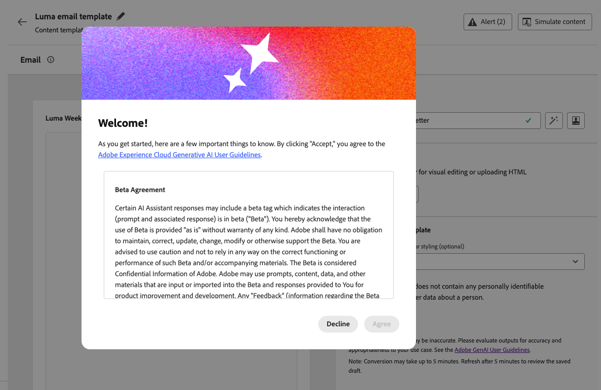
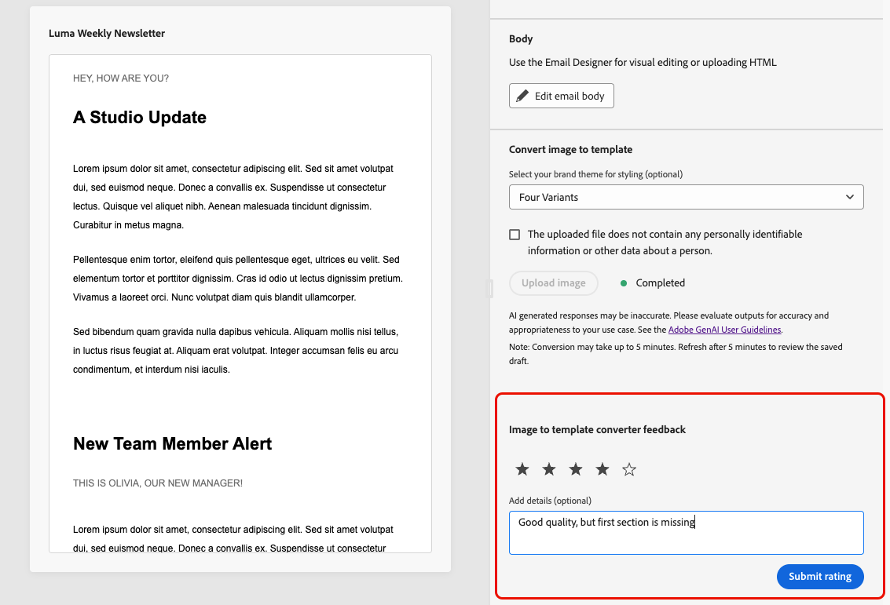

# Convert images to email content templates {#image-to-html}

[!DNL Journey Optimizer] helps you dramatically speed up email creation by converting static image designs into fully customizable, modular email content templates.

>[!AVAILABILITY]
>
>To use this feature, your organization must have signed the [!DNL Generative AI] addendum with Adobe. If you are unsure, contact your Adobe representative.
>
>This capability is available for the Email channel only.

By leveraging generative AI technology, an integrated tool analyzes the layout, typography, colors, and visual elements in your image and generates clean, modular HTML content that maintains design fidelity while ensuring full editability with the [Email Designer](../email/get-started-email-design.md). 

This no-code capability enables marketers to transform visual assets from graphic designers or design tools into responsive, editable email templates that can be saved and reused across multiple journeys and campaigns—without requiring technical expertise.

>[!IMPORTANT]
>
>Before starting to use this feature, read out related [Guardrails and recommendations](#limitations).

The main key benefits are as follows:

* **Faster than hand-coding** - The converter turns images into editable content in minutes, so you can skip the manual time-consuming mockup-to-HTML workflow.
* **No technical skills needed** - Marketers can produce and adjust templates without design or development support.
* **Reusable across campaigns** - Save templates to your library and use them in any journey or campaign.
* **Stays true to the design** - Output matches your layout and styling while being fully compatible with the Email Designer.

<!--
* **Design fidelity**: Maintain visual consistency with your original design while creating fully editable content
* **Email compatibility**: Generate HTML that works seamlessly with the Email Designer and across email clients
-->

+++ Common use cases

The image to HTML converter is ideal for:

* **Platform migration**: Migrating from another email marketing platform? Convert your existing email designs into [!DNL Journey Optimizer]-ready HTML templates without rebuilding from scratch.
* **Design mockup conversion**: Transform design mockups from tools like Photoshop, Figma, or other design software into functional email templates.
* **Quick template creation**: Generate email templates rapidly for time-sensitive campaigns without waiting for developer resources.
* **Building template libraries**: Create a comprehensive library of brand-consistent templates that non-technical team members can customize and deploy.
* **Reducing technical dependencies**: Enable marketers to create and iterate on email templates independently, speeding up campaign execution.

+++

## Access the image to HTML converter {#access-image-to-html}

**Addendum with Adobe**

To access this feature, your organization must have signed the [!DNL Generative AI] addendum with Adobe. If you are unsure, contact your Adobe representative.

**Permissions**

* To access and create templates, your role must include the **[!UICONTROL Manage content templates]** permission (under the **Content Management** resource). [Learn more about permissions](../administration/permissions.md)

* To use the image to HTML converter, you need to be granted the **Generate Content** permission. Learn how to assign Content generation related permissions in [this section](../content-management/gs-generative.md#generative-access).

**Agreement**

Before you can leverage this feature, you must agree to a user agreement which displays the first time you use Generative AI in [!DNL Journey Optimizer]. For more information, read the [Adobe Experience Cloud Generative AI User Guidelines](https://www.adobe.com/legal/licenses-terms/adobe-gen-ai-user-guidelines.html){target="_blank"}.

## Guardrails and recommendations {#limitations}

Be aware of the following limitations and recommendations when converting images to email content templates.

**Appropriateness**

* **AI interpretation**: The AI generates static HTML content based on visual interpretation of your image. It provides a strong starting point for email creation, but should be reviewed and refined using the Email Designer to ensure it meets your exact requirements. You must add personalization, dynamic content, and tracking manually after conversion if needed.

* **Text accuracy**: While the AI attempts to recognize and reproduce text accurately, always verify text content and make corrections as needed. Check the [Adobe Generative AI User Guidelines](https://www.adobe.com/legal/licenses-terms/adobe-gen-ai-user-guidelines.html){target="_blank"}.

**Image selection**

* **PII and sensitive data**: Make sure to select an image that does not contain any personally identifiable information (PII) or other sensitive data.

* **Image size**: You cannot upload images larger than 10MB.

* **High-quality images**: For best results, use clear, high-quality images: sharp visuals, readable text, and well-defined layout elements. Blurry, dark, or cluttered images reduce conversion quality. Images should ideally be between 600-800 pixels wide to match standard email dimensions.

* **Simple layouts**: Highly complex designs with intricate layering, unusual shapes, or non-standard elements may not convert perfectly. Simpler designs generally yield better results.

**Processing**

* **Refresh the page**: The result is not shown automatically until you refresh.

* **Processing time**: Conversion often finishes within **about 5 minutes**, depending on complexity and image size. Very large or complex images can sometimes take up to 10 minutes; wait accordingly, then refresh to view the result.

<!--
* **Background processing**: The AI processing happens in the background, so you can work on other tasks without keeping the screen open. The template is automatically saved as a draft once the conversion is complete.

**Feedback is welcome!** Use the dedicated section to share your thoughts and suggestions with Adobe to help us improve the feature.
-->

## Convert an image to an HTML template {#convert-image}

To convert an image design into a fully customizable email content template, follow the steps below.

1. Ensure you have an image file in JPEG or PNG format containing your email design.

    >[!IMPORTANT]
    >
    >The image size cannot exceed **10MB**. For best results, use a **clear, high-quality image** with sharp visuals, readable text, and well-defined layout elements.

1. Access the content template list by selecting **[!UICONTROL Content Management]** > **[!UICONTROL Content templates]** from the left menu.

1. Click **[!UICONTROL Create template]**.

1. Fill in the template details and select **[!UICONTROL Email]** as the channel and click **[!UICONTROL Create]**.

1. In the **[!UICONTROL Convert image to template]** section, perform the following steps:

   * (Optional) If your organization has brand themes defined in Journey Optimizer, you can select a theme as input so that the generated HTML is styled according to your brand theme parameters. [Learn more about themes](../email/apply-email-themes.md)

        Styling such as background color, button color, fonts, line spacing, margins, and padding will be applied to the generated template, reducing additional design work and producing a template that is ready to use with minimal edits.

   * To be able to upload an image, make sure it does not contain any personally identifiable information (PII) or other sensitive data. Check the corresponding option to acknowledge that you have reviewed the file.

   * Click the **[!UICONTROL Upload image]** button to select your image file.

        {width=80%}
    
        >[!CAUTION]
        >
        >When you upload an image for conversion, all content currently added in the email will be deleted and replaced with the generated template.

1. If this is the first time you are using Generative AI in [!DNL Journey Optimizer], you will be asked to agree to the user agreement. To learn more, check out the [Adobe Generative AI User Guidelines](https://www.adobe.com/legal/licenses-terms/adobe-gen-ai-user-guidelines.html){target="_blank"}.

    {width=50%}

    Click **[!UICONTROL Agree]** to continue.

1. After selecting the image, click **[!UICONTROL Open]** to start the AI-powered conversion process, which often completes within **about 5 minutes**—depending on the complexity and size of your image design.

    >[!NOTE]
    >
    >Very large images may take up to 10 minutes in some cases. You can navigate away from this screen and work on other tasks while the conversion is in progress.

1. **Refresh the page** to see the output. Once the conversion is complete, the generated content displays and is automatically saved as a draft.

    >[!IMPORTANT]
    >
    >The result is not shown automatically until you refresh.

    {width=90%}

1. Use the **[!UICONTROL Image to template converter feedback]** section to share your thoughts and suggestions with Adobe to help us improve the feature.
    {width=70%}

1. Click **[!UICONTROL Edit email body]**. The converted template opens in the [Email Designer](../email/get-started-email-design.md) with full editing capabilities. You can now:

    * Review, edit text content and apply personalization
    * Modify images and add links
    * Adjust colors, fonts, and styling
    * Add, remove, or rearrange content components
    * Leverage all Email Designer features as with any other template

    

    Make any necessary adjustments to refine the template and match your brand guidelines.

1. Once satisfied with your template, click **[!UICONTROL Save]**.

Your template is now available in the content template library and can be used when creating emails in journeys or campaigns. [Learn how to use content templates](../email/use-email-templates.md)

## Best practices {#best-practices}

To achieve optimal results when converting images to email content templates, follow these recommendations.

+++Before you start

* **Save existing content**: Converting an image replaces all existing content in your email template. Always save your current work before using this feature.
* **Plan your workflow**: Use this feature at the beginning of your email creation process, or ensure you're ready to replace all current content.

+++

+++Image preparation

* **Resolution**: Use high-resolution images for better text recognition and element detection.
* **Clarity**: Use a clear image—text must be easy to read and visual elements well-defined; avoid blurry, low-contrast, or noisy source files.
* **Width**: Design images at standard email widths (600-800px) to match typical email client requirements.
* **File format**: Use JPEG or PNG format - avoid compressed or low-quality images.
* **Complete design**: Include the full email design in a single image, from header to footer.

+++

+++Design considerations

* **Simple layouts**: Simpler, well-structured layouts convert more accurately than highly complex designs.
* **Standard elements**: Use common email design patterns (header, body sections, CTAs, footer).
* **Text legibility**: Ensure sufficient contrast between text and backgrounds.
* **Web-safe fonts**: Designs using common web-safe fonts will have better fidelity.
* **Avoid overlapping elements**: Keep design elements clearly separated for better structure recognition.

+++

+++After conversion

* **Refresh to see results**: After about 5 minutes (or up to 10 minutes for very large images), refresh the page so the completed conversion appears.
* **Review your draft**: Once conversion is complete, your template is automatically saved as a draft. Take time to carefully review the generated content for accuracy.
* **Test thoroughly**: Test the email across different email clients and devices. [Learn how to preview and test content](preview-test.md).
* **Refine manually**: Make adjustments as needed using the [Email Designer](../email/get-started-email-design.md)'s full editing capabilities.
* **Brand alignment**: Verify colors, fonts, and styling match your brand guidelines, using themes if available. [Learn more about email themes](../email/apply-email-themes.md).
* **Personalization**: Add dynamic content and personalization tokens as required. [Learn more about personalization](../personalization/personalize.md).
* **Accessibility**: Review and enhance accessibility features if needed. [Learn more about accessible email content](../email/accessible-content.md).

+++

+++Feedback is welcome!

Use the dedicated section to share your thoughts and suggestions with Adobe to help us improve the feature.

+++

## Frequently asked questions {#faq}

+++What happens to my existing email content when I convert an image to a content template?

All existing content in your email will be deleted and replaced with the newly generated template when you upload an image for conversion. Make sure to save any important content before using this feature. It's best to this capability at the beginning of your email creation process.

+++

+++What file formats are supported?

The converter supports JPEG (.jpg, .jpeg) and PNG (.png) image formats.

+++

+++How long does the conversion process take?

Conversion often finishes within about 5 minutes, depending on the complexity and size of your image design. Very large images can sometimes take up to 10 minutes; allow extra time, then refresh. The AI processing happens in the background, so you can navigate away and work on other tasks—you do not need to keep the screen open. Once the conversion is complete, your file is automatically saved as a draft for you to review and edit.

+++

+++Can I edit the generated template?

Yes! The generated content template opens in the Email Designer with full editing capabilities. You can modify all aspects of the template, including text, images, styling, layout, and structure.

+++

+++What happens if the conversion doesn't match my design exactly?

The AI does its best to accurately interpret your design, but some manual refinement may be needed. Use the Email Designer to adjust any elements that need fine-tuning.

+++

+++Can I use this feature for landing pages or other content types?

The image to HTML converter is currently designed specifically for email content templates. For other content types, use the standard design and import options available in the Email Designer.

+++

+++Do I need special permissions to use this feature?

This capability is available to all customers who have signed the [!DNL Gen AI] addendum with Adobe. If you are unsure whether your organization has signed the addendum, contact your Adobe representative.

+++

+++Can I reuse converted templates across multiple campaigns?

Yes! Templates created with the image to HTML converter are automatically saved to the Content Templates library. You can access and reuse them in any email across your journeys and campaigns. [Learn more](content-templates.md)

+++

+++Can I use this for platform migration?

Yes! The image to HTML converter is ideal for migrating from other email marketing platforms. Simply export or screenshot your existing email designs from your previous platform, and convert them into AJO-ready HTML templates without needing to rebuild them from scratch.

+++

## Related topics {#related-topics}

* [Get started with content templates](content-templates.md)
* [Create content templates](create-content-templates.md)
* [Use email templates](../email/use-email-templates.md)
* [Leverage email themes](../email/apply-email-themes.md)
* [Get started with email design](../email/get-started-email-design.md)
