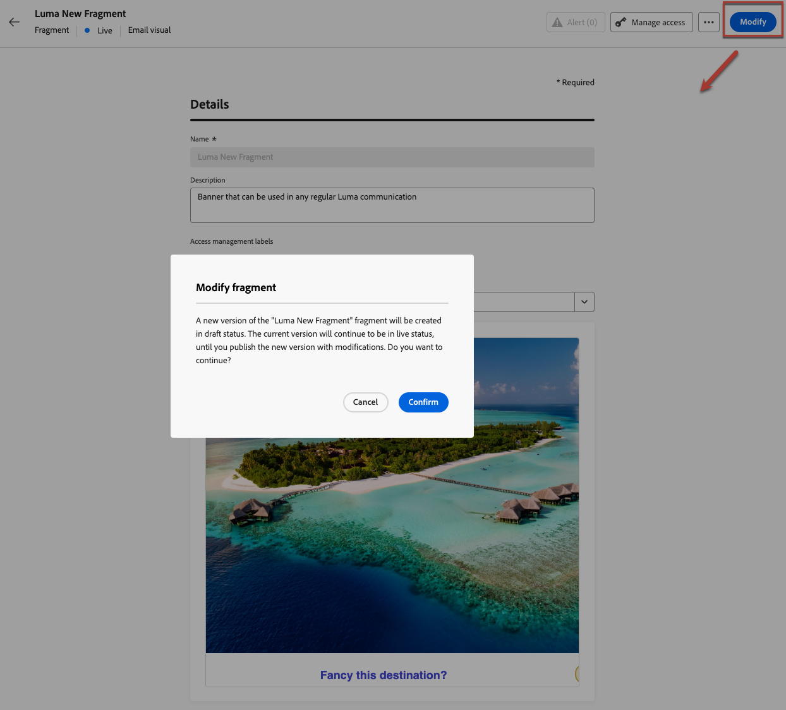

# Add contextual attributes to published fragments {#adding-contextual-attributes}

>[!AVAILABILITY]
>
>This capability is only available for select customers and involves significant risks. Confirm with your Adobe representative that this capability is enabled for your organization.

By default, adding new [personalization attributes](../personalization/personalization-build-expressions.md) to a published fragment is not supported. Once a fragment is published, the set of profile or contextual attributes is locked for all campaigns and journeys.

However, for select customers, it is possible to add **contextual attributes** only to published fragments.

>[!WARNING]
>
>When adding personalization attributes to a published fragment, the validation process is less stringent and errors may not be detected. This could cause unintended breakages across journeys and campaigns using that fragment at scale.

## Guardrails and limitations {#limitations}

* Make sure all journeys and campaigns that currently use the fragment can handle the new contextual attributes.
* Profile attributes cannot be added to published fragments. Only contextual attributes are supported.
* Contextual attributes must be manually entered into the code editor—they cannot be selected from the personalization editor UI.
* When adding personalized attributes to live fragments, validations are relaxed, which means errors may not be detected and could cause unintended breakages at scale.
* Once published, any errors will immediately impact all communications using that fragment.

## Add contextual attributes {#add-contextual-attributes}

To add contextual attributes to a published fragment, follow the steps below.

>[!IMPORTANT]
>
>Only proceed if you fully [understand the impacts](#limitations) on journeys and campaigns referencing the fragment.

1. Navigate to **[!UICONTROL Content Management]** > **[!UICONTROL Fragments]**.

1. Select the published fragment and click **[!UICONTROL Modify]** to create a draft version.

    {width="70%" align="left"}

1. Click **[!UICONTROL Edit]** to open the fragment content editor.

1. Switch to **[!UICONTROL Code editor]** or **[!UICONTROL Advanced mode]** in the personalization editor.

1. Manually type or copy-paste the contextual attribute using the `{{context.attribute_name}}` syntax:

    Example for a `promotionCode` attribute:

    ```
    {{context.promotionCode}}
    ```

    >[!CAUTION]
    >
    >Double-check the attribute path for accuracy. Errors may not be detected and could disrupt journey or campaign communications at scale.

1. Save your changes.

1. Once confirmed, click **[!UICONTROL Publish]** to make your changes live.

>[!NOTE]
>To avoid unintended breakages across journeys and campaigns, you can test the contextual attribute paths in a non-production environment.

## Related topics {#related-topics}

* [Manage fragments](manage-fragments.md)
* [Edit a fragment](manage-fragments.md#edit-fragments)
* [API-triggered campaigns](../campaigns/api-triggered-campaigns.md)
* [Personalization syntax](../personalization/personalization-syntax.md)
