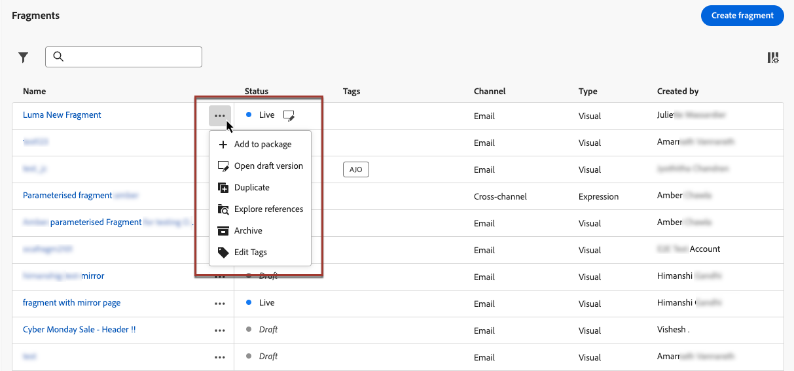

# Manage fragments {#manage-fragments}
 
## Access fragments {#access-fragments}

To manage your fragments, access the fragment list from the **[!UICONTROL Content Management]** > **[!UICONTROL Fragments]** left menu.

All the fragments that were created on the current sandbox - either [from the **[!UICONTROL Fragments]** menu](#create-fragments), either using the [Save as fragment](#save-as-fragment) option - are displayed.

You can filter fragments on their:

* Status (Draft or Live)
* Type (visual or expression)
* Creation or modification date
* State (archived or not)
* Tags

{width="90%" align="left"}

You can also choose to show all fragments, or only the items that the current user created or modified.

From the **[!UICONTROL More actions]** button next to each fragment, you can:

* Add it to a package for export. [Learn more](#export)
* If a live fragment is being edited, open the draft version of this fragment. [Learn more](#edit-fragments)
* Duplicate the fragment.
* Use the **[!UICONTROL Explore references]** option to see the journeys, campaigns or templates where it is used. [Learn more](#explore-references)
* Archive the fragment. [Learn more](#archive-fragments)
* Edit the fragment's tags. [Learn how to work with Unified tags](../start/search-filter-categorize.md#tags)

{width="70%" align="left"}

## Fragments' statuses

>[!CONTEXTUALHELP]
>id="ajo_fragment_statuses"
>title="New fragments statuses"
>abstract="Since **Draft** and **Live** statuses have been introduced with Journey Optimizer June release, all fragments created before this release have the **Draft** status, even if they are used in a journey or campaign. If you make any change to these fragments, you need to publish them to make them **Live** and propagate the changes to the associated campaigns and journeys. You also need to create a new journey/campaign version and publish it.  Publishing requires the <a href="https://experienceleague.adobe.com/en/docs/journey-optimizer/using/access-control/privacy/ootb-product-profiles#content-library-manage">Publish Fragment</a> user permission."
>additional-url="https://experienceleague.adobe.com/en/docs/journey-optimizer/using/access-control/privacy/ootb-product-profiles#content-library-manager" text="Learn more on content fragments permissions"

Fragments can have multiple statuses:

* **[!UICONTROL Draft]**: The fragment is being edited and has not been approved.

* **[!UICONTROL Live]**: The fragment has been approved and is live. [Learn how to publish a fragment](../content-management/create-fragments.md#publish)

    When a live fragment is being edited, a specific icon next to its status displays. Click this icon to open the draft version of the fragment.

* **[!UICONTROL Publishing]**: The fragment has been approved and is being published.
* **[!UICONTROL Archived]**: The fragment has been archived. [Learn how to archive fragments](#archive-fragments)

>[!CAUTION]
>
>Since **Draft** and **Live** statuses have been introduced with Journey Optimizer June release, all fragments created before this release have the **Draft** status, even if they are used in a journey or campaign. If you make any change to these fragments, you need to publish them to make them **Live** and propagate the changes to the associated campaigns and journeys. You also need to create a new journey/campaign version and publish it. Publishing requires the [Publish Fragment](../administration/ootb-product-profiles.md#content-library-manager) user permission.

## Edit a fragment {#edit-fragments}

>[!CONTEXTUALHELP]
>id="ajo_fragments_update_campaigns"
>title="Fragments update in campaigns"
>abstract="This campaign won't be updated if you publish changes to the fragment. It requires a new version to be published so that fragment update functionality can be supported."

>[!CONTEXTUALHELP]
>id="ajo_fragments_update_journeys"
>title="Fragments update in journeys"
>abstract="This journey won't be updated if you publish changes to the fragment. It requires a new version to be published so that fragment update functionality can be supported."

To edit a fragment, follow the steps below.

1. Click the desired fragment from the **[!UICONTROL Fragments]** list. The fragment properties screen opens with a preview of its content.

1. You can check the list of journeys, campaigns and content templates where the fragment is currently being used. To do so, select the **[!UICONTROL Explore references]** option from the More action button. [Learn more](#explore-references)

1. If the fragment being edited has the **[!UICONTROL Live]** status, click the **[!UICONTROL Modify]** button to create a draft version of the fragment. Click **[!UICONTROL Confirm]**.

    {width="70%" align="left"}

    >[!NOTE]
    >
    >The current version of the fragment will continue to be live, until you publish the new updated version.

1. Make the desired changes to the fragment details if needed.

1. To modify the fragment's content, click the **[!UICONTROL Edit]** button and update your content as you would do when creating a fragment from scratch. [Learn how to create a fragment](create-fragments.md#content)

    {width="70%" align="left"}

    >[!NOTE]
    >
    >When editing a published fragment, you can remove any personalization field, but you cannot add new ones to the fragment content. If you want to add personalized attributes, you must duplicate the fragment. [Learn more](#adding-new-attributes)

1. Once your changes are ready, save them and click the **[!UICONTROL Publish]** button to make your modifications live. [Learn more](create-fragments.md#publish)

When you edit a fragment, the changes are automatically propagated to all contents using that fragment, including live journeys and campaigns - except for contents where you have broken inheritance from the original fragment.

>[!NOTE]
>
>Learn how to break inheritance in the [Add visual fragments to your emails](../email/use-visual-fragments.md#break-inheritance) and [Leverage expression fragments](../personalization/use-expression-fragments.md#break-inheritance) sections.

### Add new attributes to a live fragment {#adding-new-attributes}

>[!WARNING]
>
>Adding new [personalized attributes](../personalization/personalization-build-expressions.md) to a live fragment is not supported.

Once a fragment is published, the set of personalized or contextual attributes is locked for all campaigns and journeys that reference it.

To incorporate additional attributes to a live fragment, follow the steps below.

1. Duplicate the existing fragment using the **[!UICONTROL More actions]** button.

    {width="70%" align="left"}

1. Select the duplicated fragment to open it and click the **[!UICONTROL Edit]** button.

1. [Add the new desired attributes](../personalization/personalization-build-expressions.md#add) to the duplicated fragment, such as personalization fields.

    {width="70%" align="left"}

1. Save your changes and publish the new fragment. [Learn how](create-fragments.md#publish)

1. Update any campaigns or journeys to reference the updated fragment where the new attributes were added.

    * [Learn how to use visual fragments](../email/use-visual-fragments.md)
    * [Learn how to use expression fragments](../personalization/use-expression-fragments.md)

## Explore references {#explore-references}

You can display the list of the journeys, campaigns and content templates that are currently using a fragment. To do so, select **[!UICONTROL Explore references]** from the **[!UICONTROL More actions]** menu either in the fragment list or in the fragment properties screen.

{width="70%" align="left"}

Select a tab to toggle between journeys, campaigns, templates and fragments. You can see their status and click a name to be redirected to the corresponding item where the fragment is referenced.

{width="70%" align="left"}

>[!NOTE]
>
>If the fragment is used in a journey, campaign or template that has a label preventing you from accessing it, you will see an alert message on top of the selected tab. [Learn more on Object Level Access Control (OLAC)](../administration/object-based-access.md)

## Archive fragments {#archive-fragments}

You can clean the fragment list from the items that are no longer relevant to your brand.

To do so, click the **[!UICONTROL More actions]** button next to the desired fragment and select **[!UICONTROL Archive]**. It will disappear from the fragment list, which prevents users from using it in future emails or templates.

{width="70%" align="left"}

>[!NOTE]
>
>If you archive a fragment that is used in a content, <!--it will remain in the email or template, but you won't be able to select it from the fragment list to edit it-->that content will not be affected.

To unarchive a fragment, filter on the **[!UICONTROL Archived]** items and select **[!UICONTROL Unarchive]** from the **[!UICONTROL More actions]** menu. It is now again accessible from the fragment list, and can be used in any email or template.

{width="70%" align="left"}

## Export fragments to another sandbox {#export}

Journey Optimizer allows you to copy a fragment from one sandbox to another. For example, you can copy a fragment from your Stage sandbox environment to your Production sandbox.

The copy process is carried via a **package export and import** between the source and target sandboxes. Detailed information on how to export objects and import them into a target sandbox are available in this section: [Copy objects to another sandbox](../configuration/copy-objects-to-sandbox.md).
