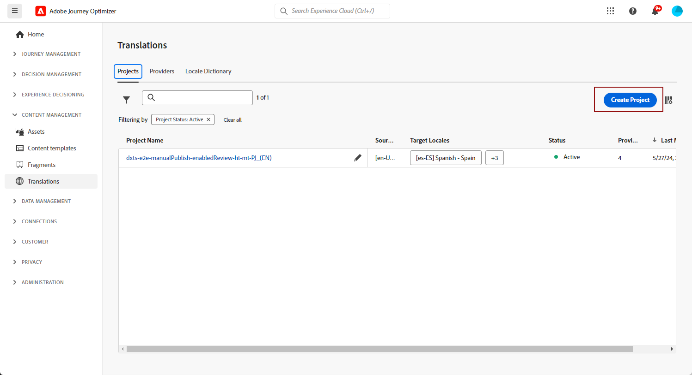
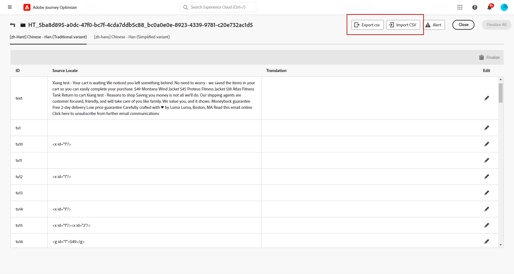
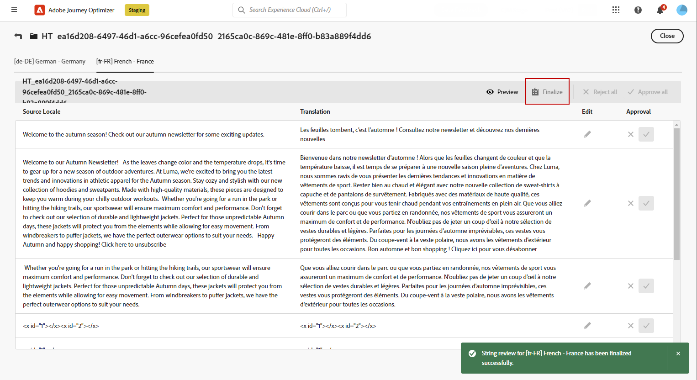

# Create multilingual content with automated translation {#multilingual-automated}

>[!CONTEXTUALHELP]
>id="ajo_multi_add_provider"
>title="Add provider"
>abstract="Add translation providers and locales as needed. This allows you to manage which providers and locales are active for your project, giving you the flexibility to adjust resources and target audiences based on your current requirements and project scope."

>[!CONTEXTUALHELP]
>id="ajo_multi_edit_provider"
>title="Edit provider"
>abstract="Modify existing translation providers and add locales as required. This functionality enables you to control which providers and locales are active for your project, offering you the flexibility to adjust resources and target specific audiences according to your current needs and project goals." 

>[!AVAILABILITY]
>
>Multilingual content is currently only available for a set of organizations (Limited Availability). To gain access, contact your Adobe representative.

Using the automated flow, you can simply select your target language and language provider. Your content is then directly sent to translation, ready for a final review upon completion. 

Follow these steps to create multilingual content using automated translation: 

1. [Create your locale](#create-locale).

1. [Create a language project](#create-translation-project).

1. [Create language settings](#create-language-settings).

1. [Create a multilingual content](#create-a-multilingual-campaign).

1. [Review your translation task (optional)](#review-translation-project).

## Create locale {#create-locale}

>[!CONTEXTUALHELP]
>id="ajo_multi_add_locale"
>title="Add locale"
>abstract="When configuring your language preferences, you have the option to create additional locales if the desired one is not available for your multilingual content." 

When configuring your language settings, as described in the [Create your language settings](#language-settings) section, if a specific locale is not available for your multilingual content, you have the flexibility to create as many new locales as required using the **[!UICONTROL Translation]** menu.

1. From the **[!UICONTROL Content management]** menu, access **[!UICONTROL Translation]**.

1. From the **[!UICONTROL Locale dictionary]** tab, click **[!UICONTROL Add locale]**.

    

1. Select your Locale code from the **[!UICONTROL Language]** list and the associated **[!UICONTROL Region]**.

1. Click **[!UICONTROL Save]** to create your Locale.

    

## Create translation project {#translation-project}

>[!CONTEXTUALHELP]
>id="ajo_multi_create_project"
>title="Create Project"
>abstract="To begin creating multilingual content, start your translation project by identifying the target locale, selecting the appropriate language or regional dialect for your audience. After that, choose a translation provider that aligns with your project's needs."

>[!CONTEXTUALHELP]
>id="ajo_multi_edit_project"
>title="Edit Project"
>abstract="Update your translation project to incorporate additional locales, allowing you to expand your content to reach a broader audience." 

Start your translation project by specifying the Target Locale, indicating the specific language or region for your content. You can then choose your Translation Provider.

1. From the **[!UICONTROL Translation]** menu under **[!UICONTROL Content management]**, click **[!UICONTROL Create project]** in the **[!UICONTROL Projects]** tab.

    

1. Type-in a **[!UICONTROL Name]** and **[!UICONTROL Description]**.

1. Select the **[!UICONTROL Source locale]**.

    

1. Choose if you want to enable the following options:

    * **[!UICONTROL Automatically publish approved translations]**: Once translations are approved, they are automatically integrated into the campaign without the need for manual intervention.
    * **[!UICONTROL Enable Review workflow]**: Only applicable to human-translated locales. This allows an internal reviewer to efficiently evaluate and either approve or reject translated content. [Learn more](#review-translation-project)

1. Click **[!UICONTROL Add locale]** to access the menu and define the languages for your translation project.

    If a **[!UICONTROL Locale]** is missing, you can manually create it beforehand from the **[!UICONTROL Translation]** menu or by API. Refer to [Create a new Locale](#create-locale).

    

1. Select from the list your **[!UICONTROL Target locale(s)]** and choose which **[!UICONTROL Translation provider]** you want to use for each locale.

    **[!UICONTROL Translation provider]** settings can be accessed from the **[!UICONTROL Translation]** menu in the **[!UICONTROL Administration]** menu section.

    >[!NOTE]
    >
    >Contract management with the Translation Provider falls outside the scope of this feature. Please ensure that you have a valid and active contract in place with the designated Translation Partner.
    >
    > The Translation Provider holds ownership of the translated content's quality.

1. Click **[!UICONTROL Add a locale]** when you finished linking your Target locale with the correct Translation provider. Then, click **[!UICONTROL Save]**. 

    Note that if a provider is greyed out for a target locale, it indicates that the provider does not support that particular locale. 

    

1. Click **[!UICONTROL Save]** when your translation project is configured.

Your Translation project is now created and can be used in a multilingual campaign.

## Create language settings {#language-settings}

In this section, you can set your primary language and its associated locales for managing your multilingual content. You can also choose the attribute that you want to use to look up information related to profile language.

1. From the **[!UICONTROL Administration]** menu, access **[!UICONTROL Channel]** > **[!UICONTROL General settings]**.

1. In the **[!UICONTROL Language settings]** menu, click **[!UICONTROL Create language settings]**.

    

1. Type-in the name of your **[!UICONTROL Language settings]**.

1. Choose the **[!UICONTROL Translation project]** option.

1. From the **[!UICONTROL Translation project]** field, click **[!UICONTROL Edit]** and choose your previously created **[!UICONTROL Translation project]**. 
    
    Your previously configured Locales are automatically imported.

    

1. From the **[!UICONTROL Sending preference]** menu, select the attribute that you want to look up to find information on profile languages. 

1. Click **[!UICONTROL Edit]** next to your **[!UICONTROL Locale]** to further personalize it and to add **[!UICONTROL Profile preferences]**.

    

1. If your **[!UICONTROL Translation project]** is updated, click **[!UICONTROL Refresh]** to reflect these changes in your **[!UICONTROL Language settings]**.

    

1. Click **[!UICONTROL Submit]** to create your **[!UICONTROL Language settings]**.

<!--
1. Access the **[!UICONTROL channel configurations]** menu and create a new channel configuration or select an existing one.

1. In the **[!UICONTROL Header parameters]** section, select the **[!UICONTROL Enable multilingual]** option.

1. Select your **[!UICONTROL Locales dictionary]** and add as many as needed.
-->

## Create a multilingual content {#create-multilingual-campaign}

Once you have set up your Translation project and Language settings, you are ready to create your campaign or journey and customize your content for your different locales.

1. Begin by creating and configuring your Email, SMS or Push notification [campaign](../campaigns/create-campaign.md) or [journey](../building-journeys/journeys-message.md) according to your requirements.

1. Once your primary content is created, click **[!UICONTROL Save]** and head back to the campaign configuration screen.

1. Click **[!UICONTROL Add languages]**.  [Learn more](#create-language-settings)

    

1. Select your previously created **[!UICONTROL Language settings]**.

    

1. Now that your Locales are imported, click **[!UICONTROL Send to translate]** to forward your content to the previously selected Translation provider.

    

1. After your content is sent for translation, it is no longer editable. To make changes to the original content, click the lock icon.

    Note that if you wish to make any alterations to this content, you will need to create a new translation project and resend it for translation.

    

1. Click **[!UICONTROL Open translation]** to access your Translation project and review it.

    
    
1. In this page, follow the status of your translation project:

    * **[!UICONTROL Translation in progress]**: Your service provider is actively working on the translation.

        If you selected **Insourcing** when configuring your **Language settings**, you can translate your content directly in your Translation project. [Learn more](#manage-ht-project)

    * **[!UICONTROL Ready for review]**: The review process is ready to begin, giving you the ability to access the translation and either reject or approve it.

        If you selected the **[!UICONTROL Enable review worflow]** in your **[!UICONTROL Translation project]**, you can review the translation directly in Journey Optimizer after completion by your selected Translation provider. [Learn more](#review-translation-project)

    * **[!UICONTROL Reviewed]**: Translation has been approved and ready to be pusblished and sent to the campaign.

    * **[!UICONTROL Ready to publish]**: Machine translation has been completed and can now be sent to your campaign.

    * **[!UICONTROL Completed]**: Translation is now available in your campaign.

    

1. Once your translation is completed, your multilingual content is ready to be sent.

    

1. Click **[!UICONTROL Review to activate]** to display a summary of the campaign.

    The summary allows you to modify your campaign if necessary, and to check if any parameter is incorrect or missing.

1. Browse through your multilingual content to see the rendering in each language.

    

1. Check that your campaign is correctly configured, then click **[!UICONTROL Activate]**.

    >[!IMPORTANT]
    >
    > If your campaign is subject to an approval policy, you will need to request approval in order to be able to send your multilingual campaign. [Learn more](../test-approve/gs-approval.md)

You can now activate your campaign or journey. Once sent, you can measure the impact of your multilingual journey or campaign within reports.

## Manage Insourcing translation project {#manage-ht-project}

>[!CONTEXTUALHELP]
>id="ajo_multi_insourcing_project"
>title="Insourcing translation project"
>abstract="Insourcing translation project allows you to manage and execute translations directly within your Translation project, streamlining the process and maintaining greater control over the translation quality and consistency."

If you selected Insourcing when configuring your Language settings, you can translate your content directly in your Translation project.

1. From your **[!UICONTROL Translation project]**, access the **[!UICONTROL More actions]** menu and select **[!UICONTROL Insourcing]**.

    

1. You can export your CSV file for translation using external translation software. Alternatively, you can import the CSV file back into your translation project by clicking the **[!UICONTROL Import CSV]** button.

    

1. Click **[!UICONTROL Edit]** to add your translation content.

    

1. If you are ready to publish the translated text, click **[!UICONTROL Finalize]**. 

## Review your translation project {#review-translation-project}

>[!CONTEXTUALHELP]
>id="ajo_multi_review_project"
>title="Review your translation project"
>abstract="Once your chosen translation provider has completed the translation, you can review the results directly within Journey Optimizer. This allows you to assess the accuracy and quality of the translation, ensuring that it aligns with your expectations and project requirements before finalizing it."

>[!CONTEXTUALHELP]
>id="ajo_multi_preview_project"
>title="Preview your translation project"
>abstract="The Preview window allows you to view how your translated content appears in each language. This feature helps you examine the rendering and ensure that the content is displayed correctly and effectively across all selected languages."

If you selected the **[!UICONTROL Enable review worflow]** in your **[!UICONTROL Translation project]**, you can review the translation directly in Journey Optimizer after completion by your selected Translation provider.

Note that if this option is disabled, once the translation is finished by your provider, the translation task status is automatically set to **[!UICONTROL Reviewed]**, allowing you to quickly proceed by clicking **[!UICONTROL Publish]**.

1. Once your translation has been completed from your service provider, you can access the translation for review from your **[!UICONTROL Translation project]** or directly from your **[!UICONTROL Campaign]**.

    From the **[!UICONTROL More actions]** menu, click **[!UICONTROL Review]**.

    

1. From the Review window, browse through your translated content and accept or reject each translation strings. 

    

1. Click **[!UICONTROL Edit]** to change content of your translation string.

    

1. Enter your updated translation and click **[!UICONTROL Confirm]** when finished.

    

1. You can also choose to **[!UICONTROL Reject all]** or **[!UICONTROL Approve all]** directly. 

    When selecting **[!UICONTROL Reject all]**, add a comment and click **[!UICONTROL Reject]**.

1. Click **[!UICONTROL Preview]** to check the rendering of your translated content in each language.

1. If you are ready to publish the translated text, click **[!UICONTROL Finalize]**. 

    

1. From your **[!UICONTROL Translation project]**, select one of your project to access more details. If you rejected the translation, you can choose to send it back to translation.

    

1. Once your **[!UICONTROL Translation project]** status is set to Reviewed, you can send it to your Campaign. 

    From the **[!UICONTROL More actions]** menu, click **[!UICONTROL Publish]**.

    

1. In your Campaign, check that your translation status has changed to **[!UICONTROL Translation complete]**. You can now send your multilingual content, refer to step 10 in [this section](#create-multilingual-campaign).

    

<!--
# Create a multilingual journey {#create-multilingual-journey}

1. Create your journey with a Delivery and personalize your content as needed.
1. From your delivery action, click Edit content.
1. Click Add languages.

-->
