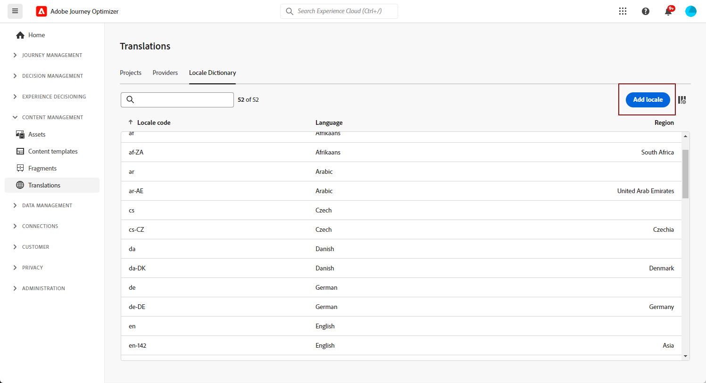
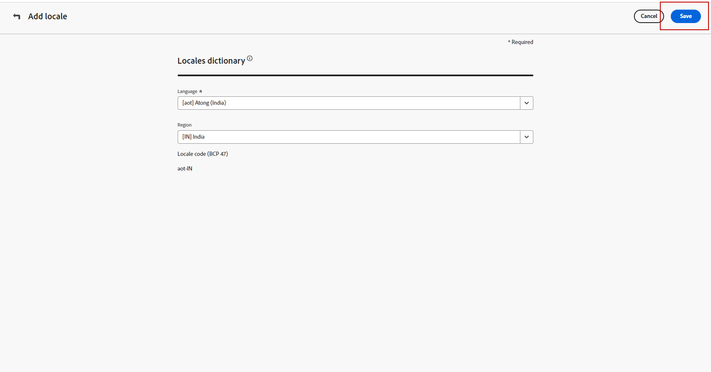

# Create locale {#multilingual-locale}

>[!BEGINSHADEBOX]

**On this page:** Learn how to create new locales from the Translation menu when a needed language or region is not available for your multilingual content.

>[!ENDSHADEBOX]

>[!CONTEXTUALHELP]
>id="ajo_multi_add_locale"
>title="Add locale"
>abstract="When configuring your language preferences, you have the option to create additional locales if the desired one is not available for your multilingual content." 

When configuring your language settings, as described in the [Create your language settings](multilingual-manual.md#language-settings) section, if a specific locale is not available for your multilingual content, you have the flexibility to create as many new locales as required using the **[!UICONTROL Translation]** menu.

1. From the **[!UICONTROL Content management]** menu, access **[!UICONTROL Translation]**.

1. From the **[!UICONTROL Locale dictionary]** tab, click **[!UICONTROL Add locale]**.

    

1. Select your Locale code from the **[!UICONTROL Language]** list and the associated **[!UICONTROL Region]**.

1. Click **[!UICONTROL Save]** to create your Locale.

    
