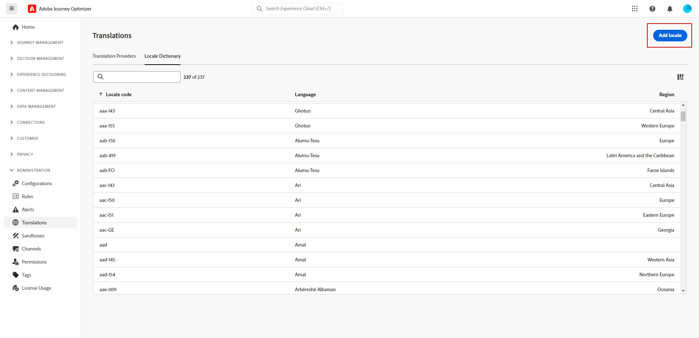

# Create multilingual content with manual translation {#multilingual-manual}

>[!AVAILABILITY]
>
>Multilingual content is currently only available for a set of organizations (Limited Availability). To gain access, contact your Adobe representative.

Using the manual flow, you can effortlessly translate your content directly in your Email, Push notification or SMS campaign and journey, giving you precise control and customization options for your multilingual messages. Additionally, you can easily import pre-existing multilingual content with the Import HTML option.

Follow these steps to create multilingual content using manual translation: 

1. [Create your locale](#create-locale).

1. [Create language settings](#create-language-settings).

1. [Create a multilingual content](#create-a-multilingual-campaign).

## Create locale {#create-locale}

When configuring your language settings, as described in the [Create your language settings](#language-settings) section, if a specific locale is not available for your multilingual content, you have the flexibility to create as many new locales as required using the **[!UICONTROL Translation]** menu.

1. From the **[!UICONTROL Content management]** menu, access **[!UICONTROL Translation]**.

1. From the **[!UICONTROL Locale dictionary]** tab, click **[!UICONTROL Add locale]**.

    

1. Select your Locale code from the **[!UICONTROL Language]** list and the associated **[!UICONTROL Region]**.

1. Click **[!UICONTROL Save]** to create your Locale.

    

## Create language settings {#language-settings}

In this section, you can set your primary language and its associated locales for managing your multilingual content. You can also choose the attribute that you want to use to look up information related to profile language

1. From the **[!UICONTROL Administration]** menu, access **[!UICONTROL Channel]**.

1. In the **[!UICONTROL Language settings]** menu, click **[!UICONTROL Create language settings]**.

    

1. Type-in the name of your **[!UICONTROL Language settings]**.
   
1. Select the **[!UICONTROL Locales]** associated to this settings. You can add a maximum of 50 locales.

    If a **[!UICONTROL Locale]** is missing, you can manually create it beforehand from the **[!UICONTROL Translation]** menu or by API. Refer to [Create a new Locale](#create-locale).

    

1. From the **[!UICONTROL Sending preference]** menu, select the attribute that you want to look up to find information on profile languages.

    

1. Click **[!UICONTROL Edit]** next to your **[!UICONTROL Locale]** to further personalize it and to add **[!UICONTROL Profile preferences]**.

    

1. Select other **[!UICONTROL Locales]** from the Profile preferences drop-down and click **[!UICONTROL Add profiles]**.

1. Access the advanced menu of your **[!UICONTROL Locale]** to define your **[!UICONTROL Primary locale]**, i.e. the default language if the profile attribute is not specified. 

    You can also delete your locale from this advanced menu.

    

1. Click **[!UICONTROL Submit]** to create your **[!UICONTROL Language settings]**.

<!--
1. Access the **[!UICONTROL Channel surfaces]** menu and create a new channel surface or select an existing one.

1. In the **[!UICONTROL Header parameters]** section, select the **[!UICONTROL Enable multilingual]** option.

1. Select your **[!UICONTROL Locales dictionary]** and add as many as needed.
-->

## Create a multilingual content {#create-multilingual-campaign}

After setting up your multilingual content, you are ready to craft your campaign or journey and customize the content for each of your selected locales.

1. Begin by creating and configuring your Email, SMS or Push notification [campaign](../campaigns/create-campaign.md) or [journey](../building-journeys/journeys-message.md) according to your requirements.

    >[!AVAILABILITY]
    >
    >We recommend including only one translation project per journey.

1. Create or import your original content and personalize it as needed.

1. Once your primary content is created, click **[!UICONTROL Save]** and head back to the campaign configuration screen.

    

1. Click **[!UICONTROL Add languages]** and select your previously created **[!UICONTROL Language settings]**. [Learn more](#create-language-settings)

    

1. Access the advanced settings of the **[!UICONTROL Locales]** menu and select **[!UICONTROL Copy primary to all locales]**.

    

1. Now that your primary content is duplicated throughout your selected  **[!UICONTROL Locales]**, access each locale and click **[!UICONTROL Edit email body]** to translate your content.

    

1. You can choose to disable or enable locales with the **[!UICONTROL More action]** menu of your selected Locale.

    

1. To deactivate your Multilingual configuration, click **[!UICONTROL Add languages]** and select the language you wish to keep as local language.

    

1. Click **[!UICONTROL Review to activate]** to display a summary of the campaign.

    The summary allows you to modify your campaign if necessary, and to check if any parameter is incorrect or missing.

1. Browse through your multilingual content to see the rendering in each language.

    

You can now activate your campaign or journey. Once sent, you can measure the impact of your multilingual journey or campaign within reports.

<!--
# Create a multilingual journey {#create-multilingual-journey}

1. Create your journey with a Delivery and personalize your content as needed.
1. From your delivery action, click Edit content.
1. Click Add languages.

-->
