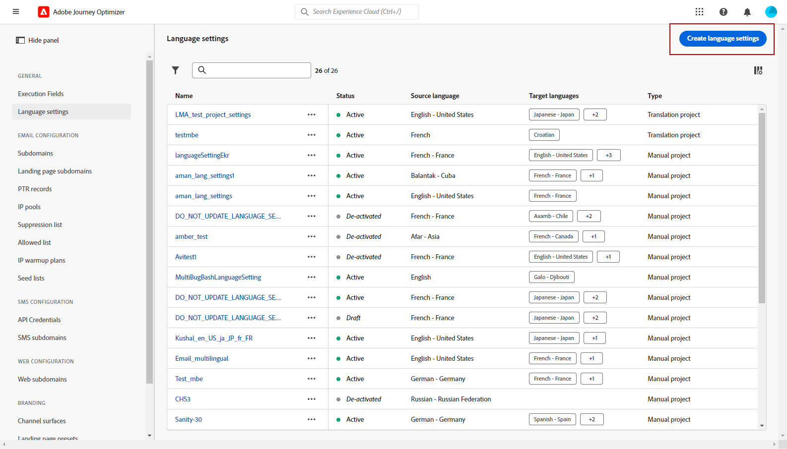
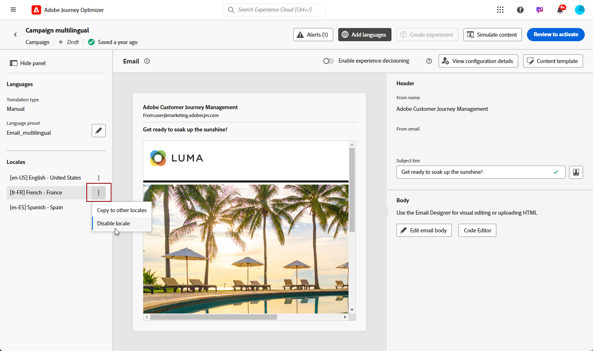

# Create multilingual content with manual translation {#multilingual-manual}

>[!IMPORTANT]
>
>For manual flow, users need to be granted the **[!UICONTROL Manage Language settings]** permission. 

Using the manual flow, you can effortlessly translate your content directly in your campaigns and journeys, giving you precise control and customization options for your multilingual messages. Additionally, you can easily import pre-existing multilingual content with the Import HTML option.

Follow these steps to create multilingual content using manual translation: 

1. [Add your provider (optional)](multilingual-provider.md)

1. [Add locales (optional)](multilingual-locale.md)

1. [Create language settings](#language-settings)

1. [Create a multilingual content](#create-multilingual-campaign)

## Create language settings {#language-settings}

In this section, you can set your different locales for managing your multilingual content. You can also choose the attribute that you want to use to look up information related to profile language

1. From the **[!UICONTROL Administration]** menu, access **[!UICONTROL Channel]** > **[!UICONTROL General settings]**.

1. In the **[!UICONTROL Language settings]** menu, click **[!UICONTROL Create language settings]**.

    

1. Type-in the name of your **[!UICONTROL Language settings]** and choose **[!UICONTROL Manual Translation]**.
   
1. Select the **[!UICONTROL Locales]** associated to this settings. You can add a maximum of 50 locales.

    If a **[!UICONTROL Locale]** is missing, you can manually create it beforehand from the **[!UICONTROL Translation]** menu or by API. Refer to [Create a new Locale](multilingual-locale.md).

    

1. Select a **[!UICONTROL Fallback preferences]** to define a backup option for when a profile does not meet the necessary criteria for content delivery.

    Note that if no fallback option is selected, the campaign or journey will not be sent.

1. Choose your sending preference from the following options:

    * **[!UICONTROL Select profile language preference attributes]**
    * **[!UICONTROL Create custom conditional rules]**

1. If you select **[!UICONTROL Select profile language preference attributes]**, choose the relevant attribute from the **[!UICONTROL Profile language preference attributes]** menu to look up profile language information.

    

1. If you select **[!UICONTROL Create custom conditional rules]**, select the locale for which you want to create conditions. Then, build rules based on factors like user location, language preferences, or other contextual elements.

    

1. Start creating conditions by adding an attribute, event, or audience to define your target group.

    >[!IMPORTANT]
    >
    >Contextual data is available exclusively for Web, In-App, Code-based Experience and Content cards channels. If used for Email, SMS, Push notification or Direct mail channels, without additional attributes, the campaign or journey will be sent in the language of the first option on the list.

    

    +++Prerequisites to use contextual events in your conditions

    When users display your content, a personalization request is sent along with the experience event. To leverage contextual data in your conditions, you must attach additional data to the personalization request payload. To do this, you need to create a rule in Adobe Experience Platform Data Collection to specify: IF a personalization request is sent, THEN attach extra data to the request, defining the attribute to match with the language field in your schema. 

    >[!NOTE]
    >
    >These prerequisites are required for the In-app and Content cards channels only.

    1. In Adobe Experience Platform Data Collection, access the **[!UICONTROL Rules]** menu and create a new rule. Detailed information on how to create rules is available in [!DNL Adobe Experience Platform] [Data Collection documentation](https://experienceleague.adobe.com/en/docs/experience-platform/collection/e2e#create-a-rule){target="_blank"}

    2. In the rule's **[!UICONTROL IF]** section, add an event configured as below:

        

        * Choose the **[!UICONTROL Extension]** you are working with.
        * In the **[!UICONTROL Event type]** field, select "AEP Request Event".
        * In the right pane, select "XDM Event Type equals personalization.request"
        * Click the **[!UICONTROL Keep changes]** button to confirm.

    3. In the rule's **[!UICONTROL THEN]** section, add an action configured as below:

        

        * Choose the **[!UICONTROL Extension]** you are working with.
        * In the **[!UICONTROL Action Type]** field, select "Attach Data".
        * In the JSON payload section, make sure that the attribute used to retrieve the language to use (in the example below "language") matches the name of the attribute specified in the schema where your data collection datastream is flowing into.

            ```JSON

            {
                "xdm":{
                    "application":{
                        "_dc":{
                            "language":"{%%Language%%}"
                        }
                    }
                }
            }
            
            ```

        * Click the **[!UICONTROL Keep changes]** button to confirm and save your rule.

    +++

1. Drag and drop the locales to reorder them and manage their priority in the list.

1. To delete a locale, click the bin icon.

    

1. Click **[!UICONTROL Submit]** to create your **[!UICONTROL Language settings]**.

Note that after setting up your language preferences, you will no longer have the option to edit them.

<!--
1. Access the **[!UICONTROL channel configurations]** menu and create a new channel configuration or select an existing one.


1. In the **[!UICONTROL Header parameters]** section, select the **[!UICONTROL Enable multilingual]** option.

1. Select your **[!UICONTROL Locales dictionary]** and add as many as needed.
-->

## Create a multilingual content {#create-multilingual-campaign}

After setting up your multilingual content, you are ready to craft your campaign or journey and customize the content for each of your selected locales.

1. Begin by creating and configuring your Email, SMS or Push notification [campaign](../campaigns/create-campaign.md) or [journey](../building-journeys/journeys-message.md) according to your requirements.

    >[!IMPORTANT]
    >
    >We recommend including only one translation project per journey.

1. Create or import your original content and personalize it as needed.

1. Once your content is created, click **[!UICONTROL Save]** and head back to the campaign configuration screen.

    

1. Click **[!UICONTROL Add languages]** and select your previously created **[!UICONTROL Language settings]**. [Learn more](#language-settings)

    

1. Choose the desired locale from the drop-down menu to apply to the existing authored content.

1. Access the advanced settings of the **[!UICONTROL Locales]** menu and select **[!UICONTROL Copy to all locales]**.

    

1. Now that your content is duplicated throughout your selected **[!UICONTROL Locales]**, access each locale and click **[!UICONTROL Edit email body]** to translate your content.

    

1. You can choose to disable or enable locales with the **[!UICONTROL More action]** menu of your selected Locale.

    

1. To deactivate your Multilingual configuration, click **[!UICONTROL Add languages]** and select the language you wish to keep as local language.

    

1. Click **[!UICONTROL Review to activate]** to display a summary of the campaign.

    The summary allows you to modify your campaign if necessary, and to check if any parameter is incorrect or missing.

1. Browse through your multilingual content to see the rendering in each language.

    

You can now activate your campaign or journey. Once sent, you can measure the impact of your multilingual journey or campaign within reports.

>[!IMPORTANT]
>
> If your campaign is subject to an approval policy, you will need to request approval in order to be able to send your multilingual campaign or journey. [Learn more](../test-approve/gs-approval.md)

<!--
# Create a multilingual journey {#create-multilingual-journey}

1. Create your journey with a Delivery and personalize your content as needed.
1. From your delivery action, click Edit content.
1. Click Add languages.

-->
