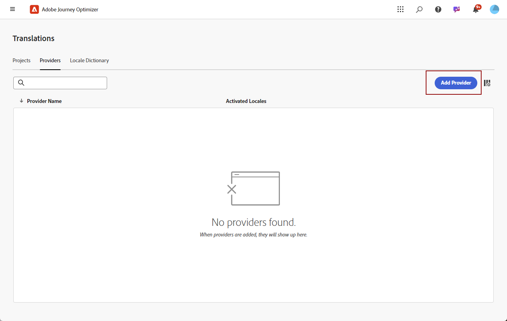
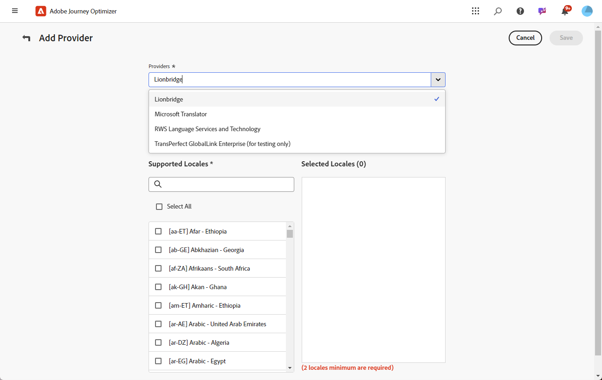
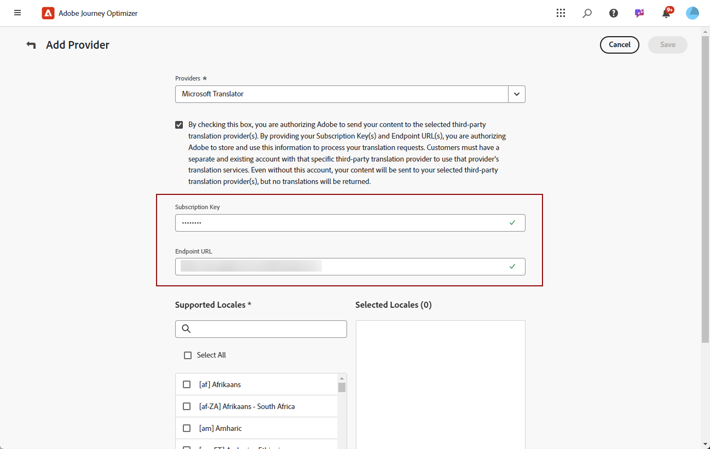
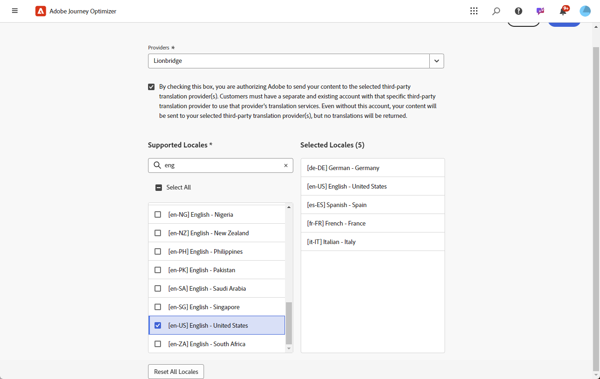

# Add language providers {#multilingual-provider}

>[!IMPORTANT]
>
> Your use of a Translation Provider's translation services is subject to additional terms and conditions from that applicable provider. As third-party solutions, translation services are available to Adobe Journey Optimizer users via an integration. Adobe does not control and is not responsible for third-party products.

Adobe Journey Optimizer integrates with third-party Translation Providers that offer both machine and human translation services, independent of Adobe Journey Optimizer.

Before adding your chosen Translation Provider, ensure you have created an account with the respective provider.

1. In the **[!UICONTROL Content Management]** menu, navigate to **[!UICONTROL Translation]**.

1. Access the **[!UICONTROL Providers]** tab and click **[!UICONTROL Add Provider]**.

    

1. From the **[!UICONTROL Providers]** drop-down list, choose the desired provider.

    >[!NOTE]
    >
    >To add a new **Provider** to the list, you can ask your **Provider** to follow the instructions detailed in [this document](https://developer.adobe.com/gcs/partner) to complete the onboarding process.

    

1. If using Microsoft Translator as the provider, input your **[!UICONTROL Subscription Key]** and **[!UICONTROL Endpoint URL]**.

    Click **[!UICONTROL Validate Credentials]** to test your connection.

    

1. Select the applicable **Supported Locales**.

    

1. After completing the configuration, click **[!UICONTROL Save]** to finalize the setup.
