# Set up a translation provider {#multilingual-provider}

>[!BEGINSHADEBOX]

**On this page:** Learn how to add and configure third-party translation providers and their supported locales so they can be used for your multilingual content.

>[!ENDSHADEBOX]

>[!IMPORTANT]
>
> Your use of a Translation Provider's translation services is subject to additional terms and conditions from that applicable provider. As third-party solutions, translation services are available to Adobe Journey Optimizer users via an integration. Adobe does not control and is not responsible for third-party products.

Adobe Journey Optimizer integrates with third-party Translation Providers that offer both machine and human translation services, independent of Adobe Journey Optimizer.

Before adding your chosen Translation Provider, ensure you have created an account with the respective provider.

## Add a translation provider {#providers}

Connect a translation provider and select the locales it supports to make it available for multilingual content.

1. In the **[!UICONTROL Content Management]** menu, navigate to **[!UICONTROL Translation]**.

1. Access the **[!UICONTROL Providers]** tab and click **[!UICONTROL Add Provider]**.

    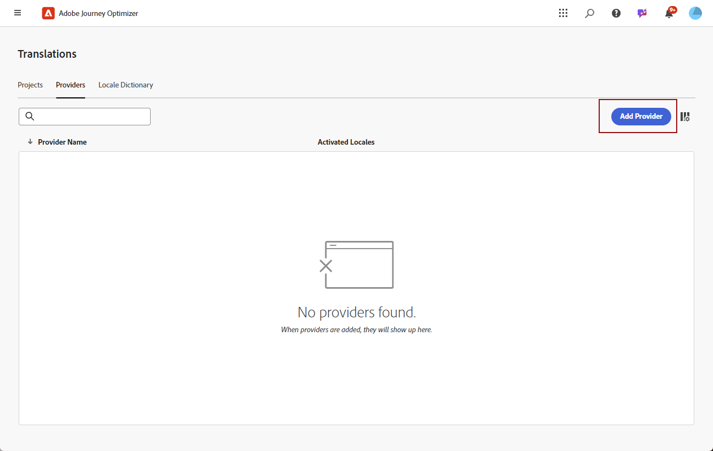

1. From the **[!UICONTROL Providers]** drop-down list, choose the desired provider.

    >[!NOTE]
    >
    >To add a new **Provider** to the list, you can ask your **Provider** to follow the instructions detailed in [this document](https://developer.adobe.com/gcs/partner) to complete the onboarding process.

    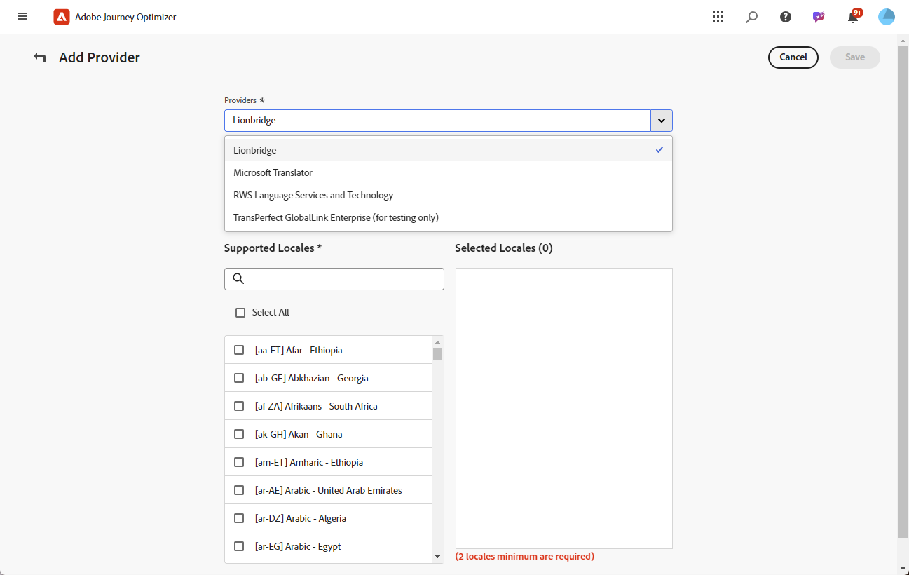

1. If using Microsoft Translator as the provider, input your **[!UICONTROL Subscription Key]** and **[!UICONTROL Endpoint URL]**.

    Click **[!UICONTROL Validate Credentials]** to test your connection.

    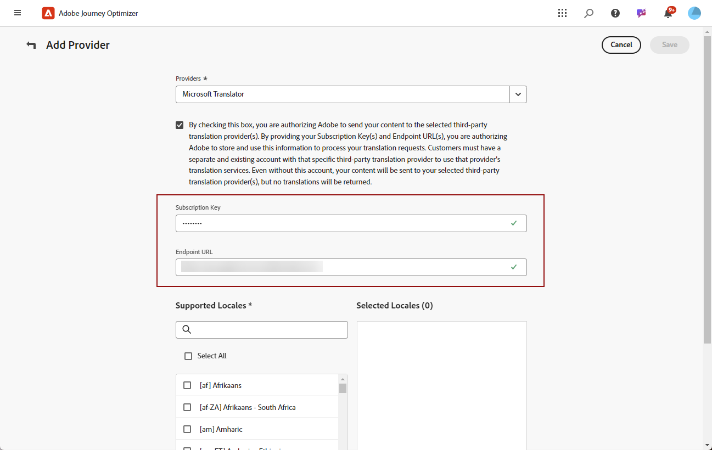

1. Select the applicable **Supported Locales**.

    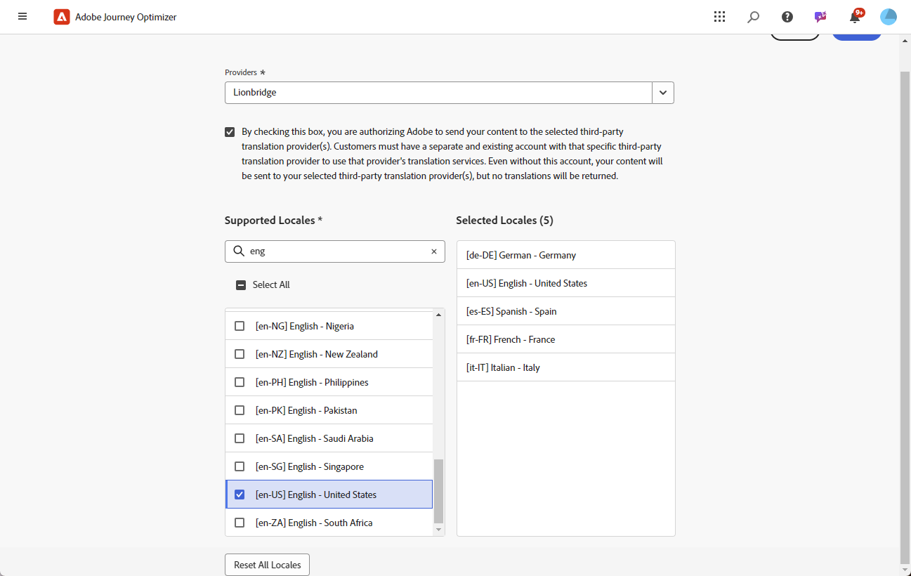

1. After completing the configuration, click **[!UICONTROL Save]** to finalize the setup.

Your Provider is now configured. To edit it, open the **[!UICONTROL Providers]** menu and click .

## Add an Agentic provider

Follow these steps to configure an Agentic Translation provider with an LLM and locale-specific translation guidelines.

1. In the **[!UICONTROL Content Management]** menu, navigate to **[!UICONTROL Translation]**.

1. Access the **[!UICONTROL Providers]** tab and click **[!UICONTROL Add Provider]**.

    

1. From the **[!UICONTROL Providers]** drop-down list, choose **[!UICONTROL Agentic Translation]**.

    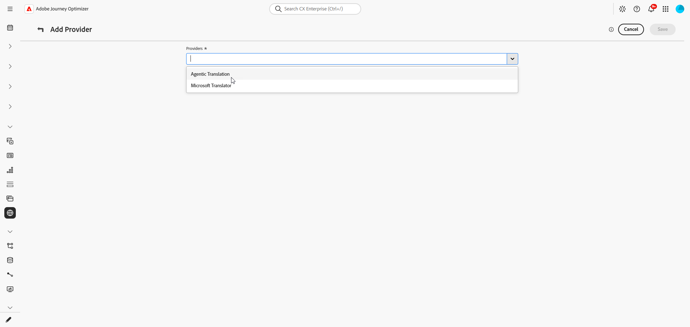

1. In the **[!UICONTROL LLM configuration]** menu, select a provider.

    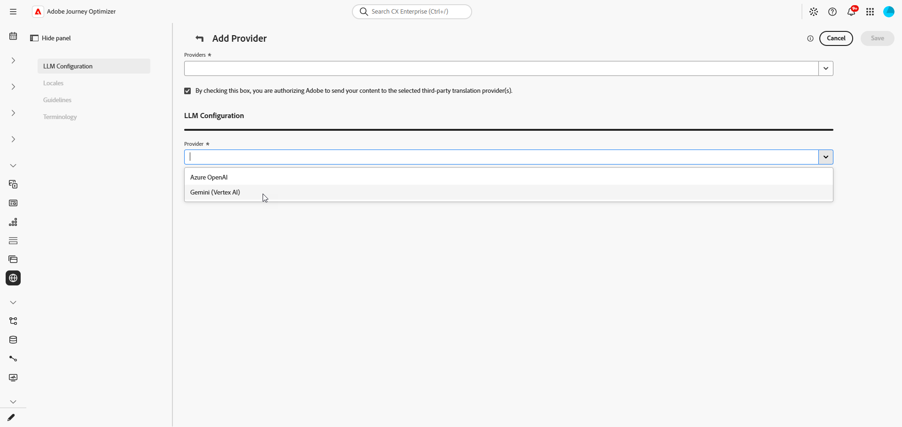

1. Enter the details for the selected provider:

    +++ **[!UICONTROL Azure OpenAI]**

    * **[!UICONTROL API Key]**: Provide the authentication key for your Azure OpenAI resource.
    * **[!UICONTROL API Version]**: Specify the Azure OpenAI API version to use.
    * **[!UICONTROL Model Name]**: Select or specify the name of the Azure OpenAI model.
    * **[!UICONTROL Base Path]**: Provide the endpoint URL for your Azure OpenAI resource.
    * **[!UICONTROL Deployment Name]**: Specify the deployment associated with the model.
  
    +++

    +++ **[!UICONTROL Gemini (Vertex AI)]**

    * **[!UICONTROL Model Name]**: Specify the Gemini model to use.
    * **[!UICONTROL Service Account Credentials]**: Upload or provide the credentials for your Google Cloud service account.
    * **[!UICONTROL Location]**: Select the Google Cloud region where the model is hosted.

    +++

1. Click **[!UICONTROL Save]** and access the **[!UICONTROL Locales]** tab.

1. Select the applicable **[!UICONTROL Supported Locales]**.

    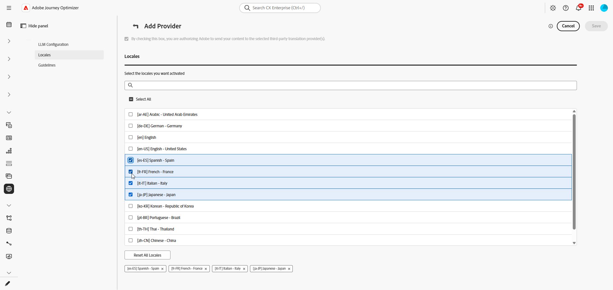

1. To configure guidelines for a locale, open the **[!UICONTROL Guidelines]** tab.

    You can click **[!UICONTROL Sample guideline]** to download the sample file.

    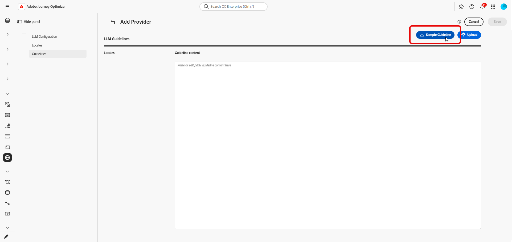

1. Click **[!UICONTROL Upload]**, then select one of the following options:

    * **[!UICONTROL Document upload]** to upload a PDF guideline.
    * **[!UICONTROL JSON upload]** to upload a guideline in the extracted JSON format.

1. Select the locale that the guideline applies to, and then upload the PDF or JSON file.

    Click **[!UICONTROL Upload file]**.

    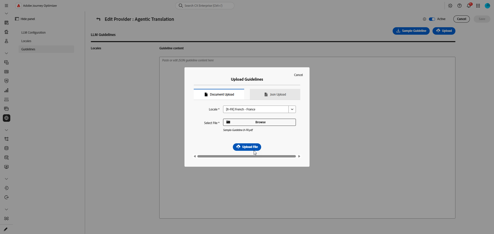

1. To update or delete an uploaded guideline, open  menu and select the appropriate action.

    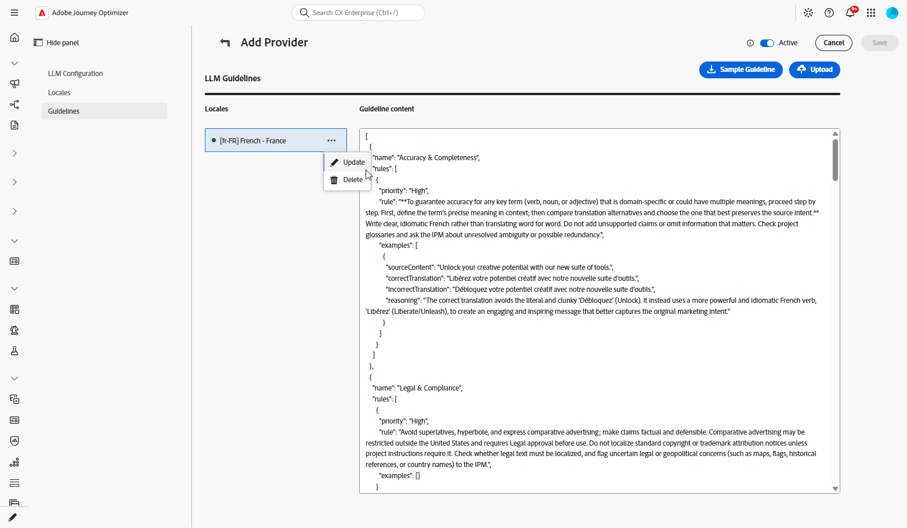

1. After completing the configuration, click **[!UICONTROL Save]** to finalize the setup.

Your Agentic provider is now configured. To edit it, open the **[!UICONTROL Providers]** menu and click .

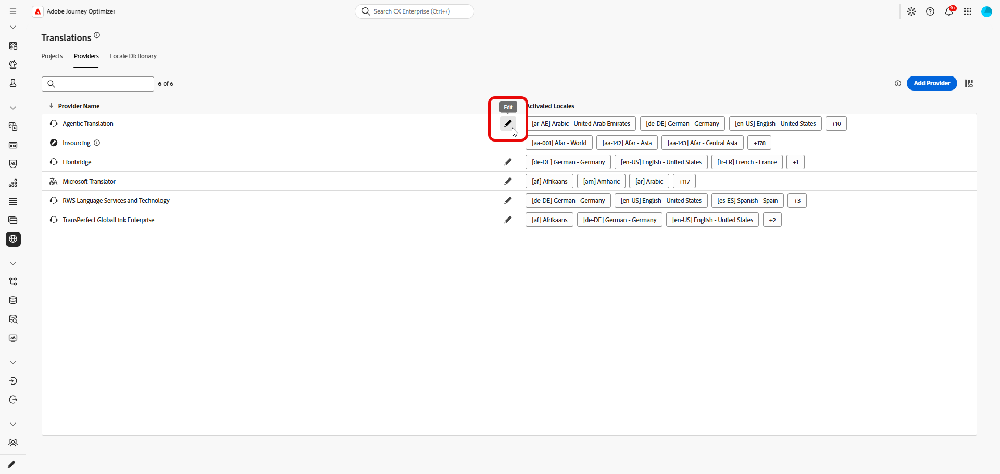

