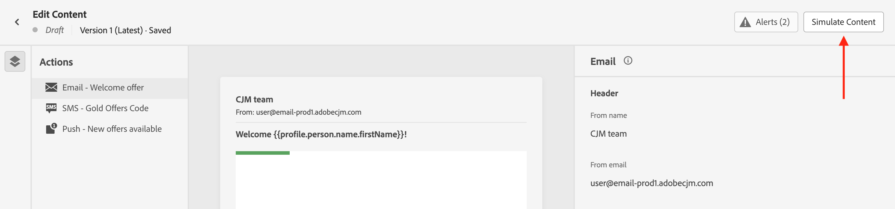

# Preview & test your content {#preview-test}

>[!CONTEXTUALHELP]
>id="ac_preview_testprofiles"
>title="Check how your content is rendering"
>abstract="Once your content has been defined, you can use test profiles to preview it and check if the rendering is correct according to the channel you are using."

>[!CONTEXTUALHELP]
>id="ajo_preview_simulate"
>title="Check how your content is rendering"
>abstract="Once your content has been defined, you can preview it and check if the rendering is correct according to the channel you are using."

Once your content has been defined, you can preview its content before sending the message. This is a crucial step to ensure that it is accurate but also free of errors both in content and personalization settings.

You can also send test deliveries of your email messages to specific recipients or subscribers for testing and validation, and check their rendering in popular desktop, mobile and web-based clients.

All these actions can be performed using the **[!UICONTROL Simulate Content]** button, which is accessible from the edit content screen of your message, or from the email and web designers for the email and web channels.

## Testing using test profiles data or sample input data {#methods}

Journey Optimizer provides two experiences to test your content:

* **Testing content using test profiles data**

    You can use test profiles to preview your content, send email proofs and check email rendering. If you have added personalized fields, you can check how they are displayed using test profile data. For more information, refer to these sections:

    ➡️ [Select test profiles](test-profiles.md)
    ➡️ [Preview using test profiles](preview.md)
    ➡️ [Send email proofs](proofs.md)
    ➡️ [Check email rendering](rendering.md)
    ➡️ [Preview & proof your email (video)](#video-preview)

* **Testing content variations using sample input data**
    
    [!DNL Journey optimizer] allows you to preview and send proofs for different variations of your content using sample input data uploaded from a CSV / JSON file, or added manually.
    
    All the profiles attributes used in your content for personalization are automatically detected by the system and can be used for your tests to create multiple variants.

    ➡️ [Simulate content variations](../test-approve/simulate-sample-input.md)

## Must-read

* **Required permissions** - You need to have the **[!DNL Manage Simulate Content]** permission included in the **[!DNL Content Library Manager]** product profile. [Learn more](../administration/ootb-product-profiles.md#content-library-manager).

    To send proofs, you must have **Approve and publish** permissions for the specific resource (campaign or journey) associated with the email. In addition, to send proofs in a journey, the **Publish journey** permission is also required. [Learn more about permissions](../administration/ootb-permissions.md).

* **Personalization with context data** - When previewing a message or sending proofs, only profile personalization data is displayed. Personalization based on context data, such as event information, can only be tested in the context of a journey. Learn how in [this use case](../personalization/personalization-use-case.md).

* **Preview content with multiple conditional variants** - When simulating or rendering proofs for emails containing multiple conditional variants, Journey Optimizer may require more processing time. If you experience timeouts or error messages, consider reducing the total number of variants or simplifying conditional rules. Learn more about conditional content on [this page](../personalization/dynamic-content.md).

## How-to video {#video-preview}

Learn how to use test profiles to test email rendering across inboxes, preview your personalized emails against test profiles, and send proofs.

>[!VIDEO](https://video.tv.adobe.com/v/3425026?quality=12)
