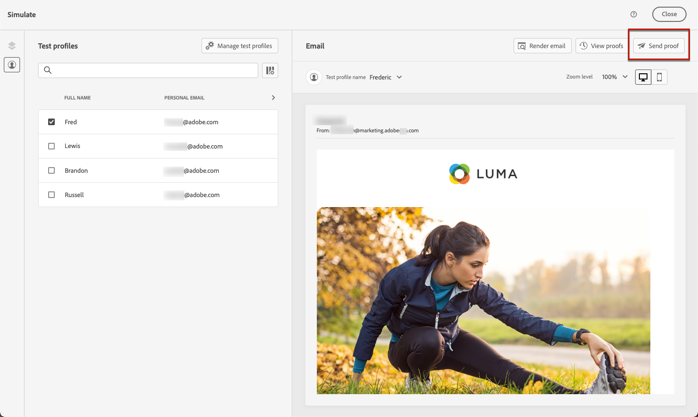
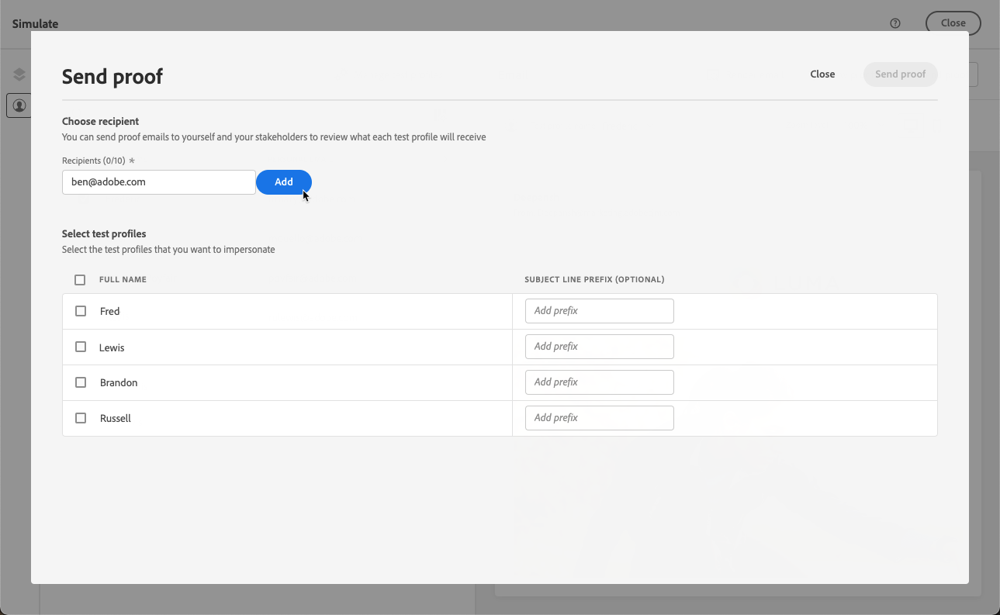
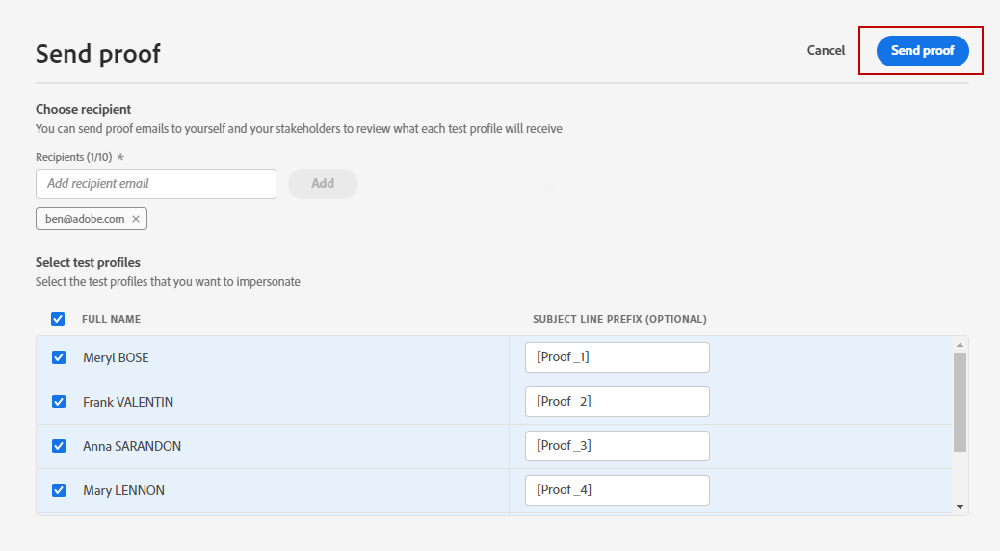
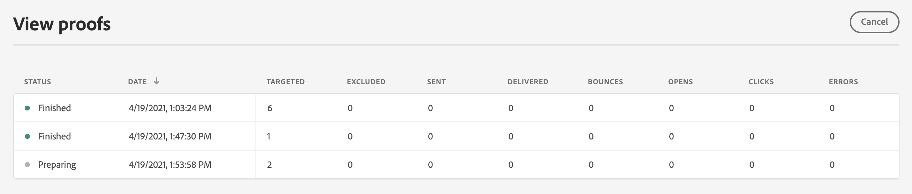

# Send proofs using test profiles data {#send-proofs}

A proof is a specific message that allows you to test a message before sending it to the main audience. Recipients of the proof are in charge of approving the message: rendering, content, personalization settings, configuration.

>[!NOTE]
>
>[!DNL Journey Optimizer] also allows you to test different variants of your content by previewing it and sending proofs using sample input data uploaded from a CSV / JSON file, or added manually. [Learn how to simulate content variations](../test-approve/simulate-sample-input.md)

## Must-read {#must-read}

**Frequency capping rules** - All existing frequency capping rules apply to proofs. If you have set [frequency capping rules](../conflict-prioritization/channel-capping.md) (e.g., maximum sends per profile), these limits also apply when sending proofs. If a test profile has already reached the frequency cap limit, proofs will show as finished but no email will be delivered. For repeated testing, consider using unique test profiles or adjusting frequency caps for proofing scenarios as needed.

**Mirror page** - In the proof sent, the link to the mirror page is not active. It is only activated in the final messages.

**Assets** - Assets and images have specific accessibility rules:

* Assets/Images are accessible in delivered content or proof content for up to 2 years (730 days) since their first publication in any fragment/inline message.
* Re-publishing is required after this expiry period (any time after 730 days) to keep them accessible for another 2 years.
* Any re-publication done within 730 days of the first publication will not extend the expiry of assets/images to the next 730 days.

## Send proofs {#send-proofs-steps}

To send email proofs using test profiles data, you must first select [test profiles](test-profiles.md). Then, follow these steps:

1. In the **[!UICONTROL Simulate]** screen, click the **[!UICONTROL Send proof]** button.

    

1. From the **[!UICONTROL Send proof]** window, type in your recipient's email and click **[!UICONTROL Add]** to send the proof to yourself or members of your organization.

    Note that you can add up to ten recipients for your proof delivery.

    

1. Select the **Test profiles** to use to personalize the message content.

    Each recipient of the proof receives as many messages as the number of selected test profiles. For example, if you added five recipient emails and selected ten test profiles, you will send fifty proof messages. Each recipient will receive ten of them.

1. You can add a prefix to the subject line of the proof if needed. Only alphanumeric characters and special characters such as . - _ ( ) [ ] are allowed as prefix to the subject line.

1. Click **[!UICONTROL Send proof]**.

    

1. Back in the **[!UICONTROL Simulate]** screen, click the  **[!UICONTROL View proofs]** button to check status.

    

It is recommended to send proofs after each modification to the message content.
