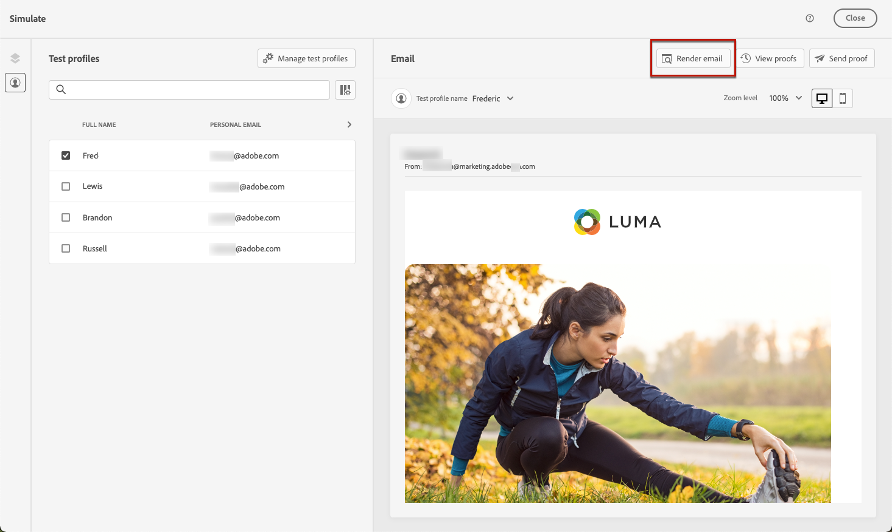
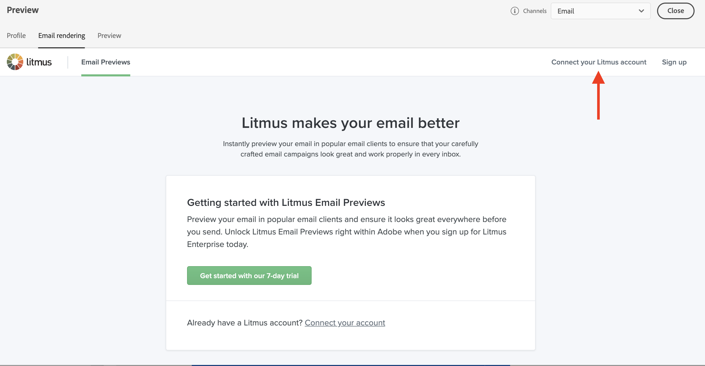
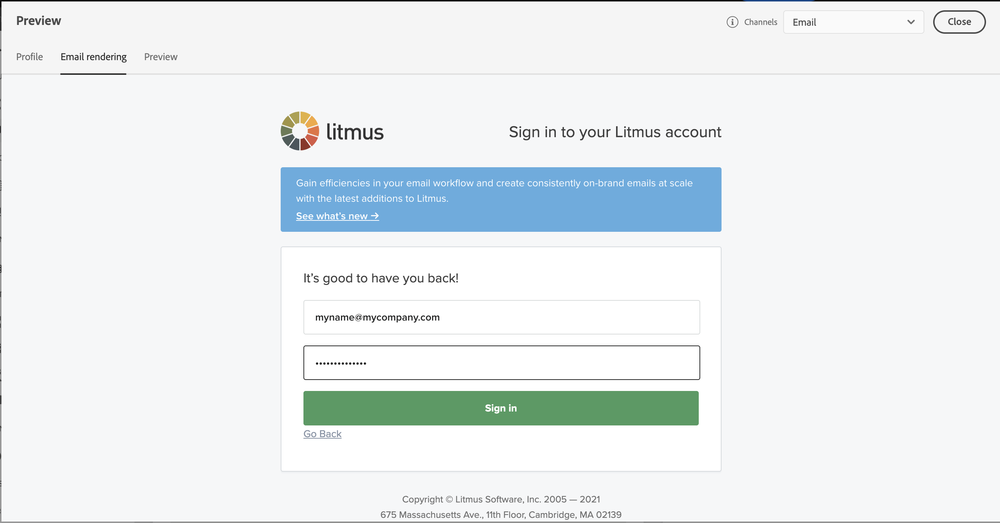
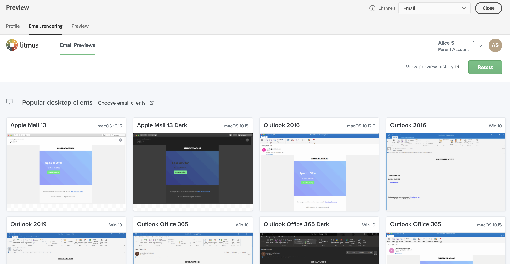

# Test email rendering {#email-rendering}

>[!BEGINSHADEBOX]

**On this page:** Learn how to connect your Litmus account to Adobe Journey Optimizer to test email rendering across popular email clients, and understand known rendering limitations including mobile web browser environments.

>[!ENDSHADEBOX]

You can leverage your **Litmus** account into [!DNL Journey Optimizer] to instantly preview your **email rendering** in popular email clients. You can then ensure your email content looks great and works properly in every inbox.

To check email rendering, follow these steps:

1. From the edit content screen of your message or in the Email Designer, click **[!UICONTROL Simulate content]**, then select **[!UICONTROL Simulate content (AEP profiles)]** from the dropdown.

1. Select the **[!UICONTROL Render email]** button.

    

1. Click **Connect your Litmus account** on the upper right section.

    

1. Enter your credentials and sign in.

    

1. Click the **Run test** button to generate email previews.

1. Check your email content in popular desktop, mobile and web-based clients.

    

>[!CAUTION]
>
>When connecting your **Litmus** account with [!DNL Journey Optimizer], you agree that test messages are sent to Litmus: once sent, these emails are no longer managed by Adobe. As a consequence, Litmus data retention email policy applies to these emails, including personalization data that may be included in these test messages.

## Mobile web browser limitations {#rendering-limitations}

Email rendering may differ when recipients open Gmail or Outlook **via a mobile web browser** (e.g., Chrome on a phone), rather than using a native mobile app or desktop client. This is a known limitation of mobile webmail environments and is not specific to Journey Optimizer.

This rendering difference stems from how webmail clients behave inside a mobile browser. The browser renders the full desktop webmail UI first, placing the email two layers deep — beyond the reach of any responsive CSS or media queries. Gmail Web additionally strips CSS `<style>` blocks and wraps email content in its own `
`, which can override your styles and create alignment conflicts.

Typical symptoms include text alignment shifting (left-aligned text appearing centered), extra white separator lines between content sections, and an overall layout that differs from the template design.

These issues only occur in Gmail Web and Outlook Web when accessed via a mobile browser. Outlook and Gmail native mobile apps, as well as all desktop clients, are not affected.

>[!TIP]
>
>To minimize the impact:
>
>* Use simple table-based layouts with fully inlined CSS.
>
>* Avoid relying on media queries or `<style>` blocks for critical layout properties such as text alignment.
