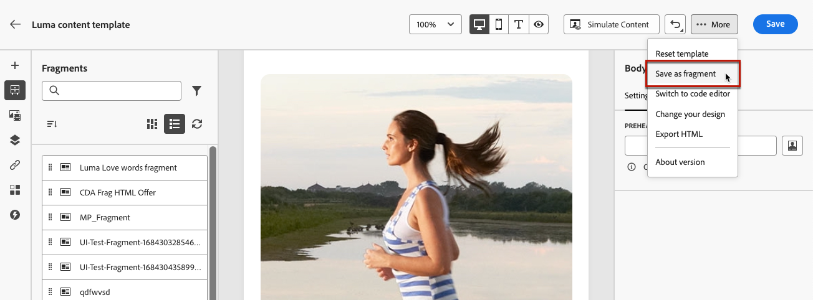

# Save content as fragment {#save-as-fragment}
 
When editing content in [!DNL Journey Optimizer], you can save all or part of your content as fragment for future reuse. You can save content as fragment either [from the Email Designer](#save-as-visual-fragment), or [from the expression editor](#save-as-expression-fragment).

## Save as visual fragment {#save-as-visual-fragment}

To save content from the Email Designer as fragment, follow these steps:

1. In the [Email Designer](../email/get-started-email-design.md), click the ellipsis on top right of the screen.

1. Select **[!UICONTROL Save as fragment]** from the drop-down menu.

    

1. The **[!UICONTROL Save as fragment]** screen displays. There select the elements you want to include into your fragment, including personalization fields and dynamic content. Note that contextual attributes are not supported in fragments.

    

    >[!CAUTION]
    >
    >You can only select sections that are adjacent to each other. You cannot select an empty structure or another fragment.

1. Click **[!UICONTROL Create]** and fill in the fragment name and description (if needed).

1. To assign custom or core data usage labels to the fragment, click the **[!UICONTROL Manage access]** button in the upper section of the screen. [Learn more on Object Level Access Control (OLAC)](../administration/object-based-access.md).

1. Select or create Adobe Experience Platform tags from the **Tags** field to categorize your template for improved search. [Learn more](../start/search-filter-categorize.md#tags)

1. Click **[!UICONTROL Create]**. The fragment is added to the [fragment list](#access-manage-fragments) with the **Draft** status. It becomes a standalone fragment that can be used as any other visual fragment from that list. 

    >[!NOTE]
    >
    >Any change to that new fragment is not propagated to the email or template it comes from. Similarly, when the original content is edited within that email or template, the new fragment is not modified.

1. In order to be able to use the fragment in your journeys and campaigns, you need to make it live. [Learn how to preview and publish a fragment](../content-management/create-fragments.md#publish)

## Save as expression fragment {#save-as-expression-fragment}

>[!CONTEXTUALHELP]
>id="ajo_perso_library"
>title="Save as expression fragment"
>abstract="The [!DNL Journey Optimizer] personalization editor allows you to save content as expression fragments. These expressions are then available to build personalized content."

The [!DNL Journey Optimizer] personalization editor allows you to save content as expression fragments. These expressions are then available to build personalized content.

To save content as an expression fragment, follow the steps below.

1. In the [personalization editor](../personalization/personalization-build-expressions.md) interface, build an expression, then click **[!UICONTROL Save as fragment]**. 

    >[!NOTE]
    >
    >Expressions cannot exceed 200KB.

1. In the right pane, enter a name and a description for the expression to help users find it more easily.

    

1. Click **[!UICONTROL Save fragment]**.

    <!--An expression fragment cannot be nested inside another fragment.-->

1. The fragment is added to the [fragment list](#access-manage-fragments) with the **Draft** status. It becomes a standalone fragment that can be used as any other expression fragment from that list. 

1. In order to be able to use the fragment in your journeys and campaigns, you need to make it live. [Learn how to preview and publish a fragment](../content-management/create-fragments.md#publish)
