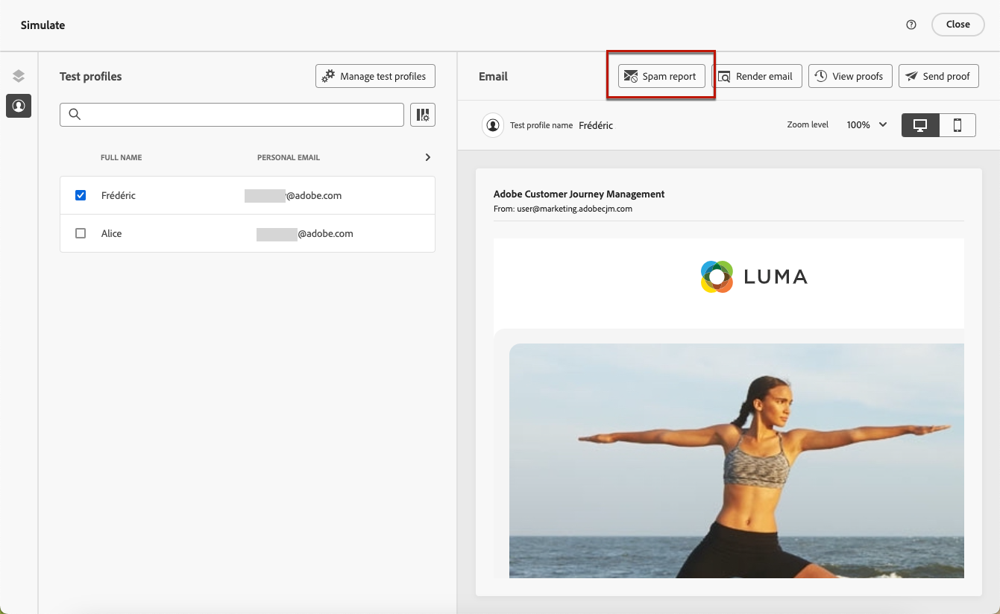

# Email spam report {#spam-report}

[!DNL Journey Optimizer] enables you to check how your content will perform against spam filtering and make sure your messages land in your customers' inboxes - not in spam.

When editing or previewing your email content, the **[!UICONTROL Spam report]** option provides a scoring and advice to improve scores for each individual item that is listed.

This allows you to determine whether a message runs the risk of being considered as spam by the anti-spam tools used upon receipt, and to take actions if this is not the case. Many email inbox providers use tools as part of their spam filtering process. Sending emails with a bad score can severely impact your deliverability.

>[!CAUTION]
>
>* This feature is currently only available as a private beta.
>
>* For now the spam report analysis can only be performed for content in English.
>
>* >The Spam report is informative, and does not prevent from sending messages which have a bad score.

To access the **[!UICONTROL Spam report]**, follow the steps below.

1. From the **[!UICONTROL Simulate]** screen, click the **[!UICONTROL Spam report]** button.

    

<!--
    You can also open the [Email Designer](../email/content-from-scratch.md), click the **[!UICONTROL More]** button and select **[!UICONTROL Check spam score]** from the menu.

    
-->

1. An anti-spam checking is automatically performed and the **[!UICONTROL Spam report]** window displays the results. It shows how your content is doing in terms of body layout, structure, image size, spam trigger words if any, etc.

    

1. Check the scores and descriptions for each item.

    The lower the score, the better. If the score is higher than 5, a warning is displayed: it indicates that some messages may be blocked or marked as spam when received.

1. Based on that scoring, if you consider that some elements can be improved, edit your content in the [Email Designer](../email/content-from-scratch.md) and make the necessary updates.

1. Once your changes are done, browse back to the **[!UICONTROL Spam report]** screen to ensure your score has improved.

    

<!--You can also check the message's alerts for warnings on potential risk of spam detection. Follow the steps below.

1. Click the **[!UICONTROL Alerts]** button on top right of the screen. [Learn more on email alerts](../email/create-email.md#check-email-alerts)

1. If **[!UICONTROL Spam checker alert]** is displayed, you should check your content for a potential risk of spam using the **[!UICONTROL Spam report]** feature as detailed above.

    
-->
